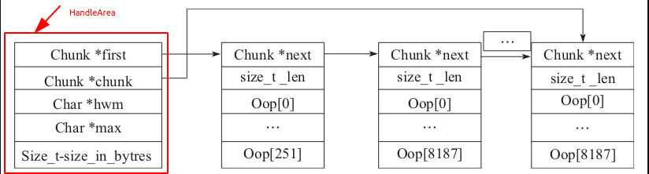

# JVM 句柄(Handle)
&nbsp;&nbsp;句柄的功能: 为JVM本地代码引用堆中对象提供方式,主要作用是在GC时保留oop的引用(代码注释)
```c

    // 005.OpenJDK/002.OpenJDK8u312-GA/OpenJDK8U312-GA/hotspot/src/share/vm/runtime/handles.inline.hpp
    inline Handle::Handle(oop obj) {
      if (obj == NULL) {
        _handle = NULL;
      } else {
        _handle = Thread::current()->handle_area()->allocate_handle(obj);
      }
    }

    class HandleArea: public Arena{
        // ...
    }

    class Arena : public CHeapObj<mtNone> {
     // ...

      Chunk *_first;                // First chunk
      Chunk *_chunk;                // current chunk
      char *_hwm, *_max;            // High water mark and max in current chunk // 高水位标志和当前区块的最大值,即： 已经使用到哪里呢以及最大是多少;(analysis by Amalloc_4)
      // ...
    }
    // 重要的是继承关系和引用关系(谁是谁的成员属性)
    // 通过代码分析，最终发现句柄(Handle)是在Arena#_chunk中分配的，且Arena#_chunk是会增长的
```

&nbsp;&nbsp;线程即可以支持Java代码的执行也可以执行本地代码，如果JVM本地代码（JVM内部的本地代码，而不是用户自定义的本地代码）引用了堆里面的对象该如何处理? >> JVM 设计了另一个概念： Handle(句柄)，并引申除了如下几个辅助结构:
- HandleArea,这是一块线程资源区，在这个区域分配句柄(Handle),并且管理所有的句柄，如果函数还在调用中，那么句柄有效，句柄关联的对象也就是活跃对象。HandleArea与Handle关系如下:
  + 
- HandleMark: 为了管理句柄的生命周期,通常HandleMark分配在栈上，在创建HandleMark的时候标记HandleArea对象有效，在HandleMark对象析构的时候，从HandleArea中删除对象引用。
> Java 线程每调用一个Java方法就会创建一个对应的HandleMark来保存已分配的对象句柄，然后等调用返回后执行恢复.

## 源码解析
见源码: 005.OpenJDK/002.OpenJDK8u312-GA/OpenJDK8U312-GA/hotspot/src/share/vm/runtime/handles.hpp

## 常见
1. 在对象分配时，在GC时，不是直接使用oop,而是先转为Handle再处理.
2. JNI 方法的调用