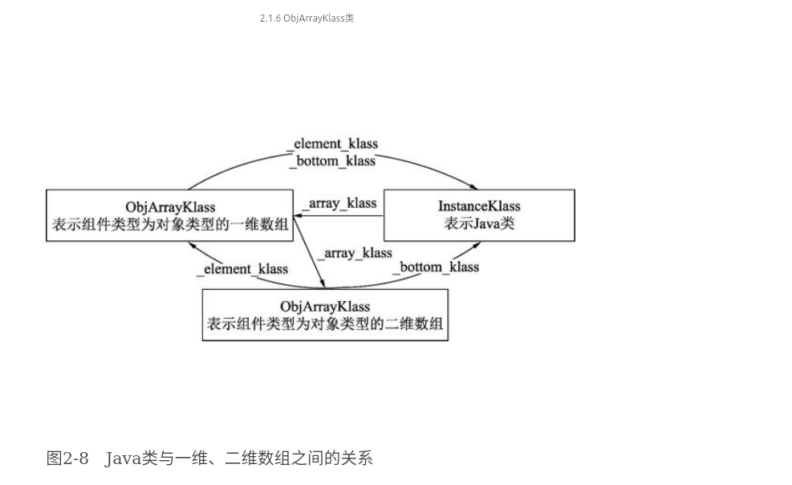

# Klass(C++) 和 Class(Java)
> 阅读[深入剖析Java虚拟机#第二章](../../../006.BOOKs/深入剖析Java虚拟机.epub) & [005.OpenJDK/002.OpenJDK8u312-GA/OpenJDK8U312-GA/hotspot/src/share/vm/oops/klass.hpp](../../../005.OpenJDK/002.OpenJDK8u312-GA/OpenJDK8U312-GA/hotspot/src/share/vm/oops/klass.hpp)

## 摘要
+ HotSpot 使用Klass<sub>通过Klass完成方法调用并获取类型信息，Klass基于C++的虚函数提供Java多态支持</sub>表示Java类；使用oop表示Java对象<sub>不提供任何虚函数功能,oop实例保存了对应Klass的指针</sub>;
+ Java类中可能定义了静态或非静态字段，因此将非静态字段值存储在oop中，静态字段值存储在表示[当前Java类的java.lang.Class对象]中
   ```txt
      静态字段值存储在java.lang.Class(与Java类对应的)对应的oop对象中. 2.1.3 InstanceKlass的子类
   ```
+ 静态字段如何保存的？[klass.hpp#_java_mirror;](../../../005.OpenJDK/002.OpenJDK8u312-GA/OpenJDK8U312-GA/hotspot/src/share/vm/oops/klass.hpp)
+ 数组的元组类型和元素类型:[005.OpenJDK/002.OpenJDK8u312-GA/OpenJDK8U312-GA/hotspot/src/share/vm/oops/arrayKlass.hpp](../../../005.OpenJDK/002.OpenJDK8u312-GA/OpenJDK8U312-GA/hotspot/src/share/vm/oops/arrayKlass.hpp)
   ```txt
      元素类型: 数组元素类型（Element Type）指的是数组去掉所有维度的类型
      元组类型: 而数组的组件类型（Component Type）指的是数组去掉一个维度的类型
   ```
+ 数组类创建
   ```c++
        // openjdk/hotspot/src/share/vm/oops/klass.hpp
        Klass* array_klass(int rank, TRAPS) 
        
        // 多维数组类创建逻辑
        Klass* InstanceKlass::array_klass_impl(instanceKlassHandle this_oop, bool or_null, int n, TRAPS);

   ```
+ Klass继承体系中涉及的C++类主要提供两个功能: 001. 提供C++层面的Java类型(包括Java类和Java数组)表示方式,也就是用C++类来描述Java类型； 002.方法分派(根据Java虚函数表和Java接口函数表来完成)；

---

## Klass继承体系
Klass继承体系中涉及的C++类主要提供两个功能:
+ 提供C++层面的Java类型(包括Java类和Java数组)表示方式,也就是用C++类来描述Java类型
+ 方法分派(根据Java虚函数表和Java接口函数表来完成)
```txt
MetaspaceObj
|
Metadata
|
Klass (抽象基类)
├─ InstanceKlass (普通类)
│   ├─ InstanceRefKlass (引用类)
│   ├─ InstanceClassLoaderKlass (类加载器)
│   └─ InstanceMirrorKlass (Class对象)
└─ ArrayKlass (抽象基类)
    ├─ TypeArrayKlass (基本类型数组)
    └─ ObjArrayKlass (对象数组)
```

###  Klass(C++) VS Class(Java) 
|C++ Klass|Java Class||
|-|-|-|
|Klass||Klass相当于java.lang.Class对象|
|InstanceMirrorKlass|java.lang.Class||
|InstanceRefKlass|java.lang.ref.Reference|通过_reference_type可以将普通类与引用类型区分开，因为引用类型需要垃圾收集器进行特殊处理。|
|InstanceKlass|一个具体的Java类型（这里的Java类型不包括Java数组类型）||
|InstanceClassLoaderKlass|java.lang.ClassLoader|InstanceClassLoaderKlass类没有添加新的字段，但增加了新的oop遍历方法，在垃圾回收阶段遍历类加载器加载的所有类来标记引用的所有对象|
|ArrayKlass||ArrayKlass类继承自Klass类，是所有数组类的抽象基类|
|TypeArrayKlass||表示数组组件类型是Java基本类型|
|ObjArrayKlass||ObjArrayKlass是ArrayKlass的子类，其属性用于判断数组元素是类还是数组|


## QA
### 一个Java类,在C++的世界中，有几个Klass与之对应
```txt
    + 1 个 InstanceKlass（元数据核心）。
    + 1 个 java.lang.Class 对象（Java 层镜像）。

    # Java类对象如何访问静态属性: 005.OpenJDK/002.OpenJDK8u312-GA/OpenJDK8U312-GA/hotspot/src/share/vm/oops/klass.hpp
    /**
     * java/lang/Class instance mirroring this class
     * 
     * 这个字段指向 该Java类静态字段的oop对象，就是Java类对应的java.lang.Class的oop对象
     * > 答案在:[深入剖析Java虚拟机.epub#2.1.3　InstanceKlass类的子类中]
     */
    oop       _java_mirror;
```

### Java类与一维、二维数组之间的关系



## 参考资料
+ [深入剖析Java虚拟机.epub](../../006.BOOKs/深入剖析Java虚拟机.epub)