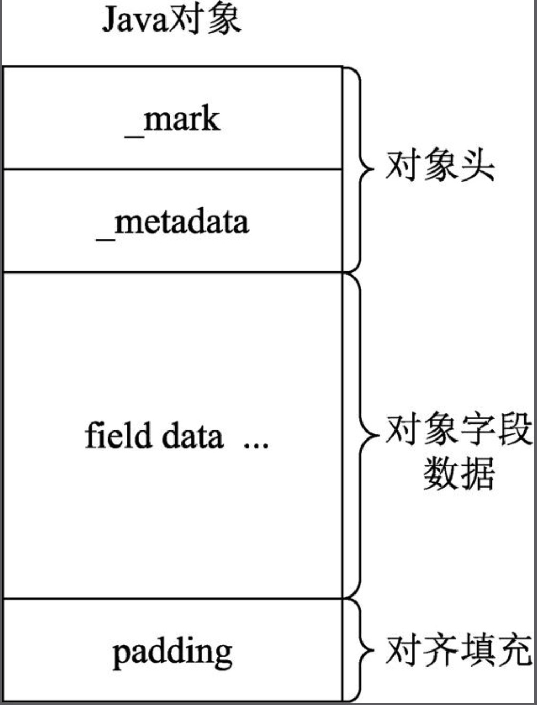
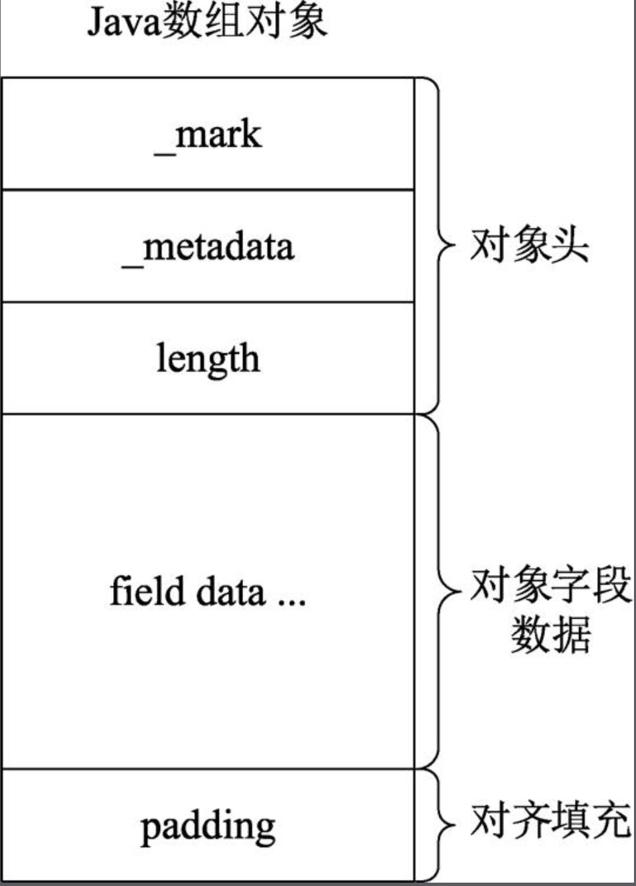
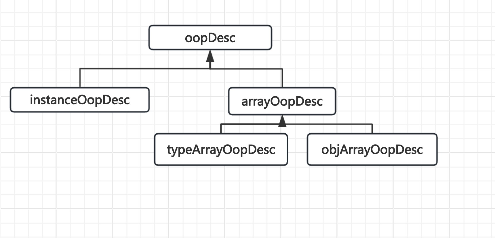

# Oop
Java对象用oop来表示，在Java创建对象的时候创建。也就是说，在Java应用程序运行过程中每创建一个Java对象，在HotSpot VM内部都会创建一个oop实例来表示Java对象。

## 对象属性存储与访问<sub>通过偏移获取</sub>
**Java对象的header信息可以存储在oopdesc类定义的_mark _metadata属性中，而Java对象的fields没有在oopDesc中定义相应的属性来存储，因此，只能申请一块连续的内存空间，然后按照一定的布局规则进行存储。对象字段存放在紧跟着oopdesc实例本身占用的内存空间之后，在获取时只能通过偏移来获取**
```C++
// 005.OpenJDK/002.OpenJDK8u312-GA/OpenJDK8U312-GA/hotspot/src/share/vm/oops/oop.inline.hpp
/**
 * 获取字段地址
 * 
 * @param offset 偏移量，通过相对于当前this的内存首地址的偏移量来存取字段的值.
 */
inline void*     oopDesc::field_base(int offset)        const { return (void*)&((char*)this)[offset]; }
```

## 对象头各部分说明
|部分|含义|备注|
|-|-|-|
|identity_hashcode|“占用31个二进制位，用来存储对象的HashCode，采用延时加载技术。调用System.identityHashCode()方法计算HashCode并将结果写入该对象头中。如果当前对象的锁状态为偏向锁，而偏向锁没有存储HashCode的地方，因此调用identityHashCode()方法会造成锁升级，而轻量级锁和重量级锁所指向的lock record或monitor都有存储HashCode的空间。HashCode只针对identity hash code。`用户自定义的hashCode()方法所返回的值不存储在Mark Word中`。`identity hash code 是未被覆写的java.lang.Object.hashCode()`或者`java.lang.System.identityHashCode()方法返回的值`。”|调用 覆盖了 java.lang.Object#hashCode方法后,头部不会存储该值|
|thread|持有偏向锁的线程ID||
|epoch|“偏向锁的时间戳”||
|ptr_to_lock_record|轻量级锁状态下，指向栈中锁记录的指针。”||
|ptr_to_heavyweight_monitor|“重量级锁状态下，指向对象监视器Monitor的指针”||
|age|“占用4个二进制位，存储的是Java对象的年龄。在GC中，如果对象在Survivor区复制一次，则年龄增加1。当对象的年龄达到设定的阈值时，将会晋升到老年代。默认情况下，并行GC的年龄阈值为15，并发GC的年龄阈值为6。由于age只有4位，所以最大值为15，这就是-XX:MaxTenuringThreshold选项最大值为15的原因”||

### Java对象的内存布局
#### instanceOopDesc (除对象数组以外的其他对象)


+ 对象头
   - 参考: [005.OpenJDK/002.OpenJDK8u312-GA/OpenJDK8U312-GA/hotspot/src/share/vm/oops/markOop.hpp](../../../005.OpenJDK/002.OpenJDK8u312-GA/OpenJDK8U312-GA/hotspot/src/share/vm/oops/markOop.hpp)
   - 参考: [005.OpenJDK/002.OpenJDK8u312-GA/OpenJDK8U312-GA/hotspot/src/share/vm/oops/oop.hpp](../../../005.OpenJDK/002.OpenJDK8u312-GA/OpenJDK8U312-GA/hotspot/src/share/vm/oops/oop.hpp)
+ 对象字段数据
  ```txt
     存储了哪些内容:
       1. Java源代码中定义的各种类型的字段内容
          - 自身定义的
          - 从父类继承的

       这涉及到字段对齐问题,引出相关配置: -XX:+CompactFields
  ```
+ 对齐填充
  ```txt
     为了将地址缩小提供条件。

     这得先研究C/C++内存对齐,JVM中是以8字节对齐，那么所有地址都可以被8整除(右移三位)，
     那么就可以将地址右移三位存储，更节约存储空间
  ```

##### 非数组对象创建源码
```C++
   instanceOop InstanceKlass::allocate_instance(TRAPS);
```

---

#### arrayOopDesc（数组对象）


与Java对象内存布局唯一不同的是，数组对象的对象头中还会存储数组的长度length，它占用的内存空间为4字节。在64位系统下，存放_metadata的空间是8字节，_mark是8字节，length是4字节，对象头为20字节，由于要按8字节对齐，所以会填充4字节，最终占用24字节。64位开启指针压缩的情况下，存放_metadata的空间是4字节，_mark是8字节，length是4字节，对象头为16字节。

##### arrayOopDesc的子类
+ typeArrayOopDesc <sub>组件类型为基本类型</sub>
+ objArrayOopDesc <sub>组件类型为对象类型</sub>

## Oop继承体系



## 参考资料
+ [深入剖析Java虚拟机.epub](../../006.BOOKs/深入剖析Java虚拟机.epub)