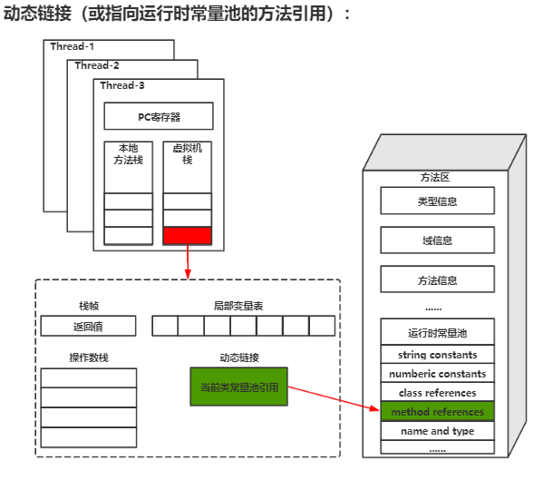

# 虚拟机栈(JVM Stack)
线程私有，生命周期与线程相同。虚拟机栈描述的是Java方法执行的线程内存模型： 每个方法被执行的时候，Java虚拟机都会同步创建一个栈帧，用于存储:
- 局部变量表
- 操作数栈
- 方法出口
- 动态链接
- Monitor 的lock record
- 方法参数
- .....
---
## 栈帧
通过源码:
- 005.OpenJDK/001.openJdk8-b120/jdk-jdk8-b120/hotspot/src/cpu/x86/vm/frame_x86  , 可以了解到JVM虚拟机栈帧的基本结构

---
## 虚拟机栈区域划分
### 1. 动态链接（或运行时常量池的方法引用）
+ 
+ -  每一个栈帧内部都包含一个指向运行时常量池中该栈帧所属方法的引用，包含这个引用的目的就是为了支持当前方法的代码能够实现动态链接（Dynamic Linking）
+ -  在Java源文件被编译到字节码文件时，所有的变量和方法引用都作为符号引用（Symbilic Reference）保存在class文件的常量池里
+ - + 例如: 描述一个方法调用了另外的其他方法时，就是通过常量池中指向方法的符号引用来表示的，动态链接的作用就是为了将这些符号引用转换位调用方法的直接引用

### 2. 局部变量表
&nbsp;&nbsp;局部变量表存放的是：
1. 编译期间可知的Java虚拟机**基本**数据类型(boolean、byte、char、short、int、float、long、double) 
2. 对象引用(referenct类型) 
3. returnAddress类型(指向了一条字节码指令的地址)

&nbsp;&nbsp;变量在局部变量表的存储空间是以局部变量槽(Slot)来表示，其中64位长度的long 和 double类型的数据需要两个变量槽，其余数据类型只占用一个。局部变量表所需要的内存空间是在编译期间完成分配的。

---
## JVM 栈帧设计
JVM 规范要求 JVM 线程要同时具有 Native Method Stacks（本地方法栈）和 Java Virtual Machine Stacks（java 虚拟机栈）。JVM 自身执行使用本地方法栈，而业务的 java 函数使用 java 虚拟机栈。
- 

---
## 附录
### 1. 操作系统线程栈的大小
+ 如"03.Linux内核学习/000.内存/000.线程栈.md"可以知晓，OS线程栈最小值16KB，最大值8MB(不同的操作系统可能不一致,这里是Ubuntu20.04 5.11版本的内核)

### 2. 相关参数
- -Xss  set java thread stack size
---  
## 参考资料 
1.  [https://wiki.openjdk.java.net/display/HotSpot/JavaControlStack](https://wiki.openjdk.java.net/display/HotSpot/JavaControlStack)
2.  [https://docs.oracle.com/javase/specs/jvms/se7/html/jvms-2.html#jvms-2.6.1](https://docs.oracle.com/javase/specs/jvms/se7/html/jvms-2.html#jvms-2.6.1)
3.  [https://www.artima.com/insidejvm/ed2/jvm9.html](https://www.artima.com/insidejvm/ed2/jvm9.html)