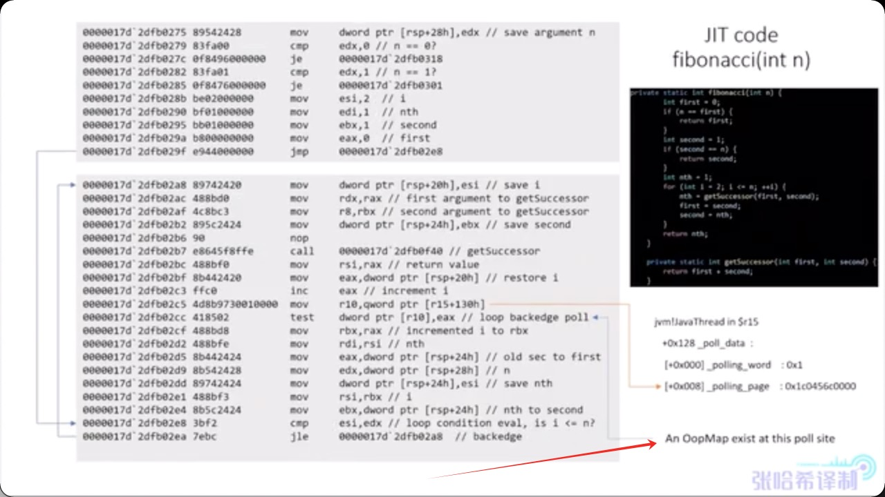

# OopMap(Object-Oriented Pointer oop:面向对象指针 Map)
&nbsp;&nbsp;在HotSpot中，有个数据结构（映射表）称为「OopMap」。一旦类加载动作完成的时候，HotSpot就会把对象内什么偏移量上是什么类型的数据计算出来，记录到OopMap。在即时编译过程中，也会在「特定的位置」生成 OopMap，记录下栈上和寄存器里哪些位置是引用。
- 在解释执行时就没有必要生成OopMap了，因为此时本地变量表都是已知的，可以直接添加到GC Roots中.

---

## OopMap 背景
OopMap 是一种记录`栈帧`或`寄存器`中哪些位置包含对象引用（OOP，Ordinary Object Pointer）的映射表。它告诉垃圾收集器在执行 GC 时，从哪里可以找到所有的对象引用。主要用于垃圾收集（GC）过程中的准确式垃圾收集（Accurate GC）。

---

## OopMap 分类
OopMap is a structure that records where object references (OOPs) are located on the Java stack. Its primary purpose is to find GC roots on Java stacks and to update the references whenever objects are moved within the Heap.（OopMap 是一种结构，用于记录对象引用 （OOP） 在 Java 堆栈上的位置。它的主要目的是在 Java 堆栈上查找 GC 根，并在堆内移动对象时更新引用。）

|分类|介绍|备注|
|-|-|-|
|OopMaps for interpreted methods|OopMaps for interpreted methods. They are computed lazily, i.e. when GC happens, by analyzing bytecode flow. The best reference is the source code (with lots of comments), see [generateOopMap.cpp](../../../005.OpenJDK/002.OpenJDK8u312-GA/OpenJDK8U312-GA/hotspot/src/share/vm/oops/generateOopMap.cpp). InterpreterOopMaps are stored in [OopMapCache](../../../005.OpenJDK/002.OpenJDK8u312-GA/OpenJDK8U312-GA/hotspot/src/share/vm/interpreter/oopMapCache.hpp).|用于解释方法的 OopMap。它们是通过分析字节码流，在 GC 发生时惰性计算的。最佳参考是源代码（有很多注释），参见  [generateOopMap.cpp](../../../005.OpenJDK/002.OpenJDK8u312-GA/OpenJDK8U312-GA/hotspot/src/share/vm/oops/generateOopMap.cpp)。InterpreterOopMap 存储在 [OopMapCache](../../../005.OpenJDK/002.OpenJDK8u312-GA/OpenJDK8U312-GA/hotspot/src/share/vm/interpreter/oopMapCache.hpp) 中。|
|OopMaps for JIT-compiled methods|They are generated during JIT-compilation and kept along with the compiled code so that VM can quickly find by instruction address the stack locations and the registers where the object references are held.|用于 JIT 编译方法的 OopMap。它们在 JIT 编译期间生成，并与编译后的代码一起保存，以便虚拟机可以通过指令地址快速找到保存对象引用的堆栈位置和寄存器。|
|OopMaps for generated shared runtime stubs.|OopMaps for generated shared runtime stubs. These maps are constructed manually by the developers - authors of these runtime stubs.|用于生成的共享运行时存根的 OopMap。这些映射由开发人员（即这些运行时存根的作者）手动构建。|

During GC JVM walks through all thread stacks. Each stack is parsed as a stream of stack frames. The frames are either interpreted or compiled or stubs. Interpreted frames contain information about Java method and bci (bytecode index). OopMapCache helps to find an OopMap corresponding to the given method and bci. The method of a compiled frame is discovered by instruction address lookup.(在 GC 期间，JVM 会遍历所有线程堆栈。每个堆栈都会被解析为堆栈帧流。这些帧要么是解释执行的，要么是编译执行的，要么是存根执行的。解释执行的帧包含有关 Java 方法和字节码索引 (bci) 的信息。OopMapCache 有助于查找与给定方法和字节码索引对应的 OopMap。编译执行的帧的方法是通过指令地址查找发现的。)

---

## OopMap功能
### 1. 快速根节点枚举: 在 GC 根节点枚举时，不需要扫描整个栈和寄存器，只需查看 OopMap 即可知道哪些位置存放着引用。
#### 应用1: [11.3:标记普通的根对象](../../../006.BOOKs/深入剖析Java虚拟机.epub)
“Threads::possibly_parallel_oops_do()或Threads::oops_do()：这两个函数会遍历Java的解释栈和编译栈。Java线程在解释执行Java方法时，每个Java方法对应一个调用栈帧，这些栈桢的结构基本固定，栈帧中含有本地变量表。另外，在一些可定位的位置上还固定存储着一些对oop的引用（如监视器对象），垃圾收集器会遍历这些解释栈中引用的oop并进行处理。Java线程在编译执行Java方法时，编译执行的汇编代码是由编译器生成的，同一个方法在不同的编译级别下产生的汇编代码可能不一样，因此编译器生成的汇编代码会使用一个单独的OopMap记录栈帧中引用的oop，以保存汇编代码的CodeBlob通过OopMapSet保存的所有OopMap，可通过栈帧的基地址获取对应的OopMap，然后遍历编译栈中引用的所有oop。”

摘录来自: 马智. “深入剖析Java虚拟机 源码剖析与实例详解(基础卷)。” 

### 2. 安全点（Safepoint）优化：JVM 只在特定位置（如方法调用、循环跳转等）生成 OopMap，这些位置称为安全点。
### 3. 减少 GC 停顿时间：通过预先生成的 OopMap，GC 可以快速定位所有引用，而不需要全栈扫描。

---

## OopMap结构

---
## OopMap工作流程
### 出现在汇编代码中
+ 出现在 safepoint 逻辑中:

---

## 参考资料
+ [https://stackoverflow.com/questions/26029764/what-does-oop-maps-means-in-hotspot-vm-exactly](https://stackoverflow.com/questions/26029764/what-does-oop-maps-means-in-hotspot-vm-exactly)
+ [https://bbs.huaweicloud.com/blogs/139877](https://bbs.huaweicloud.com/blogs/139877)
+ [深入剖析Java虚拟机](../../../006.BOOKs/深入剖析Java虚拟机.epub)
+ [safepoint-002-782909122-1-16.mp4](../../016.SafePoint/safepoint-002-782909122-1-16.mp4)

