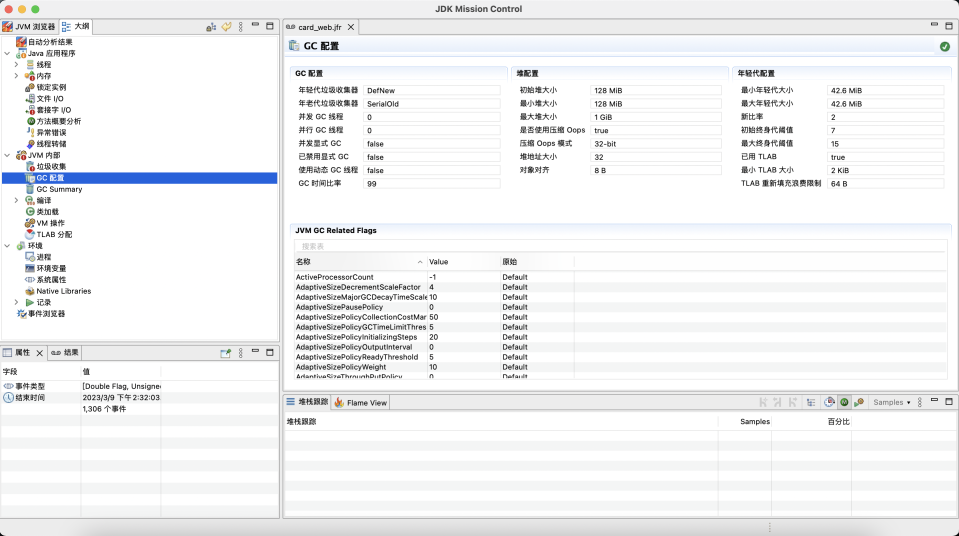
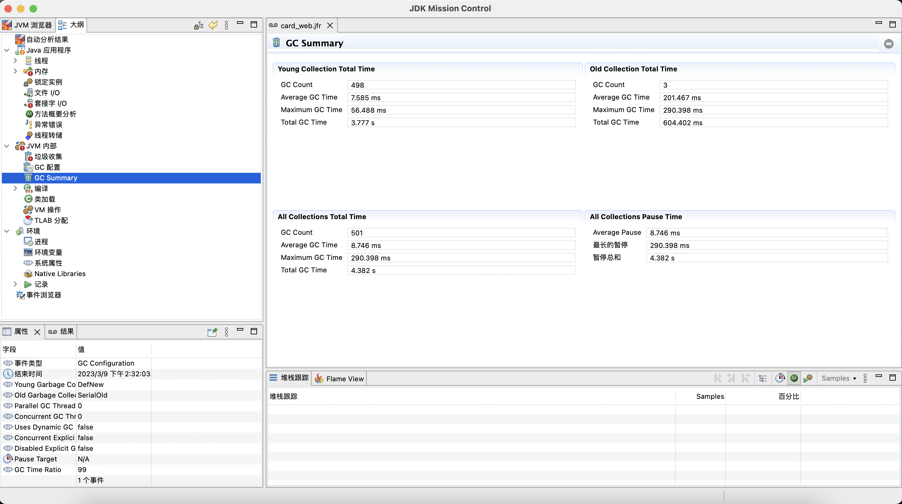
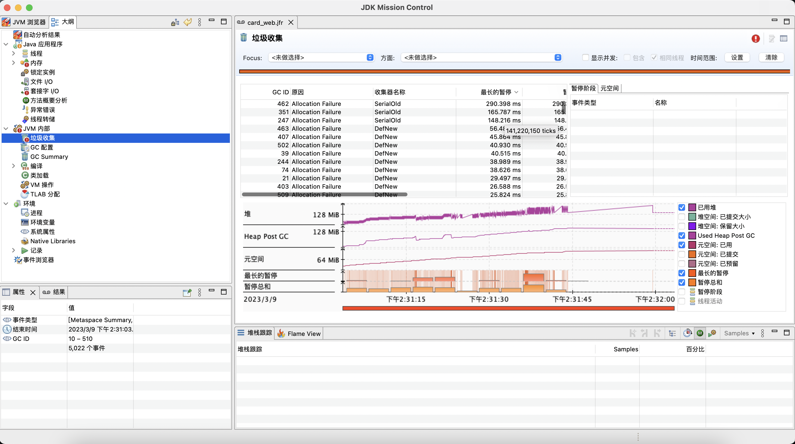
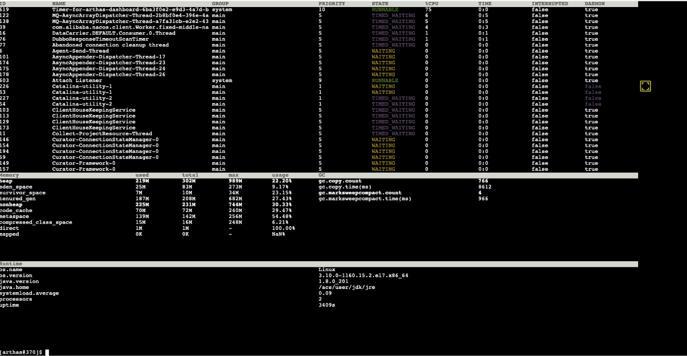
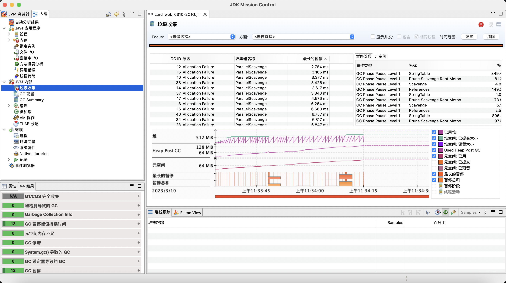
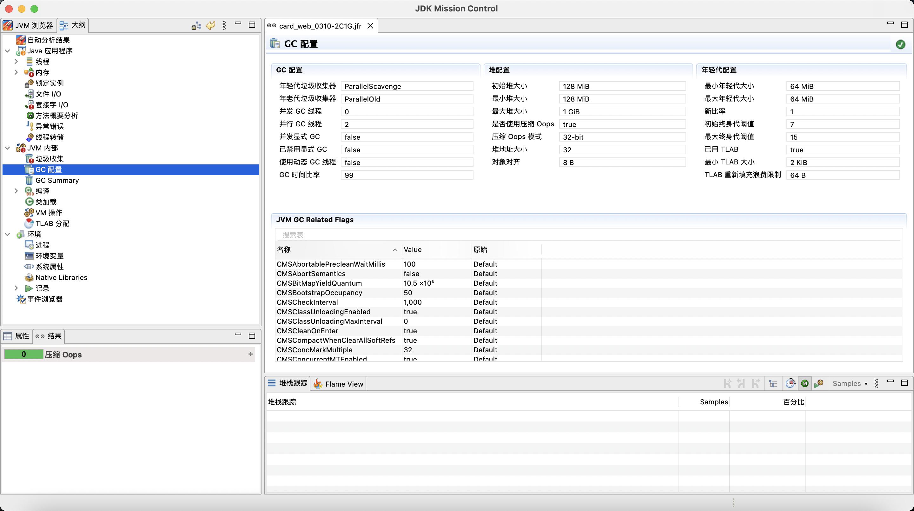
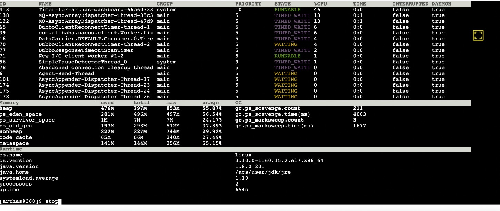

# 一次灰度环境压测JVM调优经历·2023-03-10
## 背景
&nbsp;&nbsp;因需计算正式环境所需要的ECS数量，所以需要知道单pod最大QPS。

## 调优工具
1. Arthas
2. JFR + JMC

## 调整之前
- JVM参数:  -Xmx1024M  -XX:+UnlockCommercialFeatures -XX:+FlightRecorder - -XX:StartFlightRecording=duration=60s,filename=/data/project/project-name-card-gray/card_web.jfr
- 容器最大内存：1500 ;容器最小内存：1500 ， pod数量: 1  
- CPU:2C
- 
- 
- 
- 

### 简单小结
1. 在调整之前，GC Collector并不是JDK8默认的收集器，而是一个单线程版本的收集器，而单线程版本的GC收集器在多核pod下肯定是不如多线程版本的GC Collector的。因此，首先考虑将GC Collector通过设置VM参数“-XX:+UseParallelGC”调整为ParallelGC
2. 通过arthas可以发现，年轻代与老年代比例为1:2，且通过arthas发现，老年代GC次数并不高，老年代空间利用率也不高。这个对于B/C端应用来说，是不合理的，因为这样的应用大多处理的是HTTP请求，请求结束了，请求过程中产生的对象都可以被GC掉。因此需要将年轻代空间向上调整，老年代空间向下调整。

---

## 调整之后
- -Xmx1024M -XX:+UseParallelGC -XX:NewRatio=1  -XX:+UnlockCommercialFeatures -XX:+FlightRecorder -XX:StartFlightRecording=duration=60s,filename=/data/project/project-card-gray/card_web.jfr
- 容器最大内存：1500 ;容器最小内存：1500 ， pod数量: 1
- CPU:2C
- 
- 
- 

### 简单小结
&nbsp;&nbsp;通过调整VM参数，发现系统性能相较之前有所提升
1. 通过调整GC Collector 之后，现在使用的是并行的垃圾收集器，充分利用了多核的优势。
2. -XX:NewRatio=1 通过设置该参数，将老年代与新生代对空间大小控制在1:1，因为NewRatio默认值为2，新生代大小 = 1/(NewRatio+1),内存利用率得到提升。
3. 在压测过程中，发现老年代GC次数并不高，压测半小时，老年代GC次数为2，所以 -XX:NewRatio=1 并不会导致老年代频繁GC，所以此项优化为正优化。
   
#### 问题发现
1. 在压测过程中，发现ps_eden_space、ps_survivor_space、ps_old_gen 空间大小在变化，例如，ps_survivor_space刚开始可能十几二十MB，但是后面可能变为3MB。通过[001.ParallelGC简介.md](./000.ParallelGC%E7%AE%80%E4%BB%8B.md) 可以得出结论，这是因为Parallel收集器的自适应过程。