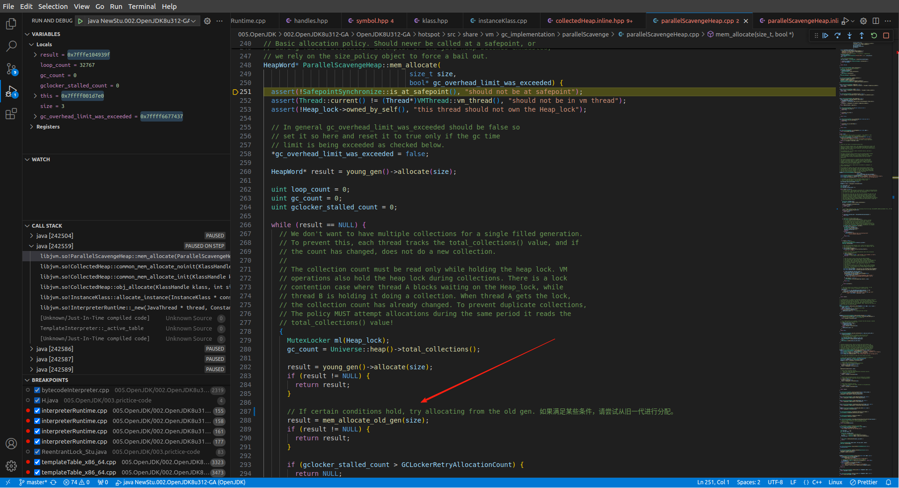

# ParallelGC
&nbsp;&nbsp;JDK8默认的垃圾收集器。[下面的注意事项 需要读一读](#注意事项)

&nbsp;&nbsp;若使用者对于收集器运作不太了解，手工优化存在困难的话，使用Parallel Scavenge收集器配合自适应调节策略，把内存管理的调优任务交给虚拟机去完成也许是一个很不错的选择。只需要把基本的内存数据设置好（如-Xmx设置最大堆），然后使用-XX:MaxGCPauseMillis参数（更关注最大停顿时间）或-XX:GCTimeRatio更关注吞吐量）参数给虚拟机设立一个优化目标，那具体细节参数的调节工作就由虚拟机完成了。

---

##### 当满足一定条件，对象会在老年代分配内存

## 参考
1. [006.BOOKs/深入理解Java虚拟机.pdf] 3.5.5 Parallel Old收集器
2. [HotSpot Virtual Machine Garbage Collection Tuning Guide](../HotSpot%20Virtual%20Machine%20Garbage%20Collection%20Tuning%20Guide.pdf)
3. [HotSpot Virtual Machine Garbage Collection Tuning Guide](../hotspot-virtual-machine-garbage-collection-tuning-guide.pdf)

----

## 注意事项
### JVM(1.8)在-server下默认老年代回收是 PS-MarkSweep(Serial-Old)，还是Parallel Old？
答案： 看版本

“在'这个改变'[000.ParallelGC简介.md# -XX:+UseParallelOldGC ](./000.ParallelGC简介.md)之前，即便选择了ParallelGC，默认情况下ParallelOldGC并不会随即开启，而是要自己通过 -XX:+UseParallelOldGC 去选定。
  + ‘这个改变’ 指的是 -XX:+UseParallelOldGC 的应用里面的 [JDK8-ParallelOldGC作为Parallel默认Old-GC.pdf](./DOCS/JDK8-ParallelOldGC作为Parallel默认Old-GC.pdf) 的这一次OpenJDK的修改通过commit信息发现，是2012年改变的默认值，将 ’Parallel Old‘ 作为 Parallel Scavenge 搭配的Old GC
     - 在这个改变之前，即便选择了ParallelGC，默认情况下ParallelOldGC并不会随即开启，而是要自己通过 -XX:+UseParallelOldGC 去选定。
     - 参考:[JDK-6679764.pdf](./JDK-6679764.pdf)
