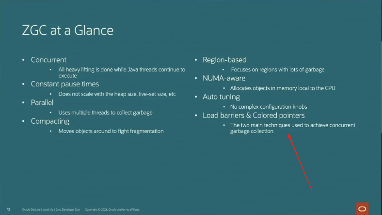

# ZGC
## 性能指标
+ 永远不会看到ZGC GC暂停时间超过1ms
  - 那么有得必有失，失: expect some  reduction  in throughput (预计吞吐量会有所减少)

---
## 课程
+ [01-ZGC来了](./005.LESSONS/1249236645-1-16.mp4): 1. 非分代 、 分代ZGC的性能比较;
+ [分代 ZGC 的由来与底层原理](./005.LESSONS/1065521679-1-16.mp4)
+ 亚毫秒级别暂停的ZGC原理与极限情况性能测试(上)
   - [亚毫秒级别暂停的ZGC原理与极限情况性能测试(上)](./005.LESSONS/560287464-1-16.mp4/)
   - [亚毫秒级别暂停的ZGC原理与极限情况性能测试(中)](./005.LESSONS/560287365-1-16.mp4/)
   - [亚毫秒级别暂停的ZGC原理与极限情况性能测试(下)](./005.LESSONS/560287467-1-208.mp4/)
+  [Java开发者日 - ZGC与下一代分代ZGC](./005.LESSONS/1167843939-1-192.mp4)
   - 
+  [深入讨论ZGC架构.png](./Docs/深入探讨%20ZGC%20的架构.png) & [深入讨论ZGC架构.pdf](./Docs/深入了解%20ZGC%20的架构.java.pdf) & [深入讨论ZGC架构-v2](./Docs/ZGC-Jfokus-2018.pdf)


---
## 摘要
The Z Garbage Collector (ZGC) is a scalable low latency garbage collector. ZGC performs all expensive work concurrently, without stopping the execution of application threads for more than a millisecond. It is suitable for applications which require low latency. Pause times are independent of the heap size that is being used. ZGC works well with heap sizes from a few hundred megabytes to 16TB. 
```txt
     ZGC 实现这一目标的主要方式就是几乎完全并发，这意味着几乎所有GC 工作 、分配对象、扫描不再可达对象、压缩堆等都是在应用程序运行时处理的。从用户的角度看，这样的代价就是吞吐量降低，因为一些可用于执行应用程序活动的资源被垃圾收集器使用。
```

ZGC was initially introduced as an experimental feature in JDK 11, and was declared Production Ready in JDK 15. In JDK 21 was reimplemented to support generations.
> 15及之后版本可用于生产环境；JDK21 ZGC才实现了分代收集
```txt
   > 分代ZGC意义
       或多或少会获得与单代ZGC所希望的平均超快速延迟，即吞吐量的适量改进，但最大暂停时间可能会出现巨大的改进，尤其是在重负载下。
       参考:  004.OpenJDK(JVM)学习/009.GC/024.ZGC/001.ZGC性能测试报告-单代&分代性能改进.md
```

At a glance, ZGC is:
- Concurrent
- Region-based
- Compacting
- NUMA-aware
- Using colored pointers
- Using load barriers
- Using store barriers (in the generational mode)

At its core, ZGC is a concurrent garbage collector, meaning all heavy lifting work is done while Java threads continue to execute. This greatly limits the impact garbage collection will have on your application's response time.

## 使用
```txt
   If you're trying out ZGC for the first time, start by using the following GC options:
      -XX:+UseZGC -XX:+ZGenerational -Xmx<size> -Xlog:gc
    
    For more detailed logging, use the following options:
      -XX:+UseZGC -XX:+ZGenerational -Xmx<size> -Xlog:gc*
    
    若不使用分代ZGC，使用单代，则不需要加  -XX:+ZGenerational
    
    单代&分代ZGC性能差异： 004.OpenJDK(JVM)学习/009.GC/024.ZGC/000.ZGC-IS-Comming.md

```
- 通过 [04.OpenJDK(JVM)学习/009.GC/024.ZGC/000.ZGC-IS-Comming.md](./000.ZGC-IS-Comming.md) 知道，ZGC是一个自适应的GC，在运行Java程序期间，会自动调整分代大小。
- 分代 & 单代 ZGC 性能差异，参考: [04.OpenJDK(JVM)学习/009.GC/024.ZGC/000.ZGC-IS-Comming.md](./000.ZGC-IS-Comming.md)

### ZGC 参数
请参考:[Open ZGC Wiki 20240330](./Docs/Main%20-%20Main%20-%20OpenJDK%20Wiki-20240330.pdf)

## 注意事项
+ 未分代ZGC 堆外额外内存占用太高，CPU消耗太大导致卡顿，分代ZGC有所改进。
+ 分代ZGC: GC线程既是并发也是并行<sub>(标记阶段还是有STW:[亚毫秒级别暂停的ZGC原理与极限情况性能测试(中)](./005.LESSONS/560287365-1-16.mp4/))</sub>，自动调优，手动调优只需要指定堆大小(-Xmx)即可,内部工作流程，分代ZGC对比普通ZGC的性能提升，参考:[分代 ZGC 的由来与底层原理](./005.LESSONS/1065521679-1-16.mp4)
+ 染色指针是什么，怎么理解
+ Multi-Mapping 是什么
+ 线程本地握手:[亚毫秒级别暂停的ZGC原理与极限情况性能测试(下)](./005.LESSONS/560287467-1-208.mp4/)
+ 有了'Concurrent Thread-Stack Processing':[亚毫秒级别暂停的ZGC原理与极限情况性能测试(下)](./005.LESSONS/560287467-1-208.mp4/)再用,使得暂停不到毫秒时间
+ ZGC实现原理: [ZGC-Jfokus-2018.pdf](./Docs/ZGC-Jfokus-2018.pdf)

## 参考资料
1. [https://wiki.openjdk.org/display/zgc/Main#Main-Overview](https://wiki.openjdk.org/display/zgc/Main#Main-Overview)
    - Pdf: [The Z Garbage Collector (ZGC) ](./Docs/Main%20-%20Main%20-%20OpenJDK%20Wiki-20240330.pdf)