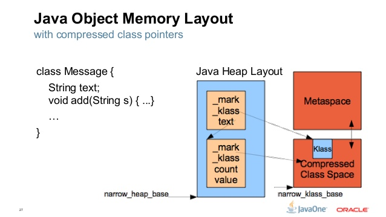
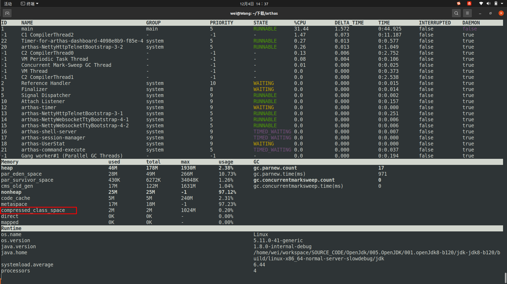

# JVM GC(Garbage Collection)

## Garbage Collector 预览
|GC|Optize For(优化方向/更适合于)|备注|建议适用版本|
|-|-|-|-|
|Serial|Memory Footprint|更少额外资源占用||
|Parallel|Throughput|吞吐量||
|G1|Throughput/Latency Balance|吞吐量/延迟 平衡||
|ZGC|Low Latency <br/>< 1ms Max GC pauses time(并不是平均活P999)|低延迟,吞吐量比G1低15%,查看:<br/>1.[ZGC来了](./024.GC-ZGC/005.LESSONS/1249236645-1-16.mp4) <br/>2. [Java开发者日 - ZGC与下一代分代ZGC](./024.GC-ZGC/005.LESSONS/1167843939-1-192.mp4)|>=16<sub>有了'Concurrent Thread-Stack Processing':[亚毫秒级别暂停的ZGC原理与极限情况性能测试(下)](./024.GC-ZGC/005.LESSONS/560287467-1-208.mp4/)再用,使得暂停不到毫秒时间</sub>|

---

## Garbage Collection (GC) 
&nbsp;&nbsp;GC是指垃圾回收，但是在JVM的实现中，GC更为准确的意思是指内存管理器，他有两个职责： 
1. 内存的分配管理
2. 垃圾回收
> 阅读[Java Memory Management _ Microsoft Learn.pdf#Java garbage collection](./Java%20Memory%20Management_Microsoft%20Learn.pdf) 先了解什么是Minor GC 、 Major GC 、Full GC

## 各垃圾收集器性能对比
### JDK8 中
- [JDK8 GC Collector性能比对](./008.G1/008.Blogs/P99-CONF/000.G1%3A-To-Infinity-and-Beyond/000.G1%3ATo-Infinity-and-Beyond.md)

---

## 分代收集理论
&nbsp;&nbsp;分代收集理论实质上是一套符合大多数程序运行实际情况的经验法则，他建立在两个分代假说上：
1. 弱分代假说
   > 绝大多数对象都是朝生夕灭的
2. 强分代假说
   > 熬过越多次垃圾收集过程的对象就越难以消亡。

&nbsp;&nbsp;第1、2两个分代假说共同奠定了多款常用的垃圾收集器一致的设计原则： <font color="red">**收集器应该将Java堆划分出不同的区域，然后将回收对象依据其年龄分配到不同的区域之中存储**</font>.

&nbsp;&nbsp;将对象根据年龄来划分存储，通过针对性的回收方式，对内存进行高效率低代价地回收。
  - 如果一个区域大多数是朝生夕灭的，那么把他们集中在一起，每次回收时只需要关注如何保留少部分存活的对象而不是去标记那些将要回收的对象，就能以较低代价会收到大量的空间。
  - 如果剩下的都是难以消亡的对象，那把他们集中在一起，虚拟机便能使用较低的频率来回收这个区域，这就同时兼顾了垃圾收集的时间开销和内存空间的有效使用)
  - 基于上述两点，因此才有了Minor GC 、 Major GC 、 Full GC.(划分为不同的区域后，垃圾收集器可以每次回收其中某一个或某一些区域)，也产生了针对性的垃圾收集算法(标记-清理，标记-整理，标记-复制)

3. 跨代引用假说
   > 跨代引用相对于同代引用来说仅占极少数。
      - 根据这条假说，在回收时就不应该为了少量的跨代引用去扫描整个老年代。目前的JVM使用了一个全局的数据结构：**记忆集**(Remembered Set),这个结构将老年代划分为若干小块，标识出老年代的哪一块内存会存在跨代引用。此后当发生Minor GC时，只有包含了跨代引用的小块内存里的若干对象才会被加入到GC Roots中进行扫描。
        > 记忆集: Card Table(基础,很多GC Collector都依赖) , Remenber Set(G1)

   > 基于1、2分代假说，JVM将堆进行了划分，因此才有了跨代引用问题

---
### GC 分类
1. 部分收集(Partial GC): 指目标不是完整收集整个Java堆的垃圾收集，其中又分为:
   - 新生代收集(Minor GC / Young GC):指目标仅完成新生代的垃圾收集
      > 新生代收集，目前所有的垃圾收集器均是对整个新生代进行回收.
   - 老年代收集(Major GC/Old GC):指目标仅完成老年代的垃圾收集，注意:
      + 目前仅有CMS垃圾收集器会有单独收集老年代的行为
   - 混合收集(Mixed GC):指目标是收集整个新生代以及部分老年代的垃圾收集，目前仅有G1收集器会有这种收集行为
2. 整堆收集(Full GC):收集整个Java堆和方法区的垃圾收集
   
---
## JVM GC
1. 哪些内存需要回收
2. 什么时候回收
   1. 当对象内存分配失败了，就会触发GC。以此作为分析的切入点
3. 如何回收
### 评判GC的两个核心标准
&nbsp;&nbsp;以下两个评判GC的核心标准，也可作为GC调优的方向，也是学习JVM GC的主要目标。
1. <font color="red" >**延迟**</font>
> 也可以理解为最大停顿时间，即垃圾收集过程中一次 STW 的最长时间，越短越好，一定程度上可以接受频次的增大，GC 技术的主要发展方向。
2. <font color="red" >**吞吐率**</font>
> 应用系统的生命周期内，由于 GC 线程会占用 Mutator 当前可用的 CPU 时钟周期，吞吐量即为 Mutator 有效花费的时间占系统总运行时间的百分比，例如系统运行了 100 min，GC 耗时 1 min，则系统吞吐量为 99%，吞吐量优先的收集器可以接受较长的停顿。
>> 吞吐量大不代表响应能力高，吞吐量一般这么描述：在一个时间段内完成了多少个事务操作；在一个小时之内完成了多少批量操作
3. 其他
> 除了这两个指标之外还有 Footprint（资源量大小测量,即本地内存占用大小）、反应速度等指标，互联网这种实时系统追求低延迟，而很多嵌入式系统则追求 Footprint。
>> 1. https://www.bilibili.com/video/BV1jv4y1K7Fo/?spm_id_from=333.999.0.0&vd_source=9eef164b234175c1ae3ca71733d5a727 视频中，Footprint也是一种指标。

## JVM内存空间初始化
> 004.OpenJDK(JVM)学习/003.JVM启动/001.Universe初始化/README.md

## JVM堆的划分(仅Heap)
&nbsp;&nbsp; 不同的收集器有着自己不同的实现，具体还得根据收集器来分析判断

&nbsp;&nbsp; 从 005.OpenJDK/001.openJdk8-b120/jdk-jdk8-b120/hotspot/src/share/vm/memory/universe.cpp#universe_init开始
## CollectedHeap
&nbsp;&nbsp;CollectedHeap是一个接口，CollectedHeap类根据CollectorPolicy中设置的值确定策略。CollectedHeap类定义了对象的分配和回收的接口。
### 重要方法
1. allocate_from_tlab
2. mem_allocate
3. collect

---

## CollectorPolicy
&nbsp;&nbsp;CollectorPolicy类是一个定义了对象管理功能策略的类。该类保存与对象管理功能相关的设置值，例如，该类在执行Java命令时设置不同的参数(如GC算法);

---
## 遇到的一些VM参数
### 1. AdaptiveSizePolicy(自适应大小策略)
&nbsp;&nbsp;JDK 1.8 默认使用 UseParallelGC （-XX:+UseParallelGC） 垃圾回收器，该垃圾回收器默认启动了 AdaptiveSizePolicy，会根据GC的情况自动计算计算 Eden、From 和 To 区的大小
#### 注意事项：
 - 在 JDK 1.8 中，如果使用 CMS，无论 UseAdaptiveSizePolicy 如何设置，都会将 UseAdaptiveSizePolicy 设置为 false；不过不同版本的JDK存在差异；
 - UseAdaptiveSizePolicy不要和SurvivorRatio参数显示设置搭配使用，一起使用会导致参数失效；
 - 由于AdaptiveSizePolicy会动态调整 Eden、Survivor 的大小，有些情况存在Survivor 被自动调为很小，比如十几MB甚至几MB的可能，这个时候YGC回收掉 Eden区后，还存活的对象进入Survivor 装不下，就会直接晋升到老年代，导致老年代占用空间逐渐增加，从而触发FULL GC，如果一次FULL GC的耗时很长（比如到达几百毫秒），那么在要求高响应的系统就是不可取的。

---
## JVM参数
### 1. CompressedClassSpaceSize （与UseCompressedOops区分）
> 这个参数主要是设置Klass Metaspace的大小，不过这个参数设置了也不一定起作用，前提是能开启压缩指针，假如-Xmx超过了32G，压缩指针是开启不来的。如果有Klass Metaspace，那这块内存是和Heap连着的。
- 
- 
+ >> Klass Metaspace 的空间是包含在Metaspace里面的,
### 2. MetaspaceSize
+ 定义于文件: 005.OpenJDK/001.openJdk8-b120/jdk-jdk8-b120/hotspot/src/share/vm/runtime/globals.hpp
+ 这个JVM参数是指Metaspace扩容时触发FullGC的初始化阈值，也是最小的阈值。这里有几个要点需要明确：
  - 如果没有配置-XX:MetaspaceSize，那么触发FGC的阈值是21807104（约20.8m），可以通过jinfo -flag MetaspaceSize pid得到这个值；jps -v也可以查看jvm的参数设置情况。
  - 如果配置了-XX:MetaspaceSize，那么触发FGC的阈值就是配置的值；
  - Metaspace由于使用不断扩容到-XX:MetaspaceSize参数指定的量，就会发生FGC；且之后每次Metaspace扩容都可能会发生FGC（至于什么时候会，比较复杂，跟几个参数有关）；
  - 如果Old区配置CMS垃圾回收，那么扩容引起的FGC也会使用CMS算法进行回收；
  - 如果MaxMetaspaceSize设置太小，可能会导致频繁FullGC，甚至OOM；
+ 赋值
```txt
libjvm.so!Metaspace::ergo_initialize() (hotspot/src/share/vm/memory/metaspace.cpp:3011)
libjvm.so!Arguments::apply_ergo() (hotspot/src/share/vm/runtime/arguments.cpp:3670)
libjvm.so!Threads::create_vm(JavaVMInitArgs * args, bool * canTryAgain) (hotspot/src/share/vm/runtime/thread.cpp:3339)
libjvm.so!JNI_CreateJavaVM(JavaVM ** vm, void ** penv, void * args) (hotspot/src/share/vm/prims/jni.cpp:5166)
libjli.so!InitializeJVM(JavaVM ** pvm, JNIEnv ** penv, InvocationFunctions * ifn) (jdk/src/share/bin/java.c:1146)
libjli.so!JavaMain(void * _args) (jdk/src/share/bin/java.c:373)
libpthread.so.0!start_thread(void * arg) (/build/glibc-eX1tMB/glibc-2.31/nptl/pthread_create.c:477)
libc.so.6!clone() (/build/glibc-eX1tMB/glibc-2.31/sysdeps/unix/sysv/linux/x86_64/clone.S:95)
```

## 注意事项
### FULL GC 是串行的
> [004.OpenJDK(JVM)学习/009.GC/008.G1/008.Full-GC-G1.md](../../004.OpenJDK(JVM)学习/009.GC/008.G1/008.Full-GC-G1.md)


> ZGC 后就不是了，见:[023.OpenJDK8-18垃圾收集器的变化.md](./023.OpenJDK8-18垃圾收集器的变化.md)

### JVM内存并不是越大越好（考虑吞吐量）
> 见:[023.OpenJDK8-18垃圾收集器的变化.md](./023.OpenJDK8-18垃圾收集器的变化.md)

### 截止目前，单体应用(单个Tomcat)吞吐量不会太高
> 见:[023.OpenJDK8-18垃圾收集器的变化.md](./023.OpenJDK8-18垃圾收集器的变化.md)

### 并发收集 & 并行收集
[006.BOOKs/深入理解Java虚拟机.pdf] 3.5 经典垃圾收集器

对比垃圾收集器运行示意图:
- 并行： 停止用户线程,即 STW , 多个GC线程同时执行GC操作 ， 如 Parallel (Parallel Scavenge , Parallel Old)
- 并发： GC线程和用户线程同时执行，会占用CPU资源,导致程序性能下降， 如 CMS


---

## 附录
### GC分类
1. 部分收集(Partial GC 或称 增量收集): 指目标不是完整收集整个Java堆的垃圾收集，其中又分为:
   - 新生代收集(Minor GC / Young GC):指目标仅完成新生代的垃圾收集
   - 老年代收集(Major GC/Old GC):指目标仅完成老年代的垃圾收集，注意:
      + 目前仅有CMS垃圾收集器会有单独收集老年代的行为
   - 混合收集(Mixed GC):指目标是收集整个新生代以及部分老年代的垃圾收集，目前仅有G1收集器会有这种收集行为
2. 整堆收集(Full GC):收集整个Java堆和方法区的垃圾收集


---
## 参考资料
- [深入理解堆外内存 Metaspace](https://javadoop.com/post/metaspace)
- https://tech.meituan.com/2017/12/29/jvm-optimize.html
- https://tech.meituan.com/2020/11/12/java-9-cms-gc.html