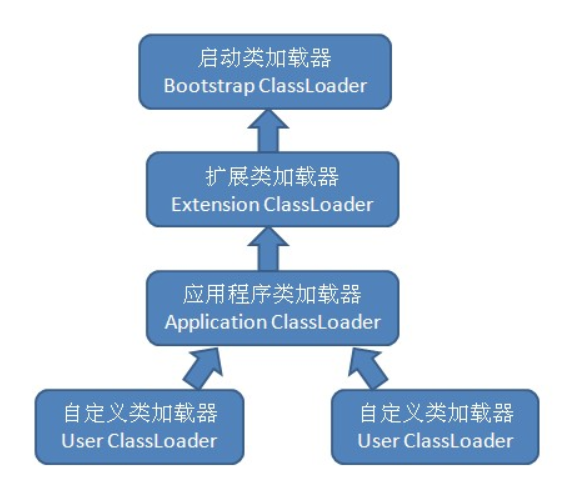

## 虚拟机类加载机制
### 什么是类加载机制
虚拟机把描述类的数据从Class文件加载到内存，并对数据进行校验、转换、解析和初始化，最终形可以被虚拟机直接使用的Java类型
   + 即Class文件并不是Jvm能够直接使用的Java类型
### Java的与众不同
+ 在Java语言中，类型的加载，连接和初始化过程都是在**程序运行期间**完成的，Java里天生可以动态扩展的语言特性就是依赖**运行期动态加载和动态连接这个特点实现的**
   - 动态加载：
   ```java
        package link.bosswang;

        public class Demo_DT{

            public static void main(String[] args) throws Exception{
                Class clazz =   Class.forName(args[0]); //动态加载类
                People p = (People) clazz.newInstance();
                p.say();
            }

        }
        //执行命令:java link.bosswang.Demo_DT  link.bosswang.Man 
        //例如在这里传入Man这个类去给Demo_DT去加载执行，当然还可以在这里实现一个Woman类，交由该程序去动态加载这个Woman类，再去执行
        //还有一种情况(静态加载)，不使用Class.forName,而直接使用new Man();,再去调用say方法。这种弊端就是没有Man这个类的时候，这个程序就没有办法启动了。
   ```
   - 动态连接：
   - 举例:
      1. 如果编写一个面向接口的应用程序，可以等到运行时再去指定其实际的实现类
      2. 用户可以通过java预定义的和自定义的类加载器，让一个本地的应用程序可以在运行时期从网络或者其他地方加载一个二进制流作为程序代码的一部分。
### 约定(学习之后内容的约定)
1. 每个Class文件都有可能代表Java语言中的一个类或者接口
2. Class文件是一个==**二进制的字节流**==，并非一个实际意义上的文件(.class后缀名结尾的存在于磁盘上的文件)
   + 这就表示对于JVM来说，Class文件来源不限制于本机，也可以是从网络上或者其他地方获取到的二进制文件流
### 类加载的时机
+ 类的**生命周期**：加载-》**验证-》准备-》解析**-》初始化-》使用-》卸载（加粗的统称为连接阶段）
   - 加载，验证，准备，初始化，卸载这5个阶段的顺序是确定的，类的加载过程必须按照这个顺序按部就班地**开始**，而解析阶段就不一定了：(解析)在某个情况下可以在初始化阶段之后再开始，这是为了支持Java语言的运行时绑定(动态绑定或晚期绑定)
+ **有且只有**5种情况必须立即对类进行初始化(当然，加载，验证，准备需要在这之前完成)
  1. 遇到new,getstatic,putstatic或invokestatic这四条字节码指令的时候，若类没有进行过初始化，则需要先触发其初始化
     + new:实例化对象指令
     + getstatic:读取类的静态字段
     + putstatic:设置类的静态字段
     + invokestatic:调用一个类的静态方法
  2. 使用java.lang.reflect包的方法对类进行反射调用的时候，若类没有进行初始化，则需要触发类的初始化
     + 进行反射调用需要先初始化
  3. 当初始化一个类的时候，若发现其类的父类还没有进行初始化，则需要**先**触发其父类的初始化
     + 父类必须优先初始化
  4. 当虚拟机启动是，用户需要指定一个要执行的主类(包含main方法的那个类)，虚拟机会先初始化这个主类
     + 启动方法所在的类优先初始化
  5. 当使用JDK1.7的动态语言支持时，如果一个java.lang.invoke.MethodHandle实例最后的解析结果REF_getStatic,REF_putStatic,REF_invokeStatic的方法句柄，并且这个方法句柄所对应的类没有进行过初始化，则需要先触发其初始化
     + 这里都是static，为什么?,个人的理解就是如果是实例方法，那么该类就应该被初始化了的(因为new和反射调用都会触发类的初始化)
+ 主动引用&&被动引用
   - 主动引用：如上，类初始化的5中情况
   - 被动引用：除以上5中情况之外，**被动引用不会触发类的初始化**
      + 被动引用--通过子类引用父类的静态字段，不会导致子类的初始化
      ```java
        package link.bosswang;

         public class SuperClass{

            static{
               System.out.println("super class");
            }
         public static int value = 123;
         }

         package link.bosswang;

         public class SubClass extends SuperClass{

            static {
               System.out.println("SubClass");
            }

         }

         package link.bosswang;

         public class NotInit{

            public static void main(String[] args){
               System.out.println(SuperClass.value);
            }

         }
         //输出
         //super class 表示通过子类来引用父类中定义的静态字段，只会触发父类的初始化而不会触发子类的初始化
         //123

      ```
      + 被动引用--通过数组来引用类，不会触发此类的初始化 
      ```java
            package link.bosswang;

            public class NotInit{

               public static void main(String[] args){
                  // System.out.println(SuperClass.value);
                  SuperClass[] sca = new SuperClass[10];
               }

            }
       //没有任何内容输出
       //这里会触发一个名为[Llink.bosswang.SuperClass(一维数组)类的初始化，它是由虚拟机产生的直接继承于java.lang.Object的子类，创建动作由字节码指令newarray触发
      ```
      + 被动引用---**常量**在编译阶段会存入调用类的常量池中，本质上并没有直接引用到定义常量的类，因此不会触发定义常量的类的初始化
         ```java
         package link.bosswang;

         public class SuperClass{

            static{
               System.out.println("super class");
            }
         public static final  int value = 123;
         }

         package link.bosswang;

         public class SubClass extends SuperClass{

            static {
               System.out.println("SubClass");
            }

         }

         package link.bosswang;

         public class NotInit{

            public static void main(String[] args){
               System.out.println(SuperClass.value);
            }

         }
         //输出 
         //123(只会输出123,表示SuperClass没有初始化)
         //这是因为在编译阶段通过  常量传播优化，已经将此常量的值123存储到了NotInit类的常量池中去了，以后NotInit对常量SuperClass.value的引用实际上都转化成了NotInit类对自身常量池的引用。
         ```
+ 接口的初始化与类加载的区别
   - 对于接口来说，编译器会为接口生成\<clinit>类构造器，用于初始化接口所定义的成员变量
   - 接口与类加载的真正区别在于类初始化场景中的第三种，即当一个类在初始化的时候，要求其父类全部都已经初始化过。但是一个接口在初始化的时候，并不要求其父接口全部完成初始化，只有在真正用到父接口的时候(如引用接口中定义的常量)才会去初始化

### 类加载--加载阶段(注意:JVM的标准定义和自定义实现)
#### 类加载阶段jvm需要完成的三件事情
1. 通过一个类的全限定名来获取定义此类的**二进制字节流**
   - 这里并没有指明从哪里获取二进制字节流，如何获取。虚拟机规范只说明了需要根据类的全限定名来获取类的二进制字节流，如何获取还是得靠具体的虚拟机的实现.HotSpot、jRockit
   - 那么可以从哪里获取类的二进制字节流
      + 从ZIP包中获取，例如现在从jar包中获取
      + 从网络中获取
      + 运行时计算生成，例如动态代理技术，在java.lang.reflect.Proxy中，就是用了ProxyGenerator.generateProxyClass来为特定的接口生成形式为“$Proxy”的代理类的二进制字节流
      + 由其他文件生成，例如JSP应用，即右JSP文件生成对应的Class文件
      + 从数据库中读取
2. 将这个字节流所代表的静态存储结构转化为方法区的运行时数据结构
3. 在内存生成一个代表这个类的java.lang.Class对象，**作为方法区这个类的各种数据的访问入口**
#### 数组类是如何加载的?
数组类本身并不通过类加载器创建，它是右JVM虚拟机直接创建的。但是数组类和类加载器还是有密切的关系，因为数组类的元素类型(数组去掉所有维度的类型)最终还是需要靠类加载器去创建，一个数组类创建过程遵循如下规则：
1. 若数组元素类型为引用类型，则递归采用本节中定义的类加载过程去加载这个类型。且这个数组类将会在加载该元素类型的类加载器上被标识(类必须与类加载器一起才能确定唯一性)
2. 若元素类型不是引用类型，则JVM将会把数组类标记为与引导类加载器相关联
3. 数组类的可见性与他的元素类型的可见性，若元素类型不是引用类型，则数组的可见性默认为public
#### java.lang.Class类的在JVM中的定义与作用
类加载完成之后，虚拟机外部的二进制字节流就按照虚拟机所需要的格式存储在方法区之中，方法区的数据存储格式由虚拟机自行定义，虚拟机规范并没有规定此区域的具体数据结构。然后在内存中实例化一个java.lang.Class类的对象(**并没有明确规定在java堆中，在HotSpot中，Class对象比较特殊，他虽然是对象，但是存放在方法区里面**)，这个对象作为程序访问方法区中的这些类型数据的外部接口

加载阶段与连接阶段的部分内容(如一部分字节码文件格式验证动作)是交叉进行的，加载阶段尚未完成，连接阶段可能已经开始了

### 类加载--验证阶段
+ 验证的目的就是确保Class文件的字节流中包含的信息符合当前虚拟机的要求，并且不会危害虚拟机自身的安全。
+ 因为Class文件可以来源于很多种方式，如果不对输入的字节流进行校验，就有可能因为载入了有害的字节流而导致系统崩溃，所以验证是虚拟机对自身的一种保护。
#### 验证动作大致会完成如下四个动作
##### 文件格式校验（能够被载入）
第一个动作就是验证字节流是否符合Class文件格式的规范，并且能够被当前版本的虚拟机处理。包含如下验证点:
1. 是否以魔数0xXAFEBABE开头
2. 主，次版本号是否在当前虚拟机处理范围之内
3. 常量池的常量是否右不被支持的常量类型（检查常量tag标签）
4. 指向常量的各种索引值中是否有包含指向不存在的常量或者不符合类型的常量
5. CONSTANT_Utf8_info型常量中是否有不符合UTF8编码的数据
6. Class文件中各个部分及文件本身是否有被删除或附加信息
............
##### 元数据校验（符合语法规范）
第二个动作就是对字节码描述的信息进行语义分析，以保证其描述的信息都符合Java语言规范(**语法校验**),如
1. 这个类是否有父类(除java.lang.Object外)
2. 这个类的父类是否继承了不被允许继承的类(被final修饰的类)
3. 这个类不是抽象类，是否实现了其父类或接口中要求实现的所有方法
4. 类中的字段，方法是否与父类产生矛盾(覆盖了父类的final字段，出现不符合规则的方法重载(返回值不一样))
...............
##### 字节码校验(校验程序逻辑是否正确)
第三个动作的主要目的就是通过数据流和控制流分析，确定程序语义是合法的、符合逻辑的。(这里会使用到StackMapTable属性)，如
1. 保证任意时刻操作数栈的数据类型与指令代码序列都能配合工作，例如不会出现在操作数栈放置了一个int类型的值，使用时却按Long类型来加载入本地变量表
2. 保证跳转指令不会跳转到方法体以外的字节码指令上
3. 保证方法体中的类类型转换是有效的

##### 符号引用校验（解析前的准备）
第四步的目的就是确保解析动作能够正常执行。对于虚拟机的类加载机制来说，验证阶段是一个非常重要的，但是不是一定必要的阶段。若运行的全部代码都已经被反复使用和验证过，那么该在实施阶段就可以考虑使用-Xverify:none参数来关闭大部分的类验证措施，以缩短虚拟机类加载的时间。这个校验发生在JVM将符号引用转为直接引用的时候，即连接的第三阶段---解析阶段的时候发生。校验的内容有：
1. 符号引用中通过字符串描述的全限定名是否能找到对应的类
2. 在指定类中是否存在符合方法的字段描述符以及简单名称所描述的方法和字段
3. 符号引用中的类，字段，方法的访问性(private,protected,public,default)是否可以被当前类所访问
.......
### 类加载---准备阶段
准备阶段是正式为**类变量**分配内存并设置类变量**初始值**的阶段，这些变量将会**方法区**中进行分配
+ 注意点 
   - 在这个阶段是为了给类变量分配内存，且是在方法区分配的内存
   - 这里所说的初始值，**通常情况**下就是数据类型的零值。
     + 例如:public static int value = 123;, 则变量value在准备阶段过后的初始值是0而不是123,因为这时候**并没有执行任何Java方法**，而把value赋值为123的putstatic指令是程序被编译后，存放与于类构造器\<clinit>()方法中，所以把value赋值为123的动作将在初始化阶段才会执行
        - 这里的\<clinit>()方法是已经存在于字节码文件中的
        - 这里的\<clinit>()方法就是将类变量，静态代码块的内容构造到一起，详见如下代码
           + .java文件
        ```java
        package link.bosswang;
         public class Demo{
            public static int a = 123;
            static{
               int i = 0;
               System.out.println(i);
            }

            private int m;

            public int inc(){
               {
                  System.out.println("Hello ");
                  Integer[] arr = new Integer[20];
                  System.out.println("Hello ");
               }
               return m + 1;
            }

         }
        ```

          + 对应的.class文件(**对照.java文件看如下字节码的static块，你就会发现**)
          ```java
          Classfile /home/wei/Desktop/java/Demo.class
            Last modified Nov 19, 2019; size 742 bytes
            MD5 checksum 9ff4f7ec8313d4d179ac8e10043fba62
            Compiled from "Demo.java"
            public class link.bosswang.Demo
            minor version: 0
            major version: 52
            flags: ACC_PUBLIC, ACC_SUPER
            Constant pool:
               #1 = Methodref          #10.#29        // java/lang/Object."<init>":()V
               #2 = Fieldref           #30.#31        // java/lang/System.out:Ljava/io/PrintStream;
               #3 = String             #32            // Hello
               #4 = Methodref          #33.#34        // java/io/PrintStream.println:(Ljava/lang/String;)V
               #5 = Class              #35            // java/lang/Integer
               #6 = Fieldref           #9.#36         // link/bosswang/Demo.m:I
               #7 = Fieldref           #9.#37         // link/bosswang/Demo.a:I
               #8 = Methodref          #33.#38        // java/io/PrintStream.println:(I)V
               #9 = Class              #39            // link/bosswang/Demo
            #10 = Class              #40            // java/lang/Object
            #11 = Utf8               a
            #12 = Utf8               I
            #13 = Utf8               m
            #14 = Utf8               <init>
            #15 = Utf8               ()V
            #16 = Utf8               Code
            #17 = Utf8               LineNumberTable
            #18 = Utf8               LocalVariableTable
            #19 = Utf8               this
            #20 = Utf8               Llink/bosswang/Demo;
            #21 = Utf8               inc
            #22 = Utf8               ()I
            #23 = Utf8               arr
            #24 = Utf8               [Ljava/lang/Integer;
            #25 = Utf8               <clinit>
            #26 = Utf8               i
            #27 = Utf8               SourceFile
            #28 = Utf8               Demo.java
            #29 = NameAndType        #14:#15        // "<init>":()V
            #30 = Class              #41            // java/lang/System
            #31 = NameAndType        #42:#43        // out:Ljava/io/PrintStream;
            #32 = Utf8               Hello
            #33 = Class              #44            // java/io/PrintStream
            #34 = NameAndType        #45:#46        // println:(Ljava/lang/String;)V
            #35 = Utf8               java/lang/Integer
            #36 = NameAndType        #13:#12        // m:I
            #37 = NameAndType        #11:#12        // a:I
            #38 = NameAndType        #45:#47        // println:(I)V
            #39 = Utf8               link/bosswang/Demo
            #40 = Utf8               java/lang/Object
            #41 = Utf8               java/lang/System
            #42 = Utf8               out
            #43 = Utf8               Ljava/io/PrintStream;
            #44 = Utf8               java/io/PrintStream
            #45 = Utf8               println
            #46 = Utf8               (Ljava/lang/String;)V
            #47 = Utf8               (I)V
            {
            public static int a;
               descriptor: I
               flags: ACC_PUBLIC, ACC_STATIC

            public link.bosswang.Demo();
               descriptor: ()V
               flags: ACC_PUBLIC
               Code:
                  stack=1, locals=1, args_size=1
                     0: aload_0
                     1: invokespecial #1                  // Method java/lang/Object."<init>":()V
                     4: return
                  LineNumberTable:
                  line 2: 0
                  LocalVariableTable:
                  Start  Length  Slot  Name   Signature
                        0       5     0  this   Llink/bosswang/Demo;

            public int inc();
               descriptor: ()I
               flags: ACC_PUBLIC
               Code:
                  stack=2, locals=2, args_size=1
                     0: getstatic     #2                  // Field java/lang/System.out:Ljava/io/PrintStream;
                     3: ldc           #3                  // String Hello
                     5: invokevirtual #4                  // Method java/io/PrintStream.println:(Ljava/lang/String;)V
                     8: bipush        20
                  10: anewarray     #5                  // class java/lang/Integer
                  13: astore_1
                  14: getstatic     #2                  // Field java/lang/System.out:Ljava/io/PrintStream;
                  17: ldc           #3                  // String Hello
                  19: invokevirtual #4                  // Method java/io/PrintStream.println:(Ljava/lang/String;)V
                  22: aload_0
                  23: getfield      #6                  // Field m:I
                  26: iconst_1
                  27: iadd
                  28: ireturn
                  LineNumberTable:
                  line 13: 0
                  line 14: 8
                  line 15: 14
                  line 17: 22
                  LocalVariableTable:
                  Start  Length  Slot  Name   Signature
                     14       8     1   arr   [Ljava/lang/Integer;
                        0      29     0  this   Llink/bosswang/Demo;

            static {};//这里会将静态代码块按顺序组装
               descriptor: ()V
               flags: ACC_STATIC
               Code:
                  stack=2, locals=1, args_size=0
                     0: bipush        123
                     2: putstatic     #7                  // Field a:I
                     5: iconst_0
                     6: istore_0
                     7: getstatic     #2                  // Field java/lang/System.out:Ljava/io/PrintStream;
                  10: iload_0
                  11: invokevirtual #8                  // Method java/io/PrintStream.println:(I)V
                  14: return
                  LineNumberTable:
                  line 3: 0
                  line 5: 5
                  line 6: 7
                  line 7: 14
                  LocalVariableTable:
                  Start  Length  Slot  Name   Signature
                        7       7     0     i   I
            }
            SourceFile: "Demo.java"

          ```
     + 什么情况不是通常情况？？？
        - 如果类字段的字段属性表中有ConstantValue属性，那么在准备阶段就会将该字段初始化ConstantValue所指定的值。

#### Java 所有基本类型的零值

|类型|零值|
|---|---|
|int|0|
|long|0L|
|short|(short)0|
|char|'\u0000'|
|byte|(byte)0|
|boolean|false|
|float|0.0f|
|double|0.0d|
|reference|null|

### 类加载---解析阶段
+ 解析阶段是虚拟机将**常量池**内的符号引用替换为直接引用的过程
  - **常量池**，Class文件中的常量池
  - 符号引用 至 直接引用的转换
#### 符号引用&&直接引用
+ 注意：是符号引用到直接应用转换的过程，并不是给变量(类变量/成员变量)赋值的阶段
+ 符号引用
  - 以一组符号来描述所引用的目标，符号引用可以是任何形式的**字面量**,只要使用时能够无歧义地定位到目标即可。
  - 符号引用与虚拟机实现的内存布局无关，引用的目标并不一定已经加载到内存中。
  - 各种虚拟机的内存布局可以各不相同，但是他们能接受的符号引用必须是一致的，因为符号引用的字面量形式明确定义在Java虚拟机规范的Class文件中(即：这是虚拟机的规范)
+ 直接引用
  - 直接引用可以是直接指向目标的指针，相对偏移量或是一个能够间接定位到目标的句柄。
  - 直接引用是和虚拟机的实现的内存布局是相关的(虚拟机的个性化实现相关)
  - **若有了直接引用，那么引用的目标必定已经存在于内存之中**
#### 解析的时机
+ 虚拟机并没有规定解析阶段发生的具体时间，只要求了在执行anewarray,checkcast,getfield,getstatic,instanceof,invokedynamic,invokeinterface,invokespecial,invokestatic,ldc,ldc_w,multianewarray,new,putfield,putstatic这16个用于操作符号引用的字节码指令之前，先对他们所使用的符号引用进行解析。故，虚拟机实现可以根据需要来判断到底是在类被加载时就对常量池中的符号引用进行解析，还是等到一个符号引用将要被使用前才去解析。
   - 即，解析的时机因虚拟机的不同而不同(标准规范，自定义实现)
+ 对解析的结果进行缓存
  - 虚拟机实现可以对第一次解析的结果进行缓存(在运行时常量池中记录直接引用，并把常量标为已解析状态)从而避免解析动作重复执行。
  - 虚拟机保障的是在**同一**实体中，若一个符号引用之前已经被成功解析过，则后序的引用解析请求就应当一直成功。反之，亦然
  - 特殊的**invokedynamic**
     + 对于invokedynamic指令，虚拟机无法对其操作的对象进行解析。
     + 对于该指令来讲，因为invokedynamic指令的目的就是用于动态语言的支持，他所对应的引用称为**动态调用点**(Dynamic Call Site),这里的**动态的含义**就是必须等到程序实际运行到这里的时候，解析动作才能进行，其余可触发解析的指令都是静态的，可以在刚刚完成加载阶段，还没有开始执行代码时就进行解析。 
#### 解析的对象
+ 解析的动作主要针对于类或接口，字段，类方法，接口方法，方法类型，方法句柄和调用点限定符进行，分别对应常量池中的CONSTANT_Class_info,CONSTANT_Fieldref_info,CONSTANT_Methodref_info,CONSTANT_InterfaceMethodref_info,CONSTANT_MethodType_info,CONSTANT_MethodHandle_info,CONSTANT_InvokeDynamic_info
##### 类或接口的解析
###### 前提:假设当前的代码所处的类为D，若需要把一个从未解析过的符号引用N解析为一个类或者接口C的直接引用，那么虚拟机完成整个解析的过程需要如下三个步骤
1. 若C不是一个数组类型，那么虚拟机将会把代表N的全限定名传递给**D的类加载器**去加载这个类C。
   + 即C会与D的类加载器一致
   + 在加载的过程中，由于元数据的验证，字节码验证的需要，又可能触发其他相关的类加载的动作。例如加载这个类的父类或实现的接口
2. 若C是一个数组类型，并且数组的元素类型为对象。也就是N的描述符会是类似"[Ljava/lang/Integer"的形式。那将会按照第一点的规则加载数组元素类型。
   + 若元素类型为java/lang/Integer，那么需要加载的类型为java/lang/Integer
   + 加载完元素类型之后，虚拟机就会生成一个代表此数组维度和元素类型的数据对象
3. 若上面的步骤没有出现任何异常，那么C在虚拟机中实际已经成为一个有效的类或者接口了，但是在解析完成之前还要进行符号验证，确认D是否具有对C的访问权限。
##### 字段的解析
###### 前提:要解析一个未被解析过的字段符号引用，首先将会对字段表内class_index项中索引的CONSTANT_Class_info符号引用进行解析，也就是字段所属的类或接口的符号引用。若在解析这个类或者接口符号引用的过程中出现了任何的异常，都会导致字段符号引用解析的失败。若解析成功完成，那将这个字段所属的类或者接口用C表示.虚拟机对C进行后序字段搜索的步骤:
1. 若C本身就包含了简单名称和字段描述符都与目标相匹配的字段，则返回这个字段的直接引用。搜索结束
2. 若在C中实现了接口，将会按照继承关系从下往上递归搜索各个接口和他的父接口，若接口中包含了简单名称和字段描述符都与目标相匹配的字段，则返回这个字段的直接引用，搜索结束
3. 若C不是java.lang.Object的话，则会按照继承关系从下往上递归搜索其父类，若父类包含了简单名称和字段描述符都与目标字段相匹配的字段，则返回这个字段，查找结束
4. 否则，查找失败。
5. 若查找成功，还需要进行权限验证
###### 注意
+ 上述的查找过程为(自身中查找 -> 递归从接口中查找 -> 递归从父类中查找 -> 没找到，抛异常)
+ 这里字段的解析为静态字段(**public static 修饰**)
###### 实现的接口和父类中有相同的字段

|情况|结果|
|---|---|
|在实现的接口中|直接引用接口中的该字段|
|在父类中|直接引用父类中的该字段|
|接口和父类中均存在，自身并不存在|拒绝编译(reference xxx is ambigous)|
|接口和父类中均存在，自身中存在|直接引用自身的该字段|
##### 类方法解析
###### 类方法解析，首先对类方法表中的class_index项中索引的方法所属的类或者接口的符号引用。若解析成功，我们使用C来表示这个类，接下来的搜索步骤
1. 类方法和接口方法符号引用的常量类型定义是分开的，若在类方法表中发现了class_index中索引的C是个接口，则会抛出异常
2. 如果通过了第一步，在类C中查找是否有简单名称和描述符都与目标相匹配的方法，若有，则返回，查找结束
3. 在类C的父类中递归查找是否有简单名称和描述符都与目标相匹配的方法，有，则返回。
4. 在类C实现的接口列表及其他们的父接口时间递归查找是否有简单名称和描述符与目标相匹配的方法，若存在，说名类C是一个抽象类，此时查找结束，抛出java.lang.AbstractMethodError异常
5. 查找失败
6. 即使查找成功，则需要校验访问权限
##### 接口方法解析
接口方法解析仅仅是引用接口方法，并不是他的某个实现的方法的直接引用
###### 接口方法也需要先解析接口方法表中的class_index项中索引的方法所属的类或者接口的符号引用，若解析成功，使用C来表示这个接口.查找步骤如下：
1. 若在接口方法表中发现class_index中的索引C是个类而不是接口，就抛出异常
2. 在接口C中查找是否有简单名称和描述符都与目标相匹配的方法，有，则返回这个方法的直接引用。查找结束
3. 否则，在接口C的父接口中递归查找，直到java.lang.Object，看是否有简单名称和描述符都与目标相匹配的放那该法，有则返回该方法的直接引用。查找结束
4. 方法查找失败。抛出异常
5. 因为接口中的方法都是public的，所以不需要校验方法的访问权限。
###### 看如下代码&字节码
+ 思考
  - 找到接口方法的直接引用有什么用?接口方法并没有方法体
  - invokeinterface 指令如何运行的?(知道了这个，上面这个也就解决了)
   ```java
   public class Main {
      private People man;

      public Main(People p){
         this.man = p;
      }

      public void say(){
         this.man.say();
      }
   }

   ```
   -----

   ```java
      Classfile /home/wei/WorkSpace/IntelliJ_IDEA/JVM/out/production/JVM/link/bosswang/test/Main.class
   Last modified Nov 23, 2019; size 506 bytes
   MD5 checksum b133dee8fb259ca1c2f6f13a947118c1
   Compiled from "Main.java"
   public class link.bosswang.test.Main
   minor version: 0
   major version: 52
   flags: ACC_PUBLIC, ACC_SUPER
   Constant pool:
      #1 = Methodref          #5.#20         // java/lang/Object."<init>":()V
      #2 = Fieldref           #4.#21         // link/bosswang/test/Main.man:Llink/bosswang/test/People;
      #3 = InterfaceMethodref #22.#23        // link/bosswang/test/People.say:()V
      #4 = Class              #24            // link/bosswang/test/Main
      #5 = Class              #25            // java/lang/Object
      #6 = Utf8               man
      #7 = Utf8               Llink/bosswang/test/People;
      #8 = Utf8               <init>
      #9 = Utf8               (Llink/bosswang/test/People;)V
   #10 = Utf8               Code
   #11 = Utf8               LineNumberTable
   #12 = Utf8               LocalVariableTable
   #13 = Utf8               this
   #14 = Utf8               Llink/bosswang/test/Main;
   #15 = Utf8               p
   #16 = Utf8               say
   #17 = Utf8               ()V
   #18 = Utf8               SourceFile
   #19 = Utf8               Main.java
   #20 = NameAndType        #8:#17         // "<init>":()V
   #21 = NameAndType        #6:#7          // man:Llink/bosswang/test/People;
   #22 = Class              #26            // link/bosswang/test/People
   #23 = NameAndType        #16:#17        // say:()V
   #24 = Utf8               link/bosswang/test/Main
   #25 = Utf8               java/lang/Object
   #26 = Utf8               link/bosswang/test/People
   {
   public link.bosswang.test.Main(link.bosswang.test.People);
      descriptor: (Llink/bosswang/test/People;)V
      flags: ACC_PUBLIC
      Code:
         stack=2, locals=2, args_size=2
            0: aload_0
            1: invokespecial #1                  // Method java/lang/Object."<init>":()V
            4: aload_0
            5: aload_1
            6: putfield      #2                  // Field man:Llink/bosswang/test/People;
            9: return
         LineNumberTable:
         line 13: 0
         line 14: 4
         line 15: 9
         LocalVariableTable:
         Start  Length  Slot  Name   Signature
               0      10     0  this   Llink/bosswang/test/Main;
               0      10     1     p   Llink/bosswang/test/People;

   public void say();
      descriptor: ()V
      flags: ACC_PUBLIC
      Code:
         stack=1, locals=1, args_size=1
            0: aload_0
            1: getfield      #2                  // Field man:Llink/bosswang/test/People;(手敲，注意点1)
            4: invokeinterface #3,  1            // InterfaceMethod link/bosswang/test/People.say:()V(手敲，注意点2)
            9: return
         LineNumberTable:
         line 18: 0
         line 19: 9
         LocalVariableTable:
         Start  Length  Slot  Name   Signature
               0      10     0  this   Llink/bosswang/test/Main;
   }
   SourceFile: "Main.java"
   ```
### 类加载---初始化阶段
类初始化阶段是类加载的最后一步，前面的类加载过程，除了在加载阶段用户应用程序可以通过自定义的类加载器参与之外，其余的动作全部由虚拟机主导和控制。到了初始化阶段，才开始真正执行类中定义的java程序代码
1. 开始执行Java代码要看相对与什么来说
   + Java 类加载器
   + 初始化阶段
#### 在准备阶段，变量已经赋过一次系统要求的**初始值**(零值)，而在初始化阶段，则根据开发人员的主观计划去初始化类变量和其他的资源。换另外一种说法：初始化阶段就是执行\<clinit>()方法的过程
##### \<clinit>()方法是如何生成的?
+ 在什么时候生成的？ 
   - 在编译期间生成的
+ 如何生成的?
   - \<clinit>()方法是由编译器自动收集类中所有类变量的赋值动作和静态语句块(static{}块)中的语句**合并**产生的。**收集顺序是**:有语句在源文件中出现的顺序所决定的，静态语句块只能访问到定义静态语句块之前的变量，定义在他之后的变量，在前面的静态语句块可以赋值，但是不能访问。
#### \<clinit>() 类构造器与实例构造器\<linit>()
+ \<clinit>() 与 \<linit>不同，他不需要显示的调用父类构造函数，虚拟机会保证在子类的\<clinit>()方法执行之前，父类的\<clinit>()方法已经被执行结束
   - 因为父类的\<clinit>方法优先子类的执行，也就是说，父类中的静态代码块中的代码也优先执行
#### \<clinit>()方法是否必要
+ \<clinit>()方法对于类或者接口来说并不是必要的。若一个类中没有静态语句块，也没有对类变量的赋值操作，那么编译器就不会为这个类生成\<clinit>()方法
#### 接口中是否存在\<clinit>()方法
+ 存在，虽然接口中不能存在静态代码块，但是仍然有变量初始化的赋值操作。但是需要注意：
    - 只有当父接口中的定义的变量被使用的时候，父接口才会被初始化
    - 因为接口加载的时候，并没有要求他的父接口优先加载，因此，执行接口的\<clinit>()方法的时候，并不要求他的父接口的\<clinit>()方法先执行
#### \<clinit>()方法执行的线程安全问题
+ 是线程安全的。
  - 虚拟机要求一个类的\<clinit>()方法在多线程下被正确的加锁、同步。若多个线程同时去初始化一个类，那么只会有一个线程去执行这个类的\<clinit>()方法，其他线程都需要阻塞等待，直到活动线程执行\<clinit>()方法结束
#### \<clinit>()方法在Class文件中是如何体现的?
   ```java
   public class Clinit{

      public static String NAME = "Wang.Wei";

      static{
         System.out.println(NAME);	
         System.out.println(123);	
         System.out.println(NAME+"12312121");	
      
      }
      
      public static void main(String[] args){
            System.out.println("NAME"+NAME);	
      }
   }
   ```
   ------
   "\<clinit>()"方法在字节中中的体现如下字节码文件中的static{}
   ```
   Classfile /home/wei/Desktop/java/Clinit.class
  Last modified Nov 24, 2019; size 877 bytes
  MD5 checksum 24951c67035625da7ac81743cbb1c271
  Compiled from "Clinit.java"
public class Clinit
  minor version: 0
  major version: 52
  flags: ACC_PUBLIC, ACC_SUPER
Constant pool:
   #1 = Methodref          #14.#31        // java/lang/Object."<init>":()V
   #2 = Fieldref           #32.#33        // java/lang/System.out:Ljava/io/PrintStream;
   #3 = Class              #34            // java/lang/StringBuilder
   #4 = Methodref          #3.#31         // java/lang/StringBuilder."<init>":()V
   #5 = String             #15            // NAME
   #6 = Methodref          #3.#35         // java/lang/StringBuilder.append:(Ljava/lang/String;)Ljava/lang/StringBuilder;
   #7 = Fieldref           #13.#36        // Clinit.NAME:Ljava/lang/String;
   #8 = Methodref          #3.#37         // java/lang/StringBuilder.toString:()Ljava/lang/String;
   #9 = Methodref          #38.#39        // java/io/PrintStream.println:(Ljava/lang/String;)V
  #10 = String             #40            // Wang.Wei
  #11 = Methodref          #38.#41        // java/io/PrintStream.println:(I)V
  #12 = String             #42            // 12312121
  #13 = Class              #43            // Clinit
  #14 = Class              #44            // java/lang/Object
  #15 = Utf8               NAME
  #16 = Utf8               Ljava/lang/String;
  #17 = Utf8               <init>
  #18 = Utf8               ()V
  #19 = Utf8               Code
  #20 = Utf8               LineNumberTable
  #21 = Utf8               LocalVariableTable
  #22 = Utf8               this
  #23 = Utf8               LClinit;
  #24 = Utf8               main
  #25 = Utf8               ([Ljava/lang/String;)V
  #26 = Utf8               args
  #27 = Utf8               [Ljava/lang/String;
  #28 = Utf8               <clinit>
  #29 = Utf8               SourceFile
  #30 = Utf8               Clinit.java
  #31 = NameAndType        #17:#18        // "<init>":()V
  #32 = Class              #45            // java/lang/System
  #33 = NameAndType        #46:#47        // out:Ljava/io/PrintStream;
  #34 = Utf8               java/lang/StringBuilder
  #35 = NameAndType        #48:#49        // append:(Ljava/lang/String;)Ljava/lang/StringBuilder;
  #36 = NameAndType        #15:#16        // NAME:Ljava/lang/String;
  #37 = NameAndType        #50:#51        // toString:()Ljava/lang/String;
  #38 = Class              #52            // java/io/PrintStream
  #39 = NameAndType        #53:#54        // println:(Ljava/lang/String;)V
  #40 = Utf8               Wang.Wei
  #41 = NameAndType        #53:#55        // println:(I)V
  #42 = Utf8               12312121
  #43 = Utf8               Clinit
  #44 = Utf8               java/lang/Object
  #45 = Utf8               java/lang/System
  #46 = Utf8               out
  #47 = Utf8               Ljava/io/PrintStream;
  #48 = Utf8               append
  #49 = Utf8               (Ljava/lang/String;)Ljava/lang/StringBuilder;
  #50 = Utf8               toString
  #51 = Utf8               ()Ljava/lang/String;
  #52 = Utf8               java/io/PrintStream
  #53 = Utf8               println
  #54 = Utf8               (Ljava/lang/String;)V
  #55 = Utf8               (I)V
{
  public static java.lang.String NAME;
    descriptor: Ljava/lang/String;
    flags: ACC_PUBLIC, ACC_STATIC

  public Clinit();
    descriptor: ()V
    flags: ACC_PUBLIC
    Code:
      stack=1, locals=1, args_size=1
         0: aload_0
         1: invokespecial #1                  // Method java/lang/Object."<init>":()V
         4: return
      LineNumberTable:
        line 1: 0
      LocalVariableTable:
        Start  Length  Slot  Name   Signature
            0       5     0  this   LClinit;

  public static void main(java.lang.String[]);
    descriptor: ([Ljava/lang/String;)V
    flags: ACC_PUBLIC, ACC_STATIC
    Code:
      stack=3, locals=1, args_size=1
         0: getstatic     #2                  // Field java/lang/System.out:Ljava/io/PrintStream;
         3: new           #3                  // class java/lang/StringBuilder
         6: dup
         7: invokespecial #4                  // Method java/lang/StringBuilder."<init>":()V
        10: ldc           #5                  // String NAME
        12: invokevirtual #6                  // Method java/lang/StringBuilder.append:(Ljava/lang/String;)Ljava/lang/StringBuilder;
        15: getstatic     #7                  // Field NAME:Ljava/lang/String;
        18: invokevirtual #6                  // Method java/lang/StringBuilder.append:(Ljava/lang/String;)Ljava/lang/StringBuilder;
        21: invokevirtual #8                  // Method java/lang/StringBuilder.toString:()Ljava/lang/String;
        24: invokevirtual #9                  // Method java/io/PrintStream.println:(Ljava/lang/String;)V
        27: return
      LineNumberTable:
        line 13: 0
        line 14: 27
      LocalVariableTable:
        Start  Length  Slot  Name   Signature
            0      28     0  args   [Ljava/lang/String;

  static {};
    descriptor: ()V
    flags: ACC_STATIC
    Code:
      stack=3, locals=0, args_size=0
         0: ldc           #10                 // String Wang.Wei
         2: putstatic     #7                  // Field NAME:Ljava/lang/String;
         5: getstatic     #2                  // Field java/lang/System.out:Ljava/io/PrintStream;
         8: getstatic     #7                  // Field NAME:Ljava/lang/String;
        11: invokevirtual #9                  // Method java/io/PrintStream.println:(Ljava/lang/String;)V
        14: getstatic     #2                  // Field java/lang/System.out:Ljava/io/PrintStream;
        17: bipush        123
        19: invokevirtual #11                 // Method java/io/PrintStream.println:(I)V
        22: getstatic     #2                  // Field java/lang/System.out:Ljava/io/PrintStream;
        25: new           #3                  // class java/lang/StringBuilder
        28: dup
        29: invokespecial #4                  // Method java/lang/StringBuilder."<init>":()V
        32: getstatic     #7                  // Field NAME:Ljava/lang/String;
        35: invokevirtual #6                  // Method java/lang/StringBuilder.append:(Ljava/lang/String;)Ljava/lang/StringBuilder;
        38: ldc           #12                 // String 12312121
        40: invokevirtual #6                  // Method java/lang/StringBuilder.append:(Ljava/lang/String;)Ljava/lang/StringBuilder;
        43: invokevirtual #8                  // Method java/lang/StringBuilder.toString:()Ljava/lang/String;
        46: invokevirtual #9                  // Method java/io/PrintStream.println:(Ljava/lang/String;)V
        49: return
      LineNumberTable:
        line 3: 0
        line 6: 5
        line 7: 14
        line 8: 22
        line 10: 49
}
SourceFile: "Clinit.java"
```
### 类加载器
#### 类与类加载器
##### 如何确定类在Java虚拟机中的唯一性？
对于任意一个类，都需要由加载它的**类加载器和这个类本身**一同确立其在Java虚拟机中的唯一性，对于每一个类加载器都拥有一个独立的类名称空间
+ 类加载器&&类本身在虚拟机构成唯一键
+ 一个类加载器就相当于一个命名空间
##### 类的唯一性体现在哪里?
1. 类的Class对象的equals方法
2. isAssignableFrom方法
   - 判定此 Class 对象所表示的类或接口与指定的 Class 参数所表示的类或接口是否相同，或是否是其超类或超接口
3. isInstance方法
4. instanceof 关键字做对象所属关系判定
#### 双亲委派模型
##### 类加载器的划分
###### 从Java虚拟机的角度来说，只存在两种不同的类加载器
- 启动类加载器(Bootstrap ClassLoader),这个类加载器由C++语言实现，是虚拟机自身的一部分
- 所有其他的类加载器，这些类加载器都由Java语言实现，独立于Java虚拟机之外，并且全部继承于类java.lang.ClassLoader
###### 从开发人员的角度来看，类加载器可以划分为三类
+ 启动类加载器(Bootstrap ClassLoader)
   - 这个类加载器负责将存在<JAVA_HOME>/lib目录下的或者被-Xbootclasspath参数所指定的路径中的，并且是虚拟机识别的类库(按文件名识别，如rt.jar,名字不符合的类库放在lib目录下也不会被加载)加载到虚拟机中
+ 扩展类加载器(Extension ClassLoader)
  - 由sun.misc.Launcher$ExtClassLoader实现，负责加载<JAVA_HOME>/lib/ext目录中的，或者被java.ext.dirs系统变量所指定的路径中的所有类库
+ 应用程序类加载器(Appplication ClassLoader)
  - 由sun.misc.Launcher$AppClassLoader实现。这个类加载器是ClassLoader中的getSystemClassLoader()方法的返回值。用于加载用户类路径(ClassPath)上所指定的类库
##### 双亲委派模型
###### 什么是双亲委派模型
<div></div>

+ 如上图，此图展示的类加载器之间的层次关系就称为类加载器的双亲委派模型
   - 双亲委派模型要求除了顶层的启动类加载器外，其余的类加载器都应当有自己的父类加载器。
   - **这里类加载器之间的父子关系不会以继承的关系实现，而都是以组合关系来复用父加载器的代码**,看ClassLoader的loadClass方法就可以看出了
###### 双亲委派模型的工作过程
若一个类加载器接收到了类加载的请求，他首先不会自己去尝试加载这个类，而是把这个请求委派给父类加载器去完成，每一个层次的类加载器都是这样，因此所有的加载请求最终都会传送到顶层的启动类加载器中，只有当父加载器反馈自己无法完成这个加载请求(他的搜索范围没有找到所需要的类)，子类才会去尝试自己去加载
###### 双亲委派模型的好处
+ Java类随着他的类加载器一起具备了一种带有优先级的层级关系。避免了程序的混乱。
+ 将类隔离开来
###### 如何实现自己的类加载器
1. 继承java.lang.ClassLoader
2. 重写方法
  - 方式一:重写loadClass()方法(**可破坏双亲委派模型**,但是破不破坏看具体实现)，不从父加载器中寻找类即破坏了双亲委派模型
  - 方式二：重写findClass()方法()(**坚持双亲委派模型**)
      + 如下java.lang.ClassLoader.loadClass()方法(java version "1.8.0_152")
      ```java
      /**
      * Loads the class with the specified <a href="#name">binary name</a>.  The
      * default implementation of this method searches for classes in the
      * following order:
      *
      * <ol>
      *
      *   <li><p> Invoke {@link #findLoadedClass(String)} to check if the class
      *   has already been loaded.  </p></li>
      *
      *   <li><p> Invoke the {@link #loadClass(String) <tt>loadClass</tt>} method
      *   on the parent class loader.  If the parent is <tt>null</tt> the class
      *   loader built-in(内置的) to the virtual machine is used, instead(代替).  </p></li>
      *
      *   <li><p> Invoke the {@link #findClass(String)} method to find the
      *   class.  </p></li>
      *
      * </ol>
      *
      * <p> If the class was found using the above steps, and the
      * <tt>resolve</tt> flag is true, this method will then invoke the {@link
      * #resolveClass(Class)} method on the resulting <tt>Class</tt> object.
      *
      * <p> Subclasses of <tt>ClassLoader</tt> are encouraged to override {@link
      * #findClass(String)}, rather than this method.  </p>
      *
      * <p> Unless overridden, this method synchronizes on the result of
      * {@link #getClassLoadingLock <tt>getClassLoadingLock</tt>} method
      * during the entire class loading process.
      *
      * @param  name
      *         The <a href="#name">binary name</a> of the class
      *
      * @param  resolve
      *         If <tt>true</tt> then resolve the class
      *
      * @return  The resulting <tt>Class</tt> object
      *
      * @throws  ClassNotFoundException
      *          If the class could not be found
      */
      protected Class<?> loadClass(String name, boolean resolve)
         throws ClassNotFoundException
      {
         synchronized (getClassLoadingLock(name)) {
            //首先，检查请求的类是否已经被加载过(查找当前类加载器的缓存中是否已经加载目标类)
               // First, check if the class has already been loaded
               Class<?> c = findLoadedClass(name);
               if (c == null) {
                  //当前请求的类没有被加载
                  long t0 = System.nanoTime();
                  try {
                     //调用父加载器的loadClass()方法去加载该类
                     if (parent != null) {
                           c = parent.loadClass(name, false);
                     } else {
                        //父加载器为空，使用内置的启动类加载器去加载该类
                           c = findBootstrapClassOrNull(name);
                     }
                  } catch (ClassNotFoundException e) {
                     // ClassNotFoundException thrown if class not found
                     // from the non-null parent class loader

                     /*
                        若父类加载器抛出异常，则表明父类加载器无法完成加载请求
                     */
                  }

                  // 当父类加载器无法加载的时候，在调用本身的findClass方法来完成类加载
                  if (c == null) {
                     // If still not found, then invoke findClass in order
                     // to find the class.
                     long t1 = System.nanoTime();
                     //故，若需要坚持双亲委派模型，在重写方法的时候，只重写findClass方法即可
                     c = findClass(name);

                     // this is the defining class loader; record the stats
                     sun.misc.PerfCounter.getParentDelegationTime().addTime(t1 - t0);
                     sun.misc.PerfCounter.getFindClassTime().addElapsedTimeFrom(t1);
                     sun.misc.PerfCounter.getFindClasses().increment();
                  }
               }
               //这个的意思是"是否要在加载时进行解析"
               if (resolve) {
                  resolveClass(c);
               }
               return c;
         }
      }
      ```
##### 破坏双亲委派模型
###### 线程上下文类加载器（基础类库回调用户代码）
+ 应用
   - JNDI
   - JDBC
   - JCE
+ 可以通过Thread类的setContextClassLoader方法进行设置
    - 若创建线程时不设置，则会从父线程中设置一个。
    - 若在应用程序的全局范围内都没有设置，那么这个类加载器就是应用程序类加载器
+ 依赖于SPI服务发现机制
  - ServiceLoader
  - jar包中的路径 META-INF/services
+ SPI接口有Java核心类库来提供，而这些SPI的实现代码则作为Java应用所依赖的jar包被包含进类路径中。SPI接口中的代码经常需要加载具体的实现类。那么SPI的接口是Java核心类库的一部分,由Bootstrap ClassLoader加载。SPI的实现类若由Application ClassLoader来加载，Bootstrap ClassLoader无法找到Application ClassLoader加载的类，那么Bootstrap ClassLoader无法找到SPI的实现类。因为按照双亲委派模型，Bootstrap ClassLoader无法委派给Application ClassLoader来加载类。而线程上下文类加载器破坏了双亲委派模型，可以在执行线程中抛弃双亲委派模型，使用程序可以逆向使用类加载器
   - 即Bootstrap ClassLoader通过线程上下文类加载器去加载类和获取类，并非是使用启动类加载器去加载
   - 可以跟踪如下代码分析
   ```java
     ("jdbc:mysql://172.17.0.2:3306/o2o","root","123456");
   ```
###### 程序动代性
##### 疑问
1. 类加载器的双亲委派模型在代码中的具体体现是怎么样的?
   + 父子关系的确定
      - 这里类加载器之间的父子关系不会以继承的关系实现，而都是以组合关系来复用父加载器的代码
      ```java
      //java.lang.ClassLoader 部分代码，通过复用parent的代码来实现类加载器之间的父子关系
       protected ClassLoader(ClassLoader parent) {
        this(checkCreateClassLoader(), parent);
       }
      ```
