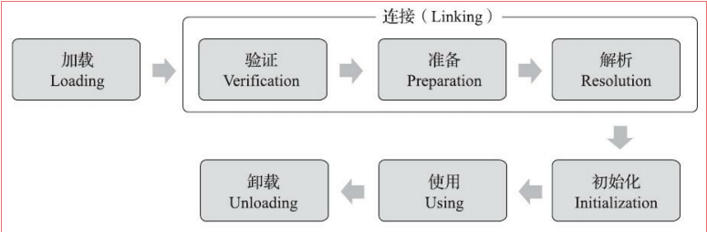

# 虚拟机类加载机制
&nbsp;&nbsp;通过该章节来复习类文件结构、类加载机制

##  类加载的时机(OpenJDK8)
1. 遇到new、getstatic、putstatic或invokestatic这四条字节码指令时，如果类型没有进行过初始化，则需要先触发其初始化阶段
2. 使用java.lang.reflect包的方法对类型进行反射调用的时候，如果类型没有进行过初始化，则需
要先触发其初始化。
3. 当初始化类的时候，如果发现其父类还没有进行过初始化，则需要先触发其父类的初始化。但是接口不一样： 当一个接口在初始化时，并不要求父接口全部都完成初始化，只有在真正使用到父接口的时候才会初始化
4. 当虚拟机启动时，用户需要指定一个要执行的主类（包含main()方法的那个类），虚拟机会先
初始化这个主类
5. 当使用JDK 7新加入的动态语言支持时，如果一个java.lang.invoke.MethodHandle实例最后的解
析结果为REF_getStatic、REF_putStatic、REF_invokeStatic、REF_newInvokeSpecial四种类型的方法句柄，并且这个方法句柄对应的类没有进行过初始化，则需要先触发其初始化
6. 当一个接口中定义了JDK 8新加入的默认方法（被default关键字修饰的接口方法）时，如果有
这个接口的实现类发生了初始化，那该接口要在其之前被初始化

## 类的生命周期
&nbsp;&nbsp;类的生命周期如下图:
- 
## 类加载过程简要概述
- 参考《类加载过程简要概述.md》

## 类与类加载器
+ 参考《类与类加载器.md》

---
## 参考资料
1. 《006.BOOKs/深入理解Java虚拟机.pdf》
2. 《005.OpenJDK/001.openJdk8-b120/jdk-jdk8-b120》