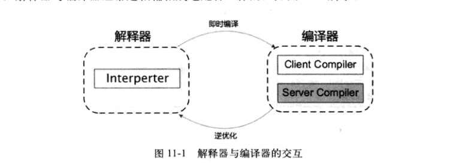
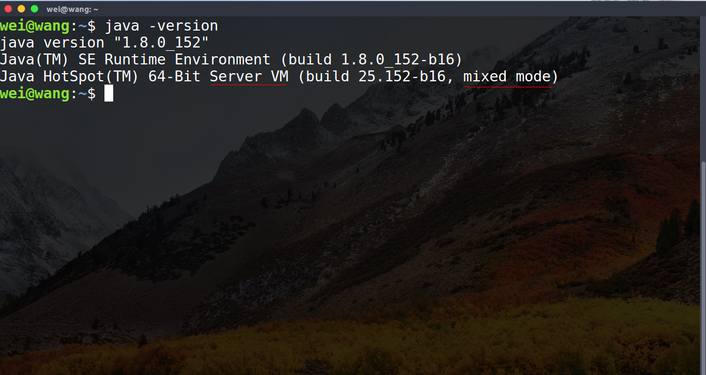
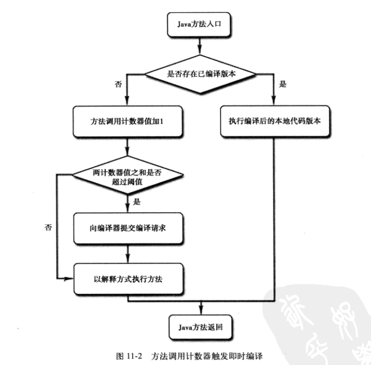
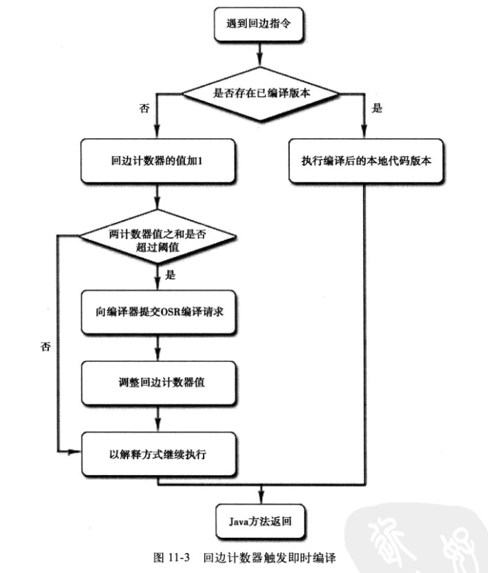
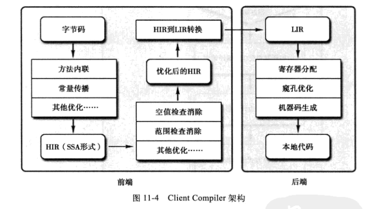

## 晚期(运行期)优化（Sun HotSpot）
|注意事项|说明|参考|注意事项|
|-|-|-|-|
|JIT原理|- [23-虚拟化：CPU虚拟化 [中山大学 操作系统原理]#方法2：二进制翻译](../../006.BOOKs/13-0522-virt-1.pdf)|- 这个二进制翻译，就是JIT|- 1. 缓存的代码补丁存储在哪里? Code Cache (既不在堆中，也不在元空间)|
|-|-|-|-|
|-|-|-|-|
|-|-|-|-|

### 引入“即时编译器”
部分的商用虚拟机（Sun HotSpot,IBM J9）中，Java程序最初是通过解释器进行解释执行的，当虚拟机发现某个方法或代码块的运行特别频繁时，就会把这些代码认定为"热点代码"。为了提高热点代码的执行效率，在运行时，虚拟机会将这些代码编译成与本地平台相关的机器码，并且进行各种层次的优化，完成这个任务的编译器称为即时编译器（Just In Time Compiler,即JIT编译器）
+ 即时编译器并不是JVM规范，而是由具体的虚拟机自己实现的
### 回答如下问题列表
1. 为什么HotSpot虚拟机要使用解释器和编译器并存的架构
2. 为什么HotSpot虚拟机要实现两个不同的即时编译器
3. 程序何时使用解释器执行？何时使用编译器执行？
4. 哪些程序代码会被编译为本地代码？如何编译为本地代码？
5. 如何从外部观察即时编译器的编译过程和编译结果？
### 解释器&&编译器
#### 解释器优势
1. 当程序需要迅速启动和执行的时候，解释器可以首先发挥作用，省去编译时间，立即执行
2. 当程序运行环境内存资源限制较大，可以使用解释执行节约内存，反之可以使用编译执行来提升效率。
3. 作为编译器**激进优化**的逃生门，当激进优化的假设不成立，出现**罕见陷阱**时可以通过逆优化退回到解释执行继续执行。部分没有解释器的虚拟机也会采用不进行激进优化的C1编译器担任逃生门。
#### 编译器优势
1. 在程序运行后，随着时间的推移，编译器逐渐发挥作用，将越来越多的代码编译为本地代码之后，可以获得更高的执行效率。
#### 解释器和编译器的交互
+ 在整个虚拟机执行架构中，解释器和编译器经常配合工作
    
#### HotSpot中的即时编译器
HotSpot虚拟机内置了两个即时编译器，分别称为Client Compiler (C1)和 Servier Compiler(C2)，在JDK1.7 及之前的版本，默认采用解释器与其中一个编译器直接配合的方式工作，程序使用哪一个编译器，取决于虚拟机的运行的模式，HotSpot虚拟机会根据自身版本与宿主机器的硬件性能自动选择运行模式，用户也可以使用**-client**或者**-server**参数强制执行虚拟机运行在Client模式还是Server模式
1. HotSpot内置两种编译器
2. HotSpot会依据自身版本&宿主机硬件性能自动选择运行模式。
3. 可以手动选择运行模式
##### 编译器和解释器搭配的模式
+ 混合模式:解释器和编译器搭配使用的方式
+ 编译模式:使用参数-Xcomp 强制虚拟机运行于编译模式，这时候将优先采用编译方式执行程序，但是解释器仍然要在编译无法进行的情况下介入执行过程
   - 解释器会介入执行，在编译无法进行的情况下
+ 解释模式:使用参数-Cint强制虚拟机运行于解释模式，这是编译器不会介入工作，全部的代码都使用解释执行
+ 
+  如上图，可以看出该jvm运行于server模式，且是使用混合模式运行
##### 解释器为编译器铺垫
1. 由于即时编译器编译本地代码需要占用程序运行时间，要编译出优化程度更高的代码，所花费的时间可能更长;并且，要想编译出优化程度更高的代码，解释器可能还要替编译器收集性能监控信息，这对解释器执行的速度也会有影响。
2. 为了在程序启动响应速度与运行效率之间达到最佳的平衡，HotSpot虚拟机会逐渐启用分层编译的策略。分层策略最终在JDK1.7的Server模式虚拟机中作为默认编译策略被开启。分层编译根据编译器编译、优化规模、耗时划分除了不同的编译层次
    + 第0层:程序解释执行，解释器不开启性能监控功能，可触发第一层编译
    + 第1层:也成为C1编译，将字节码编译为本地代码，进行简单、可靠的优化，如有必要将加入性能监控的逻辑
    + 第2层:也成为C2编译，也是将字节码编译为本地代码，但是会启用一些编译耗时较长的优化，甚至会根据性能监控信息进行一些不可靠的激进优化，不再承担收集性能监控信息的任务
3. 实施分层编译后，Client Compiler & Server Compiler会同时工作，许多代码都可能会被多次编译。用Client Compiler获取更高的编译速度，用Server Compiler来获取更高的编译质量，在解释执行的时候也无需再承担收集性能监控信息的任务
### 编译对象和触发条件
#### 编译的对象
在运行过程中，会被即时编译器编译的热点代码有两类
+ 被多次调用的循环体
  - 以整个方法作为编译对象
+ 被多次执行的循环体
  - 以整个方法作为编译对象，而非单独的循环体。这种编译方式因为编译发生在方法执行的过程之中，因此形象的称为栈上替换(on stack replacement),简称OSR编译，即方法还在栈上，方法就被替换了
#### 触发的条件
+ 前面提到，即时编译器编译的对象是**"热点代码"**，那么如何判断一段代码是不是热点代码呢？目前有两种判定方式：
  1. 基于采样的热点探测，采用这种方式的虚拟机会周期性地检查各个线程的栈顶，如果发现某个或某些方法经常出现在栈顶，那这个方法就是热点代码。
      + 优点:简单、高效;缺点:难以确定一个方法的热度，容易受到线程阻塞或别的外界因素的影响而扰乱线程探测
  2. [HotSpot使用的方式]基于计数器的热点探测：采用这种方法的虚拟机会为每个方法(甚至是代码块)建立计数器，统计方法的执行次数，若执行次数超过一定的阈值就认为他是热点代码
      + 优点：统计结果更加准确，严谨;缺点:实现复杂，不能直接获取到方法的调用关系
#### HotSpot使用的，即 基于计数器 的热点探测
+ HotSpot使用的是基于计数器的热点探测，他为每个方法准备了两类计数器
  1. 方法调用计数器
  2. 回边计数器
#### 方法调用计数器
该计数器用于统计方法被调用的次数，默认值在client模式下为1500次，在server模式先为10000次，这个阈值可以通过参数-XX:CompileThreshold来进行认为设定。
##### 流程（如图）
+ 
+ 当一个方法被调用是，先会去检测方法是否存在被JIT编译过的版本，存在，则优先使用编译后的本地代码来执行。不存在，则将该方法的调用计数器值加一，然后再去判断方法调用计数器与回边计数器之和时候超过方法调用计数器的阈值。若超过，则会向即时编译器提交一个该方法的编译请求。
+ 注意，若此处不做任何设置，执行引擎并不会同步等待编译请求的完成，而是继续进入解释器按照解释方式执行字节码，直到提交的请求被编译器编译完成。当编译完成之后，这个方法的调用入口地址就会被系统自动改写成新的。
###### 注意
1. 若不做任何设置，方法调用计数器统计的并不是方法被调用的绝对次数，而是一个相对的执行频率，即一段时间内方法被调用的次数。
    - 方法调用计数器的热度的衰减:当超过一段时间的限度，若方法的调用次数并不足以让他提交给即时编译器编译，那这个方法的调用计数器就会被减少一半。
    - 进行热端衰减的动作实在虚拟机进行垃圾收集时顺便进行的，可以使用参数-XX:-UseCounterDecay来关闭热度衰减，让方法调用计数器统计方法的绝对调用次数。
    - 可以使用-XX:CounterHalfLifeTime来设置半衰周期的时间，单位:秒
#### 回边计数器
+ 参数-XX:OnStackReplacePercentage来间接调整回边计数器的阈值
+ **回边**: 在字节码中遇到控制流向后跳转的指令称为回边
##### 流程(如图)
+ 
+ 当解释器遇到一条回边指令的时候，会先查找将要执行的代码片段是否有已经编译好的版本。有，则优先执行已编译的代码，否则将计数器值加一，然后再判断方法调用计数器和回边计数器的值是否超过回边计数器的阈值，当超过的时候，将会提交一个OSR编译请求，并且把回边计数器的值降低一点，以便继续在解释器中执行循环，等待编译器输出编译结果。 
###### 注意
1. 回边计数器没有计数器热度衰减的过程，因此这个计数器统计的就是方法循环执行的绝对次数
### 编译过程
1. 不论是方法调用产生的即时编译请求，还是OSR编译请求，虚拟机在代码还未完成之前，都要依照解释方式继续执行，而编译动作发生在后台的编译线程中。用户可以使用参数-XX:-BackgroundCompilation来禁止后台编译，这样引发的后果就是：一旦达到JIT编译条件，执行线程就会向虚拟机提交编译请求后将会一直等待，直到编译过程完成后在开始执行编译器输出的本地代码
#### client compiler三段式编译
1. 第一阶段: 将字节码编译为高级中间件代码(High-LevelIntermediate Representaion,HIR);在字节码的阶段上完成基础优化:方法内联、常量传播等
2. 第二阶段:将HIR转化为LIR(Low-Level intermediate representation , 低级中间代码);在HIR的基础上完成了空值检查消除、范围检查消除
3. 第三阶段:将LIR优化为机器代码
+ 
### Server compiler 
+ server compiler是专门面向服务端的典型应用并为服务端的性能配置特别调整过的编译器，也是一个充分优化过的高级编译器。还可以根据解释器或者Client Compiler提供的性能监控信息，进行一些不稳定的激进优化(守护内联，分支频率预测等)
+ 优化项
   - 无用代码消除
   - 循环展开
   - 循环表达式外提
   - 消除公共子表达式
   - 常量传播
   - 基本块重排序
   - 范围检查消除
   - 空值检查消除
+ 相对于Client Compiler，Server Compiler更加缓慢，但编译速度依然远远超过传统的静态优化编译器，输出的代码质量有所提高，可以减少本地代码的执行时间。

### 编译优化技术
+ HotSpot虚拟机的即时编译器在生成代码时采用的优化技术
+ 优化的变换是建立在代码的某种中间表示或者机器码之上的，并不是建立在java源码之上的
+ 其他详见《JVM.pdf》第十一章
