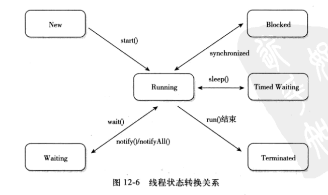

# Java 线程
### Java中的线程实现
+ 实现方式:
   - 对于Sun JDK而言，他的windows版本和Linux版本都是使用一对一的线程模型实现的，一条Java线程就映射到一条轻量级线程上，因为windows和Linux系统提供的线程模型就是一对一的
### Java中的线程调度方式
+ 线程调度是指的是系统为线程分配处理器使用权的过程，主要的调度方式：
    1. 协同式线程调度
       + 线程的执行时间是线程本身来控制
    2. 抢占式线程调度
       + 每个线程将由系统来分配执行时间，线程的切换不由线程本身来决定。
#### Java中的线程调度方式 
+ Java中使用的线程调度方式为**抢占式线程调度**，也不难理解，Java(Sun JDK)中的线程都是映射到OS中的线程上去执行的
### Java中的线程的状态
+ Java中的线程状态有6种
   1. 新建(New)
        - 创建后但未启动的线程处于这种状态
   2. 运行(Runnable)
        - Runnable包括了操作系统状态中的Running和Ready，也就是处于此状态的线程在OS中的状态有两种
            + 有可能在执行
            + 有可能正在等待着CPU为他分配执行时间
   3. 无限期等待
        - 处于这种状态的线程不会被分配CPU执行时间，他们要等待被其他线程显式唤醒。一下方法会使得线程陷入无限期的等待状态:
           1. 没有设置Timeout参数的Object.wait方法
           2. 没有设置Timeout参数的Thread.join方法
           3. LockSupport.park方法
   4. 限期等待
        - 处于这种状态的线程也不会被分配CPU执行时间，不过无需被其他线程显式唤醒，在一定时间后他们会由系统自动唤醒。一下方法会让线程进入限期等待状态:
           1. Thread.sleep方法
           2. 设置Timeout参数的Object.wait方法
           3. 设置了Timeout参数的Thread.join方法
           4. LockSupport.parkNanos方法
           5. LockSupport.parkUntil方法
   5. 阻塞
        - 线程被阻塞了，阻塞状态了等待状态的区别是: 阻塞状态在等待着获取一个排他锁，这个事件将在另一个线程放弃这个锁的时候发生;而等待状态则是在等待一段时间或者唤醒动作的发生。**在程序等待进入同步区域的时候，线程将进入该状态**
   6. 结束
        - 已终止线程的线程状态，线程已经结束运行
+ 线程状态转换图
   
   + 