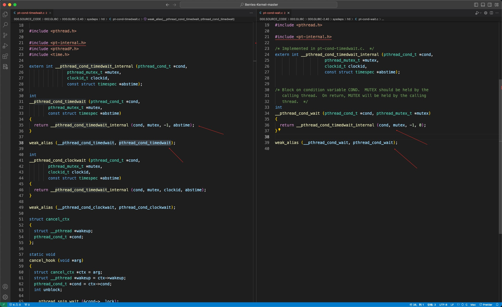
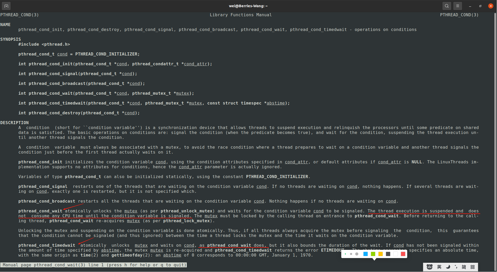

# Thread.sleep(x) 与 LockSupport#park(Obj)
## 总结
&nbsp;&nbsp; Thread.sleep(x) 相比于 LockSupport#park(Obj) 是更耗费CPU资源的,这似乎并不正确，通过测试代码: [005.OpenJDK/003.prictice-code/ThreadSleepTest.java](../../005.OpenJDK/003.prictice-code/ThreadSleepTest.java)来分析(同一个代码,运行10分钟之后)：
+ 从OS(操作系统)的角度（top -H -p $pid）
  - 
+ 从JVM的角度
  - 
+ 系统信息
  ```txt
      Ubuntu20.04
      内核版本: 
      wei@Wang:~$ uname -a
      Linux Wang 5.13.0-40-generic #45~20.04.1-Ubuntu SMP Mon Apr 4 09:38:31 UTC 2022 x86_64 x86_64 x86_64 GNU/Linux

      从上述截图可以看出，Thread.sleep(x) 与 LockSupport#park(Obj) 导致线程挂起之后，均不会占用CPU执行时间。但是线程状态不同:
        从JVM角度:
           Thread.sleep(x): TIMED_WAITING , 限期等待
           LockSupport#park(Obj): WAITING , 无限期等待
        从OS角度:
           两者都是:S(sleeping)

    另外: 
       1. int pthread_cond_timedwait(pthread_cond_t *cond, pthread_mutex_t *mutex, const struct timespec *abstime);
          第三个参数是绝对时间，只是绝对时间怎么计算，得具体情况具体分析，例如 `005.OpenJDK/002.OpenJDK8u312-GA/OpenJDK8U312-GA/hotspot/src/os/linux/vm/os_linux.cpp#os::PlatformEvent::park(jlong millis)`(Thred.sleep(x)),这里会根据内核的能力选择不同(`支持单调时钟?选择单调时钟:选择系统时间`)的方式计算绝对时间(compute_abstime(&abst, millis);)
         > 通过代码发现，如果系统支持 ‘单调时钟（Monotonic Clock）’ ， 那就按照单调时钟（Monotonic Clock）来计算绝对时间，不受系统时间调整影响
         > 单调时钟: 以 系统启动时间 作为参照而计算的时间

    Thread.sleep(x)底层实现: 005.OpenJDK/002.OpenJDK8u312-GA/OpenJDK8U312-GA/hotspot/src/share/vm/prims/jvm.cpp
    LockSupport#park(Obj) 底层实现: 005.OpenJDK/002.OpenJDK8u312-GA/OpenJDK8U312-GA/hotspot/src/share/vm/prims/unsafe.cpp

  ```


## 分析
&nbsp;&nbsp;探索Thread.sleep(x) 与 LockSupport#park(Obj)之间的不同

### Thread.sleep(x)
```java
    /**
     * Causes the currently executing thread to sleep (temporarily cease
     * execution) for the specified number of milliseconds, subject to
     * the precision and accuracy of system timers and schedulers. The thread
     * does not lose ownership of any monitors.
     * <p>
     * 根据系统计时器和调度器的精度和准确性，使当前执行的线程在指定的毫秒数内处于睡眠状态(暂时停止执行)。线程不会失去任何监视器的所有权。
     *
     * @param millis the length of time to sleep in milliseconds
     * @throws IllegalArgumentException if the value of {@code millis} is negative
     * @throws InterruptedException     if any thread has interrupted the current thread. The
     *                                  <i>interrupted status</i> of the current thread is
     *                                  cleared when this exception is thrown.
     */
    public static native void sleep(long millis) throws InterruptedException;

    // 最终调用使用"os::sleep"来实现sleep逻辑( 005.OpenJDK/002.OpenJDK8u312-GA/OpenJDK8U312-GA/hotspot/src/share/vm/prims/jvm.cpp#JVM_ENTRY(void, JVM_Sleep(JNIEnv* env, jclass threadClass, jlong millis));)


     // 通过代码探索，发现Thread.sleep(x) 是调用函数 
    int pthread_cond_timedwait(pthread_cond_t *cond, pthread_mutex_t *mutex, const struct timespec *abstime);
      // # 005.OpenJDK/002.OpenJDK8u312-GA/OpenJDK8U312-GA/hotspot/src/os/linux/vm/os_linux.cpp 可以看这个源码：compute_abstime 计算绝对时间(看系统，可以是绝对时间，可以是相对于系统启动时间的绝对时间)
     // 来暂停线程的。man page信息如下:
       // atomically unlocks mutex and waits on cond, as pthread_cond_wait does, but it also bounds the duration of the wait. If cond has  not  been signaled  within the amount of time specified by abstime, the mutex mutex is re-acquired and pthread_cond_timedwait returns the error ETIMEDOUT.  The abstime parameter specifies an absolute time, with the same origin as time(2) and gettimeofday(2): an abstime of 0 corresponds to 00:00:00 GMT, January 1, 1970.

    // 通过源代码可知，Thread.sleep(x) 底层调用逻辑如下:
    // pthread_mutex_lock -> pthread_cond_timedwait(等待指定时间，从而达到sleep功能) -> pthread_mutex_unlock
```

#### Thread.sleep(x)将线程挂起后，也不会消耗CPU资源
通过   发现， pthread_cond_wait 、 pthread_cond_timedwait 最底层调用的函数是一样的，因此Thread.sleep(x)将线程挂起后，也不会消耗CPU资源

---

### LockSupport#park(Obj)
&nbsp;&nbsp;该方法主要是通过调用“sun.misc.Unsafe#park”来实现的，因此，需要了解“sun.misc.Unsafe#park(boolean,long)”方法的逻辑，该方法是native方法，对应的cpp代码:"005.OpenJDK/002.OpenJDK8u312-GA/OpenJDK8U312-GA/hotspot/src/share/vm/prims/unsafe.cpp"中。通过解读代码，可以发现，LockSupport#park(Obj)通过如下C函数来调用的。
  ```c
    // 《UNIX 环境高级编程·第3版》
    // pthread man 手册安装 $: sudo apt-get install glibc-doc manpages-posix manpages-posix-dev

    // LockSupport#park(Obj) : 调用顺序: pthread_mutex_trylock -> pthread_cond_wait
    int pthread_mutex_trylock(pthread_mutex_t *mutex);
    // behaves identically to pthread_mutex_lock, except that it does not block the calling thread if the  mutex  is  already  locked  by  another thread (or by the calling thread in the case of a ``fast'' mutex). Instead, pthread_mutex_trylock returns immediately with the error code EBUSY.
    //  尝试对互斥量进行加锁，如果调用时互斥量处于未加锁的状态，则pthread_mutex_trylock将锁住互斥量，不会出现阻塞直接返回0.

    int pthread_cond_wait(pthread_cond_t *cond, pthread_mutex_t *mutex);
    // pthread_cond_wait atomically unlocks the mutex (as per pthread_unlock_mutex) and waits for the condition variable cond to be signaled. The  thread  execution  is  suspended  and  does  not  consume  any  CPU  time  until  the  condition  variable  is  signaled.  The mutex must be locked by the calling thread on entrance to  pthread_cond_wait. Before returning to the calling thread, pthread_cond_wait re-acquires mutex (as per pthread_lock_mutex). 
    // 线程被暂停且不会消耗任何CPU
    // 调用者将锁住的互斥量传递给函数，函数然后自动把调用线程放到等待条件的线程列表上，对互斥量进行解锁。  这就关闭了条件检查和线程进行休眠状态等待条件这两个操作之间的时间通道，这样就不会错过条件的任何变化。 pthread_cond_wait返回时，互斥量再次被锁住.

    // LockSupport#unpark
    int pthread_mutex_lock(pthread_mutex_t *mutex);
    // locks  the given mutex. If the mutex is currently unlocked, it becomes locked and owned by the calling thread, and pthread_mutex_lock returns immediately. If the mutex is already locked by another thread, pthread_mutex_lock suspends the calling thread until the mutex is unlocked.
    // 对互斥量加锁，即加锁

    int pthread_cond_signal(pthread_cond_t *cond);
    // pthread_cond_signal  restarts  one of the threads that are waiting on the condition variable cond. If no threads are waiting on cond, nothing happens. If several threads are waiting on cond, exactly one is restarted, but it is not specified which.
    // 唤醒一个等待该条件的线程。


    int pthread_mutex_unlock(pthread_mutex_t *mutex);
    // unlocks the given mutex. The mutex is assumed to be locked and owned by the calling thread on entrance to pthread_mutex_unlock. If the mutex is of the ``fast'' kind, pthread_mutex_unlock always returns it to the unlocked state. If it is of the ``recursive'' kind, it decrements the locking count of the mutex (number of pthread_mutex_lock operations performed on it by the calling thread), and only when this count reaches zero is the mutex actually unlocked.
    // 对互斥量解锁，即释放锁
  ```
#### man pthread_cond_wait


---
## 线程中断和挂起方式的关系
&nbsp;&nbsp;在AQS中，当线程被唤醒时，会返回线程的中断状态,因为AQS中被阻塞的线程无法响应中断。那么线程中断是什么?与线程挂起方式有什么区别呢?
- 线程中断是什么?
  + 线程中断: 线程中断是内核与硬件的一种通信方式。如：敲击键盘，键盘控制器就会发送一个中断，通知OS有键按下。
    1. 中断可以随时产生，因此，内核随时可能因为新到来的中断而被打断。
    2. 中断的本质是一种电信号，由硬件设备生成。 当接收到一个中断后，中断控制器就会给处理器发送一个电信号。处理器检测到此信号，便中断自己的当前工作转而处理中断。

- 二者区别
   + Thread.sleep(x);(x>0)会响应中断，是因为"int os::sleep(Thread* thread, jlong millis, bool interruptible);"本身就会响应线程中断(interruptible为TRUE时)。可以查看具体代码
   + 是直接调用"void Parker::park(bool isAbsolute, jlong time);"来中断线程的，而没有经过"os::sleep"函数。因此，并没有处理线程中断位。
---
## 番外篇
### Thread.Sleep(0): 就是“触发操作系统立刻重新进行一次CPU竞争 解析
&nbsp;&nbsp; 这个真的会“触发操作系统立即重新进行一次CPU竞争”吗? 答案是“默认的情况下是这样的”,参考代码:[005.OpenJDK/002.OpenJDK8u312-GA/OpenJDK8U312-GA/hotspot/src/share/vm/prims/jvm.cpp](../../005.OpenJDK/002.OpenJDK8u312-GA/OpenJDK8U312-GA/hotspot/src/share/vm/prims/jvm.cpp),Thread.sleep 对应的实现"JVM_ENTRY(void, JVM_Sleep(JNIEnv* env, jclass threadClass, jlong millis))"。 是否会触发CPU的竞争还是看静态变量:ConvertSleepToYield(默认为true)。当为false的时候，调用线程不会陷入等待，而是直接返回。具体可以debug测试。


---

## 参考资料
1. OpenJDK1.8
2. 《UNIX 环境高级编程·第3版》
3. 《Linux内核设计与实现》
