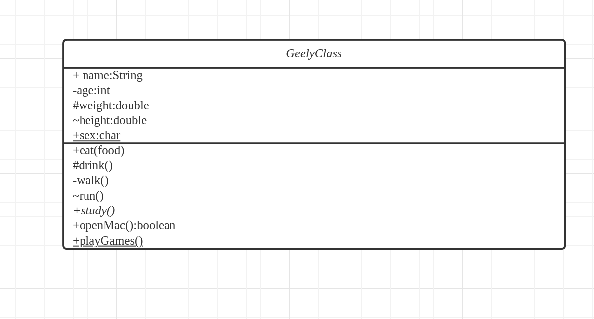

# UML类图

## UML类
&nbsp;&nbsp;如下图，UML使用如下形式表示类:

&nbsp;&nbsp;上图描述的信息如下:
- 第一部分: GeelyClass,即类的名字。注意事项如下:
    + 抽象类得是斜体，例如这里的GeelyClass,因为有抽象方法study
- 第二部分： 类的属性，如name是属性名称，String是属性的类型，：(冒号)为属性名字和类型分隔符。加了下划线，如sex属性，表示是static的。属性名字之前的+、-、#分别表示访问修饰符:
    + +: public
    + -: private
    + #: protected
    - ~：default
- 第三部分： 类的行为，+、-、~、#表示访问权限修饰符，斜体(study)表示是一个抽象方法，下划线(playGames)表示是static的。
 
 ## UML类图
 &nbsp;&nbsp;一个完整的UML图如下:
 

&nbsp;&nbsp;部分解释如下：
1. 聚合关系:  表示集体与个体之间的关联关系
2. 组合关系： 个体与组成部分之间的关联关系