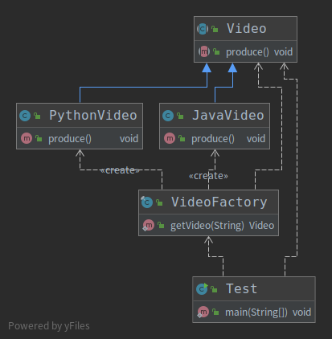

# 简单工厂设计模式
## 定义
&nbsp;&nbsp;由一个工厂对象决定创建出哪一种产品类的实例。
   1. 工厂类负责创建的对象比较少
   2. 客户端（应用层）只知道传入工厂类参数，对于如何创建对象（逻辑） 并不关心

## 类型
&nbsp;&nbsp;创建型，但不属于GOF23种设计模式

## 优点
1. 只需要传入一个正确的参数，就可以获取你需要的对象，而无需知道创建细节

## 缺点
1. 工厂类的职责相对过重，增加新产品，需要修改工厂类的判断逻辑，违背开闭原则。

## 代码示例
&nbsp;&nbsp;如代码002.Java设计模式/003.SourceCode/Design-Pattern/src/main/java/link/bosswang/simplefactory,类图如下:
- 

&nbsp;&nbsp;如上图，Test类并没有直接引用Video的具体实现类，Test直接使用VideoFactory来产生指定类型的视频。那么当视频类型增加时，就需要去添加对应的实现类并且修改VideoFactory.java工厂类。那么这样就违背了设计原则：对拓展开放，对修改关闭。

## 应用案例
1. 005.OpenJDK/000.openJDK_8u40/jdk/src/share/classes/java/util/Calendar#getInstance