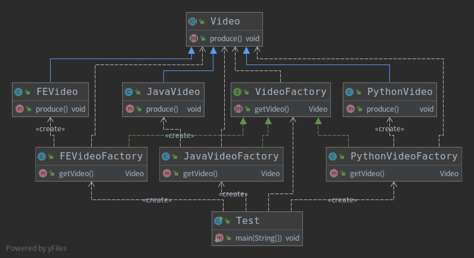

# 工厂方法模式
## 定义
&nbsp;&nbsp;定义一个创建对象接口，但让实现这个接口的类来决定实例化哪个类，工厂方法让类的实例化推迟到子类中进行。

## 适用场景
1. 创建对象需要大量重复代码
2. 应用层不依赖于产品类实例如何被创建、实现等细节
3. 一个类通过其子类来创建哪个对象

## 优点
1. 只需要关心所需产品对应的工厂，无需关心创建细节
2. 加入新产品符合开闭原则，提高可拓展性

## 缺点
1. 类的个数容易过多，增加复杂度
2. 增加了系统的抽象性和理解难度

## 代码示例
- 代码示例如代码:002.Java设计模式/003.SourceCode/Design-Pattern/src/main/java/link/bosswang/factorymethod ，类图如下:
    + 

## 应用示例
1. 005.OpenJDK/000.openJDK_8u40/jdk/src/share/classes/java/util/Collection#iterator
    - 在每一个实现类下都会自定义该方法来产生与之匹配的Iterator