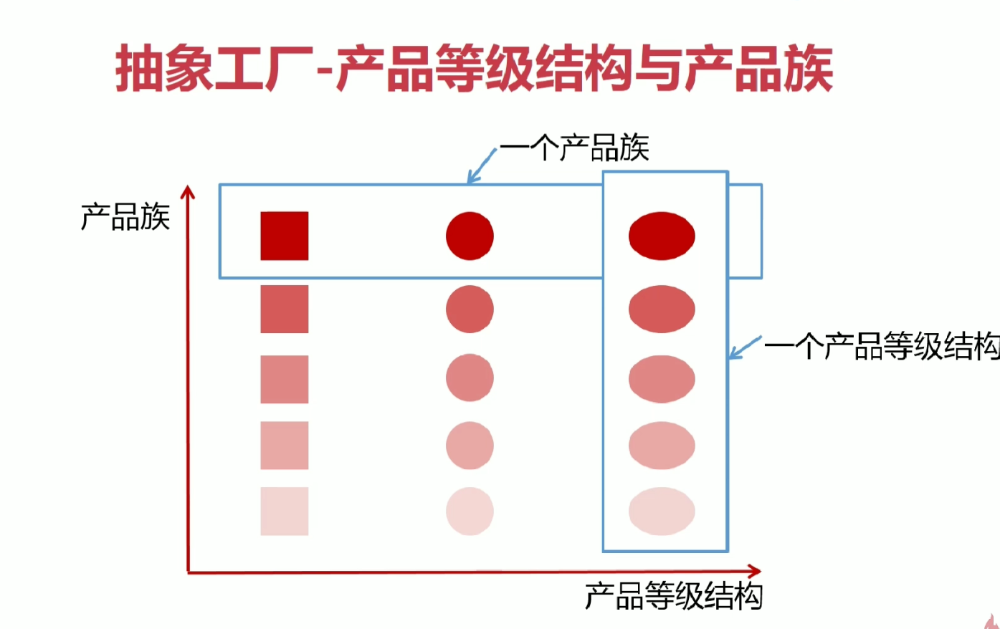
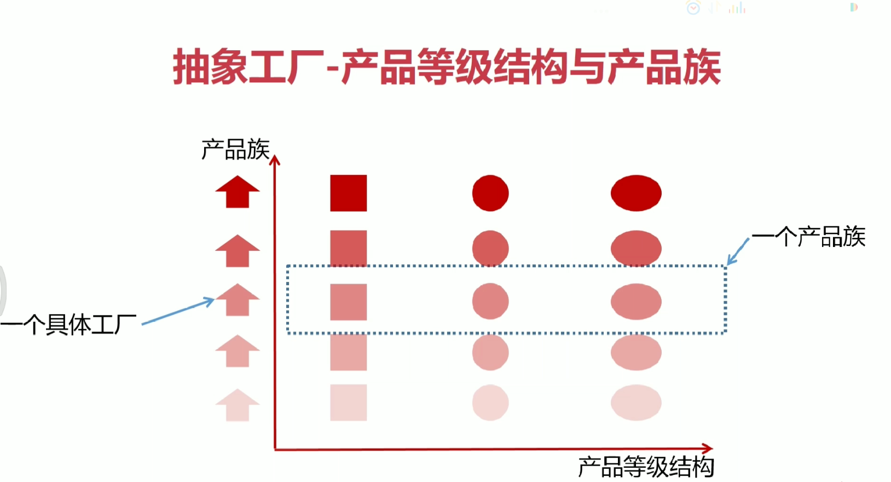
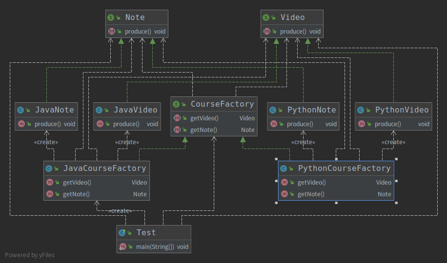

# 抽象工厂设计模式
## 定义
&nbsp;&nbsp;抽象工厂模式提供一个创建一系列相关或相互依赖对象的接口，而无需指定它们具体的类。要想理解抽象工厂设计模式，先理解一下下面的产品族和产品等级的概念吧。

## 产品族 & 产品等级

### 产品族： 某一品牌下的商品
&nbsp;&nbsp;如正方形、原型、椭圆形分别类比为品牌A的商品G1、商品G2、G3
### 产品等级： 不同品牌的同一种商品
&nbsp;&nbsp;如品牌A的商品G1，品牌B的商品G1,品牌C的商品G1

### 工厂定义
- 

&nbsp;&nbsp;如上图，抽象工厂设计就是该工厂能够生产一个产品族下所有不同产品等级的产品，他既可以创建产品A，也可以创建产品B还可以创建产品C，但是产品A、B、C一定都是同一个产品族的。

## 优点
1. 新增产品族是符合开闭原则的
2. 当一个产品族中的多个对象被设计成一起工作时，它能保证客户端始终只使用同一个产品族中的对象。
## 缺点
1. 新增产品等级是不符合开闭原则的，如新增一个产品，则抽象工厂整体需要修改了

## 实例
&nbsp;&nbsp;如代码: 002.Java设计模式/003.SourceCode/Design-Pattern/src/main/java/link/bosswang/abstractfactory,对应的类图如下:
- 

-------
## 参考资料
1. [抽象工厂模式](https://www.runoob.com/design-pattern/abstract-factory-pattern.html)