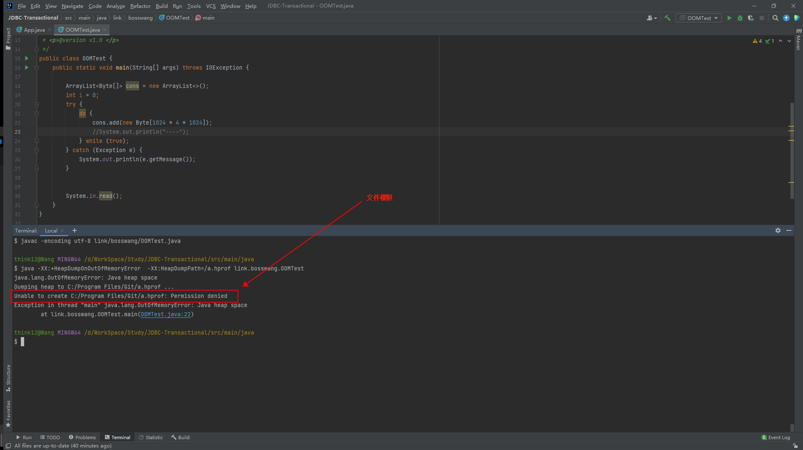
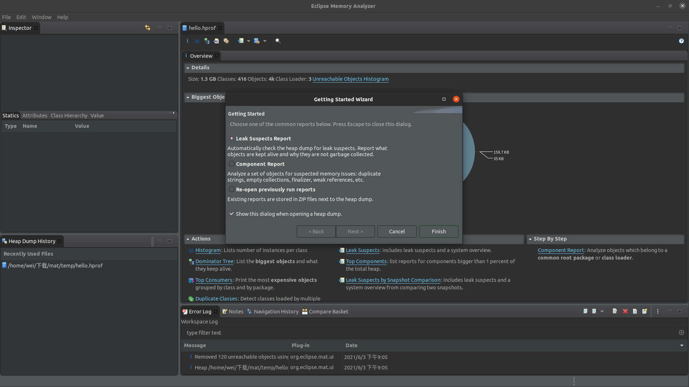
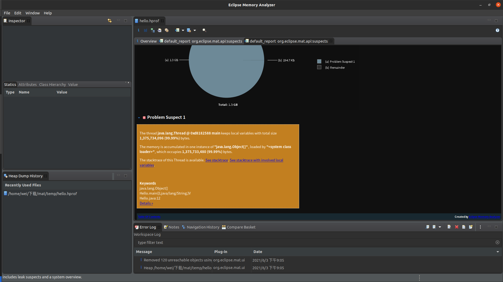
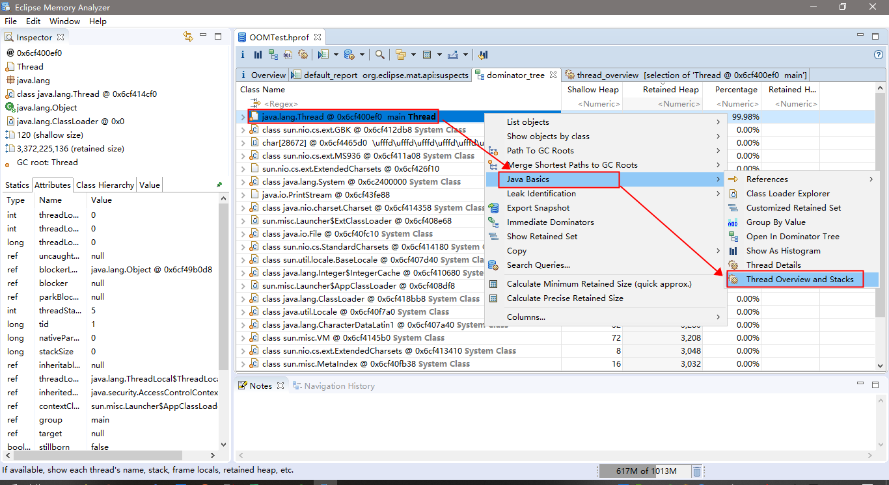
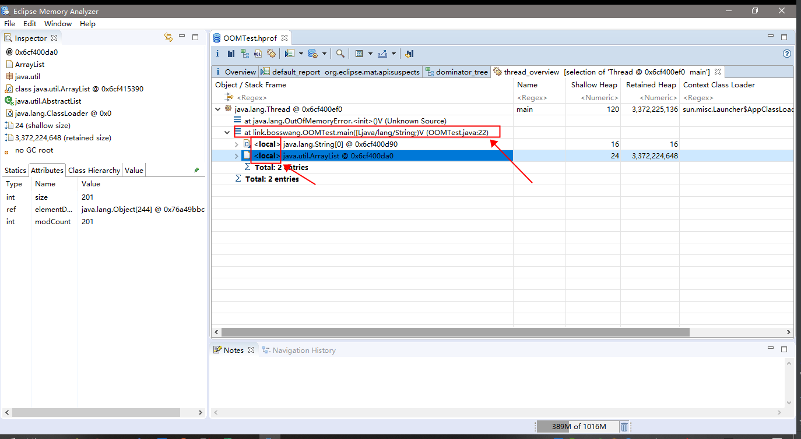
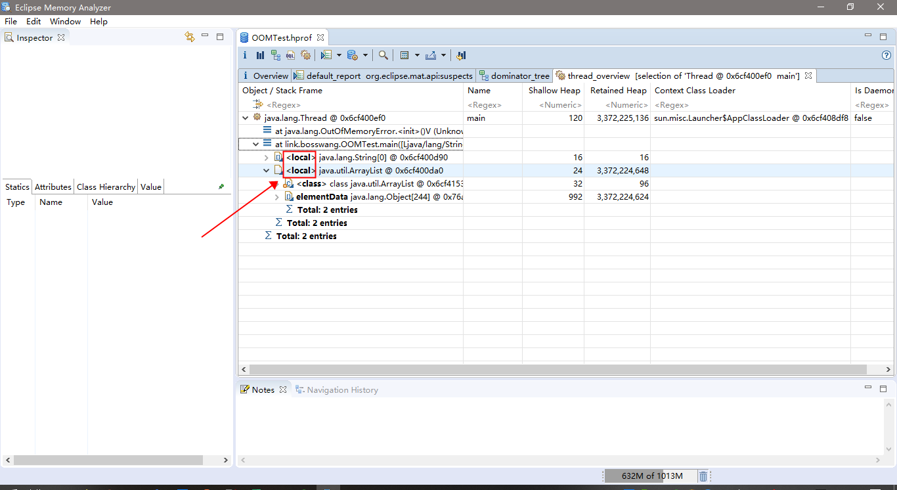

# OOM问题排查
&nbsp;&nbsp;目标：
1. 将JVM堆栈信息打印出来
2. 使用Memory Analyzer (MAT)分析解决问题

## 第一步： 获得程序运行的堆栈信息
&nbsp;&nbsp;获得程序运行是的堆栈信息有两种方式：
1. 程序启动时指定虚拟机参数
2. 使用jmap命令来导出堆栈信息

### 方式一: 程序启动时指定虚拟机参数
&nbsp;&nbsp;如下两个参数定义于hotspot/src/share/vm/runtime/globals.hpp中，分别含义如下:

   ```c
     manageable(bool, HeapDumpOnOutOfMemoryError, false,                       \
          "Dump heap to file when java.lang.OutOfMemoryError is thrown")    \
                                                                            \
     manageable(ccstr, HeapDumpPath, NULL,                                     \
          "When HeapDumpOnOutOfMemoryError is on, the path (filename or "   \
          "directory) of the dump file (defaults to java_pid<pid>.hprof "   \
          "in the working directory)")  
   ```
- -XX:+HeapDumpOnOutOfMemoryError
- -XX:HeapDumpPath

&nbsp;&nbsp;具体如下图：

- 

   - 如上，可能在运行的时候会因为权限问题导致无法在程序异常的时候将堆栈信息打印出来，因此需要当前程序拥有这个目录的操作权限。

### 方式二： 使用jmap命令来导出堆栈信息
&nbsp;&nbsp;命令jmap是一个多功能的命令。它可以生成 java 程序的 dump 文件， 也可以查看堆内对象示例的统计信息、查看 ClassLoader 的信息以及 finalizer 队列

&nbsp;&nbsp;导出堆栈信息命令如下:
- jmap -dump:format=b,file=error.hprof  pid

## 使用Memory Analyzer Tool (MAT)分析解决问题
&nbsp;&nbsp;获取到堆栈信息之后，需要对堆栈信息进行分析，这里选取MAT进行分析。

&nbsp;&nbsp;出现的名词介绍:
- Leak Suspects Report： 漏洞疑点报告，自动检查堆转储是否存在泄漏嫌疑，报告哪些对象被保存起来，为什么它们没有被垃圾收集；
- Component Report： 元件报告，分析一组对象是否存在可疑的内存问题：重复的字符串、空集合、终结器、弱引用等
- Re-open previously run reports： 打开以前的运行报告；
- Shallow Heap(浅堆)：表示对象本身占用内存的大小，也就是对象头加成员变量（不是成员变量的值）的总和
- Retained Heap(保留堆)：如果一个对象被释放掉，那会因为该对象的释放而减少引用进而被释放的所有的对象（包括被递归释放的）所占用的heap大小，即对象被垃圾回收器回收后能被GC从内存中移除的所有对象之和。

### 方式一： 使用Leak Suspects Report
#### 第一步：打开hprof文件是选择Leak Suspects Report
- 

#### 第二步: 点击查看Details
- 

### 方式二： 通过线程查看
&nbsp;&nbsp;可以找到内存占用最大的线程作为入口开始分析。如下

1. 
2. 
3. 