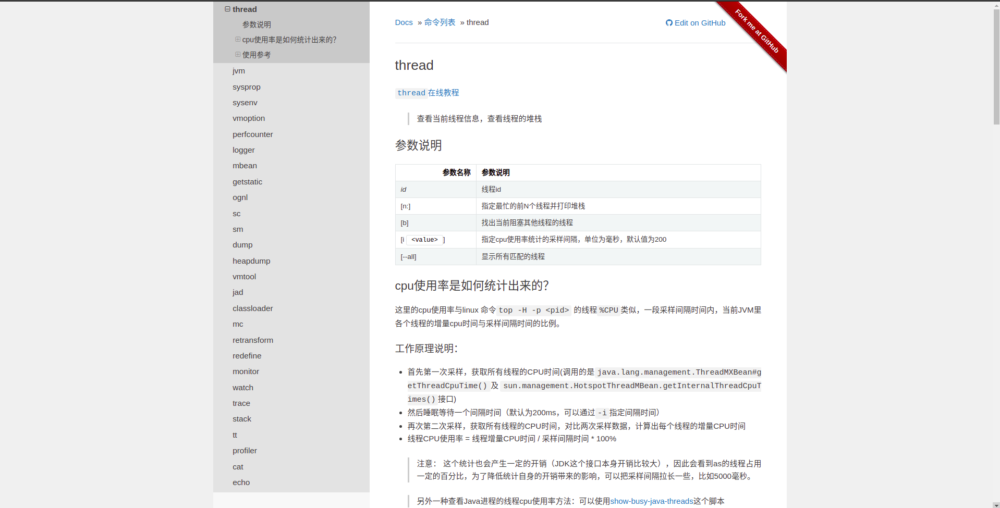
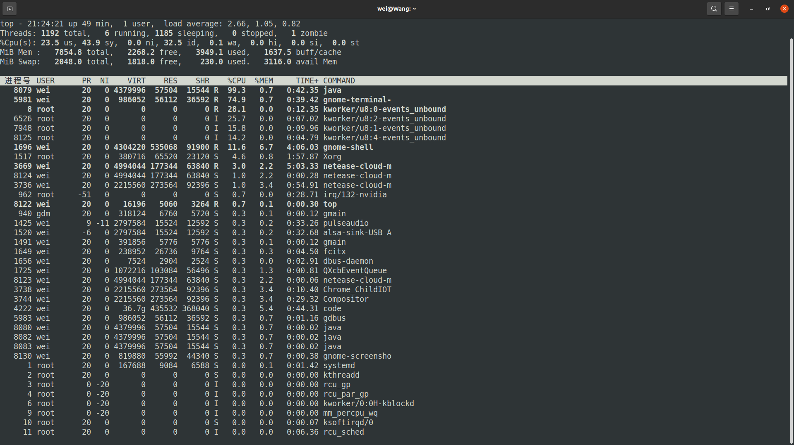
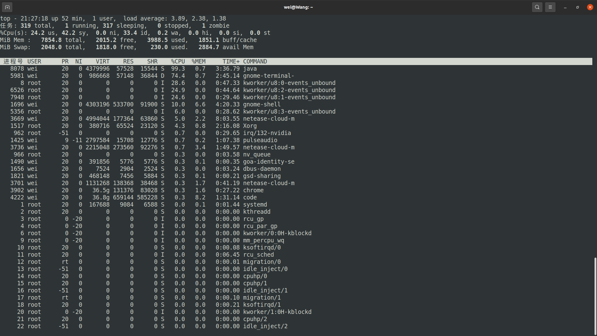
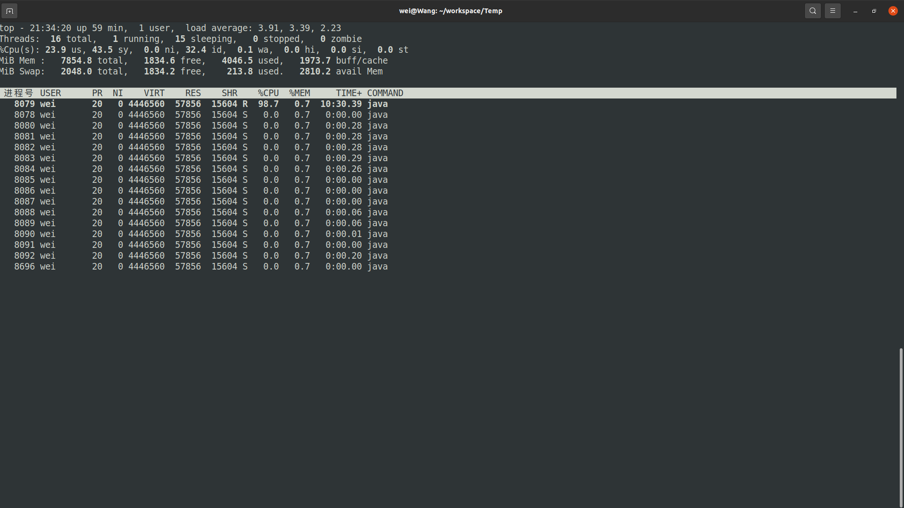
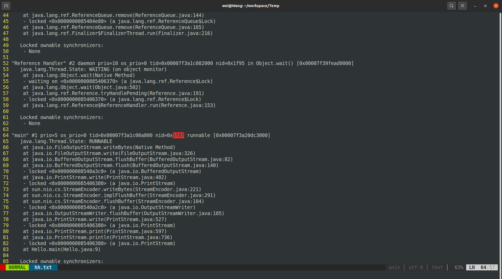

# 002.CPU使用率过高问题排查
&nbsp;&nbsp;直接开始
## 使用arthas更好
&nbsp;&nbsp;arthas提供了thread命令，如下图


---------

## 传统方式:jstack 
### 第一步，准备程序
```java
  public class Hello{

    public static void main(String[] args){

        int i = 0;

        while(true){

            System.out.println(++i);
        }
    }
}

```

### 第二步: 编译这段代码，并一直运行


### 第三步： 使用top -H命令，获取CPU占用率最高的进程
1. 首先运行top -H , 结果如下:
   - 
   - 但是需要注意的是，这里的进程号其实是线程号，因此需要再获取进程PID

2. 在top -H的基础上，输入H （shift + h），来获取进程PID
   - 
   - 如图，8078即为进程的PID

### 第四步，获取进程进程中CPU使用率最高的线程id
- 命令:
   - top -p 8078 , 如上，页面只有一个进程信息，因为此时的显示的进程级别的信息，需要输入H(shift + h)来展示线程信息，如下图：
      - 
      - 如上图所示，pid(线程号)为8079的线程cpu使用率最高。

### 第五步 将线程中的栈信息打印到文件中
- 命令: jstack -l 8078 > hh.txt

### 第六步 将线程pid转16进制
- 命令： printf "%x" 8079   , 输出： 1f8f

### 第七步 去文件中找到对应的线程
- 
  - 如上图，nid才是线程id，可以看到，在Hello.java的第9行出现了异常。


