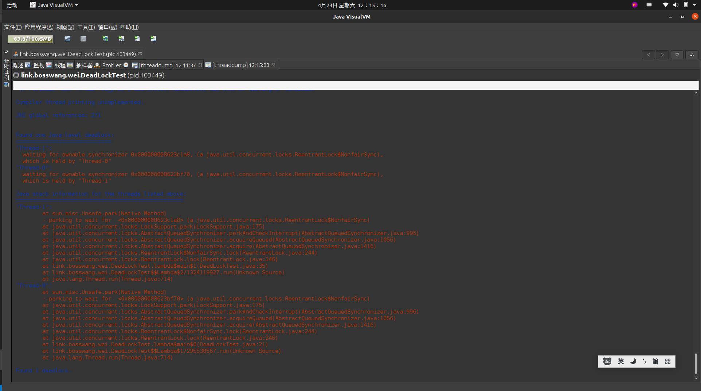

# Java 死锁检测
## 什么是死锁，死锁的产生的条件是什么?
### 死锁
&nbsp;&nbsp;死锁是指两个或两个以上的进程在执行过程中，由于竞争资源或者由于彼此通信而造成的一种阻塞的现象，若无外力作用，它们都将无法推进下去。此时称系统处于死锁状态或系统产生了死锁，这些永远在互相等待的进程称为死锁进程.[百度百科]

### 产生条件
1. 互斥条件：指进程对所分配到的资源进行排它性使用，即在一段时间内某资源只由一个进程占用。如果此时还有其它进程请求资源，则请求者只能等待，直至占有资源的进程用毕释放。
2. 请求和保持条件：指进程已经保持至少一个资源，但又提出了新的资源请求，而该资源已被其它进程占有，此时请求进程阻塞，但又对自己已获得的其它资源保持不放。
3. 不剥夺条件：指进程已获得的资源，在未使用完之前，不能被剥夺，只能在使用完时由自己释放。
4. 环路等待条件：指在发生死锁时，必然存在一个进程——资源的环形链，即进程集合{P0，P1，P2，···，Pn}中的P0正在等待一个P1占用的资源；P1正在等待P2占用的资源，……，Pn正在等待已被P0占用的资源。[百度百科]
   
## 测试代码
+ 代码与行号: 
+ 源代码如下: 
  ```java
        package link.bosswang.wei;

        import java.util.concurrent.locks.ReentrantLock;
        
        public class DeadLockTest {
            public static void main(String[] args) {
        
                ReentrantLock lock1 = new ReentrantLock();
                ReentrantLock lock2 = new ReentrantLock();
        
                (new Thread(() -> {
                    lock1.lock();
        
                    System.out.println("T1");
        
                    try {
                        Thread.sleep(3000);
                    } catch (InterruptedException e) {
                        e.printStackTrace();
                    }
                    lock2.lock();
                })).start();
        
                (new Thread(() -> {
                    lock2.lock();
        
                    System.out.println("T1");
        
                    try {
                        Thread.sleep(3000);
                    } catch (InterruptedException e) {
                        e.printStackTrace();
                    }
                    lock1.lock();
                })).start();
        
            }
        }
  ```
          
## 死锁检测
### [推荐]使用 Arthas 检测
&nbsp;&nbsp;一般线上环境，无法使用jstack,从而采用arthas检测

&nbsp;&nbsp;同样的代码，启动后，使用arthas来检测
```txt
[arthas@103449]$ thread -b
    "Thread-0" Id=11 WAITING on java.util.concurrent.locks.ReentrantLock$NonfairSync@27888865 owned by "Thread-1" Id=12
--------> # 手动注释: 通过上一行可以看出，该线程被其他线程阻塞了，线程id为12,再通过thread 12 可以看到该线程的执行内容
           at sun.misc.Unsafe.park(Native Method)
           -  waiting on java.util.concurrent.locks.ReentrantLock$NonfairSync@27888865
           at java.util.concurrent.locks.LockSupport.park(LockSupport.java:175)
           at java.util.concurrent.locks.AbstractQueuedSynchronizer.parkAndCheckInterrupt(AbstractQueuedSynchronizer.java:996)
           at java.util.concurrent.locks.AbstractQueuedSynchronizer.acquireQueued(AbstractQueuedSynchronizer.java:1056)
           at java.util.concurrent.locks.AbstractQueuedSynchronizer.acquire(AbstractQueuedSynchronizer.java:1416)
           at java.util.concurrent.locks.ReentrantLock$NonfairSync.lock(ReentrantLock.java:244)
           at java.util.concurrent.locks.ReentrantLock.lock(ReentrantLock.java:346)
           at link.bosswang.wei.DeadLockTest.lambda$main$0(DeadLockTest.java:21) # 死锁产生的位置
           at link.bosswang.wei.DeadLockTest$$Lambda$1/295530567.run(Unknown Source)
           at java.lang.Thread.run(Thread.java:714)
       
           Number of locked synchronizers = 1
           - java.util.concurrent.locks.ReentrantLock$NonfairSync@6f0ff774 <---- but blocks 1 other threads!

----------
    "Thread-1" Id=12 WAITING on java.util.concurrent.locks.ReentrantLock$NonfairSync@6f0ff774 owned by "Thread-0" Id=11
--------> # 手动注释: 通过这一行，发现该线程也在等待线程11,因此互相等待，发生了死锁
    at sun.misc.Unsafe.park(Native Method)
    -  waiting on java.util.concurrent.locks.ReentrantLock$NonfairSync@6f0ff774
    at java.util.concurrent.locks.LockSupport.park(LockSupport.java:175)
    at java.util.concurrent.locks.AbstractQueuedSynchronizer.parkAndCheckInterrupt(AbstractQueuedSynchronizer.java:996)
    at java.util.concurrent.locks.AbstractQueuedSynchronizer.acquireQueued(AbstractQueuedSynchronizer.java:1056)
    at java.util.concurrent.locks.AbstractQueuedSynchronizer.acquire(AbstractQueuedSynchronizer.java:1416)
    at java.util.concurrent.locks.ReentrantLock$NonfairSync.lock(ReentrantLock.java:244)
    at java.util.concurrent.locks.ReentrantLock.lock(ReentrantLock.java:346)
    at link.bosswang.wei.DeadLockTest.lambda$main$1(DeadLockTest.java:35) # 死锁产生的位置
    at link.bosswang.wei.DeadLockTest$$Lambda$2/1324119927.run(Unknown Source)
    at java.lang.Thread.run(Thread.java:714) 
```

---
### [推荐]使用 jvisualvm 检测，推荐使用
&nbsp;&nbsp;如下图，可以看到，jvisualvm可以直接检测到有死锁存在，因此：
- 在本地，可以直接attach上去检测
- 在远程，可以导出线程dump来分析
- 
- 
   
   + 通过对比可以发现，该检测内容和jstack一致

### 使用 jstack 检测，不推荐使用 <sup>线上慎用,会打印所有线程的信息</sup>
```txt
# 但是似乎jstack会打印出所有的线程堆栈信息，对线上环境不太友好.以下是本地测试，因此输出较少
jstack 99744
  > 输出如下: 在日志中搜索 "deadlock" 即可知晓是否有死锁
        2022-04-23 09:35:27
        Full thread dump OpenJDK 64-Bit Server VM (25.71-b00-debug mixed mode):
        
        "arthas-command-execute" #26 daemon prio=5 os_prio=0 tid=0x00007f4294949800 nid=0x18684 waiting on condition [0x00007f4276dfd000]
           java.lang.Thread.State: TIMED_WAITING (parking)
           JavaThread state: _thread_blocked
        Thread: 0x00007f4294949800  [0x18684] State: _at_safepoint _has_called_back 0 _at_poll_safepoint 0
           JavaThread state: _thread_blocked
        	at sun.misc.Unsafe.park(Native Method)
        	- parking to wait for  <0x00000000862b4ad0> (a java.util.concurrent.locks.AbstractQueuedSynchronizer$ConditionObject)
        	at java.util.concurrent.locks.LockSupport.parkNanos(LockSupport.java:215)
        	at java.util.concurrent.locks.AbstractQueuedSynchronizer$ConditionObject.awaitNanos(AbstractQueuedSynchronizer.java:2353)
        	at java.util.concurrent.ScheduledThreadPoolExecutor$DelayedWorkQueue.take(ScheduledThreadPoolExecutor.java:1093)
        	at java.util.concurrent.ScheduledThreadPoolExecutor$DelayedWorkQueue.take(ScheduledThreadPoolExecutor.java:809)
        	at java.util.concurrent.ThreadPoolExecutor.getTask(ThreadPoolExecutor.java:1074)
        	at java.util.concurrent.ThreadPoolExecutor.runWorker(ThreadPoolExecutor.java:1134)
        	at java.util.concurrent.ThreadPoolExecutor$Worker.run(ThreadPoolExecutor.java:624)
        	at java.lang.Thread.run(Thread.java:714)
        
        "arthas-NettyHttpTelnetBootstrap-3-2" #25 daemon prio=5 os_prio=0 tid=0x00007f4280039800 nid=0x1867e runnable [0x00007f42cd472000]
           java.lang.Thread.State: RUNNABLE
           JavaThread state: _thread_in_native
        Thread: 0x00007f4280039800  [0x1867e] State: _at_safepoint _has_called_back 0 _at_poll_safepoint 0
           JavaThread state: _thread_in_native
        	at sun.nio.ch.EPollArrayWrapper.epollWait(Native Method)
        	at sun.nio.ch.EPollArrayWrapper.poll(EPollArrayWrapper.java:269)
        	at sun.nio.ch.EPollSelectorImpl.doSelect(EPollSelectorImpl.java:93)
        	at sun.nio.ch.SelectorImpl.lockAndDoSelect(SelectorImpl.java:86)
        	- locked <0x0000000085e022e0> (a com.alibaba.arthas.deps.io.netty.channel.nio.SelectedSelectionKeySet)
        	- locked <0x0000000085e023d0> (a java.util.Collections$UnmodifiableSet)
        	- locked <0x0000000085e022f8> (a sun.nio.ch.EPollSelectorImpl)
        	at sun.nio.ch.SelectorImpl.select(SelectorImpl.java:97)
        	at sun.nio.ch.SelectorImpl.select(SelectorImpl.java:101)
        	at com.alibaba.arthas.deps.io.netty.channel.nio.SelectedSelectionKeySetSelector.select(SelectedSelectionKeySetSelector.java:68)
        	at com.alibaba.arthas.deps.io.netty.channel.nio.NioEventLoop.select(NioEventLoop.java:813)
        	at com.alibaba.arthas.deps.io.netty.channel.nio.NioEventLoop.run(NioEventLoop.java:460)
        	at com.alibaba.arthas.deps.io.netty.util.concurrent.SingleThreadEventExecutor$4.run(SingleThreadEventExecutor.java:986)
        	at com.alibaba.arthas.deps.io.netty.util.internal.ThreadExecutorMap$2.run(ThreadExecutorMap.java:74)
        	at com.alibaba.arthas.deps.io.netty.util.concurrent.FastThreadLocalRunnable.run(FastThreadLocalRunnable.java:30)
        	at java.lang.Thread.run(Thread.java:714)
        
        "arthas-UserStat" #23 daemon prio=9 os_prio=0 tid=0x00007f429406b000 nid=0x1866c waiting on condition [0x00007f42cc148000]
           java.lang.Thread.State: WAITING (parking)
           JavaThread state: _thread_blocked
        Thread: 0x00007f429406b000  [0x1866c] State: _at_safepoint _has_called_back 0 _at_poll_safepoint 0
           JavaThread state: _thread_blocked
        	at sun.misc.Unsafe.park(Native Method)
        	- parking to wait for  <0x00000000861c61d8> (a java.util.concurrent.locks.AbstractQueuedSynchronizer$ConditionObject)
        	at java.util.concurrent.locks.LockSupport.park(LockSupport.java:175)
        	at java.util.concurrent.locks.AbstractQueuedSynchronizer$ConditionObject.await(AbstractQueuedSynchronizer.java:2314)
        	at java.util.concurrent.LinkedBlockingQueue.take(LinkedBlockingQueue.java:442)
        	at java.util.concurrent.ThreadPoolExecutor.getTask(ThreadPoolExecutor.java:1074)
        	at java.util.concurrent.ThreadPoolExecutor.runWorker(ThreadPoolExecutor.java:1134)
        	at java.util.concurrent.ThreadPoolExecutor$Worker.run(ThreadPoolExecutor.java:624)
        	at java.lang.Thread.run(Thread.java:714)
        
        "arthas-session-manager" #22 daemon prio=9 os_prio=0 tid=0x00007f429432d800 nid=0x1866b waiting on condition [0x00007f42cc249000]
           java.lang.Thread.State: TIMED_WAITING (parking)
           JavaThread state: _thread_blocked
        Thread: 0x00007f429432d800  [0x1866b] State: _at_safepoint _has_called_back 0 _at_poll_safepoint 0
           JavaThread state: _thread_blocked
        	at sun.misc.Unsafe.park(Native Method)
        	- parking to wait for  <0x00000000861ce160> (a java.util.concurrent.locks.AbstractQueuedSynchronizer$ConditionObject)
        	at java.util.concurrent.locks.LockSupport.parkNanos(LockSupport.java:215)
        	at java.util.concurrent.locks.AbstractQueuedSynchronizer$ConditionObject.awaitNanos(AbstractQueuedSynchronizer.java:2353)
        	at java.util.concurrent.ScheduledThreadPoolExecutor$DelayedWorkQueue.take(ScheduledThreadPoolExecutor.java:1093)
        	at java.util.concurrent.ScheduledThreadPoolExecutor$DelayedWorkQueue.take(ScheduledThreadPoolExecutor.java:809)
        	at java.util.concurrent.ThreadPoolExecutor.getTask(ThreadPoolExecutor.java:1074)
        	at java.util.concurrent.ThreadPoolExecutor.runWorker(ThreadPoolExecutor.java:1134)
        	at java.util.concurrent.ThreadPoolExecutor$Worker.run(ThreadPoolExecutor.java:624)
        	at java.lang.Thread.run(Thread.java:714)
        
        "arthas-shell-server" #21 daemon prio=9 os_prio=0 tid=0x00007f429432b000 nid=0x1866a waiting on condition [0x00007f42cc34a000]
           java.lang.Thread.State: TIMED_WAITING (parking)
           JavaThread state: _thread_blocked
        Thread: 0x00007f429432b000  [0x1866a] State: _at_safepoint _has_called_back 0 _at_poll_safepoint 0
           JavaThread state: _thread_blocked
        	at sun.misc.Unsafe.park(Native Method)
        	- parking to wait for  <0x00000000861ce340> (a java.util.concurrent.locks.AbstractQueuedSynchronizer$ConditionObject)
        	at java.util.concurrent.locks.LockSupport.parkNanos(LockSupport.java:215)
        	at java.util.concurrent.locks.AbstractQueuedSynchronizer$ConditionObject.awaitNanos(AbstractQueuedSynchronizer.java:2353)
        	at java.util.concurrent.ScheduledThreadPoolExecutor$DelayedWorkQueue.take(ScheduledThreadPoolExecutor.java:1093)
        	at java.util.concurrent.ScheduledThreadPoolExecutor$DelayedWorkQueue.take(ScheduledThreadPoolExecutor.java:809)
        	at java.util.concurrent.ThreadPoolExecutor.getTask(ThreadPoolExecutor.java:1074)
        	at java.util.concurrent.ThreadPoolExecutor.runWorker(ThreadPoolExecutor.java:1134)
        	at java.util.concurrent.ThreadPoolExecutor$Worker.run(ThreadPoolExecutor.java:624)
        	at java.lang.Thread.run(Thread.java:714)
        
        "arthas-NettyWebsocketTtyBootstrap-4-2" #20 daemon prio=5 os_prio=0 tid=0x00007f4294085000 nid=0x18669 runnable [0x00007f42cc44a000]
           java.lang.Thread.State: RUNNABLE
           JavaThread state: _thread_in_native
        Thread: 0x00007f4294085000  [0x18669] State: _at_safepoint _has_called_back 0 _at_poll_safepoint 0
           JavaThread state: _thread_in_native
        	at sun.nio.ch.EPollArrayWrapper.epollWait(Native Method)
        	at sun.nio.ch.EPollArrayWrapper.poll(EPollArrayWrapper.java:269)
        	at sun.nio.ch.EPollSelectorImpl.doSelect(EPollSelectorImpl.java:93)
        	at sun.nio.ch.SelectorImpl.lockAndDoSelect(SelectorImpl.java:86)
        	- locked <0x0000000085d02480> (a com.alibaba.arthas.deps.io.netty.channel.nio.SelectedSelectionKeySet)
        	- locked <0x0000000085d024d8> (a java.util.Collections$UnmodifiableSet)
        	- locked <0x0000000085d023e8> (a sun.nio.ch.EPollSelectorImpl)
        	at sun.nio.ch.SelectorImpl.select(SelectorImpl.java:97)
        	at sun.nio.ch.SelectorImpl.select(SelectorImpl.java:101)
        	at com.alibaba.arthas.deps.io.netty.channel.nio.SelectedSelectionKeySetSelector.select(SelectedSelectionKeySetSelector.java:68)
        	at com.alibaba.arthas.deps.io.netty.channel.nio.NioEventLoop.select(NioEventLoop.java:813)
        	at com.alibaba.arthas.deps.io.netty.channel.nio.NioEventLoop.run(NioEventLoop.java:460)
        	at com.alibaba.arthas.deps.io.netty.util.concurrent.SingleThreadEventExecutor$4.run(SingleThreadEventExecutor.java:986)
        	at com.alibaba.arthas.deps.io.netty.util.internal.ThreadExecutorMap$2.run(ThreadExecutorMap.java:74)
        	at com.alibaba.arthas.deps.io.netty.util.concurrent.FastThreadLocalRunnable.run(FastThreadLocalRunnable.java:30)
        	at java.lang.Thread.run(Thread.java:714)
        
        "arthas-NettyWebsocketTtyBootstrap-4-1" #19 daemon prio=5 os_prio=0 tid=0x00007f429407e000 nid=0x18668 runnable [0x00007f42cc54b000]
           java.lang.Thread.State: RUNNABLE
           JavaThread state: _thread_in_native
        Thread: 0x00007f429407e000  [0x18668] State: _at_safepoint _has_called_back 0 _at_poll_safepoint 0
           JavaThread state: _thread_in_native
        	at sun.nio.ch.EPollArrayWrapper.epollWait(Native Method)
        	at sun.nio.ch.EPollArrayWrapper.poll(EPollArrayWrapper.java:269)
        	at sun.nio.ch.EPollSelectorImpl.doSelect(EPollSelectorImpl.java:93)
        	at sun.nio.ch.SelectorImpl.lockAndDoSelect(SelectorImpl.java:86)
        	- locked <0x0000000085d61da0> (a com.alibaba.arthas.deps.io.netty.channel.nio.SelectedSelectionKeySet)
        	- locked <0x0000000085d68500> (a java.util.Collections$UnmodifiableSet)
        	- locked <0x0000000085d61d08> (a sun.nio.ch.EPollSelectorImpl)
        	at sun.nio.ch.SelectorImpl.select(SelectorImpl.java:97)
        	at sun.nio.ch.SelectorImpl.select(SelectorImpl.java:101)
        	at com.alibaba.arthas.deps.io.netty.channel.nio.SelectedSelectionKeySetSelector.select(SelectedSelectionKeySetSelector.java:68)
        	at com.alibaba.arthas.deps.io.netty.channel.nio.NioEventLoop.select(NioEventLoop.java:813)
        	at com.alibaba.arthas.deps.io.netty.channel.nio.NioEventLoop.run(NioEventLoop.java:460)
        	at com.alibaba.arthas.deps.io.netty.util.concurrent.SingleThreadEventExecutor$4.run(SingleThreadEventExecutor.java:986)
        	at com.alibaba.arthas.deps.io.netty.util.internal.ThreadExecutorMap$2.run(ThreadExecutorMap.java:74)
        	at com.alibaba.arthas.deps.io.netty.util.concurrent.FastThreadLocalRunnable.run(FastThreadLocalRunnable.java:30)
        	at java.lang.Thread.run(Thread.java:714)
        
        "arthas-NettyHttpTelnetBootstrap-3-1" #18 daemon prio=5 os_prio=0 tid=0x00007f429407b800 nid=0x18667 runnable [0x00007f42cc64c000]
           java.lang.Thread.State: RUNNABLE
           JavaThread state: _thread_in_native
        Thread: 0x00007f429407b800  [0x18667] State: _at_safepoint _has_called_back 0 _at_poll_safepoint 0
           JavaThread state: _thread_in_native
        	at sun.nio.ch.EPollArrayWrapper.epollWait(Native Method)
        	at sun.nio.ch.EPollArrayWrapper.poll(EPollArrayWrapper.java:269)
        	at sun.nio.ch.EPollSelectorImpl.doSelect(EPollSelectorImpl.java:93)
        	at sun.nio.ch.SelectorImpl.lockAndDoSelect(SelectorImpl.java:86)
        	- locked <0x0000000085e1a540> (a com.alibaba.arthas.deps.io.netty.channel.nio.SelectedSelectionKeySet)
        	- locked <0x0000000085e1ae78> (a java.util.Collections$UnmodifiableSet)
        	- locked <0x0000000085e1a558> (a sun.nio.ch.EPollSelectorImpl)
        	at sun.nio.ch.SelectorImpl.select(SelectorImpl.java:97)
        	at sun.nio.ch.SelectorImpl.select(SelectorImpl.java:101)
        	at com.alibaba.arthas.deps.io.netty.channel.nio.SelectedSelectionKeySetSelector.select(SelectedSelectionKeySetSelector.java:68)
        	at com.alibaba.arthas.deps.io.netty.channel.nio.NioEventLoop.select(NioEventLoop.java:813)
        	at com.alibaba.arthas.deps.io.netty.channel.nio.NioEventLoop.run(NioEventLoop.java:460)
        	at com.alibaba.arthas.deps.io.netty.util.concurrent.SingleThreadEventExecutor$4.run(SingleThreadEventExecutor.java:986)
        	at com.alibaba.arthas.deps.io.netty.util.internal.ThreadExecutorMap$2.run(ThreadExecutorMap.java:74)
        	at com.alibaba.arthas.deps.io.netty.util.concurrent.FastThreadLocalRunnable.run(FastThreadLocalRunnable.java:30)
        	at java.lang.Thread.run(Thread.java:714)
        
        "arthas-timer" #15 daemon prio=9 os_prio=0 tid=0x00007f4294188000 nid=0x1865a in Object.wait() [0x00007f42cd29f000]
           java.lang.Thread.State: WAITING (on object monitor)
           JavaThread state: _thread_blocked
        Thread: 0x00007f4294188000  [0x1865a] State: _at_safepoint _has_called_back 0 _at_poll_safepoint 0
           JavaThread state: _thread_blocked
        	at java.lang.Object.wait(Native Method)
        	- waiting on <0x0000000086349ba8> (a java.util.TaskQueue)
        	at java.lang.Object.wait(Object.java:502)
        	at java.util.TimerThread.mainLoop(Timer.java:526)
        	- locked <0x0000000086349ba8> (a java.util.TaskQueue)
        	at java.util.TimerThread.run(Timer.java:505)
        
        "DestroyJavaVM" #13 prio=5 os_prio=0 tid=0x00007f42f033e800 nid=0x185a3 waiting on condition [0x0000000000000000]
           java.lang.Thread.State: RUNNABLE
           JavaThread state: _thread_blocked
        Thread: 0x00007f42f033e800  [0x185a3] State: _at_safepoint _has_called_back 0 _at_poll_safepoint 0
           JavaThread state: _thread_blocked
        
        "Thread-1" #12 prio=5 os_prio=0 tid=0x00007f42f033c800 nid=0x185c4 waiting on condition [0x00007f42cd573000]
           java.lang.Thread.State: WAITING (parking)
           JavaThread state: _thread_blocked
        Thread: 0x00007f42f033c800  [0x185c4] State: _at_safepoint _has_called_back 0 _at_poll_safepoint 0
           JavaThread state: _thread_blocked
        	at sun.misc.Unsafe.park(Native Method)
        	- parking to wait for  <0x00000000861c1678> (a java.util.concurrent.locks.ReentrantLock$NonfairSync)
        	at java.util.concurrent.locks.LockSupport.park(LockSupport.java:175)
        	at java.util.concurrent.locks.AbstractQueuedSynchronizer.parkAndCheckInterrupt(AbstractQueuedSynchronizer.java:996)
        	at java.util.concurrent.locks.AbstractQueuedSynchronizer.acquireQueued(AbstractQueuedSynchronizer.java:1056)
        	at java.util.concurrent.locks.AbstractQueuedSynchronizer.acquire(AbstractQueuedSynchronizer.java:1416)
        	at java.util.concurrent.locks.ReentrantLock$NonfairSync.lock(ReentrantLock.java:244)
        	at java.util.concurrent.locks.ReentrantLock.lock(ReentrantLock.java:346)
        	at link.bosswang.wei.DeadLockTest.lambda$main$1(DeadLockTest.java:35)
        	at link.bosswang.wei.DeadLockTest$$Lambda$2/1324119927.run(Unknown Source)
        	at java.lang.Thread.run(Thread.java:714)
        
        "Thread-0" #11 prio=5 os_prio=0 tid=0x00007f42f033a000 nid=0x185c3 waiting on condition [0x00007f42cd674000]
           java.lang.Thread.State: WAITING (parking)
           JavaThread state: _thread_blocked
        Thread: 0x00007f42f033a000  [0x185c3] State: _at_safepoint _has_called_back 0 _at_poll_safepoint 0
           JavaThread state: _thread_blocked
        	at sun.misc.Unsafe.park(Native Method)
        	- parking to wait for  <0x00000000861c1440> (a java.util.concurrent.locks.ReentrantLock$NonfairSync)
        	at java.util.concurrent.locks.LockSupport.park(LockSupport.java:175)
        	at java.util.concurrent.locks.AbstractQueuedSynchronizer.parkAndCheckInterrupt(AbstractQueuedSynchronizer.java:996)
        	at java.util.concurrent.locks.AbstractQueuedSynchronizer.acquireQueued(AbstractQueuedSynchronizer.java:1056)
        	at java.util.concurrent.locks.AbstractQueuedSynchronizer.acquire(AbstractQueuedSynchronizer.java:1416)
        	at java.util.concurrent.locks.ReentrantLock$NonfairSync.lock(ReentrantLock.java:244)
        	at java.util.concurrent.locks.ReentrantLock.lock(ReentrantLock.java:346)
        	at link.bosswang.wei.DeadLockTest.lambda$main$0(DeadLockTest.java:21)
        	at link.bosswang.wei.DeadLockTest$$Lambda$1/295530567.run(Unknown Source)
        	at java.lang.Thread.run(Thread.java:714)
        
        "Attach Listener" #10 daemon prio=9 os_prio=0 tid=0x00007f42bc001000 nid=0x185bd waiting on condition [0x0000000000000000]
           java.lang.Thread.State: RUNNABLE
           JavaThread state: _thread_blocked
        Thread: 0x00007f42bc001000  [0x185bd] State: _at_safepoint _has_called_back 0 _at_poll_safepoint 0
           JavaThread state: _thread_blocked
        
        "Service Thread" #9 daemon prio=9 os_prio=0 tid=0x00007f42f02d1000 nid=0x185bb runnable [0x0000000000000000]
           java.lang.Thread.State: RUNNABLE
           JavaThread state: _thread_blocked
        Thread: 0x00007f42f02d1000  [0x185bb] State: _at_safepoint _has_called_back 0 _at_poll_safepoint 0
           JavaThread state: _thread_blocked
        
        "C1 CompilerThread2" #8 daemon prio=9 os_prio=0 tid=0x00007f42f02ab800 nid=0x185ba waiting on condition [0x0000000000000000]
           java.lang.Thread.State: RUNNABLE
           JavaThread state: _thread_blocked
        Thread: 0x00007f42f02ab800  [0x185ba] State: _at_safepoint _has_called_back 0 _at_poll_safepoint 0
           JavaThread state: _thread_blocked
        
        "C2 CompilerThread1" #7 daemon prio=9 os_prio=0 tid=0x00007f42f02a9000 nid=0x185b9 waiting on condition [0x0000000000000000]
           java.lang.Thread.State: RUNNABLE
           JavaThread state: _thread_blocked
        Thread: 0x00007f42f02a9000  [0x185b9] State: _at_safepoint _has_called_back 0 _at_poll_safepoint 0
           JavaThread state: _thread_blocked
        
        "C2 CompilerThread0" #6 daemon prio=9 os_prio=0 tid=0x00007f42f026e800 nid=0x185b8 waiting on condition [0x0000000000000000]
           java.lang.Thread.State: RUNNABLE
           JavaThread state: _thread_blocked
        Thread: 0x00007f42f026e800  [0x185b8] State: _at_safepoint _has_called_back 0 _at_poll_safepoint 0
           JavaThread state: _thread_blocked
        
        "Monitor Ctrl-Break" #5 daemon prio=5 os_prio=0 tid=0x00007f42f026b000 nid=0x185b7 runnable [0x00007f42cdd7b000]
           java.lang.Thread.State: RUNNABLE
           JavaThread state: _thread_in_native
        Thread: 0x00007f42f026b000  [0x185b7] State: _at_safepoint _has_called_back 0 _at_poll_safepoint 0
           JavaThread state: _thread_in_native
        	at java.net.SocketInputStream.socketRead0(Native Method)
        	at java.net.SocketInputStream.socketRead(SocketInputStream.java:116)
        	at java.net.SocketInputStream.read(SocketInputStream.java:171)
        	at java.net.SocketInputStream.read(SocketInputStream.java:141)
        	at sun.nio.cs.StreamDecoder.readBytes(StreamDecoder.java:284)
        	at sun.nio.cs.StreamDecoder.implRead(StreamDecoder.java:326)
        	at sun.nio.cs.StreamDecoder.read(StreamDecoder.java:178)
        	- locked <0x0000000085e5c248> (a java.io.InputStreamReader)
        	at java.io.InputStreamReader.read(InputStreamReader.java:184)
        	at java.io.BufferedReader.fill(BufferedReader.java:161)
        	at java.io.BufferedReader.readLine(BufferedReader.java:324)
        	- locked <0x0000000085e5c248> (a java.io.InputStreamReader)
        	at java.io.BufferedReader.readLine(BufferedReader.java:389)
        	at com.intellij.rt.execution.application.AppMainV2$1.run(AppMainV2.java:47)
        
        "Signal Dispatcher" #4 daemon prio=9 os_prio=0 tid=0x00007f42f01f3000 nid=0x185b6 runnable [0x0000000000000000]
           java.lang.Thread.State: RUNNABLE
           JavaThread state: _thread_blocked
        Thread: 0x00007f42f01f3000  [0x185b6] State: _at_safepoint _has_called_back 0 _at_poll_safepoint 0
           JavaThread state: _thread_blocked
        
        "Finalizer" #3 daemon prio=8 os_prio=0 tid=0x00007f42f01b4000 nid=0x185b3 in Object.wait() [0x00007f42ce7ee000]
           java.lang.Thread.State: WAITING (on object monitor)
           JavaThread state: _thread_blocked
        Thread: 0x00007f42f01b4000  [0x185b3] State: _at_safepoint _has_called_back 0 _at_poll_safepoint 0
           JavaThread state: _thread_blocked
        	at java.lang.Object.wait(Native Method)
        	- waiting on <0x00000000861916b0> (a java.lang.ref.ReferenceQueue$Lock)
        	at java.lang.ref.ReferenceQueue.remove(ReferenceQueue.java:144)
        	- locked <0x00000000861916b0> (a java.lang.ref.ReferenceQueue$Lock)
        	at java.lang.ref.ReferenceQueue.remove(ReferenceQueue.java:165)
        	at java.lang.ref.Finalizer$FinalizerThread.run(Finalizer.java:219)
        
        "Reference Handler" #2 daemon prio=10 os_prio=0 tid=0x00007f42f01ae800 nid=0x185ae in Object.wait() [0x00007f42ce8ef000]
           java.lang.Thread.State: WAITING (on object monitor)
           JavaThread state: _thread_blocked
        Thread: 0x00007f42f01ae800  [0x185ae] State: _at_safepoint _has_called_back 0 _at_poll_safepoint 0
           JavaThread state: _thread_blocked
        	at java.lang.Object.wait(Native Method)
        	- waiting on <0x0000000085e5ee40> (a java.lang.ref.Reference$Lock)
        	at java.lang.Object.wait(Object.java:502)
        	at java.lang.ref.Reference.tryHandlePending(Reference.java:260)
        	- locked <0x0000000085e5ee40> (a java.lang.ref.Reference$Lock)
        	at java.lang.ref.Reference$ReferenceHandler.run(Reference.java:205)
        
        "VM Thread" os_prio=0 tid=0x00007f42f019f000 nid=0x185ad runnable 
        
        "GC task thread#0 (ParallelGC)" os_prio=0 tid=0x00007f42f002a000 nid=0x185a5 runnable 
        
        "GC task thread#1 (ParallelGC)" os_prio=0 tid=0x00007f42f002c000 nid=0x185a6 runnable 
        
        "GC task thread#2 (ParallelGC)" os_prio=0 tid=0x00007f42f002e000 nid=0x185a7 runnable 
        
        "GC task thread#3 (ParallelGC)" os_prio=0 tid=0x00007f42f0030000 nid=0x185a8 runnable 
        
        "VM Periodic Task Thread" os_prio=0 tid=0x00007f42f02d2000 nid=0x185bc waiting on condition 
        
        Compiler thread printing unimplemented.
        
        JNI global references: 245
        
        
        Found one Java-level deadlock:
        =============================
        "Thread-1":
          waiting for ownable synchronizer 0x00000000861c1678, (a java.util.concurrent.locks.ReentrantLock$NonfairSync),
          which is held by "Thread-0"
        "Thread-0":
          waiting for ownable synchronizer 0x00000000861c1440, (a java.util.concurrent.locks.ReentrantLock$NonfairSync),
          which is held by "Thread-1"
        
        Java stack information for the threads listed above:
        ===================================================
        "Thread-1":
        	at sun.misc.Unsafe.park(Native Method)
        	- parking to wait for  <0x00000000861c1678> (a java.util.concurrent.locks.ReentrantLock$NonfairSync)
        	at java.util.concurrent.locks.LockSupport.park(LockSupport.java:175)
        	at java.util.concurrent.locks.AbstractQueuedSynchronizer.parkAndCheckInterrupt(AbstractQueuedSynchronizer.java:996)
        	at java.util.concurrent.locks.AbstractQueuedSynchronizer.acquireQueued(AbstractQueuedSynchronizer.java:1056)
        	at java.util.concurrent.locks.AbstractQueuedSynchronizer.acquire(AbstractQueuedSynchronizer.java:1416)
        	at java.util.concurrent.locks.ReentrantLock$NonfairSync.lock(ReentrantLock.java:244)
        	at java.util.concurrent.locks.ReentrantLock.lock(ReentrantLock.java:346)
        	at link.bosswang.wei.DeadLockTest.lambda$main$1(DeadLockTest.java:35)
        	at link.bosswang.wei.DeadLockTest$$Lambda$2/1324119927.run(Unknown Source)
        	at java.lang.Thread.run(Thread.java:714)
        "Thread-0":
        	at sun.misc.Unsafe.park(Native Method)
        	- parking to wait for  <0x00000000861c1440> (a java.util.concurrent.locks.ReentrantLock$NonfairSync)
        	at java.util.concurrent.locks.LockSupport.park(LockSupport.java:175)
        	at java.util.concurrent.locks.AbstractQueuedSynchronizer.parkAndCheckInterrupt(AbstractQueuedSynchronizer.java:996)
        	at java.util.concurrent.locks.AbstractQueuedSynchronizer.acquireQueued(AbstractQueuedSynchronizer.java:1056)
        	at java.util.concurrent.locks.AbstractQueuedSynchronizer.acquire(AbstractQueuedSynchronizer.java:1416)
        	at java.util.concurrent.locks.ReentrantLock$NonfairSync.lock(ReentrantLock.java:244)
        	at java.util.concurrent.locks.ReentrantLock.lock(ReentrantLock.java:346)
        	at link.bosswang.wei.DeadLockTest.lambda$main$0(DeadLockTest.java:21)
        	at link.bosswang.wei.DeadLockTest$$Lambda$1/295530567.run(Unknown Source)
        	at java.lang.Thread.run(Thread.java:714)
        
        Found 1 deadlock.
        
```
