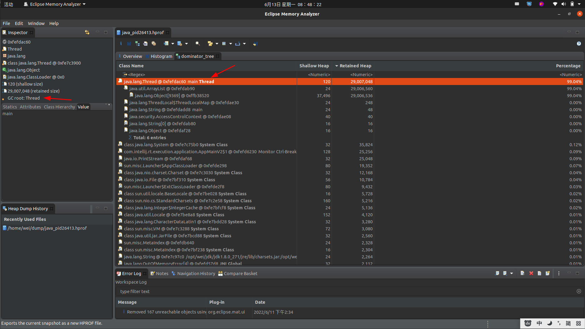

# MAT(Memory Analyzer Tool)使用手册
## 简介
&nbsp;&nbspMAT（Memory Analyzer Tool）工具是一款功能强大的]ava堆内存分析器。可以用于查找内存泄漏以及查看内存消耗情况。MAT是基于Eclipse开发的，不仅可以单独使用，还可以作为插件的形式嵌入在Eclipse中使用。是一款免费的性能分析工具，使用起来非常方便
- 下载地址: https://www.eclipse.org/mat/

---
## 安装
### Mac M1芯片(arm平台)
1. 先安装Eclipse
2. 再在Eclipse中安装MAT插件

#### 其他(X86_64)
&nbsp;&nbsp;直接下载解压运行即可

## 示例代码
```java
    package org.example;

    import java.util.ArrayList;
    
    public class App {
        public static void main(String[] args) throws ClassNotFoundException {
    
            ArrayList<Byte[]> byteArr = new ArrayList<>();
            for (; ; ) {
                Byte[] bytes = new Byte[1024];
                byteArr.add(bytes);
            }
    
        }
    }

    // VM 参数
    // -XX:+HeapDumpOnOutOfMemoryError -XX:HeapDumpPath=/home/wei/dump  -Xms30m  -Xmx30m

```

---
## 界面介绍
### 1. 打开dump文件
- 
  
### 2. 文件打开后
- 
- 
  - 简介:
     1. Leak Suspects Report(内存泄露疑点报告)
        + 自动检查堆dump文件是否有内存泄露的嫌疑，报告哪些对象依旧是存活状态以及为什么他们没有被分代收集。 
     2. Component  Report（组件报告）
        + 分析一组疑似内存问题的对象:重复字符串、空集合、finalizer、弱引用等。
     4. Re-open previously run reports（重新打开以前运行的报告）
        + 在heap dump文件旁的ZIP文件中已经存在的报告

### 3. Overview 


#### a. detail
&nbsp;&nbsp;总览: 堆的大小 、 classes 的数量 、 对象的数量 、 类加载器的数量

#### b. Biggest Objects by Retained size（最大对象保留大小） 
&nbsp;&nbsp;最大对象信息： 所占内存，对应的线程

&nbsp;&nbsp;名字解释
- Shallow Size（浅堆）: 表示对象本身占用内存的大小，也就是对象头加成员变量（不是成员变量的值）的总和
- Retained Size（保留堆）： 如果一个对象被释放掉，那会因为该对象的释放而减少引用进而被释放的所有的对象（包括被递归释放的）所占用的heap大小，即对象被垃圾回收器回收后能被GC从内存中移除的所有对象之和。

#### c. Actions  、 Reports 、 Step by Step
&nbsp;&nbsp;Actions
1. Histogram
   + 列出每个类的实例数
2. Domainator Tree
   + 列出占内存最大的存活的对象
3. Top Consumers
   + 根据class和package来分组，打印出最昂贵的对象
4. Duplicate Classes
   + 检测由多个类加载器加载的类

&nbsp;&nbsp;Reports
1. Leak Suspects
   + 包括内存泄露嫌疑和系统总览
2. Top Components
   + 列出大于总堆1%的组件的报告
3. Leak Suspects by Snapshot Comparison(通过快照比较内存泄露嫌疑对象)
   + 通过对比两个heap dump来检出内存泄露嫌疑和系统总览

&nbsp;&nbsp;Step by Step
1. Component Report
   + 分析属于root package 或  class loader 下的对象

---
### Actions
#### Histogram
##### 功能
&nbsp;&nbsp;列出每个类的实例数
- 

&nbsp;&nbsp;如上图，根据Shallow Heap 以及 Retained Heap 排序(根据内存从大到小),会得出不同的结果。
- 根据Shallow Heap 排序，可以很快知道究竟是哪个对象的实例占用了大量的内存。(直接占用内存)
- 根据Retained Heap 排序，可以知晓哪个class实例占用了大量的内存(即谁引用了他们)

##### 功能右键


---
## 名词解释
### Shallow Heap vs. Retained Heap 
- 
- 翻译:
  ```txt
     Shallow vs. Retained Heap
        Shallow heap is the memory consumed by one object. An object needs 32 or 64 bits (depending on the OS architecture) per reference, 4 bytes per Integer, 8 bytes per Long, etc. Depending on the heap dump format the size may be adjusted (e.g. aligned to 8, etc...) to model(模拟) better the real consumption of the VM.
        > Shallow heap 是一个对象所消耗的内存。每个对象引用需要32或64位内存(取决于OS架构),每个Integer需要4个字节，每个Long需要8字节，等等..。 根据heap dump文件格式的不同,这个大小会有变化(如调整为8字节对齐),以更好地模拟虚拟机的实际消耗.
        
        Retained set of X is the set of objects which would be removed by GC when X is garbage collected.
        > X 的保留集合是指在X被垃圾收集时被GC删除的对象集合
        
        Retained heap of X is the sum of shallow sizes of all objects in the retained set of X, i.e. memory kept alive by X.
        > X 的Retained Heap是X的Reained Set中所有对象的Shallow Heap大小的总和
        
        Generally speaking, shallow heap of an object is its size in the heap and retained size of the same object is the amount of heap memory that will be freed when the object is garbage collected.
        >!!! 一般来说，一个对象的Shallow Heap 是其在堆中的大小，而Retained Heap 是当对象被垃圾回收时将释放的堆内存大小。
        
        The retained set for a leading(主要的) set of objects, such as all objects of a particular class or all objects of all classes loaded by a particular class loader or simply(简单的) a bunch(一群) of arbitrary(任意的) objects, is the set of objects that is released if all objects of that leading set become unaccessible. The retained set includes these objects as well as all other objects only accessible through these objects. The retained size is the total heap size of all objects contained in the retained set.
        > 一组主要对象的Retained Set,例如特定类的所有对象或由特定类加载器加载的所有类的所有对象或者是一组任意对象。是在主要对象集合里的所有对象都变得不可访问时释放的对象集合。Retained Set包括这些对象以及所有只能通过这些对象访问的其他对象。Retained Size 是 Retained Set里的所有对象的堆大小总合。
        
        The Minimum Retained Size gives a good (under)estimation（估计、估算） of the retained size which is calculated ways faster than the exact retained size of a set of objects. It only depends on the number of objects in the inspected(检查、调查) set, not the number of objects in the heap dump.
        > 最小的Retained Size 给出了一个很好(低于)Retained Size大小的估计,他的计算方法比一组对象的精确保留大小更快，他取决于被检查集中对象数量，而不是堆转储中对象数量。
  ```

### Inspector
- 
- 