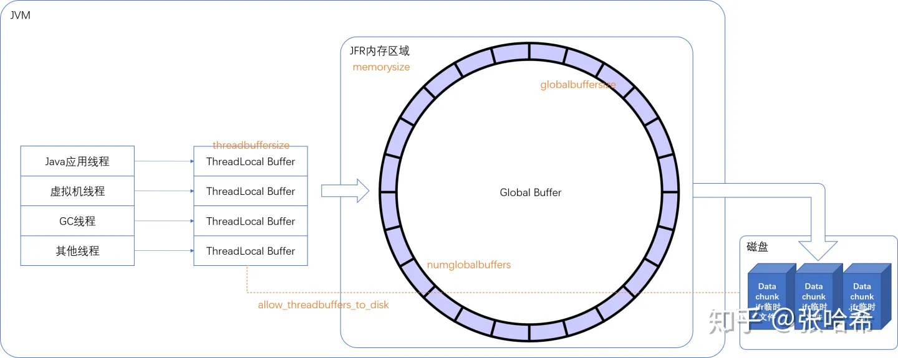

# JVM性能分析工具: JFR + JMC
&nbsp;&nbsp;Java线上进程很多面临大堆内存，无法dump堆内存快照，如何解决这样的问题，就可以通过JMC结合JFR连接到线上进程做一段时间采集，分析java进程性能问题
- JFR： Java Flight Record （Java飞行记录,将Java进程作为飞机飞行，即JFR相当于飞机的黑匣子，主要用于问题定位和持续监控。）,系统信息采集工具
- JMC： Java Mission Control，JFR分析工具

&nbsp;&nbsp;为什么用JFR？

&nbsp;&nbsp;&nbsp;&nbsp;因为某些异常很难在开发测试阶段发现，需要在生产环境才会出这些问题。为了能在生产问题发生后，更好的定位生产问题，JDK 提供了这样一个可以长期开启，对应用影响很小的持续监控手段。

## JFR 特性
1. 低开销（在配置正确的情况下），可在生产环境核心业务进程中始终在线运行.
2. 可以随时开启与关闭
3. 可以查看出问题时间段内进行分析，可以分析 Java 应用程序，JVM 内部以及当前Java进程运行环境等多因素
4. JFR基于事件采集，可以分析非常底层的信息，例如对象分配，方法采样与热点方法定位与调用堆栈，安全点分析与锁占用时长与堆栈分析，GC 相关分析以及 JIT 编译器相关分析（例如 CodeCache ）
5. 完善的 API 定义，用户可以自定义事件生产与消费。

## JFR 启动与暂停
### JDK8
+ java -XX:+UnlockCommercialFeatures -XX:+FlightRecorder -XX:StartFlightRecording=duration=60s,filename=myrecording.jfr MyApp
```txt
   -XX:+UnlockCommercialFeatures -XX:+FlightRecorder -XX:StartFlightRecording=dumponexit=true,name=servera-jfrstu,filename=/home/wei/WorkSpace/open_source/my-sql/017.Framework_Integration/001.Distributed_Transaction/000.study-code/seata-study/logs/serverA.jfr
```

### version() > JDK8
+ + java -XX:+UnlockCommercialFeatures  -XX:StartFlightRecording=duration=60s,filename=myrecording.jfr MyApp

#### 配置
##### 核心就是 -XX:StartFlightRecording，有了这个参数就会启用 JFR 记录。其中的涉及配置有：
|配置Key|默认值|说明|
|-|-|-|
|delay | 0 | 延迟多久后启动 JFR 记录，支持带单位配置， 例如 delay=60s（秒）， delay=20m（分钟）， delay=1h（小时）， delay=1d（天），不带单位就是秒， 0就是没有延迟直接开始记录。一般为了避免框架初始化等影响，我们会延迟 1 分钟开始记录（例如Spring cloud应用，可以看下日志中应用启动耗时，来决定下这个时间）。|
|disk | true | 是否写入磁盘，这个就是上文提到的， global buffer 满了之后，是直接丢弃还是写入磁盘文件。|
|dumponexit | false | 程序退出时，是否要dump出 .jfr文件|
|duration | 0 | JFR 记录持续时间，同样支持单位配置，不带单位就是秒，0代表不限制持续时间，一直记录。|
|filename | 启动目录/hotspot-pid-26732-id-1-2020_03_12_10_07_22.jfr，pid 后面就是 pid， id 后面是第几个 JFR 记录，可以启动多个 JFR 记录。最后就是时间。 | dump的输出文件|
|name | 无 | 记录名称，由于可以启动多个 JFR 记录，这个名称用于区分，否则只能看到一个记录 id，不好区分。|
|maxage | 0 | 这个参数只有在 disk 为 true 的情况下才有效。最大文件记录保存时间，就是 global buffer 满了需要刷入本地临时目录下保存，这些文件最多保留多久的。也可以通过单位配置，没有单位就是秒，默认是0，就是不限制|
|maxsize | 250MB | 这个参数只有在 disk 为 true 的情况下才有效。最大文件大小，支持单位配置， 不带单位是字节，m或者M代表MB，g或者G代表GB。设置为0代表不限制大小**。虽然官网说默认就是0，但是实际用的时候，不设置会有提示**： No limit specified, using maxsize=250MB as default. 注意，这个配置不能小于后面将会提到的 maxchunksize 这个参数。|
|path-to-gc-roots| false | 是否记录GC根节点到活动对象的路径，一般不打开这个，首先这个在我个人定位问题的时候，很难用到，只要你的编程习惯好。还有就是打开这个，性能损耗比较大，会导致FullGC一般是在怀疑有内存泄漏的时候热启动这种采集，并且通过产生对象堆栈无法定位的时候，动态打开即可。一般通过产生这个对象的堆栈就能定位，如果定位不到，怀疑有其他引用，例如 ThreadLocal 没有释放这样的，可以在 dump 的时候采集 gc roots|


##### -XX:FlightRecorderOptions 相关的参数
|配置key | 默认值 | 说明|
|-|-|-|
|allow_threadbuffers_to_disk | false | 是否允许 在 thread buffer 线程阻塞的时候，直接将 thread buffer 的内容写入文件。默认不启用，一般没必要开启这个参数，只要你设置的参数让 global buffer 大小合理不至于刷盘很慢，就行了。|
|globalbuffersize | 如果不设置，根据设置的 memorysize 自动计算得出 | 单个 global buffer 的大小，一般通过 memorysize 设置，不建议自己设置|
|maxchunksize | 12M | 存入磁盘的每个临时文件的大小。默认为12MB，不能小于1M。可以用单位配置，不带单位是字节，m或者M代表MB，g或者G代表GB。注意这个大小最好不要比 memorySize 小，更不能比 globalbuffersize 小，否则会导致性能下降|
|memorysize | 10M | JFR的 global buffer 占用的整体内存大小，一般通过设置这个参数，numglobalbuffers 还有 globalbuffersize 会被自动计算出。可以用单位配置，不带单位是字节，m或者M代表MB，g或者G代表GB。|
|numglobalbuffers | 如果不设置，根据设置的 memorysize 自动计算得出 | global buffer的个数，一般通过 memorysize 设置，不建议自己设置|
|old-object-queue-size | 256 | 对于Profiling中的 Old Object Sample 事件，记录多少个 Old Object，这个配置并不是越大越好。记录是怎么记录的，会在后面的各种 Event 介绍里面详细介绍。我的建议是，一般应用256就够，时间跨度大的，例如 maxage 保存了一周以上的，可以翻倍|
|repository | 等同于 -Djava.io.tmpdir 指定的目录 | JFR 保存到磁盘的临时记录的位置|
|retransform | true | 是否通过 JVMTI 转换 JFR 相关 Event 类，如果设置为 false，则只在 Event 类加载的时候添加相应的 Java Instrumentation，这个一般不用改，这点内存 metaspace 还是足够的|
|samplethreads | true | 这个是是否开启线程采集的状态位配置，只有这个配置为 true，并且在 Event 配置中开启线程相关的采集（这个后面会提到），才会采集这些事件。|
|stackdepth | 64 | 采集事件堆栈深度，有些 Event 会采集堆栈，这个堆栈采集的深度，统一由这个配置指定。注意这个值不能设置过大，如果你采集的 Event种类很多，堆栈深度大很影响性能。比如你用的是 default.jfc 配置的采集，堆栈深度64基本上就是不影响性能的极限了。你可以自定义采集某些事件，增加堆栈深度。|
|threadbuffersize | 8KB | threadBuffer 大小，最好不要修改这个，如果增大，那么随着你的线程数增多，内存占用会增大。过小的话，刷入 global buffer 的次数就会变多。8KB 就是经验中最合适的。|

##### 配置与JFR架构联系
> 

###### 注意这些配置的联系与区别
1. disk=true 与 dumponexit=true <sup><font color="red">将监控信息导出至本地分析必填配置</font></sup>， 这两个配置完全不是一回事。disk=true，仅仅代表如果 global buffer 满了，将这个写入文件并不是用户可以看到的，只会写入 repository 配置的目录，默认是临时目录，这个临时目录地址是-Djava.io.tmpdir指定的，默认为： - linux： /tmp 目录 - windows: C:\Users\你的用户\AppData\Temp。配置了 disk=true 之后，就会在临时目录产生一个文件夹，命名格式是：时间_pid，例如：2020_03_12_08_04_45_10916；里面的文件就是一个又一个的 Data trunk，表现为一个又一个的 .jfr 文件。最新的文件 会跟随一个 .part <sup>每个 .jfr 文件的大小， 就是 Data Chunk 的大小，这个大小如何配置，会在后面的 jcmd 启动并配置 JFR 中提到。 dumponexit=true 代表在程序退出的时候，强制dump一次将数据存入 filename 配置的输出文件。只有用户手动 dump， 或者是 dumponexit 触发的 dump， 用户才能正常看到 .jfr 文件。输出这个文件其实很快， 就是将内存中所有 buffer 以及临时文件夹 中的 .jfr文件的内容，输出到用户指定的 .jfr 文件中。一般内存中的 buffer 很小，是MB级别的，这个是可以配置的，注意不要配置很大，否则可能会内存不足，最重要的是可能会使老年代增大导致FullGC</sup>
  > 通过介绍，可以发现：需要手动dump或者dumponexit 触发的 dump才会将完整监控内容写入到用户指定的文件(filename),否则文件是不全的。
    
```txt 
       手动方式:  jcmd pid JFR.dump [name=xxx,filename=xxx]
      参数:
       name | 无 | 指定要查看的 JFR 记录名称 # 所以，在开启JFR时，需要指定该参数
       filename | 无 | 指定文件输出位置
       maxage | 0 | dump最多的时间范围的文件，可以通过单位配置，没有单位就是秒，默认是0，就是不限制
       maxsize | 0 | dump最大文件大小，支持单位配置， 不带单位是字节，m或者M代表MB，g或者G代表GB。设置为0代表不限制大小
       begin | 无 | dump开始位置， 可以这么配置：09:00, 21:35:00, 2018-06-03T18:12:56.827Z, 2018-06-03T20:13:46.832, -10m, -3h, or -1d
       end : | 无| dump结束位置，可以这么配置： 09:00, 21:35:00, 2018-06-03T18:12:56.827Z, 2018-06-03T20:13:46.832, -10m, -3h, or -1d (STRING, no default value)
       path-to-gc-roots| false | 是否记录GC根节点到活动对象的路径，一般不记录，dump 的时候打开这个肯定会触发一次 fullGC，对线上应用有影响。最好参考之前对于 JFR 启动记录参数的这个参数的描述，考虑是否有必要

       示例: 使用如下命令可以在程序运行时将JFR记录导出来，而不用等到程序退出时
       wei@Wang:~$ jcmd 25254  JFR.dump filename=./hh.jfr name=servera-jfrstu   
       25254:
       Dumped recording "servera-jfrstu", 3.0 MB written to:
       /home/wei/WorkSpace/open_source/my-sql/017.Framework_Integration/001.Distributed_Transaction/000.study-code/seata-study/hh.jfr
       
```

1. JFR相关的内存占用到底有多大？主要是两部分，一部分是 global buffer，另一部分是 thread local buffer。 global buffer 总大小由上面提到的 memorysize 自动计算得出，总大小就是 memorysize。所以， JFR 相关的占用内存大小为： thread 数量 * thread buffer 大小 + memory size
## JFR 窗口
- 
  
  + 事件名称后面的数字:  事件发生的次数。


## 参考资料
1. [深度探索JFR - JFR详细介绍与生产问题定位落地 - 1. JFR说明与启动配置](https://zhuanlan.zhihu.com/p/122247741)
2. JMC下载:[https://www.oracle.com/java/technologies/javase/products-jmc8-downloads.html](https://www.oracle.com/java/technologies/javase/products-jmc8-downloads.html)
   - 对于 JMC 8，最低 JDK 要求是 version=8，对于 JMC 8.1，最低 JDK 要求是 version=11
   ```txt
   wei@Wang:~/Downloads/jmc-8.3.0_linux-x64$ cat JDKMissionControl/jmc.ini 
      -startup
      plugins/org.eclipse.equinox.launcher_1.6.400.v20210924-0641.jar
      --launcher.library
      plugins/org.eclipse.equinox.launcher.gtk.linux.x86_64_1.2.500.v20220509-0833
      --launcher.appendVmargs
      -vm  // 指定JDK
      /home/wei/WorkSpace/open_source/OpenJdk/005.OpenJDK/005.OpenJDK18-GA/OpenJDK18-GA/build/linux-x86_64-server-slowdebug/jdk/bin
      -vmargs
      -XX:+IgnoreUnrecognizedVMOptions
      -XX:+UnlockDiagnosticVMOptions
      -XX:+DebugNonSafepoints
      -XX:FlightRecorderOptions=stackdepth=128
      -XX:+FlightRecorder
      -XX:StartFlightRecording=name=JMC_Default,maxsize=100m
      -Djava.net.preferIPv4Stack=true
      -Djdk.attach.allowAttachSelf=true
      --add-exports=java.xml/com.sun.org.apache.xerces.internal.parsers=ALL-UNNAMED
      --add-exports=jdk.internal.jvmstat/sun.jvmstat.monitor=ALL-UNNAMED
      --add-exports=java.management/sun.management=ALL-UNNAMED
      --add-exports=java.management/sun.management.counter.perf=ALL-UNNAMED
      --add-exports=jdk.management.agent/jdk.internal.agent=ALL-UNNAMED
      --add-exports=jdk.attach/sun.tools.attach=ALL-UNNAMED
      --add-opens=java.base/java.net=ALL-UNNAMED
      --add-opens=jdk.attach/sun.tools.attach=ALL-UNNAMED
      -Dsun.java.command=JMC
      --add-exports=java.desktop/sun.awt.X11=ALL-UNNAMED

      --------------------------
      MacOS:
         Contents cat Eclipse/jmc.ini
         -startup
         ../Eclipse/plugins/org.eclipse.equinox.launcher_1.6.400.v20210924-0641.jar
         --launcher.library
         ../Eclipse/plugins/org.eclipse.equinox.launcher.cocoa.macosx.aarch64_1.2.500.v20220509-0833
         --launcher.appendVmargs
         -ws
         cocoa
         -vm # 指定JDK
         /Users/wang/WorkSpace/apps/openJdk/openJdk18GA/jdk-18.jdk/Contents/Home/bin
         -vmargs
         -XX:+IgnoreUnrecognizedVMOptions
         -XX:+UnlockDiagnosticVMOptions
         -XX:+DebugNonSafepoints
         -XX:FlightRecorderOptions=stackdepth=128
         -XX:+FlightRecorder
         -XX:StartFlightRecording=name=JMC_Default,maxsize=100m
         -Djava.net.preferIPv4Stack=true
         -Djdk.attach.allowAttachSelf=true
         --add-exports=java.xml/com.sun.org.apache.xerces.internal.parsers=ALL-UNNAMED
         --add-exports=jdk.internal.jvmstat/sun.jvmstat.monitor=ALL-UNNAMED
         --add-exports=java.management/sun.management=ALL-UNNAMED
         --add-exports=java.management/sun.management.counter.perf=ALL-UNNAMED
         --add-exports=jdk.management.agent/jdk.internal.agent=ALL-UNNAMED
         --add-exports=jdk.attach/sun.tools.attach=ALL-UNNAMED
         --add-opens=java.base/java.net=ALL-UNNAMED
         --add-opens=jdk.attach/sun.tools.attach=ALL-UNNAMED
         -Dsun.java.command=JMC
         --add-exports=java.desktop/sun.lwawt.macosx=ALL-UNNAMED
         -XstartOnFirstThread
         -Dorg.eclipse.swt.internal.carbon.smallFonts

   ```
3. [https://docs.oracle.com/javacomponents/jmc-5-5/jfr-runtime-guide/run.htm#JFRRT171](https://docs.oracle.com/javacomponents/jmc-5-5/jfr-runtime-guide/run.htm#JFRRT171)