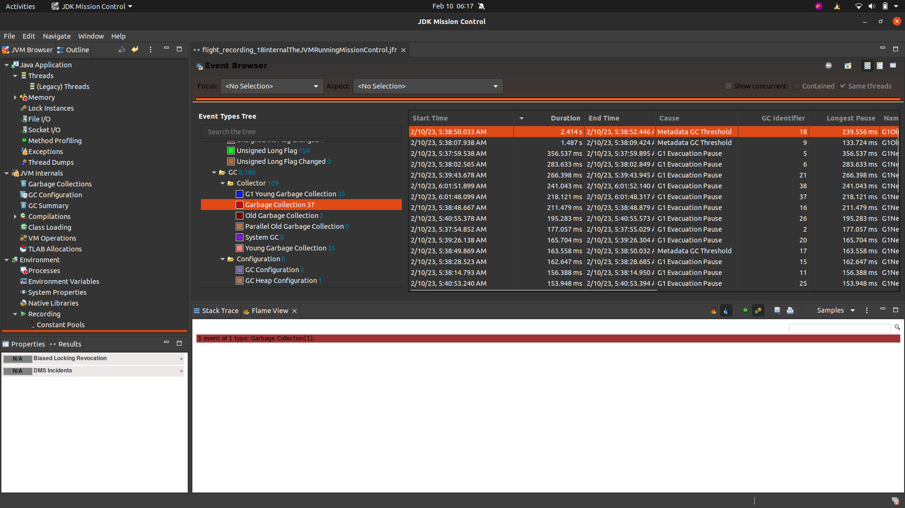

# JVM性能分析工具: JFR + JMC
&nbsp;&nbsp;Java线上进程很多面临大堆内存，无法dump堆内存快照，如何解决这样的问题，就可以通过JMC结合JFR连接到线上进程做一段时间采集，分析java进程性能问题
- JFR： Java Flight Record （Java飞行记录,将Java进程作为飞机飞行，即JFR相当于飞机的黑匣子，主要用于问题定位和持续监控。）,系统信息采集工具
- JMC： Java Mission Control，JFR分析工具

&nbsp;&nbsp;为什么用JFR？

&nbsp;&nbsp;&nbsp;&nbsp;因为某些异常很难在开发测试阶段发现，需要在生产环境才会出这些问题。为了能在生产问题发生后，更好的定位生产问题，JDK 提供了这样一个可以长期开启，对应用影响很小的持续监控手段。

## JFR 特性
1. 低开销（在配置正确的情况下），可在生产环境核心业务进程中始终在线运行.
2. 可以随时开启与关闭
3. 可以查看出问题时间段内进行分析，可以分析 Java 应用程序，JVM 内部以及当前Java进程运行环境等多因素
4. JFR基于事件采集，可以分析非常底层的信息，例如对象分配，方法采样与热点方法定位与调用堆栈，安全点分析与锁占用时长与堆栈分析，GC 相关分析以及 JIT 编译器相关分析（例如 CodeCache ）
5. 完善的 API 定义，用户可以自定义事件生产与消费。

## JFR 启动与暂停
### JDK8
+ java -XX:+UnlockCommercialFeatures -XX:+FlightRecorder -XX:StartFlightRecording=duration=60s,filename=myrecording.jfr MyApp

### > JDK8
+ + java -XX:+UnlockCommercialFeatures  -XX:StartFlightRecording=duration=60s,filename=myrecording.jfr MyApp


## JFR 窗口
- 
  
  + 事件名称后面的数字:  事件发生的次数。


## 参考资料
1. [深度探索JFR - JFR详细介绍与生产问题定位落地 - 1. JFR说明与启动配置](https://zhuanlan.zhihu.com/p/122247741)
2. JMC下载:[https://www.oracle.com/java/technologies/javase/products-jmc8-downloads.html](https://www.oracle.com/java/technologies/javase/products-jmc8-downloads.html)
   - 对于 JMC 8，最低 JDK 要求是 version=8，对于 JMC 8.1，最低 JDK 要求是 version=11
   ```txt
   wei@Wang:~/Downloads/jmc-8.3.0_linux-x64$ cat JDKMissionControl/jmc.ini 
      -startup
      plugins/org.eclipse.equinox.launcher_1.6.400.v20210924-0641.jar
      --launcher.library
      plugins/org.eclipse.equinox.launcher.gtk.linux.x86_64_1.2.500.v20220509-0833
      --launcher.appendVmargs
      -vm  // 指定JDK
      /home/wei/WorkSpace/open_source/OpenJdk/005.OpenJDK/005.OpenJDK18-GA/OpenJDK18-GA/build/linux-x86_64-server-slowdebug/jdk/bin
      -vmargs
      -XX:+IgnoreUnrecognizedVMOptions
      -XX:+UnlockDiagnosticVMOptions
      -XX:+DebugNonSafepoints
      -XX:FlightRecorderOptions=stackdepth=128
      -XX:+FlightRecorder
      -XX:StartFlightRecording=name=JMC_Default,maxsize=100m
      -Djava.net.preferIPv4Stack=true
      -Djdk.attach.allowAttachSelf=true
      --add-exports=java.xml/com.sun.org.apache.xerces.internal.parsers=ALL-UNNAMED
      --add-exports=jdk.internal.jvmstat/sun.jvmstat.monitor=ALL-UNNAMED
      --add-exports=java.management/sun.management=ALL-UNNAMED
      --add-exports=java.management/sun.management.counter.perf=ALL-UNNAMED
      --add-exports=jdk.management.agent/jdk.internal.agent=ALL-UNNAMED
      --add-exports=jdk.attach/sun.tools.attach=ALL-UNNAMED
      --add-opens=java.base/java.net=ALL-UNNAMED
      --add-opens=jdk.attach/sun.tools.attach=ALL-UNNAMED
      -Dsun.java.command=JMC
      --add-exports=java.desktop/sun.awt.X11=ALL-UNNAMED

      --------------------------
      MacOS:
         Contents cat Eclipse/jmc.ini
         -startup
         ../Eclipse/plugins/org.eclipse.equinox.launcher_1.6.400.v20210924-0641.jar
         --launcher.library
         ../Eclipse/plugins/org.eclipse.equinox.launcher.cocoa.macosx.aarch64_1.2.500.v20220509-0833
         --launcher.appendVmargs
         -ws
         cocoa
         -vm # 指定JDK
         /Users/wang/WorkSpace/apps/openJdk/openJdk18GA/jdk-18.jdk/Contents/Home/bin
         -vmargs
         -XX:+IgnoreUnrecognizedVMOptions
         -XX:+UnlockDiagnosticVMOptions
         -XX:+DebugNonSafepoints
         -XX:FlightRecorderOptions=stackdepth=128
         -XX:+FlightRecorder
         -XX:StartFlightRecording=name=JMC_Default,maxsize=100m
         -Djava.net.preferIPv4Stack=true
         -Djdk.attach.allowAttachSelf=true
         --add-exports=java.xml/com.sun.org.apache.xerces.internal.parsers=ALL-UNNAMED
         --add-exports=jdk.internal.jvmstat/sun.jvmstat.monitor=ALL-UNNAMED
         --add-exports=java.management/sun.management=ALL-UNNAMED
         --add-exports=java.management/sun.management.counter.perf=ALL-UNNAMED
         --add-exports=jdk.management.agent/jdk.internal.agent=ALL-UNNAMED
         --add-exports=jdk.attach/sun.tools.attach=ALL-UNNAMED
         --add-opens=java.base/java.net=ALL-UNNAMED
         --add-opens=jdk.attach/sun.tools.attach=ALL-UNNAMED
         -Dsun.java.command=JMC
         --add-exports=java.desktop/sun.lwawt.macosx=ALL-UNNAMED
         -XstartOnFirstThread
         -Dorg.eclipse.swt.internal.carbon.smallFonts

   ```
3. [https://docs.oracle.com/javacomponents/jmc-5-5/jfr-runtime-guide/run.htm#JFRRT171](https://docs.oracle.com/javacomponents/jmc-5-5/jfr-runtime-guide/run.htm#JFRRT171)