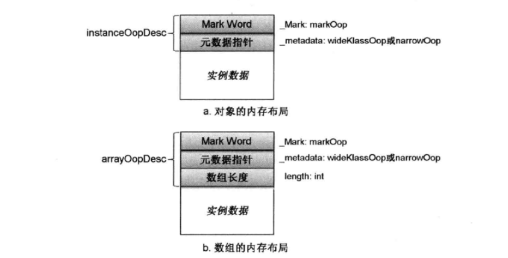
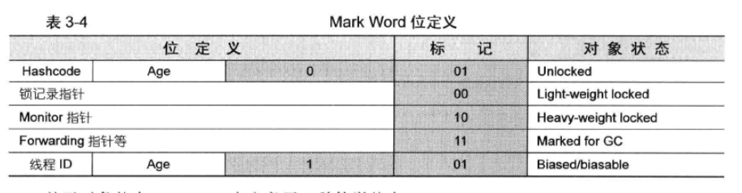
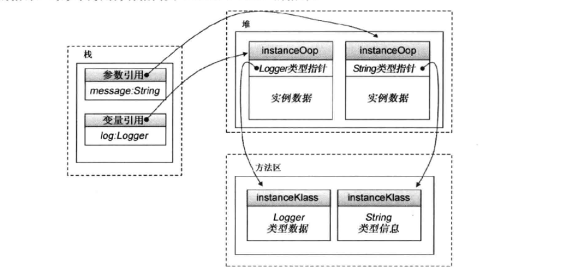

# Oop-Klass二分模型
&nbsp;&nbsp;Oop-Klass二分模型，即虚拟机将对象与类型分开表示：用Oop描述对象，而用Klass描述类型。

&nbsp;&nbsp;Oop-Klass模型：
+ OOP: ordinary object pointer, 或Oops，即普通对象指针，用来描述对象实例信息。
+ Klass: Java类的C++对等体，用来描述Java类

&nbsp;&nbsp;对于Oops对象，主要职能在于表示对象的实例数据，没有必要持有任何虚函数；而在描述Java类的Klass对象中含有VTBL（继承自Klass父类Klass_vtbl）,那么，Klass就能够根据Java对象的实际类型进行C++的分发，如此，Oops对象就只需要通过相应的Klass便可以找到所有的虚函数，**这就避免了在每个对象中都分配一个C++ VTBL指针**(见hotspot/src/share/vm/oops/klass.hpp注释：Both functions are combined into one C++ class)

&nbsp;&nbsp;Klass 向JVM提供两个功能
1. 实现语言层面的Java类
2. 实现Java对象的分发功能

## Oops
&nbsp;&nbsp;Oops模块可以分为两个相对独立的部分: Oop框架和Klass框架

&nbsp;&nbsp;代码《openJDK_8u40/hotspot/src/share/vm/oops/oopsHierarchy.hpp》中有如下代码（也代表继承关系）
```c++
// Oop框架模块
typedef class oopDesc*                            oop;  // Oop抽象基类,是Oop框架中其他OopDesc的共同基类
typedef class   instanceOopDesc*            instanceOop;  // 描述Java类的实例
typedef class   arrayOopDesc*                    arrayOop; // 描述数组的抽象基类
typedef class     objArrayOopDesc*            objArrayOop; // 描述元素类型为对象的数组
typedef class     typeArrayOopDesc*            typeArrayOop; // 描述元素类型是基本类型的数组

// Klass框架模块
// The klass hierarchy is separate from the oop hierarchy.
class Klass;  // KlassOop的一部分，用来描述语言层的类型(Klass继承体系的最高父类)
class   InstanceKlass; // 在虚拟机层面描述一个Java类
class     InstanceMirrorKlass;  // 专有instanceKlass，表示java.lang.Class实例的Klass
class     InstanceClassLoaderKlass; // 主要用于遍历ClassLoader继承体系
class     InstanceRefKlass; // 专有instanceKlass，表示java.lang.ref.Reference子类的Klass
class   ArrayKlass; // 表示所有array类型的抽象基类
class     ObjArrayKlass; // 表示objArrayOopDesc的Klass
class     TypeArrayKlass; // 表示typeArrayOopDesc的Klass
```

### 对象头
&nbsp;&nbsp;instanceOopDesc 或 arrayOopDesc 又被称为**对象头**，**instanceOopDesc对象头**包括以下两部分信息:
1. Mark Word: instanceOopDesc中的_mark成员，存储对象自身的运行时数据，如哈希码、GC分代年龄、锁状态标志、偏向线程ID、偏向时间戳等。_mark成员的类型是markOop，所占用内存大小和虚拟机位长一致，如在32位虚拟机上就是32位，在64位虚拟机上也相应为64位(允许压缩)
2. 元数据指针(类型指针)：指向描述类型的Klass对象的指针，Klass对象包含了实例对象所属类型的元数据，虚拟机在运行时将频繁使用这个指针定位到位于方法区内的类型信息。

&nbsp;&nbsp;instanceOopDesc 和 arrayOopDesc  都拥有继承自共同基类oopDesc的mark word和元数据指针，但**二者（instanceOopDesc 和 arrayOopDesc）在对象头上的唯一区别**： arrayOopDesc增加了一个描述数组长度的字段，如下图：

- 可以看出，数组的长度是存储在对象头中，但是存储方式需要注意(并非直接使用变量存储)，可以看一下length的计算方式,代码: openJDK_8u40/hotspot/src/share/vm/oops/arrayOop.hpp

### 对象头和内存空间利用率
&nbsp;&nbsp;在Java应用程序运行过程中，每创建一个Java对象，在JVM内部也相应地创建一个对象头。因此对象头的内存布局设计关系到  **对象内存空间的利用率 = 实例数据占用空间 / (instanceOop + 实例数据空间)**。但是在对象的整个生命周期内，JVM需要为他记录很多信息，如对象hash，GC分代年龄等等，如何在有限空间内存储足够丰富的信息就成为一个设计难题，这要求JVM的设计者必须在设计Oops的内存布局时做足文章。
#### 优化一： 对类元数据指针进行压缩存储
&nbsp;&nbsp;如代码: openJDK_8u40/hotspot/src/share/vm/oops/oop.inline.hpp
```c++
inline Klass* oopDesc::klass() const {
  if (UseCompressedClassPointers) {
    return Klass::decode_klass_not_null(_metadata._compressed_klass);
  } else {
    return _metadata._klass;
  }
}
```
- 如标识 UseCompressedClassPointers，他来自VM配置选项-XX:UseCompressedOops,功能是在64位JVM上，对类元数据指针使用32位指针存储（在64位系统上，指针类型是64位，这样，在由32位JVM迁移到64位JVM上时，可能会发现JVM的内存利用率有所下降，这是由于JVM为OOP类元数据指针的内存分配由32位增长到64位的缘故）。如代码： openJDK_8u40/hotspot/src/share/vm/oops/oop.hpp
    ```c++
       union _metadata {
         // 未开启指针压缩时使用
         Klass*      _klass;
         // 开启指针压缩时使用
         narrowKlass _compressed_klass;
        } _metadata;
    ```
    - 当开启指针压缩时，使用narrowKlass类型作为指向类元数据的指针。narrowKlass类型等价于32位无符号整型变量。显然，根据计算公式，开启指针压缩时，能够在一定程度上降低开销。

#### 优化二： mark word 设计优化
&nbsp;&nbsp;mark word划分为多个比特位区间，并在不同的对象状态下赋予比特位不同的含义。如下图:



+ 如代码openJDK_8u40/hotspot/src/share/vm/oops/markOop.hpp，对象有5种状态

  ```c
      enum { 
            locked_value             = 0,
            unlocked_value           = 1,
            monitor_value            = 2,
            marked_value             = 3,
            biased_lock_pattern      = 5
      };
  ```

&nbsp;&nbsp;区分对象状态的标识位在不同状态下使用的位数是不一样的，实际位数由上图有灰色底纹的单元格表示。其中：
- 状态0、2、3在mark word中用2位的标识位来表示，分别对应00、10、11
- 状态1、5标识位均为01，**尚需借用前一位来区分**，即前一位为0表示状态1；而前一位为1表示状态5

&nbsp;&nbsp;对象头中的元数据指针，用来执行对象所属类型的元数据，虚拟机在运行时将频繁使用这个指针定位位于方法区的类型信息。

## 基于Oop-Klass模型的对象访问定位
&nbsp;&nbsp;访问机制： 在对象引用中存放的指向对象(instanceOop)的指针，对象本身持有执行类(instanceKlass)的指针.如图:
- 

&nbsp;&nbsp;当Java程序在JVM中运行的时，由new创建的Java对象，将会在堆中分配对象实例。对象实例除了对象实例数据本身外，JVM还会在实例数据前面自动加上一个对象头(可以看一下hotspot/src/share/vm/oops/instanceOop.hpp的注释)。Java程序通过该对象实例的引用，可以访问到JVM内部表示的的该对象，即instanceOop.当需要访问该类时，如程序需要调用对象方法或者访问类变量，则可以通过instanceOop持有的类元数据指针定位到位于方法区中的instanceKlass来完成。

-------
## Klass
&nbsp;&nbsp;Klass数据结构定义了所有Klass类型共享的结构和行为：描述类型自身的布局，以及刻画出与其他类间的关系(父子、兄弟类等)。

&nbsp;&nbsp;由于Java8引入了Metaspace,C++ 类型都继承于 MetaspaceObj 类(定义见 vm/memory/allocation.hpp)，表示元空间的数据。Klass对象的继承关系: xxxKlass <:< Klass <:< Metadata <:< MetaspaceObj。 JVM中Klass的继承情况可以查看上面的 "Klass框架模块"

#### instanceKlass
&nbsp;&nbsp;JVM为每一个已加载的Java类创建一个instanceKlass对象，用来在JVM层表示Java类。见代码: openJDK_8u40/hotspot/src/share/vm/oops/instanceKlass.hpp

------
## 小结
&nbsp;&nbsp;所以，对于JVM的理解，元数据instanceKlass对象会存在元空间，而对象实例instanceOopDesc会存在Java堆中
-----------------
## 参考资料
1. 《HotSpot实战》