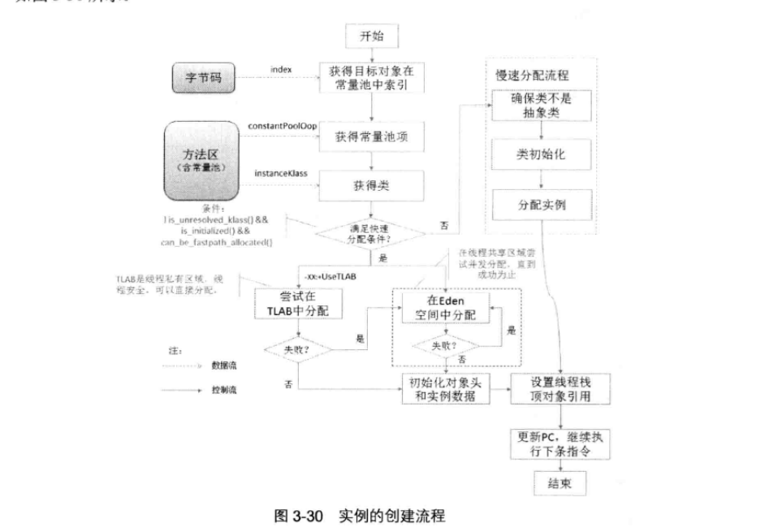

- [对象创建](#对象创建)
  - [总结](#总结)
  - [快速分配](#快速分配)
    - [空间的分配](#空间的分配)
    - [对象实例的初始化](#对象实例的初始化)
      - [1. 赋零值](#1-赋零值)
      - [2. 初始化对象头](#2-初始化对象头)
      - [3. 返回对象的引用](#3-返回对象的引用)
  - [慢速分配](#慢速分配)
  - [源代码](#源代码)
# 对象创建
&nbsp;&nbsp;实例的创建过程，首先根据从类常量池中获取对象类型信息并验证类是否已经被解析过了，若确保该类已经被加载和正确解析，使用**快速分配**技术为该类分配对象空间；若该类尚未被解析过，则只能通过**慢速分配**方式分配实例对象。实例的创建过程如下图:
   - 

---
## 总结
1. TLAB 线程私有

---
## 快速分配
### 空间的分配
&nbsp;&nbsp;如果在实例分配之前已经完成了类型的解析，那么分配操作仅仅是在内存空间中划分可用内存，因此能以较高效率实现内存分配，因此称为 快速分配。

&nbsp;&nbsp;根据分配空间是来自于线程私有区域还是共享的堆空间，快速分配又可以分为两种空间选择策略。

&nbsp;&nbsp;HotSpot通过线程局部分配缓存技术（即 Thread-Local Allocation Buffers，简称 TLABs）可以在线程私有区域实现空间的分配

&nbsp;&nbsp;可以通过VM选项UseTLAB来开启或者关闭TLAB功能。根据是否使用TLAB，快速分配方式有两种选择策略。
1. 选择TLAB： 首先尝试在TLAB中分配，因为TLAB是线程私有区域，因此不需要加锁便能够保证线程安全。在分配一个新的对象空间时，将首先尝试在TLAB空间中分配对象空间；若分配空间的请求失败，则再尝试使用加锁机制在Eden区分配对象。
2. 选择Eden区： 若失败，则尝试在共享的Eden区分配，Eden区是所有线程共享区域，需要保证线程安全，故采用原子操作进行分配。若分配失败，则再次尝试该操作，知道分配成功为止。

### 对象实例的初始化
#### 1. 赋零值
> 源码: memset(to_zero, 0, obj_size * HeapWordSize);

&nbsp;&nbsp;实例空间分配成功之后，将对实例进行初始化。
1. 根据VM选项ZeroTLAB的配置
     - 若为false，虚拟机将对实例数据空间进行填零操作
     - 这一步操作保证了对象的实例字段在Java代码中可以不赋初始值就可以直接使用，程序能访问到这些字段的数据类型所对应的零值。

#### 2. 初始化对象头
&nbsp;&nbsp;虚拟机初始化对象头，包括两个步骤
1. 设置Mark Word
2. 设置类型元数据指针：根据VM选项UseCompressedOops的配置，设置类型指针元信息_metadata._compressed_klass 或者 _metadata._klass (两者意义是一样的，区别在于是否开启了指针压缩)

#### 3. 返回对象的引用
&nbsp;&nbsp;待完成对象的空间分配和初始化之后，就可以**设置栈顶对象的引用**

---

## 慢速分配
&nbsp;&nbsp;当类没有被解析，则需要进行慢速分配

&nbsp;&nbsp;之所以称之为慢速分配，是因为在分配实例前需要对类进行解析，确保类及其依赖类已得到正确的解析和初始化。

---

## 源代码
1. 对象分配源代码:[005.OpenJDK/000.OpenJDK_8U40/hotspot/src/share/vm/interpreter/bytecodeInterpreter.cpp](../../005.OpenJDK/000.OpenJDK_8U40/hotspot/src/share/vm/interpreter/bytecodeInterpreter.cpp) ， 通过该源代码，可以了解对象分配整个流程。