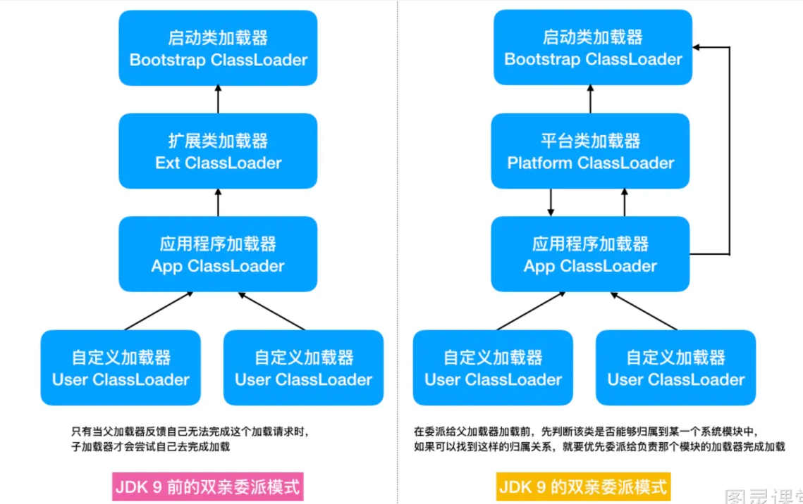

# 类加载模式
从JDK9开始，双亲委派模式发生了变化：

Java8中主要有以下几种类加载器：
- 引导类加载器： 负责加载支撑JVM运行的位于JRE的lib目录下的核心类库，例如 rt.jar , charsets.jar
- 扩展类加载器： 负责加载支撑JVM运行的位于JRE的lib目录下的ext拓展目录中的jar包
- 应用程序类加载器: 负责加载ClassPath路径下的类包
- 自定义加载器： 负责加载用户自定义路径下的类包

### JDK8以后放弃拓展类加载器的原因
JDK8以后，使用平台类加载器（Platform ClassLoader）替换了原来的扩展类加载器（Extension ClassLoader）。有两个基本的原因归纳如下：
- 在JDK8中的这个Extension ClassLoader，主要用于加载jre环境下的lib下的ext下的jar包。当想要扩展Java的功能的时候，把jar包放到这个ext文件夹下。然而这样的做法并不安全，不提倡使用。
- 这种扩展机制被JDK9开始加入的“模块化开发”的天然的扩展能力所取代。
- 所以，原来额外的不安全的拓展能力被现在安全的天然的拓展能力被替代了。 