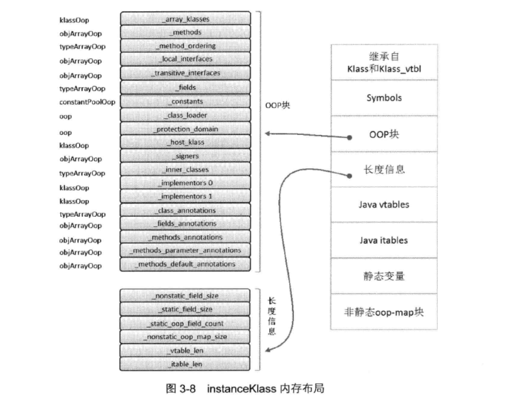

# InstanceKlass
## 内存布局

## 描述
&nbsp;&nbsp;在JVM中，JVM会为每一个已加载的Java类创建一个instanceKlass对象，用来在JVM层表示Java类。如上图，他的所有成员可以包含虚拟机内部运行一个Java类所需要的所有信息。这些成员变量在类解析阶段完成赋值。

&nbsp;&nbsp;在OOP块中，_methods描述类所拥有的方法列表；_method_ordering描述方法顺序；_local_interfaces 和 _transitive_interfaces分别表示实现的接口以及继承而来的接口；_fields表示域；

&nbsp;&nbsp;在instanceKlass的末尾部分，是几块可变的区域，分别是Java vtables、Java itables、静态变量和非静态oop-map块等。

&nbsp;&nbsp;内嵌Java vtable 大小则由vtable_len决定，以字长为单位。内嵌实例oop域（nonstatic oop-map blocks）大小由nonstatic_oop_map_size决定，以字长为单位。oop-map使用键值对"<偏移量，长度>" 描述各个非静态OOP在该klass的实例中的位置。虚拟机解析类时，parseClassFile函数将根据类信息构建这个oop-map，他刻画了一个实例对象空间的样板，以便在创建对象实例时，就按照这个样板分配**域**数据空间，对域的索引也可以通过OOP-Map中记录的偏移量和长度得到指定域数据。
 - 注意：
    1. 获取实例数据是通过偏移量和长度
    2. 域数据样板
  
## 实例数据的存储顺序
&nbsp;&nbsp;实例对象中字段的存储顺序，除了与字段在Java类中定义的顺序有关，还收到虚拟机分配策略的影响。该策略可由VM选项-XX：FieldsAllocationStyle配置。

&nbsp;&nbsp;HotSpot默认的分配策略为： 按照longs/doubles、ints、shorts/chars、bytes/booleans、OOPS的顺序进行分配。相同宽度的字段总是被分配在一起。在这个前提下，可能会出现一种情况： 在父类中定义的字段可能会出现在子类之前。在默认的情况下，VM选项CompactFields值为true，表示子类之中较窄的变量可能会插入到父类变量的空隙之中。