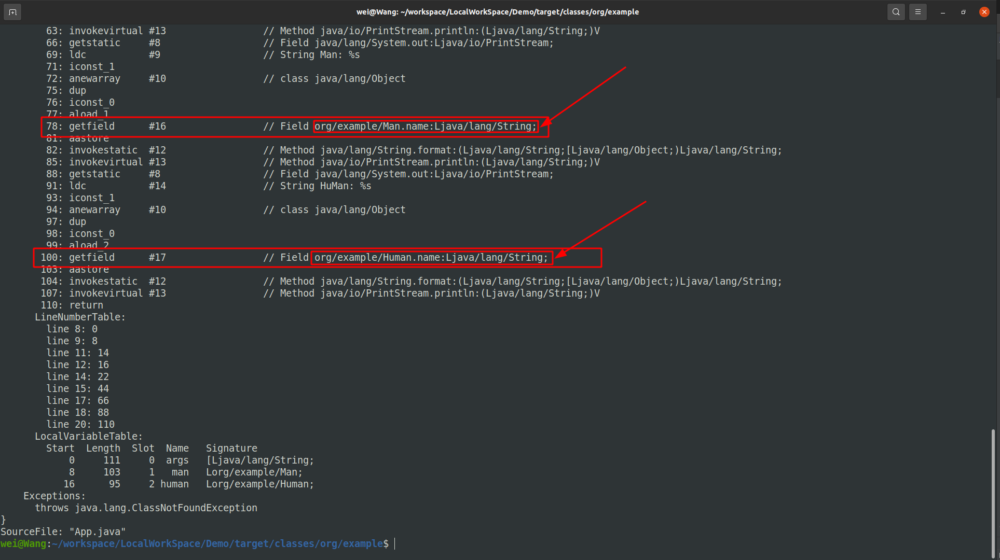

# 继承时有相同名称字段
## 实验代码
```java

public class Human {
    public String name;

    public String getName() {
        return name;
    }

    public void setName(String name) {
        this.name = name;
    }
}

// -----------------
public class Man extends Human {
    public String name;

    private Integer age;

    @Override
    public String getName() {
        return name;
    }

    @Override
    public void setName(String name) {
        this.name = name;
    }
}

//------------------------
public class App {
    public static void main(String[] args) throws ClassNotFoundException {
        Man man = new Man();
        man.setName("Man");

        Human human = man;
        human.setName("Human");

        System.out.println(String.format("Man: %s",man.getName()));  // Man: Human
        System.out.println(String.format("HuMan: %s",human.getName())); // HuMan: Human

        System.out.println(String.format("Man: %s",man.name)); // Man: Human
        System.out.println(String.format("HuMan: %s",human.name)); // HuMan: null

    }
}
```
------

## 问题-在继承时，父类和子类数据(成员属性)如何存储的
+ 如要着重看的地方
   - 
  
+ 看 App.class 的字节码

```txt
  Classfile /home/wei/workspace/LocalWorkSpace/Demo/target/classes/org/example/App.class
  Last modified 2021-8-22; size 1100 bytes
  MD5 checksum d5bafd9455749e3f2b5c8d7ffb179628
  Compiled from "App.java"
public class org.example.App
  minor version: 0
  major version: 52
  flags: ACC_PUBLIC, ACC_SUPER
Constant pool:
   #1 = Methodref          #10.#38        // java/lang/Object."<init>":()V
   #2 = Class              #39            // org/example/Man
   #3 = Methodref          #2.#38         // org/example/Man."<init>":()V
   #4 = String             #40            // Man
   #5 = Methodref          #2.#41         // org/example/Man.setName:(Ljava/lang/String;)V
   #6 = String             #42            // Human
   #7 = Methodref          #43.#41        // org/example/Human.setName:(Ljava/lang/String;)V
   #8 = Fieldref           #44.#45        // java/lang/System.out:Ljava/io/PrintStream;
   #9 = String             #46            // Man: %s
  #10 = Class              #47            // java/lang/Object
  #11 = Methodref          #2.#48         // org/example/Man.getName:()Ljava/lang/String;
  #12 = Methodref          #49.#50        // java/lang/String.format:(Ljava/lang/String;[Ljava/lang/Object;)Ljava/lang/String;
  #13 = Methodref          #51.#52        // java/io/PrintStream.println:(Ljava/lang/String;)V
  #14 = String             #53            // HuMan: %s
  #15 = Methodref          #43.#48        // org/example/Human.getName:()Ljava/lang/String;
  #16 = Fieldref           #2.#54         // org/example/Man.name:Ljava/lang/String;
  #17 = Fieldref           #43.#54        // org/example/Human.name:Ljava/lang/String;
  #18 = Class              #55            // org/example/App
  #19 = Utf8               <init>
  #20 = Utf8               ()V
  #21 = Utf8               Code
  #22 = Utf8               LineNumberTable
  #23 = Utf8               LocalVariableTable
  #24 = Utf8               this
  #25 = Utf8               Lorg/example/App;
  #26 = Utf8               main
  #27 = Utf8               ([Ljava/lang/String;)V
  #28 = Utf8               args
  #29 = Utf8               [Ljava/lang/String;
  #30 = Utf8               man
  #31 = Utf8               Lorg/example/Man;
  #32 = Utf8               human
  #33 = Utf8               Lorg/example/Human;
  #34 = Utf8               Exceptions
  #35 = Class              #56            // java/lang/ClassNotFoundException
  #36 = Utf8               SourceFile
  #37 = Utf8               App.java
  #38 = NameAndType        #19:#20        // "<init>":()V
  #39 = Utf8               org/example/Man
  #40 = Utf8               Man
  #41 = NameAndType        #57:#58        // setName:(Ljava/lang/String;)V
  #42 = Utf8               Human
  #43 = Class              #59            // org/example/Human
  #44 = Class              #60            // java/lang/System
  #45 = NameAndType        #61:#62        // out:Ljava/io/PrintStream;
  #46 = Utf8               Man: %s
  #47 = Utf8               java/lang/Object
  #48 = NameAndType        #63:#64        // getName:()Ljava/lang/String;
  #49 = Class              #65            // java/lang/String
  #50 = NameAndType        #66:#67        // format:(Ljava/lang/String;[Ljava/lang/Object;)Ljava/lang/String;
  #51 = Class              #68            // java/io/PrintStream
  #52 = NameAndType        #69:#58        // println:(Ljava/lang/String;)V
  #53 = Utf8               HuMan: %s
  #54 = NameAndType        #70:#71        // name:Ljava/lang/String;
  #55 = Utf8               org/example/App
  #56 = Utf8               java/lang/ClassNotFoundException
  #57 = Utf8               setName
  #58 = Utf8               (Ljava/lang/String;)V
  #59 = Utf8               org/example/Human
  #60 = Utf8               java/lang/System
  #61 = Utf8               out
  #62 = Utf8               Ljava/io/PrintStream;
  #63 = Utf8               getName
  #64 = Utf8               ()Ljava/lang/String;
  #65 = Utf8               java/lang/String
  #66 = Utf8               format
  #67 = Utf8               (Ljava/lang/String;[Ljava/lang/Object;)Ljava/lang/String;
  #68 = Utf8               java/io/PrintStream
  #69 = Utf8               println
  #70 = Utf8               name
  #71 = Utf8               Ljava/lang/String;
{
  public org.example.App();
    descriptor: ()V
    flags: ACC_PUBLIC
    Code:
      stack=1, locals=1, args_size=1
         0: aload_0
         1: invokespecial #1                  // Method java/lang/Object."<init>":()V
         4: return
      LineNumberTable:
        line 6: 0
      LocalVariableTable:
        Start  Length  Slot  Name   Signature
            0       5     0  this   Lorg/example/App;

  public static void main(java.lang.String[]) throws java.lang.ClassNotFoundException;
    descriptor: ([Ljava/lang/String;)V
    flags: ACC_PUBLIC, ACC_STATIC
    Code:
      stack=6, locals=3, args_size=1
         0: new           #2                  // class org/example/Man
         3: dup
         4: invokespecial #3                  // Method org/example/Man."<init>":()V
         7: astore_1
         8: aload_1
         9: ldc           #4                  // String Man
        11: invokevirtual #5                  // Method org/example/Man.setName:(Ljava/lang/String;)V
        14: aload_1
        15: astore_2
        16: aload_2
        17: ldc           #6                  // String Human
        19: invokevirtual #7                  // Method org/example/Human.setName:(Ljava/lang/String;)V
        22: getstatic     #8                  // Field java/lang/System.out:Ljava/io/PrintStream;
        25: ldc           #9                  // String Man: %s
        27: iconst_1
        28: anewarray     #10                 // class java/lang/Object
        31: dup
        32: iconst_0
        33: aload_1
        34: invokevirtual #11                 // Method org/example/Man.getName:()Ljava/lang/String;
        37: aastore
        38: invokestatic  #12                 // Method java/lang/String.format:(Ljava/lang/String;[Ljava/lang/Object;)Ljava/lang/String;
        41: invokevirtual #13                 // Method java/io/PrintStream.println:(Ljava/lang/String;)V
        44: getstatic     #8                  // Field java/lang/System.out:Ljava/io/PrintStream;
        47: ldc           #14                 // String HuMan: %s
        49: iconst_1
        50: anewarray     #10                 // class java/lang/Object
        53: dup
        54: iconst_0
        55: aload_2
        56: invokevirtual #15                 // Method org/example/Human.getName:()Ljava/lang/String;
        59: aastore
        60: invokestatic  #12                 // Method java/lang/String.format:(Ljava/lang/String;[Ljava/lang/Object;)Ljava/lang/String;
        63: invokevirtual #13                 // Method java/io/PrintStream.println:(Ljava/lang/String;)V
        66: getstatic     #8                  // Field java/lang/System.out:Ljava/io/PrintStream;
        69: ldc           #9                  // String Man: %s
        71: iconst_1
        72: anewarray     #10                 // class java/lang/Object
        75: dup
        76: iconst_0
        77: aload_1
        78: getfield      #16                 // Field org/example/Man.name:Ljava/lang/String;
        81: aastore
        82: invokestatic  #12                 // Method java/lang/String.format:(Ljava/lang/String;[Ljava/lang/Object;)Ljava/lang/String;
        85: invokevirtual #13                 // Method java/io/PrintStream.println:(Ljava/lang/String;)V
        88: getstatic     #8                  // Field java/lang/System.out:Ljava/io/PrintStream;
        91: ldc           #14                 // String HuMan: %s
        93: iconst_1
        94: anewarray     #10                 // class java/lang/Object
        97: dup
        98: iconst_0
        99: aload_2
       100: getfield      #17                 // Field org/example/Human.name:Ljava/lang/String;
       103: aastore
       104: invokestatic  #12                 // Method java/lang/String.format:(Ljava/lang/String;[Ljava/lang/Object;)Ljava/lang/String;
       107: invokevirtual #13                 // Method java/io/PrintStream.println:(Ljava/lang/String;)V
       110: return
      LineNumberTable:
        line 8: 0
        line 9: 8
        line 11: 14
        line 12: 16
        line 14: 22
        line 15: 44
        line 17: 66
        line 18: 88
        line 20: 110
      LocalVariableTable:
        Start  Length  Slot  Name   Signature
            0     111     0  args   [Ljava/lang/String;
            8     103     1   man   Lorg/example/Man;
           16      95     2 human   Lorg/example/Human;
    Exceptions:
      throws java.lang.ClassNotFoundException
}
SourceFile: "App.java"

```