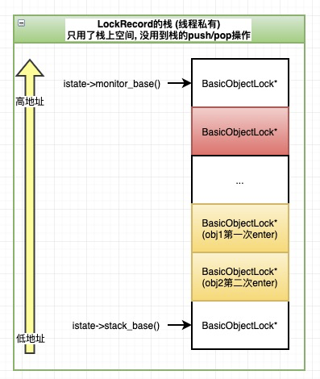

# 偏向锁和Lock Record
- 
  
&nbsp;&nbsp;LockRecord就是锁对象，来自于线程私有的栈上，每次进来都会从低地址向高地址遍历，获取一个可用的LockRecord。
对同一个对象的锁，重入时会保证分配顺序，先入获取的LockRecord的地址的地址比后入的地址高，这样对同一个对象的多个锁来说，就是一个栈的结构，保证后入先出。比如对obj2来说，第二次进入的的地址比第一次进入的地址低，释放时先释放第二次进入的锁，再释放第一次进入的锁。
   + 可重入的实现方式
     > 每重入一次，在LockRecord的栈中就会将一个LockRecord压栈，但是只有首次进入的Lock Record 中的_obj 和 _displaced_header 有值，后面重入的Lock Record只有_obj有值而_displaced_header无值

&nbsp;&nbsp;不仅是轻量级锁，对于偏向锁，也会获取同款的LockRecord，只不过使用姿势不同。