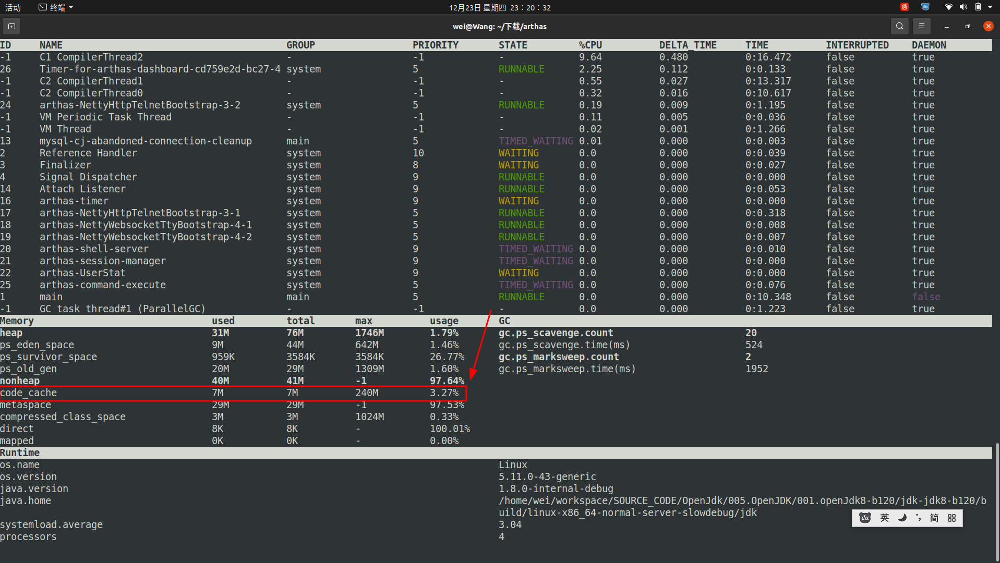

# Codecache调优
## 介绍的内容
1. 被JIT编译后的代码存储在codecache中(non-heap)
2. 如何设置codecache的大小
3. JIT在codecache使用完之后就不再编译方法了
4. Codecache相关JVM参数
5. 同步方法是否需要被内联

---
> 以下为原文: 
# Codecache Tuning(Codecache 调优)
&nbsp;&nbsp;This chapter describes techniques for reducing the just-in-time (JIT) compiler's consumption of memory in the codecache, where it stores compiled methods. This chapter contains the following topics:
> JIT将编译后的代码存储在Codecache中.本章描述如何减少JIT编译器在Codecache中所消耗的内存，本章包含如下主题:

+ Introduction
+ java Launcher Codecache Option Summary
+ Measuring Codecache Usage
+ Constraining the Codecache Size
+ Reducing Compilations
+ Reducing Compiled Method Sizes

## Introduction
&nbsp;&nbsp;The Java Virtual Machine (JVM) generates native code and stores it in a memory area called the codecache. The JVM generates native code for a variety of reasons, including for the dynamically generated interpreter loop, Java Native Interface (JNI) stubs, and for Java methods that are compiled into native code by the just-in-time (JIT) compiler. The JIT is by far the biggest user of the codecache. This appendix describes techniques for reducing the JIT compiler's codecache usage while still maintaining good performance.
> 译: JVM生成native code并把它存储在一个叫做codecache的内存区域，JVM产生native code有各式各样的原因，包括动态生成的解释器循环，JNI存根以及被JIT编译器编译成native code的Java方法。到目前为止，JIT是codecache最大的用户.这个附录描述了减少JIT编译器所占的codecache空间并且依旧维持他性能高效的技术。

&nbsp;&nbsp;This chapter describes three ways to reduce the JIT's use of the codecache:
> 译: 本章描述了三种方式去减少JIT所用的codecache空间

- Constrain the amount of codecache available to the JIT.
  > 限制JIT可用的codecache的数量
- Tune the JIT to compile fewer methods.
  > 调整JIT以编译更少的方法
- Tune the JIT to generate less code per method.
  > 调整JIT为每个方法生成更少的代码

## java Launcher Codecache Option Summary<sub>Java 启动器Codecache选项概要</sub>
&nbsp;&nbsp;The JVM options passed by the java launcher listed in the tables in this section can be used to reduce the amount of codecache used by the JIT. The table descriptions are summaries. Most of the options are described in more detail in the sections that follow.
> 由Java启动器传递的JVM选项在本节的表中列出，这些选项可以用来减少JIT所使用的codecache的数量。这个表描述的是概要。本节后面的部分将更详细的描述大多数选项。

## How to Use the Codecache Options of the java Command<sub>如何在Java命令行使用codecache选项</sub>
The options listed in the following sections share the following characteristics.
> 以下部分中列出的选项具有以下共同特征。

- All options are –XX options, for example, -XX:InitialCodeCacheSize=32m. Options that have true/false values are specified using + for true and - for false. For example, -XX:+PrintCodeCache sets this option to true.
  > 参数如何应用，应该都能看明白
- For any option that has "varies" listed as the default value, run the launcher with XX:+PrintFlagsFinal to see your platform's default value.
   > 对于任何选项，有 "varies" 标志就是默认值，可以运行带有“XX:+PrintFlagsFinal”的启动器去看平台默认的值
- If the default value for an option differs depending on which JVM is being used (client or server), then both defaults are listed, separated by a '/'. The client JVM default is listed first. The minimal JVM uses the same JIT as the client JVM, and therefore has the same defaults.
   >  如果选项的默认值因使用的JVM(client or server)的不同而不同，则所有的默认值都会列举出来，通过'/'分隔，client JVM默认值被第一个列举出来，这个最小的JVM使用和client JVM相同的JIT，因此具有相同的默认值
### Codecache Size Options
&nbsp;&nbsp;Table 15-1 summarizes the codecache size options. See also Constraining the Codecache Size.

- &nbsp;&nbsp;Table 15-1 Codecache Size Options
  |Option|Default|Description|
  |---|---|---|
  |InitialCodeCacheSize|160K (varies)|Initial code cache size (in bytes)|
  |ReservedCodeCacheSize|32M/48M|Reserved code cache size (in bytes) - maximum code cache size|
  |CodeCacheExpansionSize|32K/64K|Code cache expansion size (in bytes)|

### Codecache Flush Options
&nbsp;&nbsp;Table 15-2 summarizes the codecache flush options.
- &nbsp;&nbsp;Table 15-2 Codecache Flush Options
   |Option|Default|Description|
   |---|---|---|
   |ExitOnFullCodeCache |false| Exit the JVM if the codecache fills|
   |UseCodeCacheFlushing |false|Attempt to sweep the codecache before shutting off compiler|
   |MinCodeCacheFlushingInterval| 30 |Minimum number of seconds between codecache sweeping sessions|
   |CodeCacheMinimumFreeSpace |500K| When less than the specified amount of space remains, stop compiling. This space is reserved for code that is not compiled methods, for example, native adapters.|

### Compilation Policy Options
&nbsp;&nbsp;Table 15-3 summarizes the compilation policy (when to compile) options.
- &nbsp;&nbsp;Table 15-3 Compilation Policy Options
  |Option|Default|Description|
  |---|---|---|
  |CompileThreshold|1000 or 1500/10000|Number of interpreted method invocations before (re-)compiling|
  |OnStackReplacePercentage|140 to 933|NON_TIERED number of method invocations/branches (expressed as a percentage of CompileThreshold) before (re-)compiling OSR code|

### Compilation Limit Options
&nbsp;&nbsp;Table 15-4 summarizes the compilation limit options, which determine how much code is compiled).

- &nbsp;&nbsp;Table 15-4 Compilation Limit Options
  |Option|Default|Description|
  |---|---|---|
  |MaxInlineLevel|9|Maximum number of nested calls that are inlined|
  |MaxInlineSize|35|Maximum bytecode size of a method to be inlined |
  |MinInliningThreshold|250|Minimum invocation count a method needs to have to be inlined|
  |InlineSynchronizedMethods|true|Inline synchronized methods|

### Diagnostic Options
&nbsp;&nbsp;Table 15-5 summarizes the diagnostic options.

- &nbsp;&nbsp;Table 15-5 Diagnostic Options
  |Option|Default|Description|
  |---|---|---|
  |PrintFlagsFinal|false|Print all JVM options after argument and ergonomic processing|
  |PrintCodeCache|false|Print the code cache memory usage when exiting|
  |PrintCodeCacheOnCompilation|false|Print the code cache memory usage each time a method is compiled|

## Measuring Codecache Usage
&nbsp;&nbsp;To measure the success of a codecache usage reduction effort, you must measure the codecache usage and the effect on performance. This section explains how to measure the codecache usage. It is up to you to decide the best way to measure performance for your application.
> 为了能够成功的测量减少codecache使用量的成果，你必须测量codecache的使用情况及其对性能的影响，本章解释了如何去测量codecache的使用情况，将由你决定测量你应用程序性能最好的方式。

&nbsp;&nbsp;Start with a baseline (the amount of codecache used when no codecache reduction techniques are applied), and then monitor the effect of your codecache reduction techniques on both codecache size and performance relative to the baseline.
> 从一个基线开始（没有应用codecache缩减技术时codecache的使用数量），然后相对于基线监测codecache缩减技术对于codecache大小和性能的影响

&nbsp;&nbsp;Keep in mind that the codecache starts relatively small and then grows as needed as new methods are compiled. Sometimes compiled methods are freed from the codecache, especially when the maximum size of the codecache is constrained. The memory used by free methods can be reused for newly compiled methods, allowing additional methods to be compiled without growing the codecache further.
> 记住，codecache开始很小然后随着新方法的编译而增长，有时编译后的方法会从codecache中释放，特别是在codecache的最大值被限制的时候。"free methods"所占用的内存将被新编译的方法所重用，从而允许在编译其他方法的时候而不需要增长codecache空间.
> > free methods : 是啥

> > 即codecache空间的复用

&nbsp;&nbsp;You can get information on codecache usage by specifying –XX:+PrintCodeCache on the java launcher command line. When your application exits, you will see output similar to the following:
> 你可以通过在java启动器命令行指定–XX:+PrintCodeCache参数获取codecache的信息，当你的应用程序退出的时候，你可以看到类似于一下这样的输出
 ```txt
    CodeCache: size=32768Kb used=542Kb max_used=542Kb free=32226Kb
     bounds [0xb414a000, 0xb41d2000, 0xb614a000] 
     total_blobs=131 nmethods=5 adapters=63 
     compilation: enabled
 ```
The most useful part of the output for codecache reduction efforts is the first line. The following describes each of the values printed:
> 
+ size: The maximum size of the codecache. It should be equivalent to what was specified by –XX:ReservedCodeCacheSize. Note that this is not the actual amount of physical memory (RAM) used by the codecache. This is just the amount of virtual address space set aside for it.
  > codecache的最大值，他应该等同于–XX:ReservedCodeCacheSize参数的指定值，注意，这不是codecache真实使用的物理内存，这仅仅是为他预留的虚拟地址空间。
+ used: The amount of codecache memory actually in use. This is usually the amount of RAM the codecache occupies. However, due to fragmentation<sup>n.破碎；分裂</sup> and the intermixing<sup>n.混合</sup> of free and allocated blocks of memory within the codecache, it is possible that the codecache occupies more RAM than is indicated by this value, because blocks that were used then freed are likely still in RAM.
  >  codecache真实使用的内存，这通常表示codecache占用的内存。然而，因为codecache中的碎片化，他可能实际占用了超过这个值的内存，因为使用后被释放的块依然在内存中
+ max_used: This is the high water mark for codecache usage; the maximum size that the codecache has grown to and used. This generally is considered to be the amount of RAM occupied by the codecache, and will include any free memory in the codecache that was at some point in use. For this reason, it is the number you will likely want to use when determining how much codecache your application is using.
  > 这是codecache使用内存的最高水位，是codecache所达到和使用的最大尺寸，这通常被认为是codecache占用RAM的数量，并包括任何时候在codecache中释放的内存。因为这个原因，在确定你的应用程序的codecache将使用多少内存时，你可能希望使用这个数字。
+ free: This is size minus used.
  > size - used 的差值


The –XX:+PrintCodeCacheOnCompilation option also produces the same output as the first line above produced by –XX:+PrintCodeCache, but does so each time a method is compiled. It can be useful for measuring applications that do not terminate. It can also be useful if you are interested in the codecache usage at a certain point in the application's execution, such as after application startup has completed.
> 因为–XX:+PrintCodeCacheOnCompilation选项也会产生和–XX:+PrintCodeCache一样的输出，但是每次编译一个方法都会这样做。这在应用程序没有终止时很有用。如果你在程序运行的某个时候对codecache的使用情况有兴趣，这个也有用，例如程序启动完成。

Because max_used generally represents the amount of RAM used by the codecache, this is the value you will want note when you take your baseline measurement. The sections that follow describe how you can reduce max_used.
> 因为max_use通常代表着codecache使用的RAM的数量，这将你在进行基准测试时需要注意的值。本章接下来描述如何减少max_used

## Constraining the Codecache Size
Constraining the codecache size means the codecache is limited to a size that is less than what would an unconstrained codecache would use. The ReservedCodeCacheSize option determines the maximum size of the codecache. It defaults to a minimum of 32MB for the client JVM and 48MB for the server VM. For most Java applications, this size is so large that the application will never fill the entire codecache. Thus the codecache is viewed as being unconstrained, meaning the JIT will continue to compile any code that it thinks should be compiled.
> 约束codecache的大小意味着codecache限于一个小于一个没有限制时的codecache的大小。ReservedCodeCacheSize选项确定codecache的最大值，他的默认值在client JVM是32MB，在Server JVM是48MB。对于大多数的Java应用程序，这个值大到应用程序绝不会全部使用。因此，codecache被看做为是不被约束的，因为这JIT将继续编译任何他认为需要被编译的代码。

### When is Constraining the Codecache Size Useful?
Applications that make state changes that result in a new set of methods being "hot" can benefit greatly from a constrained codecache.
> 如果应用程序使得状态改变了导致了一组新的热点代码，那么他将从受限的codecache获取到极大的好处。

A common state change is from startup to regular execution. The application might trigger a lot of compilation during startup, but very little of this compiled code is needed after startup. By constraining the codecache, you will trigger codecache flushing to throw away the code compiled during startup to make room for the code needed during application execution.
> 一个普通的状态变更是从启动状态到常规运行状态，在启动的时候，应用程序或许会触发一系列编译，但是在非常少的编译代码在启动后被需要。通过限制codecache，你将触发codecache的刷新操作，将这些在启动期间被编译的代码刷丢弃，为程序运行期间所需要的代码腾出空间。

Some applications make state changes during execution, and tend to stay in the new state for an extended period of time. For these applications, the codecache only needs to be big enough to hold the compiled code needed during any given state. Thus if your application has five distinct states, each needing about 1MB of codecache to perform well, then you can constrain the codecache to 1MB, which will be an 80% reduction over the normal 5MB codecache usage for the application. Note, however, that each time the application makes a state change, there will be some performance degradation while the JIT compiles the methods needed for the new state.
> 一些应用程序在运行期间变更状态，并且倾向于留在一个新的状态较长时间。对于这些应用程序，codecache只需要足够大以至于能够保存这些被编译的代码在任何给定的状态。因此如果你的程序有五个截然不同的状态，每个需要大概1MB的codecache空间以至于让你的程序高效运行，那么你可以将codecache约束为1MB，这将比应用程序正常5MB的codecache减少80%。注意，然而，在每个应用程序状态变更的时间，在JIT为新状态编译代码时，会有一些性能下降。

### How to Constrain the Codecache Size
When the codecache is constrained (its usage approaches or reaches the ReservedCodeCacheSize), to compile more methods, the JIT must first throw out some already compiled methods. Discarding compiled methods is known as codecache flushing. The UseCodeCacheFlushing option turns codecache flushing on and off. By default it is on. You can disable this feature by specifying XX:-UseCodeCacheFlushing. When enabled, the codecache flushing is triggered when the memory available in the codecache is low. It is critical to enable codecache flushing if you constrain the codecache. If flushing is disabled, the JIT does not compile methods after the codecache fills up.
>当codecache被限制了(其使用接近或达到ReservedCodeCacheSize),为了编译更多的代码，JIT必须首先将早已编译的代码丢弃，丢弃已编译的方法被称为codecache刷新。UseCodeCacheFlushing选项配置codecache的开启和关闭。默认是开启的。你可以通过指定XX:-UseCodeCacheFlushing来关闭。当允许使用的时候，codecache的刷新在其可用内存很小的时候被触发。这是在限制codecache大小时允许codecache刷新的关键。如果不允许刷新，<font color="red">JIT在codecache使用完之后就不再编译方法了。</font>

To determine an appropriate<sup>adj. 合适的，相称的</sup> ReservedCodeCacheSize value for your application, you must first see how much codecache the application uses when the codecache is unconstrained. Use the XX:+PrintCodeCache option described in Measuring Codecache Usage, and examine the max_used value, which is how much codecache your application uses. You can then try setting ReservedCodeCacheSize to smaller values and see how well your application performs.
> 为了给一个程序确定一个合适的ReservedCodeCacheSize值，你必须首先查看应用程序的codecache在没有限制的时候的使用量。使用XX:+PrintCodeCache选项在测量时获取codecache的使用并且检查max_use的值，这是你的程序的codecache的使用量。然后你可以尝试设置ReservedCodeCacheSize一个较小的值并查看应用程序的性能。

If you are trying to use a small (less than 5MB) codecache, you must consider CodeCacheMinimumFreeSpace. For larger codecaches, leave the default value alone. Generally<sup>adv. 笼统地，大概；通常，普遍地</sup>, the JIT keeps enough space free in the codecache to honor this option. For a small code cache, add CodeCacheMinimumFreeSpace to your new ReservedCodeCacheSize. As an example, suppose:
> 如果你尝试使用一个小(少于5MB)的codecache，你必须考虑CodeCacheMinimumFreeSpace，对于较大的codecache，保持默认值不变。一般情况下，JIT保持codecache里有足够的空闲空间来尊重这个选项。对于小的codecache，添加CodeCacheMinimumFreeSpace到你的新ReservedCodeCacheSize，例如，支持:
  ```txt
    max_used = 3M
    CodeCacheMinimumFreeSpace = 500k
  ```
To reduce the codecache size from 3MB to 2MB, increase ReservedCodeCacheSize to 2500k (2M+500K) After making the change, verify that max_used changes to 2M.
> 为了将codecache的大小从3MB减到2MB，增大ReservedCodeCacheSize到2500K，在这个改变之后，校验这个max_use值增长到了2MB。

When constraining the codecache, usually<sup>adv. 通常，经常</sup> CodeCacheMinimumFreeSpace can be set to a lower value. However, CodeCacheMinimumFreeSpace should be at least 100KB. If free space is exhausted<sup>耗尽的，枯竭的</sup>, the JVM throws VirtualMachineError and exits, or in rare cases, crashes. For the 3MB to 2MB example, the following settings are appropriate:
> 当限制codecache，通常CodeCacheMinimumFreeSpace被设置为一个较小的值，然后，CodeCacheMinimumFreeSpace应该至少是100KB。如果空闲空间被耗尽，JVM将抛出VirtualMachineError并且退出，或者在极少数的情况下崩溃。对于将3MB设置为2MB的例子，下面的配置更加合适: 

```txt
   -XX:ReservedCodeCacheSize=2100k
   -XX:CodeCacheMinimumFreeSpace=100k
```

Finding the optimal<sup>adj. 最佳的，最适的</sup> ReservedCodeCacheSize for your needs is an iterative<sup>adj. [数] 迭代的；重复的，反复的</sup> process. You can repeatedly<sup>adv. 重复地，再三地</sup> use smaller and smaller values for ReservedCodeCacheSize until your application's performance degrades<sup>v. 侮辱，贬低；降低，削弱</sup> unacceptably, and then increase until you get acceptable performance again. You should also gauge the incremental return you are achieving. You might find that you can decrease max_used by 50% with only a 5% performance degradation, and decrease max_used by 60% with a 10% performance degradation. In this example, the second 10% codecache reduction cost as much performance as the initial<sup>开始的，最初的</sup> 50% codecache reduction. You might conclude in this case that the 50% reduction a good balance between codecache usage and performance.
> 找到一个你需要的最佳的ReservedCodeCacheSize是一个重复的过程，你可以重复地使用越来越小的值来设置ReservedCodeCacheSize直到你的程序的性能降低到不能接受。并且逐渐增长，直到性能达到你能接受的地步。你也应该衡量你所获得的增量回报。你获取找到了减少max_use到50%而仅有5%的性能降低，和 将mas_used减少60%而只会损失10%的性能。在这个例子中，第二个10% codecache的降低损失的性能和最初的50% codecache压缩相同。你或许推断出在这个例子中50%的压缩是在性能和codecache的使用之间是一个好的平衡。

## Reducing Compilations<sup>n. 收集，选辑；汇编物（compilation 的复数）</sup>
Reducing the number of compiled methods, or the rate at which they are compiled, is another effective way of reducing the amount of codecache that is used. Two main command line options that affect how aggressively methods are compiled: CompileThreshold and OnStackReplacePercentage. CompileThreshold relates to the number of method invocations needed before the method is compiled. OnStackReplacePercentage relates to the number of backwards branches taken in a method before it gets compiled, and is specified as a percentage of CompileThreshold. When a method's combined number of backwards branches and invocations reaches or exceeds CompileThreshold * OnStackReplacePercentage / 100, the method is compiled. Note that there is also an option called BackEdgeThreshold, but it currently does nothing. Use OnStackReplacePercentage instead.
> 减少被编译方法的数量或者降低被编译的比率，另一个有效的方法是减少codecache正在被使用的数量。两个主要的命令行参数影响着方法编译的方式: CompileThreshold 和 OnStackReplacePercentage。CompileThreshold 和方法被编译前被调用的次数相关。OnStackReplacePercentage 和方法被编译前接受的向后分支数量相关，且被指定为CompileThreshold的百分比。当方法的调用次数和向后分支总数达到或者超过”CompileThreshold * OnStackReplacePercentage / 100“，这个方法就会被编译。注意，还有一个叫BackEdgeThreshold的选项，但是目前什么都不做。使用OnStackReplacePercentage代替。

Larger values for these options decreases compilations. Setting the options larger than their defaults defers<sup>推迟；延迟；服从</sup> when a method gets compiled (or recompiled), possibly even preventing a method from ever getting compiled. Usually, setting these options to larger values also reduces performance (methods are interpreted), so it is important to monitor both performance and codecache usage when you adjust them. For the client JVM, tripling the default values of these options is a good starting point. For the server JVM, CompileThreshold is already set fairly high, so probably does not need to be adjusted further.
> 这些值越大，编译的次数越少。被设置的值超过默认值将延迟方法的编译或者重编译。设置可能阻止某个方法被编译。通常，设置这些选项更大的值也会降低性能(方法被解释执行)，所以，当你要调整它们时，监控性能和codecache的使用非常关键。对于Client JVM，将这些选项的默认值增加两倍是一个很好的起点。对于server JVM，CompileThreshold已经设置得相当高了，所以可能不需要进一步调整。

## Reducing Compiled Method Sizes
There are a number of command-line options that reduce the size of compiled methods, but generally at some performance cost. Like the codecache reduction methods described in other sections, the key is finding a setting that gives good code cache usage reduction, without much performance loss.
> 这里有一些减少被编译方法大小的命令行选项，但是通常有些性能损耗。例如在其他章节介绍的减少codecache。这个关键在于找到一种配置，既要很好的减少codecache的使用，同时又不会有太多的性能损耗。

The options described in this section all relate to reducing the amount of inlining the compiler does. Inlining is when the compiler includes the code for a called method into the compiled code for the method being compiled. Inlining can be done many levels deep, so if method a() calls b() which in turn calls c(), then when compiling a(), b() can be inlined in a(), which in turn can trigger the inlining of c() into a().
> 本章介绍的选项都和减少编译器内联的数量有关，内联是指编译器将被调用方法的代码包含到正在编译的方法的编译代码中。内联可以在很多层次进行，所以如果方法a()调用b()， b()又调用c()，那么当编译a()时，b()可以内联在a()中，这反过来可以触发c()内联到a()中。

The JIT compiler uses multiple heuristics to determine if a method should be inlined. In general, the heuristics are tuned for optimal performance. However, you can adjust some of them to sacrifice<sup>牺牲；献出</sup> some performance for less codecache usage. The more useful options to tune are described below:
> JIT编译器使用多中试探法来确定一个方法是否应该被内联，通常，试探法是为了获取最佳的性能，然而，你可以调整他们中的一些来舍弃一些性能从获得更少的codecache的使用量。下面描述了更有用的调优选项: 

- InlineSmallCode
  + The value of this option determines how small an already compiled method must be for it to be inlined when called from a method being compiled. If the compiled version of this method is bigger than the setting for InlineSmallCode, then it is not inlined. Instead, a call to the compiled version of the method is generated.
     + 这个选项的值决定了一个已被编译的方法必须有多小，以便被正在被编译的方法调用的时候内联他。当方法被编译的版本超过了该设置，然而他没有被内联，相反，会生成一个对该方法编译版本的调用。
- MaxInlineLevel
  + This option represents the maximum nesting level of the inlining call chain. Inlining becomes much less useful at deeper levels, and can eventually be harmful to performance due to code bloat. The default value is 9. Setting MaxInlineLevel as low as 1 or 2 ensures that trivial methods, such as getters and setters, are inlined.
  + - 这个选项代表了内联方法调用链的最大层级，内联在更深层次上变得不那么有用，并且由于代码膨胀，最终会对性能造成损害。缺省值是9。将MaxInlineLevel设置为1或2，可以确保普通的方法(如getter和setter)内联。
- MaxInlineSize
  + This option represents the maximum bytecode size of an inlined method. It defaults to 35, but is automatically reduced at each inlining level. Setting it very small (around 6) ensures that only trivial methods are inlined.
  + - 这个选项代表着被内联方法的最大字节码大小。默认是35，但是会自动在每个内联层级上减少。将他设置的非常小确保只有不重要的方法被内联。
- MinInliningThreshold
  + The interpreter tracks invocation counts at method call sites. This count is used by the JIT to help determine if a called method should be inlined. If a method's number of invocations is less than MinInliningThreshold, the method is not inlined. Raising this threshold reduces the number of method call sites that are inlined. Trivial<sup>微不足道的</sup> methods are always inlined and are not subject to the setting of MinInliningThreshold.
  + - 解释器跟踪方法调用点的调用计数，这个计数被JIT用来帮助确定一个被调用的方法是否应该被内联。如果方法的调用次数小于MinInliningThreshold，这个方法不应该被内联。提高这个阈值从而被内联方法的调用点的数量。普通的方法通常被内联且不受MinInliningThreshold配置的影响。
- InlineSynchronizedMethods
  + This option can be used to disable the inlining of methods that are declared as synchronized. Because synchronizing is a fairly expensive operation, especially on multi-core devices, the benefits of inlining even small synchronized methods is greatly diminished<sup>减少，削弱</sup>. You might find you can disable the inlining of synchronized methods with little or no perceived<sup>感知；认为；perceive过去式</sup> performance degradation, but with a noticeable reduction in the codecache usage.
  + - 这个选项被用于禁止同步方法的内联，因为同步是一个相当昂贵的操作，特别是在多核设备。即使是小的同步方法被内联的好处也会大大减少，你或许会发现可以禁止同步方法被内联而不会有明显的性能下降，但是codecache的使用有明显的减少。

---
## 附录
### 1. 起因


- code_cache：JIT缓存区域占用内存信息
- metaspace：元数据区占用内存信息（受操作系统内存大小的限制）
- compressed_class_space：指针压缩 用32位的offset代表64位的classpointer
- direct： Direct Memory,nio使用的堆外空间
- mapped：内存映射缓冲区（一般来说频繁读写文件可能导致此区域偏高）系统信息区域（内存映射文件,nio使用）

---
## 参考资料
1. 原文: [15 Codecache Tuning](https://docs.oracle.com/javase/jp/8/embedded/develop-apps-platforms/codecache.htm)

-----
## 哈哈，蹩脚的翻译
|单词|中文|
|---|---|
|variety|多样化，变化；种类，品种；（人或物的）各式各样；综艺表演，杂耍表演|
|dynamically|adv. 动态地；充满活力地；不断变化地|
|far|adv. 远，遥远地；久远地；非常，很大程度上；发展，进展（到）；过分地；adj. 遥远的，久远的；另一边的，较远的；偏远的，极端的|
|by far|到目前为止|
|appendix|附录，阑尾|
|techniques|n. 技术；方法；技巧（technique 的复数）|
|maintaining|n. 维护；保养;v. 维持；保养（maintain 的现在分词）|
|Constrain|v. 限制，约束；强迫，迫使|
|Summary|n. 总结，概要|
|characteristics|n. 特性，特征；特色（characteristic 的复数）；特质|
|varies|v. （大小、形状等）不同；改变；略微变更，调整（vary 的第三人称单数）|
|expansion|n. 扩大，扩张；扩充，展开；扩张物；膨胀|
|Measuring|v. 测量（measure 的 ing 形式）|
|effort|n. 努力，艰难的尝试；力气，精力；有组织的活动；努力的结果，成就；努力的结果，成就|
|measure|v.测量；估量；|
|It is up to you|由你决定;取决于你;|
|equivalent|adj. 等同的，等效的|
|aside|adv. 在旁边，到（或向）一边；积攒，留出；除……以外|
|occupies|占领；占用|
|considered|被认为是|
|certain|adj. 必然的，必定的；确定的，无疑的；某个，特定的；某位，一位叫……的；一定程度上的，有点儿 pron. 某些，某几个|
|tend|v. 倾向于，往往会；照顾，护理；走向，趋向|
|degradation|n. 丢脸，落魄，侮辱；损害，恶化，衰退；降解；陵夷，剥蚀|
|critical|adj. 批判的，爱挑剔的；极其重要的，关键的；严重的，危急的；病重的，重伤的；评论性的，评论家的；临界的|
|examine|v. 检查，调查；考核，测验；（医生）诊察；（尤指在法庭上）审问，查问|
|gauge|n. 测量仪器；宽度，厚度；（测量或判断的）尺度，标准；（铁道的）轨距；（枪管的）口径；（汽车）胎压计；v. 估计，判断；测量|
|incremental|adj. （定额）增长的；逐渐的，逐步的；递增的|
|conclude|v. 断定，推断出；结束，终止；达成，做成，完成；<美>决定|
|exceeds|v. 超过，超出；超越（限制）；优于，胜过|
|tuned|adj. 经调谐的；谱好曲的；调好台的v. 调整；调音；发出乐音（tune 的过去分词）|