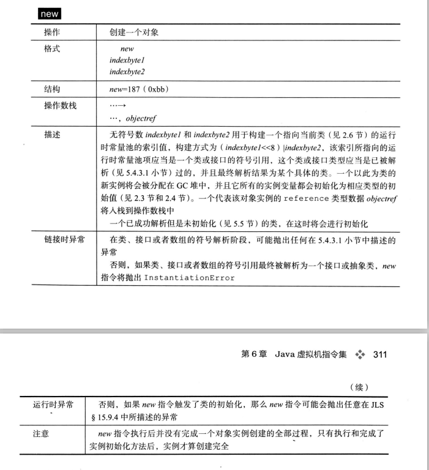
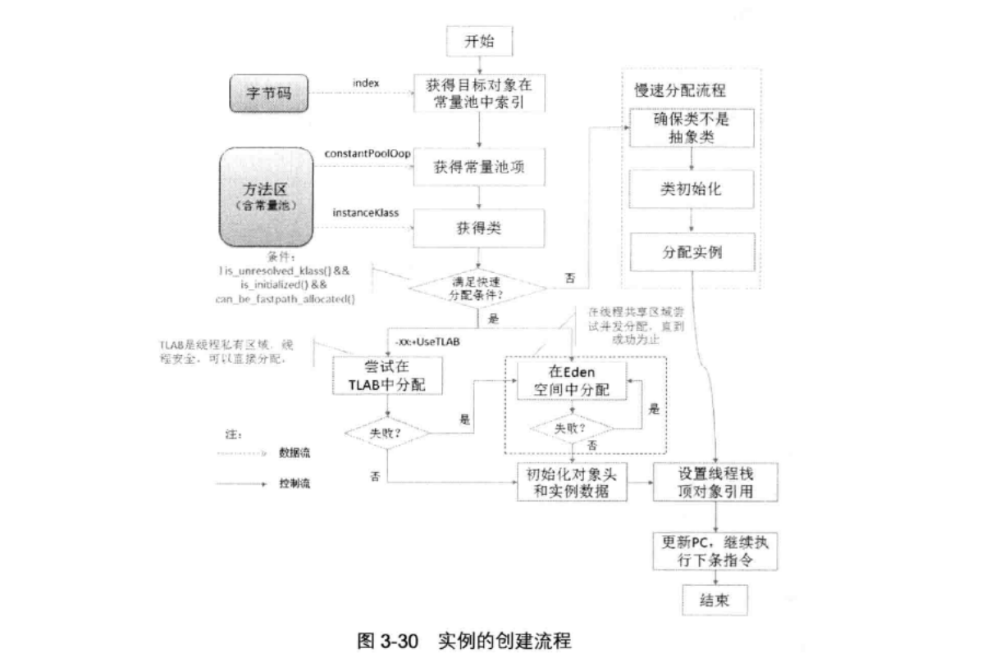

# 对象的创建
## new 字节码指令格式
- 

## 对象创建源代码
+ [005.OpenJDK/001.openJdk8-b120/jdk-jdk8-b120/hotspot/src/share/vm/interpreter/bytecodeInterpreter.cpp](../../005.OpenJDK/001.openJdk8-b120/jdk-jdk8-b120/hotspot/src/share/vm/interpreter/bytecodeInterpreter.cpp)
### 对象创建流程
- 


---
## Q&A
### 当对象大小超过一定阈值，则在老年代分配，代码体现在哪里
&nbsp;&nbsp;这主要是通过JVM参数:PretenureSizeThreshold 来设置，代码:
```c
 // grep -r 'PretenureSizeThreshold' ./*  -> 005.OpenJDK/001.openJdk8-b120/jdk-jdk8-b120/hotspot/src/share/vm/runtime/globals.hpp
 product(uintx, PretenureSizeThreshold, 0,                                 \
          "Maximum size in bytes of objects allocated in DefNew "           \
          "generation; zero means no maximum")                              \
  // 该JVM参数用于: 005.OpenJDK/001.openJdk8-b120/jdk-jdk8-b120/hotspot/src/share/vm/memory/defNewGeneration.cpp

  // 该JVM参数是否影响  ik->can_be_fastpath_allocated()(005.OpenJDK/001.openJdk8-b120/jdk-jdk8-b120/hotspot/src/share/vm/interpreter/bytecodeInterpreter.cpp)的返回值呢?
```
- 通过代码
- + ParNewGeneration 继承自 DefNewGeneration , 所以ParNew以及Serial垃圾收集器也会受该参数影响
- 该参数的应用在慢速分配的代码中
#### 避免了什么问题
- 大对象容易导致明明还有不少空间时就提前触发垃圾收集(原因是没有连续的空间),以及避免在Eden 以及 两个survivor之间来回复制，产生大量的内存复制操作

+ 部分日志，暂记录
```log
   libjvm.so!DefNewGeneration::should_allocate(DefNewGeneration * const this, size_t word_size, bool is_tlab) (jdk-jdk8-b120/hotspot/src/share/vm/memory/defNewGeneration.hpp:266)
   libjvm.so!Generation::should_collect(Generation * const this, bool full, size_t word_size, bool is_tlab) (jdk-jdk8-b120/hotspot/src/share/vm/memory/generation.hpp:371)
   libjvm.so!GenCollectedHeap::do_collection(GenCollectedHeap * const this, bool full, bool clear_all_soft_refs, size_t size, bool is_tlab, int max_level) (jdk-jdk8-b120/hotspot/src/share/vm/memory/genCollectedHeap.cpp:424)
   libjvm.so!GenCollectorPolicy::satisfy_failed_allocation(GenCollectorPolicy * const this, size_t size, bool is_tlab) (jdk-jdk8-b120/hotspot/src/share/vm/memory/collectorPolicy.cpp:814)
   libjvm.so!GenCollectedHeap::satisfy_failed_allocation(GenCollectedHeap * const this, size_t size, bool is_tlab) (jdk-jdk8-b120/hotspot/src/share/vm/memory/genCollectedHeap.cpp:596)
   libjvm.so!VM_GenCollectForAllocation::doit(VM_GenCollectForAllocation * const this) (jdk-jdk8-b120/hotspot/src/share/vm/gc_implementation/shared/vmGCOperations.cpp:187)
   libjvm.so!VM_Operation::evaluate(VM_Operation * const this) (jdk-jdk8-b120/hotspot/src/share/vm/runtime/vm_operations.cpp:60)
   libjvm.so!VMThread::evaluate_operation(VMThread * const this, VM_Operation * op) (jdk-jdk8-b120/hotspot/src/share/vm/runtime/vmThread.cpp:372)
   libjvm.so!VMThread::loop(VMThread * const this) (jdk-jdk8-b120/hotspot/src/share/vm/runtime/vmThread.cpp:497)
   libjvm.so!VMThread::run(VMThread * const this) (jdk-jdk8-b120/hotspot/src/share/vm/runtime/vmThread.cpp:274)
   libjvm.so!java_start(Thread * thread) (jdk-jdk8-b120/hotspot/src/os/linux/vm/os_linux.cpp:860)
   libpthread.so.0!start_thread(void * arg) (/build/glibc-eX1tMB/glibc-2.31/nptl/pthread_create.c:477)
   libc.so.6!clone() (/build/glibc-eX1tMB/glibc-2.31/sysdeps/unix/sysv/linux/x86_64/clone.S:95)
   
   ----
   libjvm.so!DefNewGeneration::should_allocate(DefNewGeneration * const this, size_t word_size, bool is_tlab) (jdk-jdk8-b120/hotspot/src/share/vm/memory/defNewGeneration.hpp:266)
   libjvm.so!GenCollectorPolicy::mem_allocate_work(GenCollectorPolicy * const this, size_t size, bool is_tlab, bool * gc_overhead_limit_was_exceeded) (/home/wei/worcd bukspace/SOURCE_CODE/OpenJdk/005.OpenJDK/001.openJdk8-b120/jdk-jdk8-b120/hotspot/src/share/vm/memory/collectorPolicy.cpp:673)
   libjvm.so!GenCollectedHeap::allocate_new_tlab(GenCollectedHeap * const this, size_t size) (jdk-jdk8-b120/hotspot/src/share/vm/memory/genCollectedHeap.cpp:972)
   libjvm.so!CollectedHeap::allocate_from_tlab_slow(KlassHandle klass, Thread * thread, size_t size) (jdk-jdk8-b120/hotspot/src/share/vm/gc_interface/collectedHeap.cpp:278)
   libjvm.so!CollectedHeap::allocate_from_tlab(KlassHandle klass, Thread * thread, size_t size) (jdk-jdk8-b120/hotspot/src/share/vm/gc_interface/collectedHeap.inline.hpp:186)
   libjvm.so!CollectedHeap::common_mem_allocate_noinit(KlassHandle klass, size_t size, Thread * __the_thread__) (jdk-jdk8-b120/hotspot/src/share/vm/gc_interface/collectedHeap.inline.hpp:124)
   libjvm.so!CollectedHeap::common_mem_allocate_init(KlassHandle klass, size_t size, Thread * __the_thread__) (jdk-jdk8-b120/hotspot/src/share/vm/gc_interface/collectedHeap.inline.hpp:173)
   libjvm.so!CollectedHeap::array_allocate(KlassHandle klass, int size, int length, Thread * __the_thread__) (jdk-jdk8-b120/hotspot/src/share/vm/gc_interface/collectedHeap.inline.hpp:214)
   libjvm.so!TypeArrayKlass::allocate_common(TypeArrayKlass * const this, int length, bool do_zero, Thread * __the_thread__) (jdk-jdk8-b120/hotspot/src/share/vm/oops/typeArrayKlass.cpp:106)
   libjvm.so!TypeArrayKlass::allocate(TypeArrayKlass * const this, int length, Thread * __the_thread__) (jdk-jdk8-b120/hotspot/src/share/vm/oops/typeArrayKlass.hpp:67)
   libjvm.so!oopFactory::new_typeArray(BasicType type, int length, Thread * __the_thread__) (jdk-jdk8-b120/hotspot/src/share/vm/memory/oopFactory.cpp:56)
   libjvm.so!InterpreterRuntime::newarray(JavaThread * thread, BasicType type, jint size) (jdk-jdk8-b120/hotspot/src/share/vm/interpreter/interpreterRuntime.cpp:178)
```
### 新建立对象的对象头的值

---
## 参考资料
1. 《Java虚拟机规范  Java SE 8版》