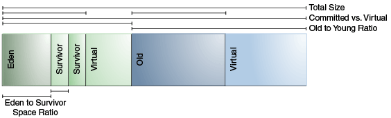

# ParNew + CMS
&nbsp;&nbsp;对于ParNew + CMS 的组合，实际案例分析请参考资料 [004.OpenJDK(JVM)学习/009.GC/004.ParNew+CMS/从实际案例聊聊Java应用的GC优化.pdf](./从实际案例聊聊Java应用的GC优化.pdf) 以及 [004.OpenJDK(JVM)学习/009.GC/004.ParNew+CMS/Java中9种常见的CMS-GC问题分析与解决.pdf](./Java中9种常见的CMS-GC问题分析与解决.pdf)。

&nbsp;&nbsp;以上资料详细讲述了GC的案例以及分析与解决方案，那么在这里，主要是通过源代码了解理论知识，如CMS的过程，Concurrent Mode Failure、碎片化

## 源码分析路径
&nbsp;&nbsp;当对象内存分配失败了，就会触发GC。以此作为分析的切入点,开始分析ParNew + CMS 源代码
```c
    
```
## 内存分区(OpenJDK1.8)
- 
- + Virtual 即虚拟内存(未使用的内存，在初始化JVM堆或者元空间时进行的预留空间操作就是申请虚拟地址空间，即虚拟内存)，即UnCommit的内存。虚拟内存之前的是已经使用的内存，即commited的内存。
    -  [HotSpot Virtual Machine Garbage Collection Tuning Guide](../HotSpot%20Virtual%20Machine%20Garbage%20Collection%20Tuning%20Guide.pdf)
    - [HotSpot Virtual Machine Garbage Collection Tuning Guide](../hotspot-virtual-machine-garbage-collection-tuning-guide.pdf)

## 关于CMS-Full GC
1. 阅读[CMS介绍](./001.CMS介绍.md)可知，当并发失败,CMS会退化为单线程的Ful GC，性能会更差
2. [/深入理解Java虚拟机.pdf](../../../006.BOOKs/深入理解Java虚拟机.pdf) 可知,CMS 的Full GC 并不是单线程的,不要弄混了。

---

## 参考
1. [006.BOOKs/深入理解Java虚拟机.pdf] 3.5.6 CMS收集器
2. [HotSpot Virtual Machine Garbage Collection Tuning Guide](../HotSpot%20Virtual%20Machine%20Garbage%20Collection%20Tuning%20Guide.pdf)
3. [HotSpot Virtual Machine Garbage Collection Tuning Guide](../hotspot-virtual-machine-garbage-collection-tuning-guide.pdf)