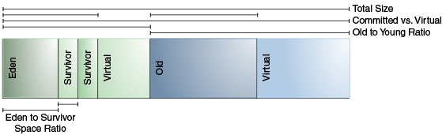

# ParNew + CMS
## 内存分区
- 
- + Virtual 即虚拟内存(未使用的内存，在初始化JVM堆或者元空间时进行的预留空间操作就是申请虚拟地址空间，即虚拟内存)，即UnCommit的内存。虚拟内存之前的是已经使用的内存，即commited的内存。
- [https://docs.oracle.com/javase/9/gctuning/factors-affecting-garbage-collection-performance.htm#JSGCT-GUID-189AD425-F9A0-444A-AC89-C967E742B25C](https://docs.oracle.com/javase/9/gctuning/factors-affecting-garbage-collection-performance.htm#JSGCT-GUID-189AD425-F9A0-444A-AC89-C967E742B25C)