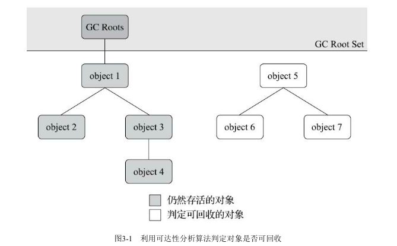
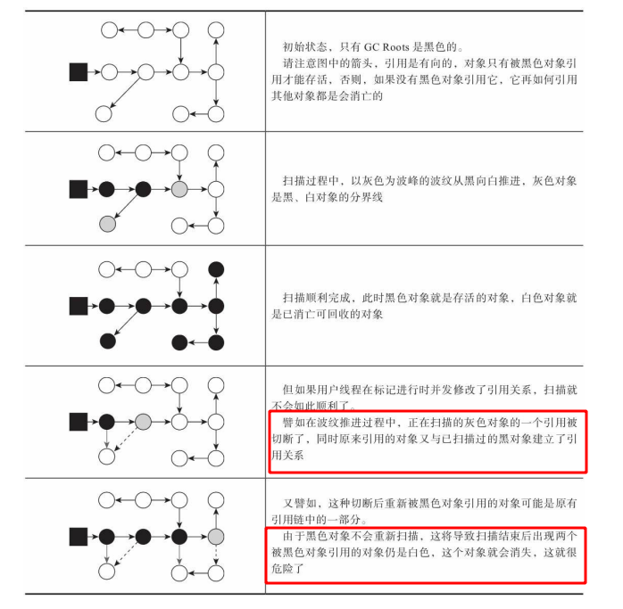

# 可达性分析算法
&nbsp;&nbsp;通过一系列称为 GC Roots 的根对象作为起始节点集，从这些节点开始，根据引用关系向下搜索，搜索过程走过的路径称为“引用链”，如果某个对象到GC Roots间没有任何引用链相连，则证明该对象是不可能再被使用的。
<br/>
&nbsp;&nbsp;如上图，对象object5、object6、object7虽然由关联，但是他们到GC Roots是不可达的，因此他们将被判定为可回收的对象。

## Java中GC Roots有哪些?
&nbsp;&nbsp;在Java中，固定可以作为GC Roots的对象包含以下几种:
1. 在虚拟机栈(栈帧中的本地变量表)中引用的对象
2. 在方法区中类静态属性引用的对象
3. 在方法区中常量引用的对象
4. 在本地方法栈JNI引用的对象
5. Java 虚拟机内部的引用，如基本数据类型对应的Class对象，常驻的异常对象(OOM、NPE)等，以及系统类加载器
6. 所有被同步锁(synchronized关键字)持有的对象
7. 反映Java虚拟机内部情况的JMXBean,JVMTI中注册的回调、本地代码缓存等。

&nbsp;&nbsp;除了这些固有的GC Roots集合之外，根据用户所选用的垃圾收集器以及当前回收的内存区域不同，还可以有其他对象<font color="red">**“临时性”加入**</font>，共同构成完整的GC Roots集合。如 Partial GC(部分收集)

## 根节点枚举
### 在枚举根节点时必须STW
&nbsp;&nbsp;至今，所有收集器在根节点枚举这一步骤时都是必须暂停用户线程的，因此毫无疑问，根节点的枚举需要“Stop The World”。因为如果在枚举的过程中，根节点集合的对象引用关系还在不断的变化，那么分析的结果的准确性将无法保证。这是导致垃圾收集过程中必须停顿所有用户线程的其中一个重要原因。CMS、G1、ZGC等垃圾收集器在枚举根节点时也是必须要停顿的。

### GC Roots实现
&nbsp;&nbsp;HotSpot使用的是准确式GC<sup>[准确式GC](#准确式gc)</sup>，所以当用户线程停顿下来之后，并不需要一个不漏地检查完所有执行上下文和全局的引用位置。

&nbsp;&nbsp;在HotSpot中，使用了一组称为[OopMap](../../004.OpenJDK(JVM)学习/009.GC/011.OopMap.md)的数据结构来达到这个目的。一旦类加载动作完成的时候，HotSpot就会把对象内什么偏移量上是什么类型的数据计算出来，在即时编译过程中，也会在特定的位置记录下栈和寄存器里哪些位置是引用。这样收集器在扫描时就可以直接得知这些消息了，不需要真正的从方法区等GC Roots开始查找。

#### 安全点 · OopMap产生的时机
&nbsp;&nbsp;在OopMap的协助下，Hotspot可以快速准确地完成GC Roots枚举.

&nbsp;&nbsp;导致OopMap内容变化的指令很多(引用关系变化)，如果为每一条指令都生成对应的OopMap,那将会需要大量的额外存储空间，这样垃圾收集伴随而来的空间成本就会变得高昂。

&nbsp;&nbsp;HotSpot也只是在 **“特定的位置"** 记录了这些信息，这些位置被称为**安全点(SafePoint)**,有了安全点，也决定了用户程序执行时并非在代码指令流的任意位置都能够停顿下来开始垃圾收集，而是强制要求必须执行到达安全点后才能够暂停

##### 安全点的选取<sup>针对的是拥有CPU时间片的线程</sup>
&nbsp;&nbsp;因为用户线程在安全点需要停顿<sup>[为什么需要停顿](#在枚举根节点时必须stw)</sup>，因此，安全点的选取既不能太少以至于让收集器等待的时间过长，也不能太过频繁以至于过分增大运行时的内存负荷。安全点的选取基本上是以"是否具有让程序长时间执行的特征"为标准选定的。长时间执行针对的不是指令(指令是非常快的)，这里的长时间执行指的是指令序列的复用，如方法的调用、循环跳转、异常跳转等，所以只有这些功能的指令才会产生安全点。

###### 用户线程如何在安全点停顿
&nbsp;&nbsp;如何在垃圾收集发生时，让所有的线程(执行JNI调用线程除外)都跑到最近的安全点，然后停顿下来。这里有两种方案:
###### 抢先式中断
&nbsp;&nbsp;抢先式中断不需要线程的执行代码主动去配合，在垃圾收集发生时，系统首先把所有用户线程全部中断，如果发现有用户线程中断的地方不在安全点上，就恢复这条线程执行，让他一会再重新中断，直到跑到安全点上。
###### 主动式中断<sup>HotSpot的选择</sup>
&nbsp;&nbsp;当垃圾收集时，不直接对线程操作，仅仅简单的设置一个标识位，各个线程在执行的时候会不停地主动去轮询这个标识，一旦发现中断标识为真时就在自己最近的安全点上主动挂起。轮询标识的地方和安全点是重合的，另外还要加上所有创建对象和其他需要在Java堆上分配内存的地方，这是为了检查是否即将要发生垃圾收集，避免没有足够的内存分配新对象。

&nbsp;&nbsp;HotSpot使用内存保护陷阱的方式，把轮询操作精简至只有一条汇编指令的程度。如下，test指令就是HotSpot生成的轮询指令，当需要暂停用户线程时，虚拟机把0x160100的内存页设置为不可读，那线程执行到test指令时就会产生一个自陷异常信号，然后在预先注册的异常处理器中挂起线程实现等待。这样仅通过一条汇编指令便完成安全点轮询和触发线程中断了。
 ```log
     0x01b6d627: call   0x01b2b210      ; OopMap{[60]=Oop off=460}
                                        ; *invokeinterface size
                                        ; - Client1::main@113 (line 23)
                                        ;   {virtual_call}
     0x01b6d62c: nop                    ; OopMap{[60]=Oop off=461}
                                        ; *if_icmplt
                                        ; - Client1::main@118 (line 23)
     0x01b6d62d: test   %eax,0x160100   ;   {poll}
     0x01b6d633: mov    0x50(%esp),%esi
     0x01b6d637: cmp    %eax,%esi
 ```

#### 安全区域<sup>针对没有获得CPU时间片的线程</sup>
&nbsp;&nbsp;对于暂时没有获得CPU时间片的线程，无法执行到SafePoint，也无法在SafePoint处中断自己，VM也不可能持续等待线程重新被激活分配处理器时间。对于这种情况，VM引入了安全区域来解决。

&nbsp;&nbsp;安全区域是指能够确保在某一段代码片段之中，引用关系不会发生变化，因此，在这个区域的任意位置开始垃圾收集都是安全的(可以将安全点理解为被拓展拉伸了的安全点),

&nbsp;&nbsp;当用户线程执行到安全区域里面的代码时，首先会标识自己已经进入到了安全区域中，那么当这段时间里虚拟机要发起垃圾收集时就不必管这些已声明自己在安全区域内的线程。当线程要离开安全区域时，他要检查虚拟机是否已经完成了根节点枚举(或者垃圾收集过程中其他需要暂停用户线程的阶段)，如果完成了，那么继续执行；反之，他就需要一直等待，直到收到可以离开安全区域的信号。

###### Q&&A
###### 1. 如果线程在没有执行到安全区域时就被抢占了CPU的执行权呢?
&nbsp;&nbsp;A: 

#### 记忆集与卡表<sup>解决跨代引用问题,详见: [004.OpenJDK(JVM)学习/009.GC/012.CardTable.md](../../004.OpenJDK(JVM)学习/009.GC/012.CardTable.md)</sup>


---
### 并发的可达性分析
&nbsp;&nbsp;可达性分析算法理论要求全过程都基于一个能保障一致性的快照中才能够进行分析，这意味着必须全程冻结用户线程的运行。

&nbsp;&nbsp;在根节点枚举这个步骤中，由于GC Roots相比于整个Java堆中全部的对象毕竟还算是极少数，且在各种优化技巧(oopMap)的加持下，他带来的停顿已经是非常短暂且相对固定。但是，从GC Roots再继续往下遍历对象图，这一步骤的停顿时间就必定会与Java堆容量直接成正比关系了： 堆越大，存储的对象越多，对象图结构越复杂，要标记更多对象而产生的停顿时间自然就更长。

### 三色标记(Tri-color Marking)
&nbsp;&nbsp;三色标记将遍历对象图过程中遇到的对象，按照 是否访问过 这个条件标记为以下三种颜色:
1. 白色
   - 表示对象尚未被垃圾收集器访问过，显然，这是在可达性分析刚开始的阶段，所有的对象都是白色的，若在分析结束的阶段，仍然是白色的对象，即代表不可达。
2. 黑色
   - 表示对象已经被垃圾收集器访问过，且这个对象的所有引用都已经扫描过。黑色的对象代表已经扫描过，他是安全存活的，如果有其他对象引用指向了黑色对象，那么无须重新扫描一遍。黑色的对象不可能直接(不通过灰色对象)指向某个白色对象。
3. 灰色
   - 表示对象已经被垃圾收集器访问过，但这个对象上至少存在一个引用还没有被扫描过。

#### 三色标记的并发问题-对象消失
&nbsp;&nbsp;对于可达性分析算法的扫描过程，如果用户线程是冻结的，只有收集器线程在工作，那么不会有任何问题。但如果用户线程与收集器线程是并发工作时（收集器在对象图上标记颜色，同时用户线程在修改引用关系——即修改对象图的结构）。这样可能出现两种后果:
- 将原本该消亡的对象错误的标记为存活，可以容忍，只是产生了一点逃过本次收集的浮动垃圾，下次收集清理掉就好。
- 将原本存活的对象标记为已消亡，这个是致命后果。

&nbsp;&nbsp;如下图，”致命后果“产生过程:
- 

##### 三色标记中对象消失问题的原因<sup>即并发标记对象消失问题, 见:006.BOOKs/深入理解Java虚拟机·3.4.6并发的可达性分析</sup>
&nbsp;&nbsp;当且仅当**同时**满足以下两个条件时，会产生对象消失的问题（结合图更好理解）:
- 赋值器插入了一条或多条从黑色对象到白色对象的新引用
  + 因为黑色对象已经被标记了，如果不对黑色对象重新处理，那么白色对象将会被漏标，造成错误
- 赋值器删除了所有从灰色对象到该白色对象的直接或间接引用。
  + 因为灰色对象正在标记，字段引用的对象还没有被标记，如果这个引用的白色对象被删除了(引用发生了变化)，那么这个引用对象也有可能被删除。

##### 三色标记中对象消失问题解决方案
&nbsp;&nbsp;因此，需要解决并发扫描时的对象消失问题，只需要破坏这两个条件的任意一个即可。由此分别产生了两种解决方案： **增量更新(Incremental Update)** 和 **原始快照(Snapshot At The Beginning,SATB)**
+ **增量更新**是破坏第一个条件，当黑色对象插入新的白色对象的引用关系时，就将这个新插入的引用记录下来，等并发扫描结束之后，再将这些记录过的引用关系中的黑色对象为根，重新扫描一遍： 黑色对象一旦新插入了指向白色对象的引用之后，他就变回灰色对象了。
+ **原始快照**破坏的是第二个条件，当灰色对象要删除执行白色对象的引用关系时，就将这个要删除的引用关系记录下来，在并发结束之后，再将这些记录过的引用关系中的灰色对象为根，重新扫描一次： 无论引用关系删除与否，都会按照刚开始扫描那一刻的对象图快照进行搜索。
+ 不论引用关系的记录的插入还是删除，虚拟机的记录操作都是通过写屏障实现的。在HotSpot虚拟机中，增量更新和原始快照这两种解决方案都有应用： CMS采用的是基于增量更新来做并发标记的；G1、Shenandoah则是用原始快照来实现的。


---
## 附录
### 准确式GC
[深入理解Java虚拟机.pdf] 1.4.1 虚拟机始祖：Sun Classic/Exact VM
> Exact VM因它使用准确式内存管理（Exact Memory Management，也可以叫Non-Con-
servative/Accurate Memory Management）而得名。**准确式内存管理是指虚拟机可以知道内存中某个位置的数据具体是什么类型**。譬如内存中有一个32bit的整数123456，虚拟机将有能力分辨出它到底是一
个指向了123456的内存地址的引用类型还是一个数值为123456的整数，准确分辨出哪些内存是引用类
型，这也是在垃圾收集时准确判断堆上的数据是否还可能被使用的前提

---
## 参考资料
1. [http://psy-lob-saw.blogspot.com/2014/10/the-jvm-write-barrier-card-marking.html](http://psy-lob-saw.blogspot.com/2014/10/the-jvm-write-barrier-card-marking.html)
2. [004.OpenJDK(JVM)学习/009.GC/The-Garbage-Collector-That-Could.pdf](./004.OpenJDK(JVM)学习/009.GC/The-Garbage-Collector-That-Could.pdf)
3. 《深入理解JVM虚拟机·第三版》