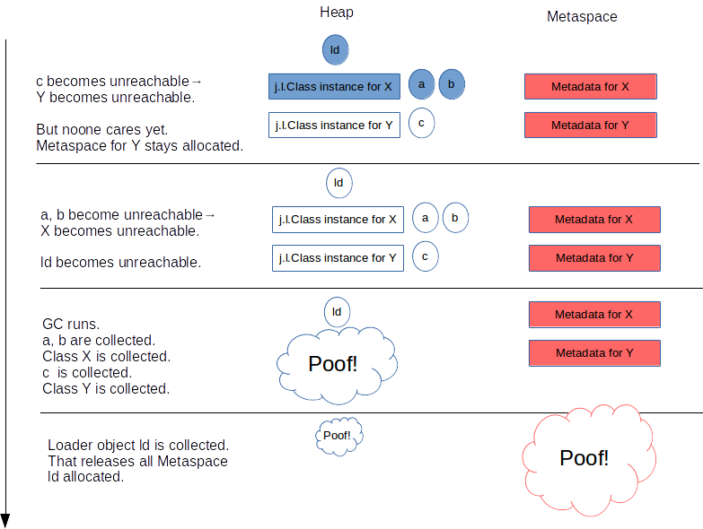

# Metaspace 架构
## 注意
1. 博主的博客不是描述的JDK8,可能涉及更高级的版本: 如 ClassLoaderMetaspace

---
## [什么是 Metaspace](https://stuefe.de/posts/metaspace/what-is-metaspace/)
&nbsp;&nbsp;Metaspace是VM用来存放class metadata的一块内存。Metaspace区域位于堆外，所以他的大小取决于系统内存，而不是堆的大小，我们可以指定MaxMetaspaceSize参数来限定他的最大内存.

&nbsp;&nbsp;Metaspace是用来存放class metadata的，class metadata 用于记录一个Java类在JVM中的信息，包括但不限于 [JVM class file format](https://docs.oracle.com/javase/specs/jvms/se8/html/jvms-4.html) 的运行时数据:  
  - Klass 结构，是VM内部对于Java Class的表示，包括 vtable(虚方法表) 和 itable(接口方法表)
  - Method metadata: class file中method_info在JVM运行时的等效信息，包含: 字节码，异常表，常量，参数信息
  - 常量池
  - 注解
  - 方法计数器，记录方法被执行的次数，用来辅助JIT决策

&nbsp;&nbsp;尽管java.lang.Class是驻留在java堆中的java对象，但类元数据本身不是java对象，也不在java堆中。它们位于Java堆之外的本机内存区域中。这个区域被称为元空间。

---
### [什么时候分配Metaspace空间](https://stuefe.de/posts/metaspace/what-is-metaspace/)
&nbsp;&nbsp;当一个类被加载时，他的类加载器会负责在Metaspace中分配空间用于存放这个类的元数据。
  + 由类加载器进行申请
  + 
  + - 如图，Id这个类加载器第一次加载类X 和 Y 的时候，在Metadata中为他们开辟空间存放元数据。

---
### [什么时候回收Metadata空间](https://javadoop.com/post/metaspace)
&nbsp;&nbsp;分配给一个类的空间，是归属于这个类的类加载器的，只有当这个类加载器卸载的时候，这个空间才会释放。
+ 所以，只有当这个类加载器加载的所有类都没有存活的对象，并且没有对于这些类和类加载器的引用时，相应的Metaspace空间才会释被GC释放。
+ 
+ - 如上图： 一个 Java 类在 Metaspace 中占用的空间，它是否释放，取决于这个类的类加载器是否被卸载。
+ - 翻译:
+ - 1. but noone cares yes: 但是现在没有人在乎
#### 内存通常会被保留
However, “releasing Metaspace” does not necessarilyadv. 必定，必然；必要地 mean that memory is returned to the OS.
 + 然而，“释放 metaspace” 并不一定意味着将内存返还给OS。

All or a part of that memory may be retainedv. 保留；保存（retain 的过去式形式） within the JVM; it may be reused for future class loading, but at the moment it remainsn.剩余物，残留物 unused within the JVM process.
 + "所有"或"部分" 内存会被JVM保存下来，之后获取被重新用于类加载，但是现在没有被JVM进程使用
  
How large that part is depends mainly on how fragmentedadj. 片断的；成碎片的;v. 分裂（fragment 的过去分词）；使成碎片 Metaspace has gotten - how tightlyadv. 紧紧地，牢固地，紧密地 interleaved交错 used and free portionsn.部分；v.将...分配 of the Metaspace are. Also, one part of Metaspace (Compressed Class Space) will not be returned to the OS at all.
 + 这部分被保留的空间有多大，取决于 Metaspace 的碎片化程度。另外，Metaspace 中有一部分区域 Compressed Class Space 是一定不会还给操作系统的。

### 配置Metaspace空间
&nbsp;&nbsp;有两个参数去限制Metaspace大小:
1. -XX:MaxMetaspaceSize determines the maximum committed size the Metaspace is allowed to grow. It is by default unlimited.
   + Metaspace 总空间的最大允许使用内存，默认是不限制。
2. -XX:CompressedClassSpaceSize determines the virtual size of one important portionn.一部分；v.分配 of the Metaspace, the Compressed Class Space. Its default value is 1G (note: reserved space, not committed)
   + CompressedClassSpaceSize 是决定Metaspace中最重要的部分:Compressed Class Spac 的虚拟大小,默认是1GB(虚拟大小，即预留空间还记得源码中的mmap吗?，并没有真正分配物理内存页.)

### Metaspce 和 GC
&nbsp;&nbsp;Metaspace只在GC运行并且卸载类加载器时才会释放，当然，在某些时候，需要主动触发GC来回收一些没用的class metadata，即使在这个时候对于堆空间来说还达不到GC条件:

&nbsp;&nbsp;Metaspace可能在两种情况下触发GC：
1. **分配空间时**: 虚拟机维护了一个阈值，如果metaspace的空间大小超过了这个阈值，那么在新空间分配时，虚拟机首先会通过收集可以卸载的类加载器来达到复用空间的目的，而不是扩大Metaspace的空间，这时候会触发GC。
2. **Metaspace OOM**：Metaspace 的总使用空间达到了 MaxMetaspaceSize 设置的阈值，或者 Compressed Class Space 被使用光了，如果这次 GC 真的通过卸载类加载器腾出了很多的空间，这很好，否则的话，我们会进入一个糟糕的 GC 周期，即使我们有足够的堆内存。

---
## Metaspace 架构
&nbsp;&nbsp;Metaspace 在实现上分为多层。最底层，负责向操作系统申请大块的内存；中间的一层，负责分出一小块一小块给每个类加载器；最顶层，类加载器负责把这些申请到的内存块用来存放 class metadata。
### 最底层 -- the space list
&nbsp;&nbsp;在最底层，JVM 通过 mmap(3) 接口向操作系统申请内存映射，在 64 位平台上，每次申请 2MB 空间。
> 这里的 2MB 不是真的就消耗了主存的 2MB，只有之后在使用的时候才会真的消耗内存。这里是虚拟内存映射。

&nbsp;&nbsp;每次申请的内存区域，放到一个VirtualSpaceList005.OpenJDK/001.openJdk8-b120/jdk-jdk8-b120/hotspot/src/share/vm/memory/metaspace.cpp#VirtualSpaceList,作为其中的一个Node.如下图: 
  - 
  - + 一个Node是2MB的空间，前面说了在使用的时候再向操作系统申请实际的内存，但是频繁的系统调用会降低性能，所以 Node 内部需要维护一个水位线，当 Node 内已使用内存快达到水位线的时候，向操作系统要新的内存页。并且相应地提高水位线。
  - + 直到一个 Node 被完全用完，会分配一个新的 Node，并且将其加入到链表中，老的 Node 就 “退休” 了。下图中，前面的三个 Node 就是退休状态了。
  - + 从一个 Node 中分配内存，每一块称为 MetaChunk，chunk 有三种规格，在 64 位系统中分别为 1K、4K、64K。

&nbsp;&nbsp;链表VirtualSpaceList和每个节点都是全局的，而Ｎode内部的一个个MetaChunk是分配给每个类加载器的。所以一个Node通常由分配给多个类加载器的chunks组成:如下图:
  - 
  - + 不同的chunk有不同的规格: 在 64 位系统中分别为 1K、4K、64K

&nbsp;&nbsp;当一个类加载器和它加载的所有的类都卸载的时候，它占用的 chunks 就会加入到一个全局的空闲列表中：如下图ChunkManager:
  - 

&nbsp;&nbsp;这些 chunks 会被复用：如果其他的类加载器加载新的类，它可能就会得到一个空闲列表中的 chunk，而不是去 Node 中申请一个新的 chunk.如下图:
  - 
  - + 如果刚好把整个 Node 都清空了，那么这整个 Node 的内存会直接还给操作系统

### 中间层--Metachunk
&nbsp;&nbsp;通常，一个类加载器在申请Metaspace空间用来存放metadata的时候，也就需要几十到几百字节，但是他会得到一个Metachunk,一个比要求的内存大的多的内存块。但为什么:
  - 从全局的 VirtualSpaceList 链表的 Node 中分配内存是昂贵的操作，需要加锁。我们不希望这个操作太频繁，所以一次性给一个大的 MetaChunk，以便于这个类加载器之后加载其他的类，这样就可以做到多个类加载器并发分配了。只有当这个 chunk 用完了，类加载器才需要又去 VirtualSpaceList 申请新的 chunk。

&nbsp;&nbsp;chunk有三个规格，那Metaspace的分配器怎么知道一个类加载器每次需要多个的chunk呢？这些都是基于猜测的:
- 通常，一个标准的类加载器在第一次申请空间时，会得到一个4K的chunk，知道他达到一个随意设置的阈值，此时分配器失去耐心，之后会一次性给他一个64K的大chunk。
- bootstrap classloader 是一个公认的会加载大量类的加载器，所以分配器会给它一个巨大的 chunk，一开始就会给它 4M。可以通过 InitialBootClassLoaderMetaspaceSize 进行调优。
- 反射类类加载器 (jdk.internal.reflect.DelegatingClassLoader) 和匿名类类加载器只会加载一个类，所以一开始只会给它们一个非常小的 chunk（1K），因为给它们太多就是一种浪费。
  
&nbsp;&nbsp;类加载器申请空间的时候，每次都给类加载器一个 chunk，这种优化，是建立在假设它们立马就会需要新的空间的基础上的。这种假设可能正确也可能错误，可能在拿到一个很大的 chunk 后，这个类加载器恰巧就不再需要加载新的类了。

### 最顶层 -- Metablock
&nbsp;&nbsp;在Metachunk上，有一个二级分配器(class-loader-local allocator),他将一个Metachunk分割成一个个小的单元，这些小的单元称为Metablock,他们是实际分配给每个调用者的。

&nbsp;&nbsp;class metadata 的生命周期是和类加载器绑定的，所以在类加载器卸载的时候，JVM可以大块大块的释放这些空间。

&nbsp;&nbsp; Metachunk 的结构：
  + 
  + - 这个 chunk 诞生的时候，它只有一个 header，之后的分配都只要在顶部进行分配就行。
  + - 由于这个 chunk 是归属于一个类加载器的，所以如果它不再加载新的类，那么 unused 空间就将真的浪费掉。

### ClassloaderData and ClassLoaderMetaspace
&nbsp;&nbsp;在JVM内部，一个类加载器以一个[ClassLoaderData](../../005.OpenJDK/001.openJdk8-b120/jdk-jdk8-b120/hotspot/src/share/vm/classfile/classLoaderData.hpp)结构标识，这个结构引用了一个[ClassLoaderMetaspace](http://hg.openjdk.java.net/jdk/jdk11/file/1ddf9a99e4ad/src/hotspot/share/memory/metaspace.hpp#l230)JDK11,JDK8使用MetaSpace结果，它维护了该类加载器使用的所有Metachunk.

&nbsp;&nbsp;当这个类加载器被卸载的时候，这个 ClassLoaderData 和 ClassLoaderMetaspace 会被删除。并且会将所有的这个加载器用到的 chunks 归还到空闲列表中。这部分内存是否可以直接归还给操作系统取决于是否满足其他条件，后面会介绍。
#### 匿名类
&nbsp;&nbsp;ClassloaderData != ClassLoaderMetaspace

&nbsp;&nbsp;“Metaspace 内存是属于类加载器的”，但是，这里其实撒了一个小谎，如果将匿名类考虑进去，那就更加复杂了：
 + **当类加载器加载一个匿名类时，这个类有自己独立的 ClassLoaderData，它的生命周期是跟随着这个匿名类的，而不是这个类加载器**（所以，和它相关的空间可以在类加载器卸载前得到释放）。所以，一个类加载器有一个主要的 ClassLoaderData 结构用来服务所有的正常的类，对于每一个匿名类，还有一个二级的 ClassLoaderData 结构来维护。
 +  - 这样做的目的之一，其实就是没有必要扩大大量的 Lambdas 和 method  handlers 在 Metaspace 中的空间的生命周期。如下图:
 +  - - 

#### 内存什么时候归还给OS
&nbsp;&nbsp;当一个 VirtualSpaceListNode 中的所有 chunk 都是空闲的时候，这个 Node 就会从链表 VirtualSpaceList 中移除，它的 chunks 也会从空闲列表中移除，这个 Node 就没有被使用了，会将其内存归还给操作系统。
  - 对于一个空闲的 Node 来说，拥有其上面的 chunks 的所有的类加载器必然都是被卸载了的。至于这个情况是否可能发生，主要就是取决于碎片化：
  - + 一个 Node 是 2M，chunks 的大小为 1K, 4K 或 64K，所以通常一个 Node 上有约 150-200 个 chunks，如果这些 chunks 全部由同一个类加载器拥有，回收这个类加载器就可以一次性回收这个 Node，并且把它的空间还给操作系统。
  - + 但是，如果这些 chunks 分配给不同的类加载器，每个类加载器都有不同的生命周期，那么什么都不会被释放。这也许就是在告诉我们，要小心对待大量的小的类加载器，如那些负责加载匿名类或反射类的加载器。
  - + 同时也要清楚，Metaspace 中的 Compressed Class Space 是永远不会将内存还给操作系统的
  
## Meta架构小结
1. 每次向操作系统申请 2M 的虚拟空间映射，放置到全局链表中，待需要使用的时候申请内存。(即虚拟内存映射)
2. 一个 Node 会分割为一个个的 chunks，分配给类加载器，一个 chunk 属于一个类加载器。
3. chunk 再细分为一个个 Metablock，这是分配给调用者的最小单元
4. 当一个类加载器被卸载，它占有的 chunks 会进入到空闲列表，以便复用，如果运气好的话，有可能会直接把内存归还给操作系统。

---
## Compressed Class Space
&nbsp;&nbsp;在 64 位平台上，HotSpot 使用了两个压缩优化技术，Compressed Object Pointers (“CompressedOops”) 和 Compressed Class Pointers

&nbsp;&nbsp;压缩指针，指的是在 64 位的机器上，使用 32 位的指针来访问数据（堆中的对象或 Metaspace 中的元数据）的一种方式。
  + 指针压缩的优势: 这样有很多的好处，比如 32 位的指针占用更小的内存，可以更好地使用缓存，在有些平台，还可以使用到更多的寄存器。

&nbsp;&nbsp;由于本文在描述的是 Metaspace，所以我们这里不关心 Compressed Object Pointers，下面将描述 Compressed Class Pointers： 每个 Java 对象，在它的头部，有一个引用指向 Metaspace 中的 Klass 结构。
  + 
---
## 附录
### 1. Class Metadata
&nbsp;&nbsp; Class Metadata 是java class 在JVM进程中(运行中)的表示形式,是JVM运行所需要的java class的任何基本信息.原文: Class metadata are the runtime representation of java classes within a JVM process - basically any information the JVM needs to work with a Java class

---
## 参考资料: 
1. [A blog about OpenJDK & JVM topics.](https://stuefe.de/)
2. [深入理解堆外内存 Metaspace](https://javadoop.com/post/metaspace)
3. [Oracle Docs](https://docs.oracle.com/javase/specs/jvms/se8/html/jvms-4.html)