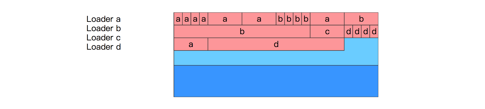

# Metaspace 架构
## 注意
1. 博主的博客不是描述的JDK8,可能涉及更高级的版本: 如 ClassLoaderMetaspace

---
## [什么是 Metaspace](https://stuefe.de/posts/metaspace/what-is-metaspace/)
&nbsp;&nbsp;Metaspace是VM用来存放class metadata的一块内存。Metaspace区域位于堆外，所以他的大小取决于系统内存，而不是堆的大小，我们可以指定MaxMetaspaceSize参数来限定他的最大内存.

&nbsp;&nbsp;Metaspace是用来存放class metadata的，class metadata 用于记录一个Java类在JVM中的信息，包括但不限于 [JVM class file format](https://docs.oracle.com/javase/specs/jvms/se8/html/jvms-4.html) 的运行时数据:  
  - Klass 结构，是VM内部对于Java Class的表示，包括 vtable(虚方法表) 和 itable(接口方法表)
  - Method metadata: class file中method_info在JVM运行时的等效信息，包含: 字节码，异常表，常量，参数信息
  - 常量池
  - 注解
  - 方法计数器，记录方法被执行的次数，用来辅助JIT决策

&nbsp;&nbsp;尽管java.lang.Class是驻留在java堆中的java对象，但类元数据本身不是java对象，也不在java堆中。它们位于Java堆之外的本机内存区域中。这个区域被称为元空间。

---
### [什么时候分配Metaspace空间](https://stuefe.de/posts/metaspace/what-is-metaspace/)
&nbsp;&nbsp;当一个类被加载时，他的类加载器会负责在Metaspace中分配空间用于存放这个类的元数据。
  + 由类加载器进行申请
  + 
  + - 如图，Id这个类加载器第一次加载类X 和 Y 的时候，在Metadata中为他们开辟空间存放元数据。

---
### [什么时候回收Metadata空间](https://javadoop.com/post/metaspace)
&nbsp;&nbsp;分配给一个类的空间，是归属于这个类的类加载器的，只有当这个类加载器卸载的时候，这个空间才会释放。
+ 所以，只有当这个类加载器加载的所有类都没有存活的对象，并且没有对于这些类和类加载器的引用时，相应的Metaspace空间才会释被GC释放。
+ 
+ - 如上图： 一个 Java 类在 Metaspace 中占用的空间，它是否释放，取决于这个类的类加载器是否被卸载。
+ - 翻译:
+ - 1. but noone cares yes: 但是现在没有人在乎
#### 内存通常会被保留
However, “releasing Metaspace” does not necessarilyadv. 必定，必然；必要地 mean that memory is returned to the OS.
 + 然而，“释放 metaspace” 并不一定意味着将内存返还给OS。

All or a part of that memory may be retainedv. 保留；保存（retain 的过去式形式） within the JVM; it may be reused for future class loading, but at the moment it remainsn.剩余物，残留物 unused within the JVM process.
 + "所有"或"部分" 内存会被JVM保存下来，之后获取被重新用于类加载，但是现在没有被JVM进程使用
  
How large that part is depends mainly on how fragmentedadj. 片断的；成碎片的;v. 分裂（fragment 的过去分词）；使成碎片 Metaspace has gotten - how tightlyadv. 紧紧地，牢固地，紧密地 interleaved交错 used and free portionsn.部分；v.将...分配 of the Metaspace are. Also, one part of Metaspace (Compressed Class Space) will not be returned to the OS at all.
 + 这部分被保留的空间有多大，取决于 Metaspace 的碎片化程度。另外，Metaspace 中有一部分区域 Compressed Class Space 是一定不会还给操作系统的。

### 配置Metaspace空间
&nbsp;&nbsp;有两个参数去限制Metaspace大小:
1. -XX:MaxMetaspaceSize determines the maximum committed size the Metaspace is allowed to grow. It is by default unlimited.
   + Metaspace 总空间的最大允许使用内存，默认是不限制。
2. -XX:CompressedClassSpaceSize determines the virtual size of one important portionn.一部分；v.分配 of the Metaspace, the Compressed Class Space. Its default value is 1G (note: reserved space, not committed)
   + CompressedClassSpaceSize 是决定Metaspace中最重要的部分:Compressed Class Spac 的虚拟大小,默认是1GB(虚拟大小，即预留空间还记得源码中的mmap吗?，并没有真正分配物理内存页.)

### Metaspce 和 GC
&nbsp;&nbsp;Metaspace只在GC运行并且卸载类加载器时才会释放，当然，在某些时候，需要主动触发GC来回收一些没用的class metadata，即使在这个时候对于堆空间来说还达不到GC条件:

&nbsp;&nbsp;Metaspace可能在两种情况下触发GC：
1. **分配空间时**: 虚拟机维护了一个阈值，如果metaspace的空间大小超过了这个阈值，那么在新空间分配时，虚拟机首先会通过收集可以卸载的类加载器来达到复用空间的目的，而不是扩大Metaspace的空间，这时候会触发GC。
2. **Metaspace OOM**：Metaspace 的总使用空间达到了 MaxMetaspaceSize 设置的阈值，或者 Compressed Class Space 被使用光了，如果这次 GC 真的通过卸载类加载器腾出了很多的空间，这很好，否则的话，我们会进入一个糟糕的 GC 周期，即使我们有足够的堆内存。

---
## Metaspace 架构
&nbsp;&nbsp;Metaspace 在实现上分为多层。最底层，负责向操作系统申请大块的内存；中间的一层，负责分出一小块一小块给每个类加载器；最顶层，类加载器负责把这些申请到的内存块用来存放 class metadata。
### 最底层 -- the space list
&nbsp;&nbsp;在最底层，JVM 通过 mmap(3) 接口向操作系统申请内存映射，在 64 位平台上，每次申请 2MB 空间。
> 这里的 2MB 不是真的就消耗了主存的 2MB，只有之后在使用的时候才会真的消耗内存。这里是虚拟内存映射。

&nbsp;&nbsp;每次申请的内存区域，放到一个VirtualSpaceList005.OpenJDK/001.openJdk8-b120/jdk-jdk8-b120/hotspot/src/share/vm/memory/metaspace.cpp#VirtualSpaceList,作为其中的一个Node.如下图: 
  - 
  - + 一个Node是2MB的空间，前面说了在使用的时候再向操作系统申请实际的内存，但是频繁的系统调用会降低性能，所以 Node 内部需要维护一个水位线，当 Node 内已使用内存快达到水位线的时候，向操作系统要新的内存页。并且相应地提高水位线。
  - + 直到一个 Node 被完全用完，会分配一个新的 Node，并且将其加入到链表中，老的 Node 就 “退休” 了。下图中，前面的三个 Node 就是退休状态了。
  - + 从一个 Node 中分配内存，每一块称为 MetaChunk，chunk 有三种规格，在 64 位系统中分别为 1K、4K、64K。

&nbsp;&nbsp;链表VirtualSpaceList和每个节点都是全局的，而Ｎode内部的一个个MetaChunk是分配给每个类加载器的。所以一个Node通常由分配给多个类加载器的chunks组成:如下图:
  - 
  - + 不同的chunk有不同的规格: 在 64 位系统中分别为 1K、4K、64K

&nbsp;&nbsp;当一个类加载器和它加载的所有的类都卸载的时候，它占用的 chunks 就会加入到一个全局的空闲列表中：如下图ChunkManager:
  - 

&nbsp;&nbsp;这些 chunks 会被复用：如果其他的类加载器加载新的类，它可能就会得到一个空闲列表中的 chunk，而不是去 Node 中申请一个新的 chunk.如下图:
  - 
  - + 如果刚好把整个 Node 都清空了，那么这整个 Node 的内存会直接还给操作系统

### 中间层--Metachunk
&nbsp;&nbsp;通常，一个类加载器在申请Metaspace空间用来存放metadata的时候，也就需要几十到几百字节，但是他会得到一个Metachunk,一个比要求的内存大的多的内存块。但为什么:
  - 从全局的 VirtualSpaceList 链表的 Node 中分配内存是昂贵的操作，需要加锁。我们不希望这个操作太频繁，所以一次性给一个大的 MetaChunk，以便于这个类加载器之后加载其他的类，这样就可以做到多个类加载器并发分配了。只有当这个 chunk 用完了，类加载器才需要又去 VirtualSpaceList 申请新的 chunk。

&nbsp;&nbsp;chunk有三个规格，那Metaspace的分配器怎么知道一个类加载器每次需要多个的chunk呢？这些都是基于猜测的:
- 通常，一个标准的类加载器在第一次申请空间时，会得到一个4K的chunk，知道他达到一个随意设置的阈值，此时分配器失去耐心，之后会一次性给他一个64K的大chunk。
- bootstrap classloader 是一个公认的会加载大量类的加载器，所以分配器会给它一个巨大的 chunk，一开始就会给它 4M。可以通过 InitialBootClassLoaderMetaspaceSize 进行调优。
- 反射类类加载器 (jdk.internal.reflect.DelegatingClassLoader) 和匿名类类加载器只会加载一个类，所以一开始只会给它们一个非常小的 chunk（1K），因为给它们太多就是一种浪费。
  
&nbsp;&nbsp;类加载器申请空间的时候，每次都给类加载器一个 chunk，这种优化，是建立在假设它们立马就会需要新的空间的基础上的。这种假设可能正确也可能错误，可能在拿到一个很大的 chunk 后，这个类加载器恰巧就不再需要加载新的类了。

### 最顶层 -- Metablock
&nbsp;&nbsp;在Metachunk上，有一个二级分配器(class-loader-local allocator),他将一个Metachunk分割成一个个小的单元，这些小的单元称为Metablock,他们是实际分配给每个调用者的。

&nbsp;&nbsp;class metadata 的生命周期是和类加载器绑定的，所以在类加载器卸载的时候，JVM可以大块大块的释放这些空间。

&nbsp;&nbsp; Metachunk 的结构：
  + 
  + - 这个 chunk 诞生的时候，它只有一个 header，之后的分配都只要在顶部进行分配就行。
  + - 由于这个 chunk 是归属于一个类加载器的，所以如果它不再加载新的类，那么 unused 空间就将真的浪费掉。

### ClassloaderData and ClassLoaderMetaspace
&nbsp;&nbsp;在JVM内部，一个类加载器以一个[ClassLoaderData](../../005.OpenJDK/001.openJdk8-b120/jdk-jdk8-b120/hotspot/src/share/vm/classfile/classLoaderData.hpp)结构标识，这个结构引用了一个[ClassLoaderMetaspace](http://hg.openjdk.java.net/jdk/jdk11/file/1ddf9a99e4ad/src/hotspot/share/memory/metaspace.hpp#l230)JDK11,JDK8使用MetaSpace结果，它维护了该类加载器使用的所有Metachunk.

&nbsp;&nbsp;当这个类加载器被卸载的时候，这个 ClassLoaderData 和 ClassLoaderMetaspace 会被删除。并且会将所有的这个加载器用到的 chunks 归还到空闲列表中。这部分内存是否可以直接归还给操作系统取决于是否满足其他条件，后面会介绍。
#### 匿名类
&nbsp;&nbsp;ClassloaderData != ClassLoaderMetaspace

&nbsp;&nbsp;“Metaspace 内存是属于类加载器的”，但是，这里其实撒了一个小谎，如果将匿名类考虑进去，那就更加复杂了：
 + **当类加载器加载一个匿名类时，这个类有自己独立的 ClassLoaderData，它的生命周期是跟随着这个匿名类的，而不是这个类加载器**（所以，和它相关的空间可以在类加载器卸载前得到释放）。所以，一个类加载器有一个主要的 ClassLoaderData 结构用来服务所有的正常的类，对于每一个匿名类，还有一个二级的 ClassLoaderData 结构来维护。
 +  - 这样做的目的之一，其实就是没有必要扩大大量的 Lambdas 和 method  handlers 在 Metaspace 中的空间的生命周期。如下图:
 +  - - 

#### 内存什么时候归还给OS
&nbsp;&nbsp;当一个 VirtualSpaceListNode 中的所有 chunk 都是空闲的时候，这个 Node 就会从链表 VirtualSpaceList 中移除，它的 chunks 也会从空闲列表中移除，这个 Node 就没有被使用了，会将其内存归还给操作系统。
  - 对于一个空闲的 Node 来说，拥有其上面的 chunks 的所有的类加载器必然都是被卸载了的。至于这个情况是否可能发生，主要就是取决于碎片化：
  - + 一个 Node 是 2M，chunks 的大小为 1K, 4K 或 64K，所以通常一个 Node 上有约 150-200 个 chunks，如果这些 chunks 全部由同一个类加载器拥有，回收这个类加载器就可以一次性回收这个 Node，并且把它的空间还给操作系统。
  - + 但是，如果这些 chunks 分配给不同的类加载器，每个类加载器都有不同的生命周期，那么什么都不会被释放。这也许就是在告诉我们，要小心对待大量的小的类加载器，如那些负责加载匿名类或反射类的加载器。
  - + 同时也要清楚，Metaspace 中的 Compressed Class Space 是永远不会将内存还给操作系统的
  
## Meta架构小结
1. 每次向操作系统申请 2M 的虚拟空间映射，放置到全局链表中，待需要使用的时候申请内存。(即虚拟内存映射)
2. 一个 Node 会分割为一个个的 chunks，分配给类加载器，一个 chunk 属于一个类加载器。
3. chunk 再细分为一个个 Metablock，这是分配给调用者的最小单元
4. 当一个类加载器被卸载，它占有的 chunks 会进入到空闲列表，以便复用，如果运气好的话，有可能会直接把内存归还给操作系统。

---
## Compressed Class Space
&nbsp;&nbsp;在 64 位平台上，HotSpot 使用了两个压缩优化技术，Compressed Object Pointers (“CompressedOops”) 和 Compressed Class Pointers

&nbsp;&nbsp;压缩指针，指的是在 64 位的机器上，使用 32 位的指针来访问数据（堆中的对象或 Metaspace 中的元数据）的一种方式。
  + 指针压缩的优势: 这样有很多的好处，比如 32 位的指针占用更小的内存，可以更好地使用缓存，在有些平台，还可以使用到更多的寄存器。

&nbsp;&nbsp;由于本文在描述的是 Metaspace，所以我们这里不关心 Compressed Object Pointers，下面将描述 Compressed Class Pointers： 每个 Java 对象，在它的头部，有一个引用指向 Metaspace 中的 Klass 结构。
  + 

&nbsp;&nbsp;当使用了compressed class pointers,这个引用是32位的值，为了找到真正的64位地址，需要加上一个base值:
  + 
  + - 这项技术对 Klass 的分配带来的问题是：由于 32 位地址只能访问到 4G 的空间，所以最大只允许 4G 的 Klass 地址。这项限制也意味着，JVM 需要向 Metaspace 分配一个连续的地址空间。
       + 因为定位的方式，所以得分配一块连续的地址空间
       + - 当从系统申请内存时，通过调用系统接口 malloc(3) 或 mmap(3)，操作系统可能返回任意一个地址值，所以在 64位系统中，它并不能保证在 4G 的范围内。
       + -  + 所以，我们只能用一个 mmap() 来申请一个区域单独用来存放 Klass 对象。我们需要提前知道这个区域的大小，而且不能超过 4G。显然，这种方式是不能扩展的，因为这个地址后面的内存可能是被占用的。
       + 只有 Klass 结构有这个限制，对于其他的 class metadata 没有这个必要: 因为只有 Klass 实例是通过 Java 对象 header  中的压缩指针访问的。其他的 metadata 都是通过 64 位的地址进行访问的，所以它们可以被放到任意的地址上。

&nbsp;&nbsp;因此，将Metaspace氛围两个区域： non-class part 和 class part
+ **class part**: 存放Klass对象，需要一个连续的不超过4G的内存空间
    - class part 被称作 Compressed Class Space，这个名字会有点怪，因为 Klass 本身其实没有使用压缩技术，而是引用它们的指针被压缩了。
    - compressed class space 空间的大小，是通过 -XX:CompressedClassSpaceSize 指定的。默认值是 1G。当然这个 1G 并不是真的使用了操作系统的 1G，而是虚拟地址映射
+ **non-class part**: 包含其他所有的metadata

### Compressed Class Space实现
&nbsp;&nbsp;为了复用已有的Metaspace空间，使用了一个小技巧： 在Class space 和 non-Class Space中，分别都有VirtualSpaceList和Chunkmanager两个结构.但是对于 Class Space , 既然需要一个连续的空间，那么就不能使用一个链表来存放所有的Node，所以这个链表退化为只有一个节点，并且不能拓展。这个Node就是Compressed class space。如下图:
 - 
 - + ClassLoaderMetaspace（记录当前类加载器持有哪些 chunks）需要两个链表，一个用于记录 Class Space 中的 chunks，一个用于记录 Non-Class Space 中的 chunks。

### 度量 Metaspace
&nbsp;&nbsp;MaxMetaspaceSize 和 CompressedClassSpaceSize 是控制 Metaspace 的两个配置。
- MaxMetaspaceSize: 最大允许 Metaspace 使用的内存，包括 Class Space 和 Non-Class Space，默认是不限制
- CompressedClassSpaceSize: 在启动的时候就限制 Class Space 的大小，默认值是 1G，启动后不可以修改。再说一遍，它是 reserved 不是 committed 的内存

&nbsp;&nbsp;工作原理: 
  - 
  - + 红色部分是 Metaspace 中已使用的系统内存，包括 Non-Class Space 链表中的红色部分和 Class Space 中大 Node 的红色部分。这个总和受到 -XX:MaxMetaspaceSize 的限制，超出将抛出 OutOfMemoryError(“Metaspace”)。
  - + -XX:CompressedClassSpaceSize 限制了下方的 Class Space 中，这个大 Node 的大小，包括了红色已使用的内存和蓝色未使用的内存。如果这个 Node 被用完了，会抛出 OutOfMemoryError(“Compressed Class Space”)。

#### 所以这意味着什么？
&nbsp;&nbsp;当一个 Java 类被加载后，它需要 Non-Class Space 和 Class Space 的空间，而且后者通常都是被限制的(默认 1G)，所以我们总是有那么一个上限存在，即使 -XX:MaxMetaspaceSize 没有配置。

&nbsp;&nbsp;所以，是否会触及到这个上限，取决于 Non-Class Space 和 Class Space 的使用比例。

&nbsp;&nbsp;对于每个类，我们假设这个比例是 1: 5 （class:non-class） 。这意味着，对于 -XX:CompressedClassSpaceSize 的 1G 的默认值，我们的上限约 6G，1G 的 Class Space 再加约 5G 的 Non-Class Space。

#### 一个类大概需要多大的Metaspace空间
&nbsp;&nbsp;对于一个被加载到虚拟机中的类，Metaspace 需要分配 class 和 non-class 空间，那么这些空间花在哪里了呢？如下图:
- 
  
#### 深入Class Space
1. 最大的一部分是Klass结构，他是固定大小的。
2. 然后紧跟着两个可变大小的vtable 和 itable，前者由类中方法的数量决定，后者由这个类所实现的接口的方法数量决定。
3. 随后是一个map,记录类中引用的Java对象的地址(non-static oop map 描述的是成员对象的引用在Java Class中的位置:即记录了在该类型的对象内什么偏移量上是什么类型的数据)，尽管该结构一般很小，但是也是可变的。

&nbsp;&nbsp;vtable 和 itable 通常也很小，但是对于一些巨大的类，它们也可以很大，一个有 30000 个方法的类，vtable 的大小会达到 240k，如果类派生自一个拥有 30000 个方法的接口，也是同理。但是这些都是测试案例，除了自动生成代码，你从来不会看到这样的类。

#### 深入Non-Class Space
&nbsp;&nbsp;这个区域有很多的东西，下面这些占用了最多的空间：
1. 常量池，可变大小；
2. 每个成员方法的 metadata：ConstMethod 结构，包含了好几个可变大小的内部结构，如方法字节码、局部变量表、异常表、参数信息、方法签名等；
3. 运行时数据，用来控制 JIT 的行为；
4. 注解
   
> Metaspace 中的结构都继承自 MetaspaceObj，所以查看它的类继承结构能了解更详细的信息。

#### Class Space 与 Non-Class Space比例
&nbsp;&nbsp;下面是 WildFly 应用服务器，16.0.0，运行在 SAPMachine 11 平台上，没有加载任何应用。我们检查下总共需要多少 Metaspace 空间，然后计算平均每个类所需要的空间。我们使用  jcmd VM.metaspace 进行度量。

|loader|#classes|non-class space (avg per class)|class space (/avg per class)|ratio non-class/class|
|---|---|---|---|---|
|all|11503|60381k (5.25k)|9957k (0.86k)	|6.0 : 1|
|bootstrap|2819|16720k (5.93k)|1768k (0.62k)|9.5 : 1|
|app|185|1320k (7.13k)|136k (0.74k)|9.7 : 1|
|anonymous|869|1013k (1.16k)|475k (0.55k)|2.1 : 1|

  + 基于上面的表，可以大致得出如下结论:
  + 1. 对于正常的类（我们假设通过 bootstrap 和 app 加载的类是正常的），我可以得到平均每个类需要约 5-7k 的 Non-Class Space 和 600-900 bytes 的 Class Space。
  + 2. 匿名类要小得多，但是也有一个有趣的事情，Class 和 Non-Class Space 之间的比例，相对的，我们需要更多的 Class Space。这也不奇怪，因为诸如 Lambda 类都是很小的，但是它的 Klass 结构不可能小于 sizeof(Klass)。所以，我们得到 1k Non-Class Space 和 0.5k Class Space。

### Metaspace 默认大小
&nbsp;&nbsp;如果我们完全不设置Metaspace的大小，那么Metaspace可以容纳多少类呢?
1. MaxMetaspaceSize 默认是没有限制的，CompressedClassSpaceSize 默认是 1G，所以我们唯一会触碰到的是 Class Space 空间的上限。
2. 使用上面的数据，每个类约 5-7k 的 Non-Class Space 和 600-900 bytes 的 Class Space，我们可以估算出大约 1-1.5 百万的类（假设没有碎片、没有浪费）以后会触碰到 Class Space 的 OOM。这是一个很大的数值了。

### 限制Metaspace
#### 为什么要限制Metaspace? (Metaspace 应该设置为多大?)
+ 告警系统需要知道，为什么 Metaspace 空间以一个异常的速度在消耗，需要有人去看一下发生了什么。
+ 有时候需要限制虚拟内存地址的大小。通常我们感兴趣的是实际消耗内存，但是虚拟内存大小可能会导致虚拟机进程达到系统限制。

> 注意：JDK 版本依赖：与 JDK 11或更高版本相比，JDK 8 中的元空间受到碎片的影响更大。所以在 JDK 8 环境下分配的时候，需要设置更多的缓冲。

&nbsp;&nbsp;如果要限制 Metaspace 大小使得系统更容易被监控，同时不用在乎虚拟地址空间的大小，那么最好只设置 MaxMetaspaceSize 而不用设置 CompressedClassSpaceSize。如果要单独设置，那么最好设置 CompressedClassSpaceSize 为 MaxMetaspaceSize 的 80% 左右.这可能过分了，但注意，这里的Compressed Class space只是预留的内存，并不是实际使用的内存

&nbsp;&nbsp;除了 MaxMetaspaceSize 之外，减小 CompressedClassSpaceSize 的唯一原因是减小虚拟机进程的虚拟内存大小。 但是，如果将 CompressedClassSpaceSize 设置得太低，则可能在用完 MaxMetaspaceSize 之前先用完了 Compressed Class Space。 在大多数情况下，比率为1：2（CompressedClassSpaceSize = MaxMetaspaceSize / 2）应该是安全的

&nbsp;&nbsp;那么，你应该将 MaxMetaspaceSize 设置为多大呢？ 首先应该是计算预期的 Metaspace 使用量。你可以使用上面给出的数字，然后给每个类约 1K 的 Class Space 和 3~8K 的 Non-Class Space 作为缓冲。

&nbsp;&nbsp;因此，如果你的应用程序计划加载10000个类，那么从理论上讲，你只需要 10M 的 Class Space 和 80M Non-Class Space。

&nbsp;&nbsp;然后，你需要考虑安全系数。在大多数情况下，因子 2 是比较安全的。你当然也可以碰运气，设置低一点，但是要做好在碰到 OOM 后调大 Metaspace 空间的准备。

&nbsp;&nbsp;如果设置安全因子为 2，那么需要 20M 的 Class Space 和 160M 的 Non-Class Space，也就是总大小为 180M。因此，在这里 -XX:MaxMetaspaceSize=180M 是一个很好的选择。

---
## 附录
### 1. Class Metadata
&nbsp;&nbsp; Class Metadata 是java class 在JVM进程中(运行中)的表示形式,是JVM运行所需要的java class的任何基本信息.原文: Class metadata are the runtime representation of java classes within a JVM process - basically any information the JVM needs to work with a Java class

---
## 参考资料
1. [A blog about OpenJDK & JVM topics.](https://stuefe.de/)
2. [深入理解堆外内存 Metaspace](https://javadoop.com/post/metaspace)
3. [Oracle Docs](https://docs.oracle.com/javase/specs/jvms/se8/html/jvms-4.html)