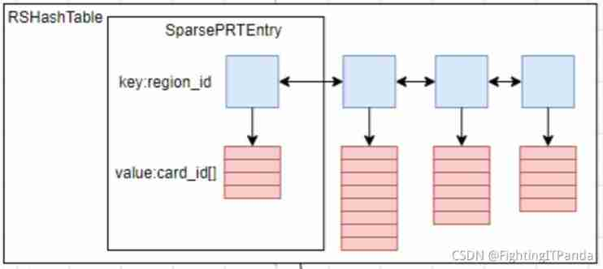
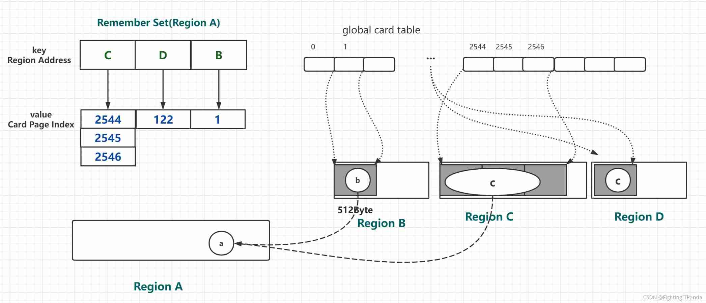
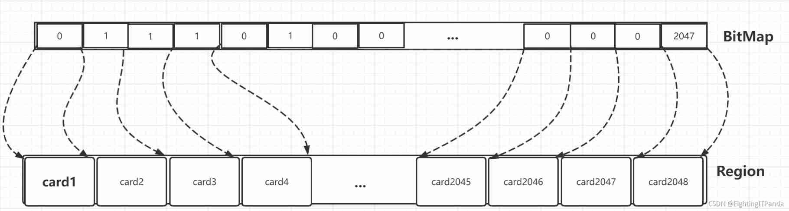

# Garbage-First之RSet
&nbsp;&nbsp;RSet 是一个抽象概念，记录对象在不同代际之间的引用关系，目的是加速垃圾回收的速度。

## 背景
&nbsp;&nbsp;如何加速回收速度: JVM使用的是跟对象引用的收集算法，即从根集合出发，标记所有存活的对象，然后遍历对象的每一个成员变量并继续标记，知道所有的对象标记完毕。 但是在垃圾回收中，新生代和老年代处于不同的回收阶段，如果还是采用这样的标记方法，不合理也没有必要。如仅回收新生代，如果标记时把老生代的活跃对象全部标记，但回收时并没有回收老年代，则浪费了时间。同样的，在回收老年代时，当且仅当进行FGC时，才需要对内存进行全部标记。
> 在进行GC时，控制GC Roots的数量，避免做了无用功而造成时间的浪费。

## RSet
&nbsp;&nbsp;为了对这种情况进行优化，JVM引入了RSet,用于记录从非收集部分指向收集部分的指针的集合，而这个集合描述的就是对象的引用关系。

### Garbage-First中有哪些引用关系·5种

|引用关系|是否需要记录|为什么(YR:Young Hegion;OR:Old Region)|
|---|---|---|
|Region内部引用|不需要|回收是针对一个分区的，即这个分区要么被回收，要么不回收。如果回收，则会遍历整个分区。|
|YR -> YR|不需要|G1的YGC/Mixed GC/FGC回收算法都会全量处理新生代分区，他们都会被遍历，因此无须记录|
|YR -> OR|不需要|G1中的YGC针对的是新生代，无须知道这个引用关系；Mixed GC时，G1会使用新生代分区作为根，那么遍历新生代分区时自然能够找到新生代分区到老年代分区的引用，所以无须记录。|
|OR -> YR|需要|在YGC时有两种根: 一个就是栈空间/全局变量的引用；一个是老生代分区的引用。|
|OR -> OR|需要|在Mixed GC时可能只有部分分区被回收|

&nbsp;&nbsp;即是否需要记录，即在回收的时候是否会存在 ”从非收集部分指向收集部分的指针“ 

### 引用记录的方法
  ```txt
     ObjA.fieldA = ObjB;
  ```
&nbsp;&nbsp;如上伪代码，通常有两种引用记录方法：
1. Point Out: 会在ObjA的RSet中记录ObjB的地址;
   > 引用了谁

   > Point Out记录简单，但是需要对RSet做全部扫描；

2. Point In: 会在ObjB的RSet中记录ObjA的地址;(G1的选择)
   > 被谁引用了

   > Point In 有个问题，即谁都可以引用我，这就可能导致我对应的RSet急剧膨胀，这样记录引用的空间就太大了。

   > Point In记录操作复杂，但是在标记扫描时可以直接找到有用和无用的对象，不需要进行额外的扫描，因为RSet中的对象可以看作为根对象。

## Garbage-First中RSet实现
&nbsp;&nbsp;G1中使用了Point In的记录方式，定义了一种新的数据结构PRT(Per Region Table)来记录这种变化。每个HeapRegion都包含了一个PRT,OtherRegionTable<sub>HeapRegion->HeapRegionRemSet->OtherRegionsTable</sub>就是所谓的PRT

&nbsp;&nbsp;为了提高RSet的存储效率以及节约内存，PRT使用了三种数据结构来动态存储引用关系(不同的数据结构，存储的粒度不同),源码如下:
```c
   // 005.OpenJDK/002.OpenJDK8u312-GA/OpenJDK8U312-GA/hotspot/src/share/vm/gc_implementation/g1/heapRegionRemSet.hpp
   class OtherRegionsTable VALUE_OBJ_CLASS_SPEC {
    // ......
     
      /**
       *  粗粒度位图
       */
      BitMap _coarse_map;
      
      /**
       * 细粒度PTR
       */
      PerRegionTable** _fine_grain_regions;
    
      /**
       * 稀疏哈希表
       */
      SparsePRT _sparse_table;

       // ......
   }
```
### Card Table · 卡表
&nbsp;&nbsp;以下会将到卡表，关于卡表，请参考:[004.OpenJDK(JVM)学习/009.GC/020.记忆集-概念(Card-Table).md](../../../004.OpenJDK(JVM)学习/009.GC/020.记忆集-概念(Card-Table).md)

#### G1中，卡表和RSet的关系
&nbsp;&nbsp;RSet全称是Remembered Set，是辅助GC过程的一种结构，典型的空间换时间工具，和Card Table有些类似。还有一种数据结构也是辅助GC的：Collection Set（CSet），它记录了GC要收集的Region集合，集合里的Region可以是任意年代的。在GC的时候，对于old->young和old->old的跨代对象引用，只要扫描对应的CSet中的RSet即可。 逻辑上说每个Region都有一个RSet，RSet记录了其他Region中的对象引用本Region中对象的关系，属于points-into结构（谁引用了我的对象）。而Card Table则是一种points-out（我引用了谁的对象）的结构，每个Card 覆盖一定范围的Heap（一般为512Bytes）。G1的RSet是在Card Table的基础上实现的：每个Region会记录下别的Region有指向自己的指针，并标记这些指针分别在哪些Card的范围内。 <font color="gray">**这个RSet其实是一个Hash Table，Key是别的Region的起始地址，Value是一个集合，里面的元素是Card Table的Index。**</font>

&nbsp;&nbsp;下图表示了RSet、Card和Region的关系:
> 

&nbsp;&nbsp;上图中有三个Region，每个Region被分成了多个Card，在不同Region中的Card会相互引用，Region1中的Card中的对象引用了Region2中的Card中的对象，蓝色实线表示的就是points-out的关系，而在Region2的RSet中，记录了Region1的Card，即红色虚线表示的关系，这就是points-into。 而维系RSet中的引用关系靠post-write barrier和Concurrent refinement threads来维护，操作伪代码如下
  ```c
     void oop_field_store(oop* field, oop new_value) {
         pre_write_barrier(field);             // pre-write barrier: for maintaining SATB invariant
         *field = new_value;                   // the actual store
         post_write_barrier(field, new_value); // post-write barrier: for tracking cross-region reference
      }
  ```

&nbsp;&nbsp;<font color="red">**post-write barrier记录了跨Region的引用更新，更新日志缓冲区则记录了那些包含更新引用的Cards。一旦缓冲区（DCQS，Dirty Card Queue Set）满了，Post-write barrier就停止服务了，会由Concurrent refinement threads处理这些缓冲区日志。<sup>Refine 线程工作内容之一</sup>**</font> RSet究竟是怎么辅助GC的呢？在做YGC的时候，只需要选定young generation region的RSet作为根集，这些RSet记录了old->young的跨代引用，避免了扫描整个old generation。 而mixed gc的时候，old generation中记录了old->old的RSet，young->old的引用由扫描全部young generation region得到，这样也不用扫描全部old generation region。所以RSet的引入大大减少了GC的工作量。

---

### 稀疏表·SparsePRT
&nbsp;&nbsp;稀疏表，通过哈希表方式来存储。默认长度：4，数据结构以及源码如下
```c
    /**
     * K: region address · 引用对象所在Region的地址，即得知道是哪个Region引用了我
     * V: card page index array · 引用对象所在内存位置对应的Card Table中Card的索引数组: 此时的索引值是全局Card Table级别的 
     */
    // 源码 · SparsePRTEntry
   class SparsePRTEntry: public CHeapObj<mtGC> {
     // ...
    private:
     RegionIdx_t _region_ind; // Region 索引,表示某一个Region
     int         _next_index;
     CardIdx_t   _cards[1]; // 全局Card Table的索引值
     // ...
   };
```

#### 稀疏表·SparsePRT示意图
- 
- 

- B、C、D分区中的对象b、c、d都引用了分区A中的a对象，使用Point In方式记录，所以Region A的RSet会记录这三个引用情况.
- K分别记录B、C、D分区地址；
- V分别记录b、c、d对应全局Card Table的index.
- c对象比较大，占3个card page,所以V是数组类型，存放index的值.

#### 有了"稀疏表"，为什么还需要"细粒度表"
&nbsp;&nbsp;稀疏表的结构记录了引用对象在哪个分区，分区中的哪个Card上。为什么还要设计细粒度、粗粒度PRT结构呢? · 原因: 内存利用率

&nbsp;&nbsp;以上图举例，当前a对象有三个引用，RSet记录情况:
1. Region B -> [1]
2. Region C -> [122]
3. Region D -> [2544,2545,2546]

&nbsp;&nbsp;<font color="red">**辅助数据结构占用内存太大**</font>: 一个整型占4Byte，当前RSet开销已经>32Byte，当引用逐渐增多，RSet占用的内存空间就太大了，要知道RSet并不是对象本身的数据，开销太大得不偿失了。。

### 细粒度表·PerRegionTable
&nbsp;&nbsp; 基于"稀疏表·SparsePRT"带来的性能问题，G1将哈希表的默认长度设置为4,当引用Region数超过4个，就会使用细粒度表来存储引用关系。

&nbsp;&nbsp; 细粒度表·PerRegionTable 使用更小的单位来映射Card：使用位图来映射卡表。

&nbsp;&nbsp; 使用位图来映射卡表，中心思想：使用更小的空间来表示引用情况。 即：
- 一个Bit代表一个card(512Byte)
   + 0代表这个卡表中对象没有引用
   + 1表示有引用

#### 细粒度表·PerRegionTable·示意图
- 

&nbsp;&nbsp;如上图，每一个Bit代表的是这个Heap Region 中某个512Byte的内存区域，如果需要映射到全局Card Table中，则需要借助该Heap Region的起始地址。也是因为这个原因，所以
+ 细粒度表 = HeapRegion指针（也就是HeapRegion起始位置）+ 位图 

#### 源码定义
```c
      class PerRegionTable: public CHeapObj<mtGC> {
       // ...
         HeapRegion*     _hr; // HeapRegion指针
         BitMap          _bm; // 位图
         jint            _occupied; // 引用数量
       // ...
      }
```
#### 此时，RSet存储情况
&nbsp;&nbsp;Region A 的RSet 存储情况就是：
- region B-> bitmap （01000…）
- region D-> bitmap (000…1000…)
- region C -> bitmap (000…111000…)
- 用位图的1代表这个Region的这个card里有对象引用了我的Region中对象

### 粗粒度位图·BitMap
&nbsp;&nbsp; 太多Region都有对象引用我，那么我的PRT记录数一直膨胀。因此，G1设置了阈值，达到阈值时会继续”粒度降级“。
- 此时位图的0和1表示Region而不是Card，即粒度更粗了

&nbsp;&nbsp;结构定义&&源码
```c
   // 005.OpenJDK/002.OpenJDK8u312-GA/OpenJDK8U312-GA/hotspot/src/share/vm/gc_implementation/g1/heapRegionRemSet.hpp
   class OtherRegionsTable VALUE_OBJ_CLASS_SPEC {
    // ......
     
      /**
       *  粗粒度位图
       */
      BitMap _coarse_map;

       // ......
   }
```
&nbsp;&nbsp;RSet记录一张位图信息：
- 示例：（000100100001）
  + 位图中三个1分表代表RegionB,RegionC,RegionD引用了RegionA

---
## 开发选项
```c
   // 005.OpenJDK/002.OpenJDK8u312-GA/OpenJDK8U312-GA/hotspot/src/share/vm/gc_implementation/g1/g1_globals.hpp
     develop(bool, G1RecordHRRSOops,true,                    \
          "When true, record recent calls to rem set operations.")

     develop(bool, G1HRRSUseSparseTable, true,               \
          "When true, use sparse table to save space.")

     develop(bool, G1TraceHeapRegionRememberedSet,true,      \
          "Enables heap region remembered set debug logs")  
```

----
## 参考资料
1. [Panda 白话 - G1垃圾收集器 之 RSet(Remembed Set)源码解读](https://chowdera.com/2021/12/202112171225335245.html)
2. 《JVM G1源码分析与调优》
3. [Java Hotspot G1 GC的一些关键技术](https://tech.meituan.com/2016/09/23/g1.html)