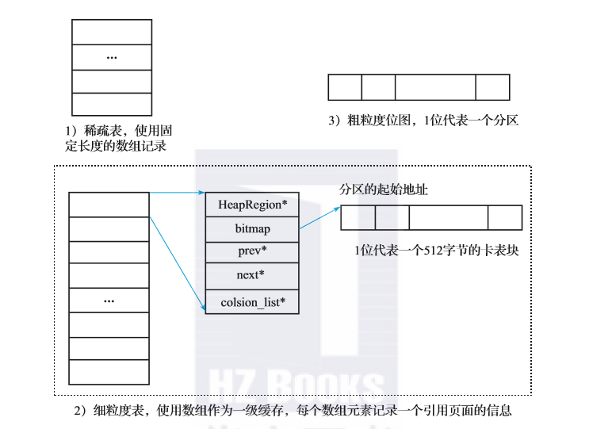

# RSet与Refine线程
## RSet
&nbsp;&nbsp;RSet 是一个抽象概念，记录对象在不同代际之间的引用关系，目的是加速垃圾回收的速度。

### 背景
&nbsp;&nbsp;如何加速回收速度: JVM使用的是跟对象引用的收集算法，即从根集合出发，标记所有存活的对象，然后遍历对象的每一个成员变量并继续标记，知道所有的对象标记完毕。 但是在垃圾回收中，新生代和老年代处于不同的回收阶段，如果还是采用这样的标记方法，不合理也没有必要。如仅回收新生代，如果标记时把老生代的活跃对象全部标记，但回收时并没有回收老年代，则浪费了时间。同样的，在回收老年代时，当且仅当进行FGC时，才需要对内存进行全部标记。
> 在进行GC时，控制GC Roots的数量，避免做了无用功而造成时间的浪费。

### RSet
&nbsp;&nbsp;为了对这种情况进行优化，JVM引入了RSet,用于记录从非收集部分指向收集部分的指针的集合，而这个集合描述的就是对象的引用关系。

### 引用记录的方法
  ```txt
     ObjA.fieldA = ObjB;
  ```
&nbsp;&nbsp;如上伪代码，通常有两种引用记录方法：
1. Point Out: 会在ObjA的RSet中记录ObjB的地址;
   > 引用了谁
2. Point In: 会在ObjB的RSet中记录ObjA的地址;
   > 被谁引用了

&nbsp;&nbsp;Point Out记录简单，但是需要对RSet做全部扫描；Point In记录操作复杂，但是在标记扫描时可以直接找到有用和无用的对象，不需要进行额外的扫描，因为RSet中的对象可以看作为跟对象。
> G1中使用的记录方式: Point In

### RSet数据结构
&nbsp;&nbsp;G1中使用了Point In的记录方式，为了提高RSet的存储效率，使用了三种数据结构:

1. 稀疏表，通过哈希表方式来存储
2. 细粒度表，通过数组来存储，每个数组元素指向引用者分区中512字节内存块对本分区的引用情况。
3. 粗粒度位图，通过位图来只是，每一位表示对应分区有引用到本分区。


## Refine线程
&nbsp;&nbsp;

--- 
## 参考资料