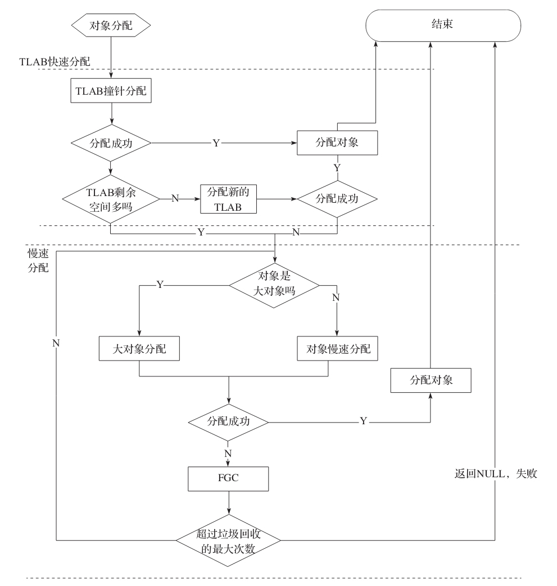

# Garbage-First对象分配
## 对象分配策略
1. G1中大对象不使用新生代空间，直接进入老年代。那对于G1来说，什么是大对象？即 region_size的一半。

## 对象内存分配流程图

 - 源码分析: 005.OpenJDK/002.OpenJDK8u312-GA/OpenJDK8U312-GA/hotspot/src/share/vm/interpreter/bytecodeInterpreter.cpp

###  快速分配

### 慢速分配