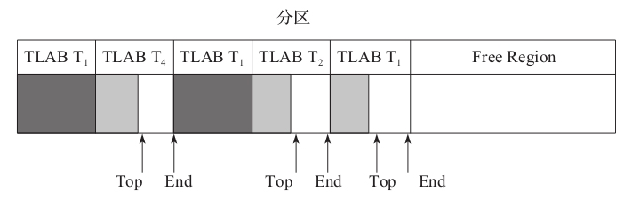

# Garbage-First对象分配
## 对象分配策略
1. G1中大对象不使用新生代空间，直接进入老年代。那对于G1来说，什么是大对象？即 region_size的一半。

## 对象内存分配流程图

 - 源码分析: 005.OpenJDK/002.OpenJDK8u312-GA/OpenJDK8U312-GA/hotspot/src/share/vm/interpreter/bytecodeInterpreter.cpp

### 快速分配
&nbsp;&nbsp;TLAB（ Thread Local Allocation Buffer,线程本地分配缓存）产生的目的是为了进行内存快速分配。JVM堆是所有线程的共享区域，因此，从JVM堆分配内存时，必须锁定整个堆，以便不会被其他线程中断或影响。为了解决这个问题，TLAB机制试图通过为每个线程分配一个缓冲区(即TLAB)来避免和减少使用锁。

&nbsp;&nbsp;TLAB是Eden区域中的一块内存，不同线程的TLAB都位于Eden区，所有的TLAB内存对所有线程都是可见的，只不过每个线程有一个TLAB的数据结构，用于保持待分配内存空间的起始地址和结束地址，在分配的时候只在这个区间分配，从而达到无锁分配，快速分配.
- 虽然TLAB在分配对象空间时是无锁分配，但是TLAB空间本身在分配的时候还是需要锁的，G1中使用CAS来分配。

&nbsp;&nbsp;如下图，TLAB在分区中的使用

- 深色表示该TLAB块已经分配完毕，浅色表示该TLAB还可以分配更多的对象。

&nbsp;&nbsp;&nbsp;&nbsp; 从上图可以看出，线程T1已经使用了两个TLAB块，T1,T2和T4的TLAB块都有待分配的空间。从图中可以看出，TLAB之间不重叠，所以线程之间对象的分配是可以并行的，且无影响。

#### TLAB 对象分配方式-指针对撞
&nbsp;&nbsp;
```c
   // 005.OpenJDK/002.OpenJDK8u312-GA/OpenJDK8U312-GA/hotspot/src/share/vm/interpreter/bytecodeInterpreter.cpp

   // 005.OpenJDK/002.OpenJDK8u312-GA/OpenJDK8U312-GA/hotspot/src/share/vm/memory/threadLocalAllocBuffer.inline.hpp
  /**
   * 从TLAB 中分配内存空间。
   * 
   * @return 分配成功,返回对象地址;失败,返回NULL;
   */ 
  inline HeapWord* ThreadLocalAllocBuffer::allocate(size_t size) {
       invariants();
       HeapWord* obj = top();
       // 判断是否有足够空间
       if (pointer_delta(end(), obj) >= size) {
         // successful thread-local allocation
       #ifdef ASSERT
         // Skip mangling the space corresponding to the object header to
         // ensure that the returned space is not considered parsable by
         // any concurrent GC thread.
         size_t hdr_size = oopDesc::header_size();
         Copy::fill_to_words(obj + hdr_size, size - hdr_size, badHeapWordVal);
       #endif // ASSERT
         // This addition is safe because we know that top is
         // at least size below end, so the add can't wrap.
         set_top(obj + size);
     
         invariants();
         return obj;
       }
       return NULL;
   }
  /**
   *  TLAB中保存一个top指针用于标记当前对象分配的位置，若剩余空间大于待分配对象的空间，则直接修改top=top+ObjSize;
   */ 
```

#### TLAB 大小如何确定
&nbsp;&nbsp;TLAB过小，那么TLAB则不能存储更多的对象，所以可能需要不断重新的分配新的TLAB。TLAB过大，则可能导致内存碎片问题。&nbsp;&nbsp;

---
### 慢速分配


---
## 附录
### 1. TLAB 大小和分区大小的关系
&nbsp;&nbsp;一个分区可能有多个TLAB，但一个TLAB是不可能跨分区的.<sup>《JVM G1源码分析与调优》 P47</sup>
