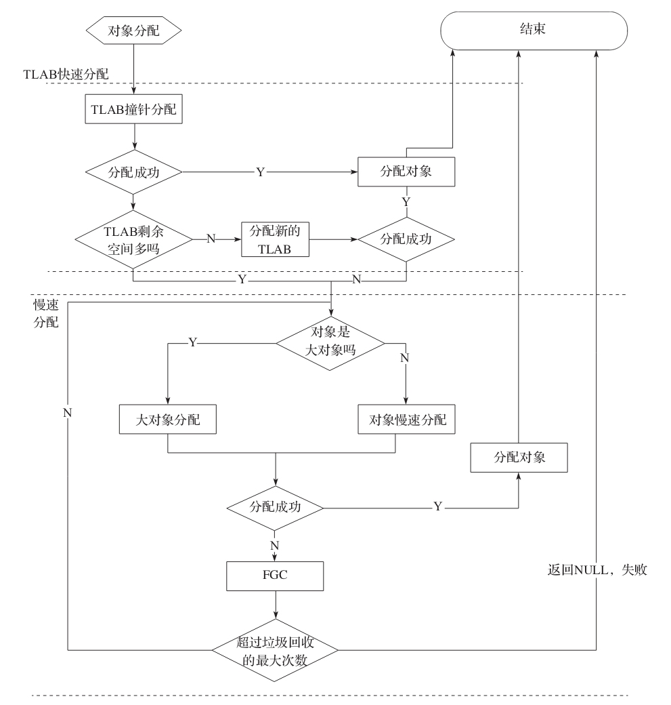
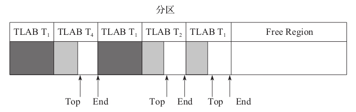

# Garbage-First对象分配
## 对象分配策略
1. G1中大对象不使用新生代空间，直接进入老年代。那对于G1来说，什么是大对象？即 region_size的一半。

## 对象内存分配流程图

 - 源码分析: 005.OpenJDK/002.OpenJDK8u312-GA/OpenJDK8U312-GA/hotspot/src/share/vm/interpreter/bytecodeInterpreter.cpp

### 快速分配
&nbsp;&nbsp;TLAB（ Thread Local Allocation Buffer,线程本地分配缓存）产生的目的是为了进行内存快速分配。JVM堆是所有线程的共享区域，因此，从JVM堆分配内存时，必须锁定整个堆，以便不会被其他线程中断或影响。为了解决这个问题，TLAB机制试图通过为每个线程分配一个缓冲区(即TLAB)来避免和减少使用锁。

&nbsp;&nbsp;TLAB是Eden区域中的一块内存，不同线程的TLAB都位于Eden区，所有的TLAB内存对所有线程都是可见的，只不过每个线程有一个TLAB的数据结构，用于保持待分配内存空间的起始地址和结束地址，在分配的时候只在这个区间分配，从而达到无锁分配，快速分配.
- 虽然TLAB在分配对象空间时是无锁分配，但是TLAB空间本身在分配的时候还是需要锁的，G1中使用CAS来分配。

&nbsp;&nbsp;如下图，TLAB在分区中的使用

- 深色表示该TLAB块已经分配完毕，浅色表示该TLAB还可以分配更多的对象。

&nbsp;&nbsp;&nbsp;&nbsp; 从上图可以看出，线程T1已经使用了两个TLAB块，T1,T2和T4的TLAB块都有待分配的空间。从图中可以看出，TLAB之间不重叠，所以线程之间对象的分配是可以并行的，且无影响。

#### TLAB 对象分配方式-指针对撞
&nbsp;&nbsp;
```c
   /**
    * 从TLAB上为对象分配内存空间，目前和垃圾收集器无关
    * 
    * @param klass 对象Klass句柄
    * @param thread 当前执行线程
    * @param size 对象大小
    * 
    * @return 对象地址
    */ 
   HeapWord* CollectedHeap::allocate_from_tlab(KlassHandle klass, Thread* thread, size_t size) {
     assert(UseTLAB, "should use UseTLAB");
     
     // 从当前线程绑定的TLAB上分配内存
     HeapWord* obj = thread->tlab().allocate(size);
     if (obj != NULL) {
       return obj;
     }
     // Otherwise...  // 从线程当前绑定的TLAB上分配失败,则再尝试从TLAB上慢速分配
     // 可能会重新分配TLAB，重要操作: 1. 哑元对象的填充
     return allocate_from_tlab_slow(klass, thread, size);
   }

   // 005.OpenJDK/002.OpenJDK8u312-GA/OpenJDK8U312-GA/hotspot/src/share/vm/interpreter/bytecodeInterpreter.cpp

   // 005.OpenJDK/002.OpenJDK8u312-GA/OpenJDK8U312-GA/hotspot/src/share/vm/memory/threadLocalAllocBuffer.inline.hpp
  /**
   * 从TLAB 中分配内存空间。
   * 
   * @return 分配成功,返回对象地址;失败,返回NULL;
   */ 
  inline HeapWord* ThreadLocalAllocBuffer::allocate(size_t size) {
       invariants();
       HeapWord* obj = top();
       // 判断是否有足够空间
       if (pointer_delta(end(), obj) >= size) {
         // successful thread-local allocation
       #ifdef ASSERT
         // Skip mangling the space corresponding to the object header to
         // ensure that the returned space is not considered parsable by
         // any concurrent GC thread.
         size_t hdr_size = oopDesc::header_size();
         Copy::fill_to_words(obj + hdr_size, size - hdr_size, badHeapWordVal);
       #endif // ASSERT
         // This addition is safe because we know that top is
         // at least size below end, so the add can't wrap.
         set_top(obj + size);
     
         invariants();
         return obj;
       }
       return NULL;
   }
  /**
   *  TLAB中保存一个top指针用于标记当前对象分配的位置，若剩余空间大于待分配对象的空间，则直接修改top=top+ObjSize;
   */ 

```

#### TLAB 大小如何确定
&nbsp;&nbsp;TLAB过小，那么TLAB则不能存储更多的对象，所以可能需要不断重新的分配新的TLAB。TLAB过大，则可能导致内存碎片问题。

&nbsp;&nbsp; TLAB的最大值
```c
  // 005.OpenJDK/002.OpenJDK8u312-GA/OpenJDK8U312-GA/hotspot/src/share/vm/gc_implementation/g1/g1CollectedHeap.cpp
  /**
   * For G1 TLABs should not contain humongous objects, so the maximum TLAB size
   * must be smaller than the humongous object limit.
   *  G1 TLAB不能包含大对象，所以TLAB的最大值必须小于大对象的限制
   */ 
   size_t G1CollectedHeap::max_tlab_size() const {
     return align_size_down(_humongous_object_threshold_in_words - 1, MinObjAlignment);
   }

   // 日志: 此时选择的是G1GC
   // Wei Say: HeapRegion大小计算完成, region_size: 1048576 byte, 对数region_size_log:20
   // Minimum heap(byte) 8388608  Initial heap(byte) 130023424  Maximum heap(byte) 2057306112
   // Minimum heap(MB) 8  Initial heap(MB) 124  Maximum heap(MB) 1962
   // TLAB的最大值计算完成,大小: 65535,单位: HeapRegion::GrainWords(see hotspot/src/share/vm/gc_implementation/g1/heapRegion.cpp),即524280 byte
   // > 通过代码和日志发现，TLAB的最大值 < region_size/2 , 具体: tlab_max_size = (region_size / 2) - 8

   // HeapRegion大小设置
   // 005.OpenJDK/002.OpenJDK8u312-GA/OpenJDK8U312-GA/hotspot/src/share/vm/gc_implementation/g1/heapRegion.cpp
```

#### 什么时候会分配一个新的TLAB，新TLAB大小如何计算?

#### 细节
#### 1. 哑元对象（dummy对象）
```c
  // 005.OpenJDK/002.OpenJDK8u312-GA/OpenJDK8U312-GA/hotspot/src/share/vm/gc_interface/collectedHeap.cpp
  /**
   * 从TLAB上慢速分配对象空间
   * 
   * @param klass  对象klass句柄
   * @param thread 当前执行线程
   * @param size 对象大小
   * 
   * @return 对象地址
   */ 
  HeapWord* CollectedHeap::allocate_from_tlab_slow(KlassHandle klass, Thread* thread, size_t size) {
  
    // ... 代码省略，看源码
    /**
     * 分配之前先清理老的TLAB，目的是为了让堆保持parsable可解析
     * > 清理就是把尚未分配的空间分配一个对象(一般是int[]),这样做是为了GC在进行某些需要线性扫描堆里对象的操作时，
     * 如 查看Region对象、并行标记等，需要堆里哪些地方有对象，哪些地方是空白。对于对象，扫描之后可以直接跳过对象的长度，
     * 对于空白的地方只能一个字一个字的扫描，这会非常慢。所以将这部分空白的地方也分配一个dummy对象(哑元对象)，
     * 这样GC在线性遍历的时候就能做到快速遍历了,这样也能统一处理。
     */ 
    thread->tlab().clear_before_allocation();
  
    // ... 代码省略，看源码
    return obj;
  }
```

---
### 慢速分配


---
## 附录
### 1. TLAB 大小和分区大小的关系
&nbsp;&nbsp;一个分区可能有多个TLAB，但一个TLAB是不可能跨分区的.<sup>《JVM G1源码分析与调优》 P47</sup>

### 2.哪些命令行参数影响TLAB
