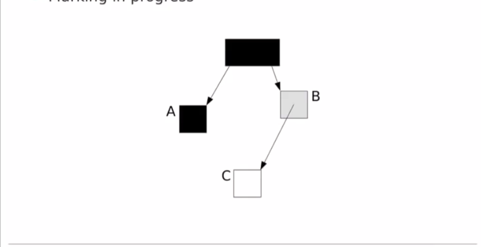

# G1 GC最初的设计思路
学习 [G1GC最初的设计思路(上)](./724637051_nb2-1-16.mp4) 、 [G1GC最初的设计思路(下)](./724637053-1-16.mp4)，总结内容如下:

- G1 是Hotspot低延迟收集器,被当作CMS长期替代者
- G1 被设计为非常容易调优:
  + -XX:MaxGCPauseMillis=100  调整STW时间，默认是250ms
- G1 是分代收集器:
  + Young Generation GC
    - STW , Parallel , Coping
  + Old Generation GC
     -  Mostly-concurrent marking 几乎并发标记
     - Incremental Compaction 
       - Piggybacked on Young Generation GC
     - 基本上将Old GC 委托到了 Young GC

---

- G1 具有非常详细的日志
  | 参数名                         | 含义                                                                                    |
  |--------------------------------|----------------------------------------------------------------------------------------|
  | -XX:+PrintGCDateStamps         | 打印GC时间戳                              OR hotspot/src/share/vm/runtime/globals.hpp  |
  | -XX:+PrintGCDetails            | 见[JVM-Options](../../../JVM-Options.pdf)  OR hotspot/src/share/vm/runtime/globals.hpp |
  | -XX:+PrintAdaptiveSizePolicy   | 见[JVM-Options](../../../JVM-Options.pdf) OR hotspot/src/share/vm/runtime/globals.hpp  |
  | -XX:+PrintTenuringDistribution | 见[JVM-Options](../../../JVM-Options.pdf) OR hotspot/src/share/vm/runtime/globals.hpp  |

---

- G1 GC 工作流程
  1. JVM 启动，G1准备Eden regions
  2. 应用程序运行并在Eden区分配对象
  3. Eden regions 被填满，当所有的Eden regions被填满，则进行Young GC

---

- 引用(指针)更新: 应用程序不仅仅分配，应用程序还会修改已存在对象的指针
  + 老年带或许会指向Eden区
  + G1必须追踪generation之间的指针
  + Generation 之间的引用如何追踪: Card Table + RSet(Remeber Set )
  + G1 使用写屏障追踪指针更新(也不是G1了，Card Table 更新就是通过写屏障)
    + 这些变更记录是通过Card Table 来记录到 Dirty Card Queue .
      - Dirty Card Queue 被分为四个区域: White、 Green、 Yellow、 Red

- refinement threads
  + 处理 Dirty Card Queue ,更新Remeber Set : 立即更新会有强烈竞争
    | 名称                                        | 含义                                                                         |
    |---------------------------------------------|------------------------------------------------------------------------------|
    | White zone                                  | Nothing happens , buffers are left unprocessed                               |
    | Green Zone:-XX:G1ConcRefinementGreenZone=<> | Refinement threads are activated,Buffers are processed and the queue drained |
    | Yellow Zone:G1ConcRefinementYellowZone=<>   | All avaliable refinement threads are active                                  |
    | Red Zone: -XX:G1ConcRefinementRedZone=<>    | Application threads process the buffers                                      |

---

- G1 Young GC
  - G1 Stops The World
  - G1 builds a "Collection Set"
    + the regions that will be subject to Collection
  - In Young GC , the collection set containes:
     1. Eden regions
     2. Suvivor regions
  - Young GC 流程
    1. 阶段1： Root Scanning（根扫描,需STW）: static and local objects are scanned
    2. 阶段2： Update RS: Drains the dirty queue to update the RS
       > 清空脏卡队列，更新RS
    3. 阶段3： Process RS: Detect the Eden objects pointed by Old objects
       > 跟随指针回到所有的Old Regions(脏卡涉及到的，并非整个Old区),找出指向Eden区的对象是什么,真正查清楚Eden区那些对象还是存活的
    4. 阶段四: Object Copy
       - The Object graph is traversed
       - Live objects copied to Survivor/Old regions
    5. 阶段5： Reference Processing
       - Soft、 Weak、 Phantom、 Final、 JNI Weak reference
       - 永远允许: -XX:+ParallelRefProcEnabled
       - 更多详细信息: -XX:+PrintReferenceGC

---

- G1 Old GC
  - G1 schedules and Old GC based on heap usage
    - By default when the entire heap is 45% full (当整个堆已经使用到了45%时，开始Old GC)
      - Checked after young GC or a humongous allocation (触发时机)
    - Tunable via -XX:InitiatingHeapOccupancyPercent=<>
  - The Old GC consists of old region marking
    - Finds all the live objects in the old regions
    - old regions marking is concurrent (三色标记法)
      - 三色标记问题: Lost Object Problem (GC线程和用户线程并发导致)  —— G1采用的解决方案:SATB(Snapshot-At-The-Beginning)
      - SATB(Snapshot-At-The-Beginning)
        + Preserves the object graph that was live at marking start (保留标记开始时的对象图)
        + C(先看视频，就是C没有被引用了) is queued and processed during remark (C被入队，在重标记时处理)
        + May retain floating garbage , collected the next cycle
          > 产生浮动垃圾，在下一次GC中被处理
        + 
          ```txt
             简单描述:
             如上图，在这种情况下，应用程序-用户线程执行如下操作:
             A.c = C;
             B.c = null;

             A 是已经遍历完成的对象了，所以他是黑色，但是B是灰色（引用的对象没有遍历完成）,此时C还是白色(其实应该变为黑色的，因为被A引用了),那么C就变味了浮动垃圾，在下一次GC中被回收

          ```

- Old GC Phases
  1. G1 Stop The World
  2. Performs a Young GC
     - piggybacks old regions roots detection(initial-mark)
       > 在做Young GC时， 也记录old regions 区域的GC Roots
  3. G1 resumes(继续) application threads
  4. Concurrent Old region marking proceeds
     - Keeps track of references(soft , weak , etc.)
     - Computes per-region liveness information
  5. G1 Stops The World
  6. Remark phase
     - SATB queue processing
     - Reference processing
  7. Cleanup phase
     - Empty old regions are immediately recycled(回收)
  8. Application thread are resumed 

- 非完全满的垃圾区域如何处理-碎片如何处理——Mixed GC
  - Cleanup phase -> recycle empty old regions
  - What about ono-empty old regions?
    - How is fragmentations resolved? (碎片如何处理)
  - Non-empty Old regions processing
    - Happens during the next Young GC cycle 
    - No rush to clean the garbage in Old regions: no rush: 不着急
  - Mixed GC - piggybacked  on Young GCs
    - By default G1 performs 8 mixed GC ？
      - -XX:G1MixedGCCountTarget=<> 
  - The Collection set includes
    - Part(1/8) of the remaining Old regions to collect
    - Eden regions
    - Survivor regions
  - Algorithm is identical to Young GC
    - Stop-The-World , Parallel , Copying  
      > 将老年代对象移动到新的region,或者说是将分散的对象整理到一个新的region,减少碎片化 —— 压缩
  - Old regions with most garbage are chosen first (优先选择大部分都是垃圾的区域)
      > 怎么知道空间利用率呢?--想想G1的RSet
    - -XX:G1MixedGCLiveThresholdPercent=<> , default to 85%
  - G1 wastes some heap space (waste threshold)
    - -XX:G1HeapWastePercent=<> , default to 5%
  - Mixed GCs are stopped:
    - When old regions garbage <= waste threshold
    - Therefore , mixed GC count may be less than 8 （就是为了减少停顿时间,当达到了(When old regions garbage <= waste threshold),就停止Mixed GC,恢复用户线程，这样停顿时间就更短了）

- G1 General Advices
  - Avoid at all consts Full GCs
    + The Full GC is single threaded and REALLY slow
    + Also becase G1 likes BIG heaps 
  - Grep the GC Logs for "Full GC"
    + 通过再GC日志中查找"Full GC" ，从而知道造成"Full GC"的原因
  - Avoid "to-space exhausted(耗尽)"
    + Not enough space to move objects to 
    + increase max heap size
    + G1 works better with more room to maneuver(空间越大，G1工作地越好)
  - Avoid too many "humongous" allocations
    + -XX:+PrintAdaptiveSizePolicy prints the GC reason
    + Increase max heap size
    + Increse region size: -XX:G1HeapRegionSize=<>
  - Avoid lengthy reference processing
    + always enable -XX:+ParallelRefProcEnabled
    + more detail with: -XX:+PrintReferenceGC
  - Find the cause for WeakRefences
    + ThreadLocals
    + RMI
    + Third party libraries