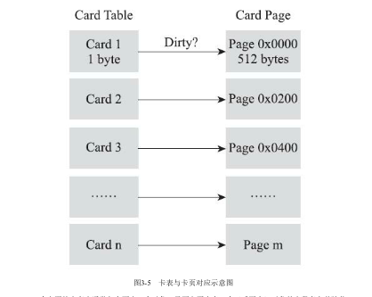
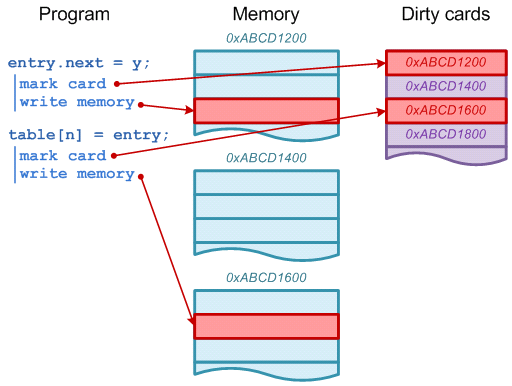

# Card Table 
## 简介
&nbsp;&nbsp;为了解决对象跨代引用<sub>如附录 GC分类</sub>所带来的问题，垃圾收集器在新生代中建立了名为记忆集(Remembered Set)数据结构，用以避免把整个老年代加进GC Roots扫描范围。

&nbsp;&nbsp;但事实上，并不是只是新生代、老年代之间才有跨代引用问题，所有涉及**部分区域收集(Partial GC)行为**的垃圾收集器都会面临这个问题。

## 记忆集(Remembered Set)·定义
&nbsp;&nbsp;记忆集是一种用于记录从非收集区域指向收集区域的指针集合的抽象数据结构。

&nbsp;&nbsp;在垃圾收集的场景中，收集器只需要通过记忆集判断出某一块非收集区域是否存在有指向了收集区域的指针就可以了，在GC时，将这些内存区域<sub>(部分，对于card table，是其中变脏了的元素)</sub>加入到GC Roots中，并不需要了解这些跨代指针的全部细节。

&nbsp;&nbsp;由于并不需要了解到跨代指针的全部细节，因此在设计记忆集的时候，便可以选择更为粗犷的记录粒度来节省记忆集的存储和维护成本。以下是可供选择的记录精度:
1. 字长精度
   + 每个记录精确到一个机器字长(即处理器的寻址位数，如32位或64位，这个精度决定了机器访问物理内存地址的指针长度)，该字包含跨代指针。
2. 对象精度
   + 每个记录精确到一个对象，该对象里面有字段含有跨代指针
3. 卡精度<sup>**HotSpot的选择，具体实现: 卡表(Card Table)**</sup>
   + 每个记录精确到一块内存区域，该区域内存在对象含有跨代指针。

## 卡表(Card Table) · 记忆集的一种实现 · HotSpot的选择
&nbsp;&nbsp;记忆集是一种抽象的数据结构，抽象的意思是只定义了记忆集的行为意图，并没有定义其行为的具体实现。卡表(Card Table)就是记忆集的一种具体实现，他定义了卡表的记录精度、与堆内存的映射关系等。

&nbsp;&nbsp;卡表最简单的形式可以只是一个字节数组，而在HotSpot中也是这样实现的。如下代码:
```c
    // HotSpot 默认的卡表标记逻辑
    CARD_TABLE [this address >> 9] = 0;
```

### Card Table 与 JVM Heap的映射关系
&nbsp;&nbsp;关于Card Table与JVM Heap的映射关系，如下说明:

```txt
   "...the heap is divided into a set of cards, each of which is usually smaller than a memory page. The JVM maintains a card map, with one bit (or byte, in some implementations) corresponding to each card in the heap. Each time a pointer field in an object in the heap is modified, the corresponding bit in the card map for that card is set."

   ＃结合《深入理解JVM·第三版》译: 即堆被分为卡片集合(即字节数组CARD_TABLE中的每个元素都对应着其标识的内存区域中一块特定大小的内存块),卡片的大小通常小于一个内存页(卡页的大小都是以2的N次幂的字节数，通过上面代码可以看出HotSpot中使用的卡页是2^9,即512字节)。JVM中包含一个card映射，其中一个元素对应着堆中的一个"Card".每当堆上的一个对象属性的指针发生了修改，Card Map中对应的位置就会被设置。
```

&nbsp;&nbsp;如下图，如果卡表标识内存区域的起始位置是 0x0000,数组CARD_TABLE的第0、1、2号元素分别对应地址范围为0x0000 ~ 0x01FF 、 0x0200 ~ 0x03FF 、 0x0400 ~ 0x05FF 的卡片内存页。
- 

> 在垃圾收集发生的时候，只要筛选出卡表中变脏的元素，就能轻易得出哪些卡页内存块中包含跨代指针，将他们加入GC Roots中一并扫描。


### Card Table Marking(标记)
&nbsp;&nbsp;使用了记忆集来缩短GC Roots扫描范围的问题，但是还没有解决卡表元素如何维护的问题： 何时变脏、谁来变脏。
- 何时变脏，这个很明确了: 有其他分代区域中对象引用了本区域对象时，其对应的卡表元素就应该变脏，变脏时间点原则上应该发生在引用类型字段赋值的那一刻。
- 如何变脏?
   + 如果是解释执行，则由充分的介入空间。
   + 对于编译执行，经过即时编译器编译过的代码已经是纯粹的机器指令流了，那么此时得制定一套方案来解决这个问题。

#### Card Table Marking标记方式-写屏障
&nbsp;&nbsp;在HotSpot中，使用写屏障(Write Barrier)技术维护卡表状态。写屏障可以看作在虚拟机层面对"引用类型字段赋值"这个动作的AOP切面，在引用对象赋值时会产生一个环形通知，供程序执行额外的操作。如下代码:
```c
     void oop_field_store(oop* field, oop new_value) {
         pre_write_barrier(field); // 写屏障-写前操作
         *field = new_value; 
         post_write_barrier(field, value); // 写屏障-写后操作
     }
```

&nbsp;&nbsp;示意图:
- 

#### 伪共享问题 - Card Table Marking标记方式-写屏障 带来的问题
&nbsp;&nbsp;伪共享是处理并发底层细节时一种经常需要考虑的问题，现代中央处理器的缓存系统中是以缓存行(Cache Line)为单位存储的，当多线程修改相互独立的变量时，如果这些变量正好共享同一个缓存行，就会彼此影响(写回、无效化 或者 同步 )而导致性能降低。
+ CPU缓存是以缓存行（Cache line）为最小数据单位，缓存行是2的整数幂个连续字节，主流大小是64个字节。如果多个变量同属于一个缓存行，在并发环境下同时修改，因为写屏障及内存一致性协议会导致同一时间只能一个线程操作该缓存行，进而因为竞争导致性能下降，这就是“伪共享”。“伪共享”是高并发场景下一个底层细节问题。
##### 优化伪共享问题<sup>是优化，不是解决</sup>
&nbsp;&nbsp;假设处理器缓存行大小为64字节，由于一个卡表元素占一个字节，64个卡表元素将共享一个缓存行。这64个卡表元素对应的卡页总的内存为64*512字节=32KB。也就是说，如果不同线程更新的对象正好处于这32KB的内存区域内，就会导致更新卡表时正好写入同一个缓存行而影响性能。为了避免伪共享问题，一种简单的解决方案是不采用无条件的写屏障，而是先检查卡表标记，只有当卡表未被标记的时候才将其标记为变脏。即卡表更新的逻辑变为如下代码所示:
```c
      // 指定了 -XX:+UseCondCardMark: 参数
     if (CARD_TABLE [this address >> 9] != 0) {
       CARD_TABLE [this address >> 9] = 0; 
     }
```

### G1 GC
&nbsp;&nbsp;先占个位置，后续学习到G1时再补充

---
## 附录
### GC分类
1. 部分收集(Partial GC): 指目标不是完整收集整个Java堆的垃圾收集，其中又分为:
   - 新生代收集(Minor GC / Young GC):指目标仅完成新生代的垃圾收集
   - 老年代收集(Major GC/Old GC):指目标仅完成老年代的垃圾收集，注意:
      + 目前仅有CMS垃圾收集器会有单独收集老年代的行为
   - 混合收集(Mixed GC):指目标是收集整个新生代以及部分老年代的垃圾收集，目前仅有G1收集器会有这种收集行为
2. 整堆收集(Full GC):收集整个Java堆和方法区的垃圾收集

---
## 参考资料
1. [http://psy-lob-saw.blogspot.com/2014/10/the-jvm-write-barrier-card-marking.html](http://psy-lob-saw.blogspot.com/2014/10/the-jvm-write-barrier-card-marking.html)
2. [006.BOOKs/深入理解Java虚拟机.pdf](../../006.BOOKs/深入理解Java虚拟机.pdf)