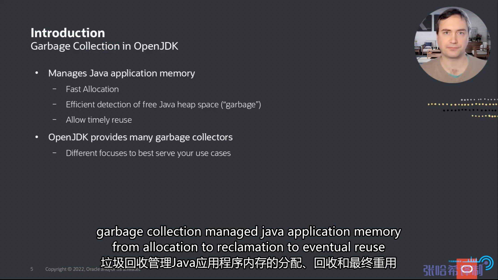
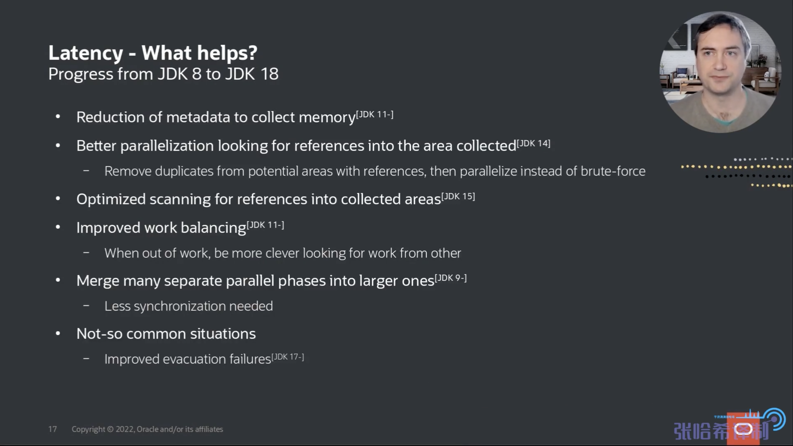

# OpenJDK8 ~ 18 垃圾收集器的变化
## 摘要
1. 垃圾收集器的特性： 内存管理: 提供 & 回收内存
2. 不同的垃圾收集器的侧重点不同: 吞吐量/延迟 , 因此，需要选择合适你应用的垃圾收集器
3. 自动内存管理是牺牲了一定的吞吐量的 ，见 "关注点和权衡的维度"  "是什么造就了吞吐量的提升?"
4. ZGC , Shenandoah 垃圾收集器没有STW了
5. 合理减少并行处理，也是一种优化方式
6. G1 新生代收集快于 老年代 
7. JVM 内存不是越大越好，将内存返还给操作系统，可以减少处理时间，见 "什么造就了内存占用的降低"
## PPT内容
- 前言  
  + 
- 主题内容
   - 
- 介绍垃圾收集器: timely：及时地,垃圾收集器需要哪些特性:
  1. 内存应该快速提供给应用程序。
  2. 应有效地检测未使用的内存，并且快速检测未使用的内存通常也被称为垃圾，并且还应该能够及时地向应用程序再次提供该内存
  3. 以上两点只是应用程序对垃圾收集器的一些需求，不同的应用程序获取还对垃圾收集器有更多的需求，因此OpenJDK提供了许多垃圾收集器以供选择。如下图的  ‘focuses’

  + 

- 关注点和权衡的维度
  1. 吞吐量： 在给定的时间单位内完成了多少工作。”in terms of garbage collection choice how much does the garbage collector decrease throughput to do to do manual management“(在垃圾收集器选择方面，垃圾收集器减少了多少吞吐量来进行手动管理)
  2. 延迟: 垃圾收集器从开始到结束部分工作的延迟时间，垃圾收集器操作是否在此类事务中引发任何不可接受的暂停  
  3. 内存占用 ： 除了应用程序外，还需要其他额外的内存来供垃圾收集器工作。
   
  + 
  +  

- 垃圾收集器分类
  1. Parallel: 尽可能快完成工作，最小限度考虑延迟。 通过压缩应用程序中正在使用的内存来释放内存，STW意味着Parallel会停止应用程序。使用更多的CPU完成垃圾收集，然后继续让应用程序运行。
  2. G1： 试图平衡吞吐量和延迟，一方面停止世界进程，并使用并行GC的分代模式，另一方面，并行冗长的GC操作，意味着与应用程序并行，这会减少暂停时间。
  3. ZGC 、 Shenandoah ： 试图以最小的停顿，与应用程序并发执行所有操作。
   
  + 

- 简单介绍G1
  + 
  + 
  + 如果你集中精力收集这些年轻对象，并保持年轻代很小，并且经常只收集年轻代垃圾，您将以最少的消耗回收大部分垃圾。最终对象被移动到老一代，在那里他们将慢慢死去，为了减少在旧代中垃圾收集的暂停时间，G1逐步收集垃圾，也成为增量收集。此外，G1对于任何长时间的工作都尝试与应用程序并发执行，保持暂停时间短且相当可预测，将这些繁重的工作移出暂停的例子是进入Java堆和垃圾收集器数据结构维护的活动分析。对于G1有件重要的事情: 主要的调优参数: -XX:MaxGCPauseMillis (默认200毫秒)
    - 

- 吞吐量的提升
  1. spent: 用过的，失效的，即已经流逝的CPU时间
  2. maxjOPS 指标代表系统的吞吐量
  3. 未指定VM参数
  + 

- 是什么造就了吞吐量的提升?
  1. G1 尝试尽可能长时间地执行年轻代收集，因为他们效率最高。Lazy start of old generation collection: G1通过预测何时需要开始老年代收集，将老年代收集尽量往后延迟。 
  2. 通过关注所谓的简单拾取并减少垃圾收集的数量,例如： 需要收集的对象通常是很大区域，他们占用很大空间，通常容易回收，而且往往很快就会死亡，所以G1在每次垃圾收集时都会尝试回收大片区域，几乎没有成本，但有潜在的巨大回报。
  3. reclaim: 回收 
  4. 从JDK8 ~ 18 ， 垃圾收集本身的时间也显著缩短了，通常在代码中寻找优化机会。即 垃圾收集器花费的时间更少，自然会增加应用程序的运行时间。
  5. G1 更好地利用了NUMA ， 试图将对象放置在他们所使用的CPU附近
  6. 很多不常见情况的优化: 对于STM，通过并行化，已经优化到和并行GC一样快。
  7. VM中添加了很多非垃圾收集相关的改进，也提升了吞吐量
  + 

- 吞吐量在其他收集器的改进（相同的垃圾收集器，不同的版本JVM）： Parallel GC ， 可以使用新的VM来提升吞吐量，虽然不明显
  + 

- 延迟的提升
  1. 200ms是G1默认的暂停时间,作为暂停的目标值
  2. 下图的时间是暂停时间。
  3. G1 
  4. 优化后，应用程序可以使用更多的CPU时间。
  + 

- 将 MaxGCPauseMillis 设置为 50 ms
  + G1
  + 在JDK18中，只需要1/3的暂停时间，就可以获得和JDK8一样的吞吐量
  + 

- 什么造就了JDK8~18延迟的降低
  1. JDK11 开始，G1积极地尝试减少垃圾收集器所需要的元数据量： 保存的数据越少，所需维护的越少。
  2. JDK14 引入的 首先删除包含这些信息的数据结构中的重复项，然后并行处理，而不是强制删除所有数据同时并行处理
  3. 在收集的区域中寻找引用的实际过程已经得到优化。
  4. 并行创建对象引用图时，在改善工作平衡方面也做了大量的工作： 有些线程可能比其他线程完成早得多，他们开始窃取其他线程的工作,算法也有提升，好的算法可以让其他线程窃取工作更便宜，更高效。
  5. 从JDK8以来，垃圾收集器暂停的更多部分已被并行化，这就提供了将多个并行阶段合并为单个更大阶段的机会，这极大减少了同步的开销，可能本来会有很多线程需要同步。
  6. 投入大量时间来加速不常见的情况： 移动对象时，内存不足怎么办？即疏散失败，
  + 

- ZGC的延迟
  1. ZGC 优化了延迟，使所有的工作，甚至将对象的重新定位于应用程序并发执行。ZGC会忽略吞吐量
  + 

- 内存占用
  1. 内存占用大幅下降
  + 

- 什么造就了内存占用的降低
  1. 并发地创建和维护所有内容，尽可能快地释放任何未使用的数据，即只维护绝对必要的数据，以及在接下来的几次垃圾收集中必要的数据。
  2. 数据结构优化
  3. 更加积极地将内存还给操作系统，是为了节约暂停时间，并发进行
  + 
- The Future
  1. 消除G1在本地代码中使用Java对象时锁定垃圾收集的需要，垃圾收集可能意味着巨大的延迟峰值，因为等待内存的线程都需要等待执行本地代码使用的Java对象。
  2. 对于批处理应用，意味着吞吐量应用程序调优为并行GC级别的性能,并行GC在这方面目前比G1好10%. 即未来的方向，提升吞吐量的方向： 优化G1，提升G1接近并行GC的性能。
  3. 通过减少每次写引用时执行的代码量来实现这一点，即所谓的写屏障。
  4. barrier: 障碍；壁垒
  5. frugal: 节约的
  6. 让G1成为最节约内存的垃圾收集器
  + 
  + 

- End
  1. 有问题，请找他，不要找我，我是个菜鸟!!!
  + 
  
## 参考资料
1. [OpenJDK8 ~ 18 垃圾收集器的变化](https://www.bilibili.com/video/BV1jv4y1K7Fo/?spm_id_from=333.337.search-card.all.click&vd_source=9eef164b234175c1ae3ca71733d5a727)