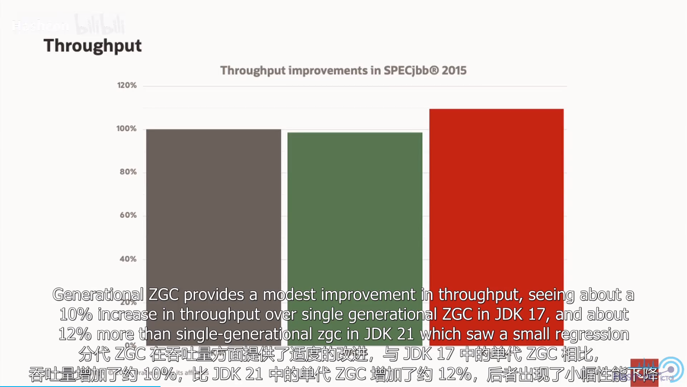
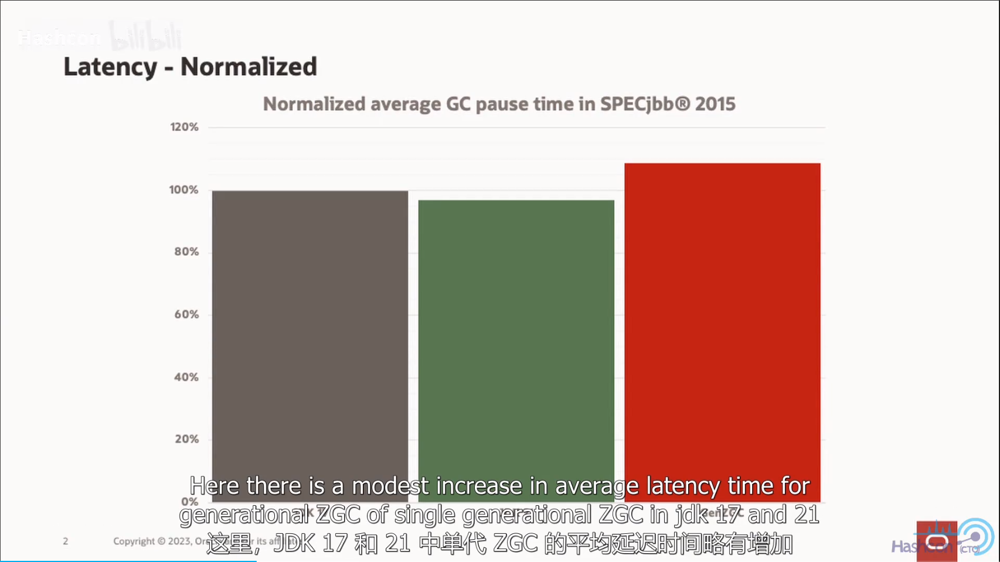
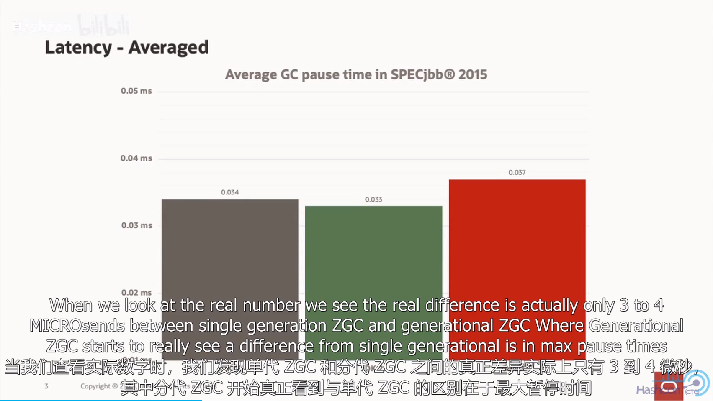
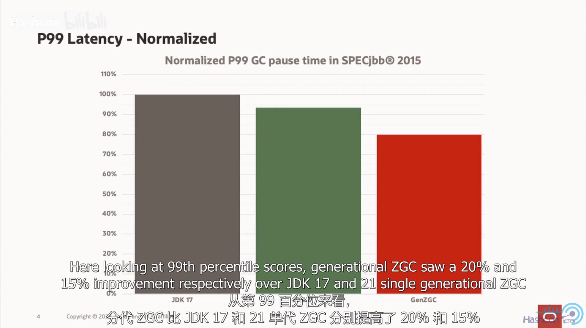
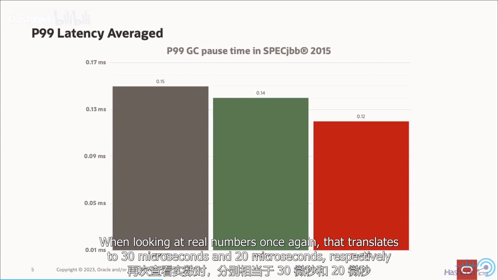
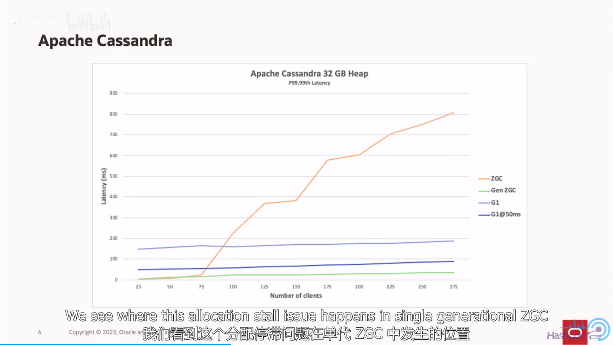

## 001.ZGC性能测试报告-单代&分代性能改进
### 吞吐量测试
- 
- 横坐标： JDK17 、 JDK21 、 Gen ZGC
- 可以发现，ZGC 提升了吞吐量

### 延迟测试
- 
  + 转换为时间

#### 从P99 GC暂停时间来分析
- 
  + 转换为时间 

### Apache Cassandra 测试

+ 横坐标： 并发客户端数量
+ 纵坐标： 延迟时间

## 分代ZGC的意义
&nbsp;&nbsp;或多或少会获得与单代ZGC所希望的平均超快速延迟，即吞吐量的适量改进，但最大暂停时间可能会出现巨大的改进，尤其是在重负载下。

## 参考资料
1. [Java 内幕新闻 - ZGC实战](https://www.bilibili.com/video/BV1pQ4y1V7MW/?spm_id_from=333.999.0.0&vd_source=9eef164b234175c1ae3ca71733d5a727)