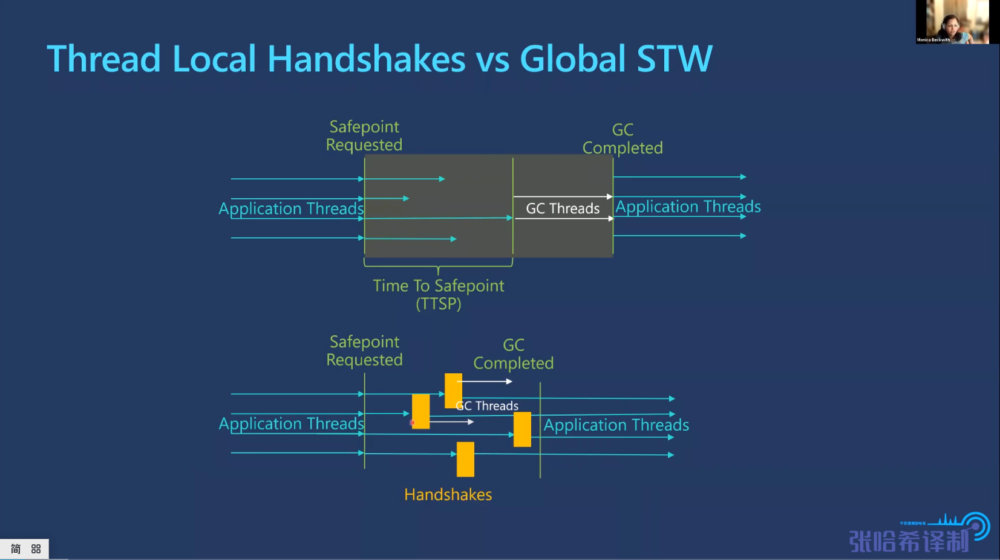

# 亚毫秒级别暂停的ZGC原理与极限情况性能测试

- 吞吐量与GC的关系: 上 16：23
  + GC不会抢夺应用程序资源(如 CPU时间片)，即 吞吐量最大化

## 注意事项
1. ZGC 没有 STW阶段，是因为 去除了STW阶段，并将其（引用处理，历史上时以STW方式进行的）添加到并发阶段： 15：56
   > Thread Local Handshakes  代替 STW
   > 

## Question & Answer
1. Q: ZGC 没有分代(视频基于OpenJDK17),对于使用者有什么影响，特别是在生产工作负荷和类似的使用上使用他
   - A： 这的确是个问题，特别是当你试图获得吞吐量的好处，所以当我说每个人都有人在请应用帮助，这意味着应用程序没有做他的工作，他在帮助收集器，或者他在减缓他的分配速率，这意味着他不能完成你所希望他完成的工作量，这意味着您的吞吐量受到了影响，任何时候你想要做一些限制你的，尝试限制他过去的目标，例如，我将小于A，而且基本上他考虑的是他自己，可以认为垃圾收集器很自私，在停顿时尽量保持低开销，但与此同时，您的应用程序也会收到影响，因为GC太自私了，所以他无法完成这项工作，类似于除非你帮忙，否则我是不会搬的，那么应用程序只好放下手头上的工作，先帮你，这就是ZGC所做的，因为他就是这么被设计的。那么使用分代之后，GC1目标是年轻代的，GC2目标是老年代的，所以，当你做工作的时候，这个可以做他自己的工作，他不需要考虑其他在老年代的垃圾收集器，老年代会考虑自己的事情，所以他给了你自由，待年轻代晋升到老年代，GC1 GC2会互相帮助，那么你的应用线程是一种更灵活的，考虑他们能做的工作，而不是参与这种GC问题的活动

## 参考资料
1. [亚毫秒级别暂停的ZGC原理与极限情况性能测试(上)](https://www.bilibili.com/video/BV1gS4y1m7Ah/?spm_id_from=333.999.0.0&vd_source=9eef164b234175c1ae3ca71733d5a727)
2. [亚毫秒级别暂停的ZGC原理与极限情况性能测试(中)](https://www.bilibili.com/video/BV1SS4y1272E/?spm_id_from=333.999.0.0&vd_source=9eef164b234175c1ae3ca71733d5a727)
3. [亚毫秒级别暂停的ZGC原理与极限情况性能测试(下)](https://www.bilibili.com/video/BV1T44y1K72G/?spm_id_from=333.999.0.0&vd_source=9eef164b234175c1ae3ca71733d5a727)
