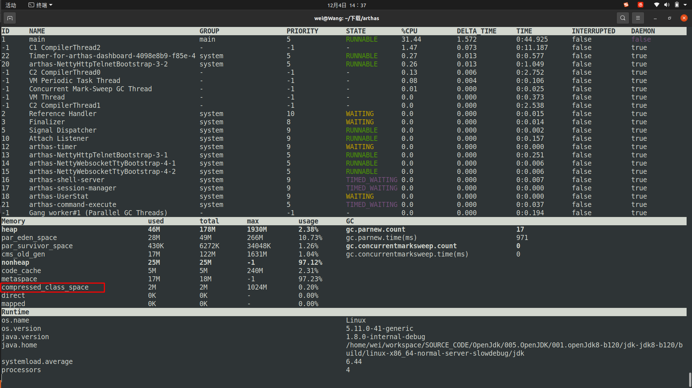

# JVM GC(Garbage Collection)
> 004.OpenJDK(JVM)学习/003.JVM启动/001.Universe初始化/README.md

&nbsp;&nbsp; 从 005.OpenJDK/001.openJdk8-b120/jdk-jdk8-b120/hotspot/src/share/vm/memory/universe.cpp#Universe::initialize_heap开始
## CollectedHeap
&nbsp;&nbsp;CollectedHeap是一个接口，CollectedHeap类根据CollectorPolicy中设置的值确定策略。CollectedHeap类定义了对象的分配和回收的接口。
### 重要方法
1. allocate_from_tlab
2. mem_allocate
3. collect

---

## CollectorPolicy
&nbsp;&nbsp;CollectorPolicy类是一个定义了对象管理功能策略的类。该类保存与对象管理功能相关的设置值，例如，该类在执行Java命令时设置不同的参数(如GC算法);

---
## CollectedHeap之间的继承关系
+ 见文件: 005.OpenJDK/001.openJdk8-b120/jdk-jdk8-b120/hotspot/src/share/vm/gc_interface/collectedHeap.hpp
+ CollectedHeap
    - SharedHeap
       + GenCollectedHeap
       + G1CollectedHeap
    - ParallelScavengeHeap


## 学习目标是什么
1. 针对与不同的垃圾收集器，软引用，弱引用，强引用，虚引用分别在什么时机回收的?

---
## 备注
1. 学习所有的垃圾收集器没有必要，主要学习
    - ParNew + CMS的组合
    - G1垃圾收集器

---
## 遇到的一些VM参数
### 1. AdaptiveSizePolicy(自适应大小策略)
&nbsp;&nbsp;JDK 1.8 默认使用 UseParallelGC 垃圾回收器，该垃圾回收器默认启动了 AdaptiveSizePolicy，会根据GC的情况自动计算计算 Eden、From 和 To 区的大小
#### 注意事项：
 - 在 JDK 1.8 中，如果使用 CMS，无论 UseAdaptiveSizePolicy 如何设置，都会将 UseAdaptiveSizePolicy 设置为 false；不过不同版本的JDK存在差异；
 - UseAdaptiveSizePolicy不要和SurvivorRatio参数显示设置搭配使用，一起使用会导致参数失效；
 - 由于AdaptiveSizePolicy会动态调整 Eden、Survivor 的大小，有些情况存在Survivor 被自动调为很小，比如十几MB甚至几MB的可能，这个时候YGC回收掉 Eden区后，还存活的对象进入Survivor 装不下，就会直接晋升到老年代，导致老年代占用空间逐渐增加，从而触发FULL GC，如果一次FULL GC的耗时很长（比如到达几百毫秒），那么在要求高响应的系统就是不可取的。

## 收集策略的继承关系(在上的是超类，往下是子类)
- CHeapObj
-  + CollectorPolicy
-  +  + GenCollectorPolicy
-  +  +   + TwoGenerationCollectorPolicy
-  +  +   +   + ConcurrentMarkSweepPolicy


## 函数分析
### jdk-jdk8-b120/hotspot/src/share/vm/memory/universe.cpp#universe_init
  - 先为java堆申请内存，再为元空间申请内存
  ```c++
     jint universe_init() {
            assert(!Universe::_fully_initialized, "called after initialize_vtables");
            guarantee(1 << LogHeapWordSize == sizeof(HeapWord),
                        "LogHeapWordSize is incorrect.");
            guarantee(sizeof(oop) >= sizeof(HeapWord), "HeapWord larger than oop?");
            guarantee(sizeof(oop) % sizeof(HeapWord) == 0,
                        "oop size is not not a multiple of HeapWord size");
            TraceTime timer("Genesis", TraceStartupTime);
            // 禁止在启动的时候GC
            GC_locker::lock(); // do not allow gc during bootstrapping
            JavaClasses::compute_hard_coded_offsets();

            // 初始化JVM堆
            jint status = Universe::initialize_heap();
            if (status != JNI_OK) {
                return status;
            }
            
            /**
             * 元空间初始化
             * 内存是怎么申请的，内存多大
             */ 
            Metaspace::global_initialize();

            // Create memory for metadata.  Must be after initializing heap for
            // DumpSharedSpaces.
            ClassLoaderData::init_null_class_loader_data();

            // We have a heap so create the Method* caches before
            // Metaspace::initialize_shared_spaces() tries to populate them.
            Universe::_finalizer_register_cache = new LatestMethodCache();
            Universe::_loader_addClass_cache = new LatestMethodCache();
            Universe::_pd_implies_cache = new LatestMethodCache();

            /**
             * 当JVM启动时若配置-XX:+UseSharedSpaces,则它会通过内存映射文件的方式把classes.jsa文件的内存加载到自己的JVM进程空间中.
             *  classes.jsa对应的这一部分内存空间地址一般在永久代(现在是元空间了)内存地址空间的后面.
             * JVM这么做的目的就是让这个JVM的所有实例共享classlist中所有类的类型描述信息以达到节约物理内存的目标
             * 
             */ 
            if (UseSharedSpaces) {
                // Read the data structures supporting the shared spaces (shared
                // system dictionary, symbol table, etc.).  After that, access to
                // the file (other than the mapped regions) is no longer needed, and
                // the file is closed. Closing the file does not affect the
                // currently mapped regions.
                MetaspaceShared::initialize_shared_spaces();
                StringTable::create_table();
            } else {
                SymbolTable::create_table();
                StringTable::create_table();
                ClassLoader::create_package_info_table();
            }

            return JNI_OK;
            }
  ```


---
## JVM参数
### 1. CompressedClassSpaceSize
> 这个参数主要是设置Klass Metaspace的大小，不过这个参数设置了也不一定起作用，前提是能开启压缩指针，假如-Xmx超过了32G，压缩指针是开启不来的。如果有Klass Metaspace，那这块内存是和Heap连着的。

> 为什么JVM开启指针压缩后支持的最大堆内存是32GB
>> 开启指针压缩之后，对象指针会被压缩到4字节，也就是32位，也就是能代表2的32次方个寻址地址(4GB)。又因为java默认对象对齐方式是8个字节，所以根据4GB个地址找到32个内存的对象。如果超过32G之后，压缩就已经找不全所有的对象了，那么就不压缩了

- 
- 那这里的metaspace存的是什么呢?
### 2. MetaspaceSize
+ 定义于文件: 005.OpenJDK/001.openJdk8-b120/jdk-jdk8-b120/hotspot/src/share/vm/runtime/globals.hpp
+ 这个JVM参数是指Metaspace扩容时触发FullGC的初始化阈值，也是最小的阈值。这里有几个要点需要明确：
  - 如果没有配置-XX:MetaspaceSize，那么触发FGC的阈值是21807104（约20.8m），可以通过jinfo -flag MetaspaceSize pid得到这个值；jps -v也可以查看jvm的参数设置情况。
  - 如果配置了-XX:MetaspaceSize，那么触发FGC的阈值就是配置的值；
  - Metaspace由于使用不断扩容到-XX:MetaspaceSize参数指定的量，就会发生FGC；且之后每次Metaspace扩容都可能会发生FGC（至于什么时候会，比较复杂，跟几个参数有关）；
  - 如果Old区配置CMS垃圾回收，那么扩容引起的FGC也会使用CMS算法进行回收；
  - 如果MaxMetaspaceSize设置太小，可能会导致频繁FullGC，甚至OOM；
+ 赋值
```txt
libjvm.so!Metaspace::ergo_initialize() (/home/wei/workspace/SOURCE_CODE/OpenJdk/005.OpenJDK/001.openJdk8-b120/jdk-jdk8-b120/hotspot/src/share/vm/memory/metaspace.cpp:3011)
libjvm.so!Arguments::apply_ergo() (/home/wei/workspace/SOURCE_CODE/OpenJdk/005.OpenJDK/001.openJdk8-b120/jdk-jdk8-b120/hotspot/src/share/vm/runtime/arguments.cpp:3670)
libjvm.so!Threads::create_vm(JavaVMInitArgs * args, bool * canTryAgain) (/home/wei/workspace/SOURCE_CODE/OpenJdk/005.OpenJDK/001.openJdk8-b120/jdk-jdk8-b120/hotspot/src/share/vm/runtime/thread.cpp:3339)
libjvm.so!JNI_CreateJavaVM(JavaVM ** vm, void ** penv, void * args) (/home/wei/workspace/SOURCE_CODE/OpenJdk/005.OpenJDK/001.openJdk8-b120/jdk-jdk8-b120/hotspot/src/share/vm/prims/jni.cpp:5166)
libjli.so!InitializeJVM(JavaVM ** pvm, JNIEnv ** penv, InvocationFunctions * ifn) (/home/wei/workspace/SOURCE_CODE/OpenJdk/005.OpenJDK/001.openJdk8-b120/jdk-jdk8-b120/jdk/src/share/bin/java.c:1146)
libjli.so!JavaMain(void * _args) (/home/wei/workspace/SOURCE_CODE/OpenJdk/005.OpenJDK/001.openJdk8-b120/jdk-jdk8-b120/jdk/src/share/bin/java.c:373)
libpthread.so.0!start_thread(void * arg) (/build/glibc-eX1tMB/glibc-2.31/nptl/pthread_create.c:477)
libc.so.6!clone() (/build/glibc-eX1tMB/glibc-2.31/sysdeps/unix/sysv/linux/x86_64/clone.S:95)
```
