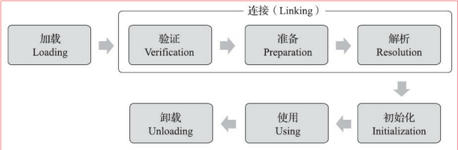

# 类加载过程简要概述
&nbsp;&nbsp;在Java语言中，类型的加载、连接和初始化过程都是在程序运行期间完成的。Java天生可以动态拓展的语言特性就是依赖运行期动态加载和动态连接这个特点实现的(如 编写一个面向接口的的应用程序，可以等到运行时再指定其实际的实现类).

---
##  类加载的时机(OpenJDK8)
1. 遇到new、getstatic、putstatic或invokestatic这四条字节码指令时，如果类型没有进行过初始化，则需要先触发其初始化阶段
2. 使用java.lang.reflect包的方法对类型进行反射调用的时候，如果类型没有进行过初始化，则需
要先触发其初始化。
3. 当初始化类的时候，如果发现其父类还没有进行过初始化，则需要先触发其父类的初始化。但是接口不一样： 当一个接口在初始化时，并不要求父接口全部都完成初始化，只有在真正使用到父接口的时候才会初始化
4. 当虚拟机启动时，用户需要指定一个要执行的主类（包含main()方法的那个类），虚拟机会先
初始化这个主类
5. 当使用JDK 7新加入的动态语言支持时，如果一个java.lang.invoke.MethodHandle实例最后的解
析结果为REF_getStatic、REF_putStatic、REF_invokeStatic、REF_newInvokeSpecial四种类型的方法句柄，并且这个方法句柄对应的类没有进行过初始化，则需要先触发其初始化
6. 当一个接口中定义了JDK 8新加入的默认方法（被default关键字修饰的接口方法）时，如果有
这个接口的实现类发生了初始化，那该接口要在其之前被初始化

---
## 类的生命周期
&nbsp;&nbsp;类的生命周期如下图:
- 

### 对各个阶段进行简要概述
&nbsp;&nbsp;加载、验证、准备、初始化、卸载 这5个阶段的顺序是确定的，类型的加载过程必须按照这种顺序按部就班地开始。但是解析阶段<sub>那么解析阶段做了什么，可以使得他不按这个顺序执行呢?</sub>则不一定: 他在某些情况下可以在初始化阶段之后再开始，这是为了支持Java语言的运行时绑定的特性(即动态绑定 或 晚绑定)，<font color="red">**除这点之外，其他顺序并不是绝对的(如验证阶段部分内容的验证发生在解析阶段)，只是相对来说是这样的**</font>

#### 加载(Loading)
&nbsp;&nbsp;加载阶段完成的任务:
1. **获取二进制字节流**：通过一个类的全限定名来获取定义此类的二进制字节流
   - 怎么获取没有限制，可以通过网络获取、从ZIP中获取 、 动态生成...
2. **数据结构转换**：将这个字节流锁代表的静态存储结构转换为方法区的运行时数据结构。
3. **生成Class对象**：在内存中生成一个代表这个类的java.lang.Class对象，作为方法区这个类的各种数据访问的入口

&nbsp;&nbsp;**类加载器的选择**: 即可以是JVM内置的引导类加载器，也可以是由用户自定义的类加载器<sub>开发人员可控制字节流的获取方式</sub>去完成。

&nbsp;&nbsp;**数组类**： 对于数组类，数组类本身不通过类加载器创建，他是由JVM虚拟机直接在内存中动态构建出来的<sub>回顾一下JVM启动流程</sub>。但是数组的元素类型还是需要类加载器类加载.
+ 数组类和类加载器的关联:
  - *元素类型是引用类型*，则递归地去加载这个类型，数组将会和加载数组类型的类加载器相关联。
  - *元素类型是基本类型*, 将数组类与引导类加载器相关联。
+ 数组类的可访问性:数组类的可访问性与元素类型的可访问性一致(元素类型不是引用类型，数组的可访问性默认是public)

&nbsp;&nbsp;**类和元空间**:类型数据存储到元空间之后，会在Java堆中实例化一个java.lang.Class类的对象，这个对象作为程序访问方法区中类型数据的外部接口

---
#### 验证(Verification)
&nbsp;&nbsp;这一阶段的目的是 确保Class文件的字节流包含的信息符合《Java 虚拟机规范》的全部约束要求，保证这些信息被当做代码运行后不会危害虚拟机自身的安全。主要包含：
+ 文件格式校验
+ 字节码校验
+ 符号引用校验
   - 发生在JVM将符号引用转换为直接引用的时候，在连接的第三阶段-解析阶段

&nbsp;&nbsp;详细参考《006.BOOKs/深入理解Java虚拟机.pdf》,不赘述

---
### 准备(Preparation)
&nbsp;&nbsp;准备阶段是正式为类中定义的变量(静态变量)分配内存并设置类变量初始值的阶段，Java8之后，类变量随着Class对象一起放在Java堆中。

&nbsp;&nbsp;注意事项:
1. 该阶段进行内存分配的仅包括类变量
2. 赋初始值，通常情况下是数据类型的零值，如下:
    ```java
        // 在该阶段之后，初始值是0而不是123,因为<clinit>()方法还未执行.
        // 赋值123的动作是在类构造器<clinit>()方法中
        public static int value = 123;

        // "通常情况之外" 的其他情况,即类变量被final修饰，在该阶段就会被赋值为123.
        // 即类字段的字段属性表中是否存在ConstantValue属性
        public static final int value = 123;
    ```
---
### 解析(Resolution)
&nbsp;&nbsp;解析阶段是JVM将常量池中的符号引用<sup>附录1</sup> 替换为 直接引用<sup>附录2</sup>的过程

&nbsp;&nbsp;静态解析和动态解析 请参考 《004.OpenJDK(JVM)学习/011.执行与优化/003.Java与动态类型.md》

---
### 初始化(Initialization)
&nbsp;&nbsp;到初始化阶段，JVM才真正开始执行类中编写的Java程序代码，将主导权交给应用程序。

&nbsp;&nbsp;在准备阶段，变量已经赋过一次初始零值，而在初始化阶段，则会根据程序的去初始化变量和其他资源。初始化阶段就是执行类构造器\<clinit\>()<sup>附录3</sup>方法的过程。


---
## 附录
### 附录1： 符号引用
&nbsp;&nbsp;Class 文件中的CONSTANT_Class_info 、 CONSTANT_Fieldref_info、CONSTANT_Methodref_info等

&nbsp;&nbsp;可以是任何形式的字面量，只要使用时可以无歧义地定位到目标即可。 

### 附录2： 直接引用
&nbsp;&nbsp;直接引用是可以直接执行目标的指针，相对偏移量或者是一个能直接定位到目标的句柄。直接引用是和虚拟机实现的内存布局直接相关的。

&nbsp;&nbsp;《Java虚拟机规范》之中并未规定解析阶段发生的具体时间，只要求了在执行ane-warray、
checkcast、getfield、getstatic、instanceof、invokedynamic、invokeinterface、invoke-special、
invokestatic、invokevirtual、ldc、ldc_w、ldc2_w、multianewarray、new、putfield和putstatic这17个用于
操作符号引用的字节码指令之前，先对它们所使用的符号引用进行解析。所以虚拟机实现可以根据需
要来自行判断，到底是在类被加载器加载时就对常量池中的符号引用进行解析，还是等到一个符号引
用将要被使用前才去解析它。

&nbsp;&nbsp;除了invokeDynamic指令之外，虚拟机实现可以对第一次解析的结果进行缓存，因为invokedynamic指令的目的本来就是用于动态语言支持[1]，它对应的引用称为“动态调用点限定符
（Dynamically-Computed Call Site Specifier）”，这里“动态”的含义是指必须等到程序实际运行到这条指令时，解析动作才能进行。相对地，其余可触发解析的指令都是“静态”的，可以在刚刚完成加载阶段，还没有开始执行代码时就提前进行解析
- 即invokeDynamic指令的解析是**动态解析**，其他指令的解析是**静态解析**

### 附录3：\<clinit\>()方法的生成
&nbsp;&nbsp;\<clinit\>()方法是javac编译器的自动生成物。

&nbsp;&nbsp;由编译器自动收集类中所有类变量的赋值动作和静态语句块中的语句合并产生的，编译器收集的顺序是由语句在源文件中出现的顺序决定的，

#### \<clinit\>()方法注意事项:
1. 与\<linit\>()实例构造器方法不同，\<clinit\>()方法不需要显示的调用。在类加载的过程中直接执行，因此父类\<clinit\>()方法一定先于子类被调用执行。
2. \<clinit\>()方法对于类或接口不是必须的，因此一个类中没有静态代码块，也没有对变量的赋值操作，那么这个方法可以不生成。
3. 接口中不能使用静态代码块，但是仍然有变量初始化操作，因此接口与类一样，都会生成该方法，但是执行接口的\<clinit\>()方法不需要先执行付借口的\<clinit\>()方法，因为只有当父接口中定义的变量被使用时，父接口才会被初始化。
4. 多线程情况下，一个类的\<clinit\>()方法只会被其中的一个线程执行一次，其他线程都需要阻塞等待。
   - **类加载器粒度**: 其他线程虽然被阻塞，但如果执行\<clinit\>()方法的那条线程退出\<clinit\>()方法之后，其他线程唤醒后则不会再进入。同一个类加载器下，一个类型只会被初始化一次。

---
## 参考资料
1. 《006.BOOKs/深入理解Java虚拟机.pdf》
2. 《005.OpenJDK/001.openJdk8-b120/jdk-jdk8-b120》

