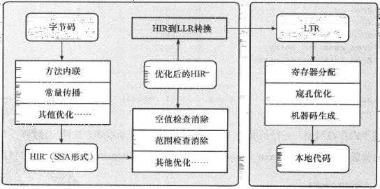

# 02.Java及时编译器原理解析及实战
## 背景
&nbsp;&nbsp;为了优化Java的性能，JVM解释器之外引入了即时（Just In Time）编译器：当程序运行的时，解释器首先发挥作用，代码可以直接运行.随着时间推移，即时编译器逐渐发挥作用，把越来越多的代码编译优化为本地代码，来获取更高的执行效率。解释器这时候可以**作为编译运行的降级手段**,在一些不可靠的编译优化出现问题的时候，再切换为解释执行，保证程序可以正常运行。
&nbsp;&nbsp;即时编译器极大提高了Java程序的运行速度，而且和静态编译相比，即时编译器可以选择性的编译热点代码，省去了很多编译时间，也节省了很多空间。
   - 即： 代码优先解释执行  -> 即时编译器优化之后，本地代码执行 -> 当出现编译优化问题时，回到解释执行
## Java的执行过程
&nbsp;&nbsp;Java的执行过程可以分为两个部分：
1. 第一步由javac将源代码便以为字节码，在这个过程中会进行 词法分析、语法分析、语义分析，编译原理中这部分编译称为**前端编译**。
2. 接下来并不需要编译直接逐条将字节码解释执行，在解释执行的过程中，虚拟机同时对程序运行的信息进行收集，在这些信息的基础上，即时编译器会逐渐发挥作用，他会进行**后端编译**---即将字节码编译为机器码，但不是所有的代码都会被编译，只有被JVM认定为的热点代码才可能被编译。
    - 遗留的一个问题? 什么是热点代码
       + 见 附录-01
## 01. JVM中的JIT(即时编译器)
&nbsp;&nbsp;JVM中集成了两种编译器，Client Compiler 和 Server Compiler，他们的作用也不一样。
   - Client Compiler注重启动速度和局部的优化
   - Server Compiler则更加注重全局的优化，性能会更好，但由于会进行更多的全局分析，所以启动速度会变慢。
&nbsp;&nbsp;两种编译器有着不同的应用场景，在虚拟机中同时发挥作用
### 01-01.Client Compiler(客户端编译器)
- 
&nbsp;&nbsp;HotSpot VM带有一个Client Compiler ，简称为C1编译器。这种编译器启动速度快，但是性能比较Server Compiler来说会差一些。C1会做以下三件事:
1. 局部简单可靠的优化，比如字节码上进行的一些基础优化，方法内联、常量传播等，放弃许多耗时较长的全局优化。
2. 将字节码构造成高级中间表示(High-level Intermediate Representation，以下称为HIR),HIR与平台无关，通常采用图结构，更适合JVM对程序进行优化
3. 最后将HIR转换为低级中间表示(Low-level Intermediate Representation，以下称为LIR),在LIR的基础上会进行寄存器分配、窥孔优化(局部的优化方式，编译器在一个基本块或者多个基本块中，针对于已经生成的代码，集合CPU自己指令的特点，通过一些认为可能带来性能提升的转换规则或者通过整体的分析，进行指令的转换，来提升代码性能)等操作,最终生成机器码。

### 01-02.Server Compiler(服务端编译器)
&nbsp;&nbsp;Server Compiler主要关注一些编译比较耗时的全局优化，甚至还会根据程序运行的信息进行一些不可靠的激进优化。这种编译器的启动时间长，适用于长时间运行的后台程序，他的性能通常比Client Compiler高30%以上。目前，在HotSpot虚拟机中使用的Server Compiler有两种：
- C2
- Graal
#### 01-02-1. C2
&nbsp;&nbsp;在HotSpot VM中，默认的Server Compiler是C2编译器。
&nbsp;&nbsp;C2编译器在进行编译优化的时候，会使用一种控制流与数据流结合的图数据结构，称为Ideal Graph。Ideal Graph表示当前程序的数据流向和指令间的依赖关系，依靠这种图结构，某些优化步骤(尤其涉及到浮动代码块的那些优化步骤)变得不那么复杂。
+ Ideal Graph的构建是在解析字节码的时候，根据字节码中的指令向一个空的Graph中添加节点，Graph中的节点通常对应一个指令块，每个指令块包含多条相关联的指令，JVM会利用一些优化技术对这些指令进行优化，例如 Global Value Number 、 常量折叠等，解析结束之后，还会进行对一些死代码剔除的操作。生成Ideal Graph后，会在这个基础上结合收集的程序的运行信息来进行一些全局的优化，这个阶段如果JVM判断此时没有全局优化的必要，就会跳过这部分优化。
&nbsp;&nbsp;无论是否进行全局优化，Ideal Graph都会被转化为一种更接近机器层面的MachNode Graph，最后，编译的机器码就是从MachNode Graph中得的，生成机器码前还会有一些包括寄存器分配、窥孔优化等操作。Server Compiler 编译优化步骤如下图所示:
   - 
### 01-02-2. Graal Compiler
&nbsp;&nbsp;从JDK9开始，HotSpot VM中集成了一种新的Server Compiler，Graal 编译器。相比于C2编译器，Graal有如下几种关键特性:
1. 如前所述，JVM会在解释执行的时候收集程序运行的各种信息，然后编译器会根据这些信息进行一些基于预测的激进优化，例如分支预测，根据程序不同分支的运行频率，选择性地编译一些概率较大的分支。Graal比C2更加青睐这种优化，所以Graal的峰值性能通常比C2更好。
2. 使用Java编写，对于Java语言，尤其是新特性，比如 Lambda，Stream更加友好。
3. 更深层次的优化，例如虚函数的内联，部分逃逸分析等。
&nbsp;&nbsp;Graal编译器可以通过java虚拟机参数-XX:+UnlockExperimentalVMOptions -XX:+UseJVMCICompiler启用。当启用时，他将替换掉HotSpot中的C2编译器，并响应原本由C2负责的编译请求。

## 02. 分层编译
+ 始于 Java 7 , 在JDK8中才默认开启

- 

&nbsp;&nbsp;在Java 7以前，需要研发人员根据服务的特性去选择编译器，对于需要快速启动的，或者一些不会长时间运行的服务，可以采取编译效率较高的C1，对应参数 -client;长期运行的服务，或者对峰值性能有要求的后台服务，可以采用峰值性能更好的C2，对应参数 -server。Java 7 开始引用了分层编译的概念，他结合了C1和C2的优势，追求启动速度和峰值性能的一个平衡。分层编译将JVM的执行状态分为了5个层次，分别是：
1. 层次0： 解释执行
2. 层次1： 执行不带profiling的C1代码 ， 什么是profiling，见附录-02。 **在C1中性能最好:仅仅是编译执行**
3. 层次2： 执行仅带方法调用次数以及循环回边执行次数的profiling的C1代码。 **带有计数器的C1,计数器是进入下一层的基础,性能次于第1层**
4. 层次3： 执行带所有的profiling的C1代码。**并带有详细采样分析的代码，性能次于第2层**，即实际上是在跟踪你的应用程序再非常精细的层面上做了什么
5. 层次4： 执行C2代码。**性能最好**

## 03. C1 C2编译效率对比
- 

### 分层编译执行流程
&nbsp;&nbsp;通常情况下，C2代码的执行效率要比C1代码高出30%以上，C1层执行的代码，按执行效率排序从高至低： 1层 > 2层 > 3层(这里的**层**是指下面图中的层)。在这5个层次中，1层和4层都是终止状态，**当一个方法达到终止状态后，只要编译后的代码没有失效，那么JVM就不会再次发出该方法的编译请求**。服务实际运行时，JVM会根据服务的运行情况，从解释执行开始，选择不同的编译路径，直到到达终止状态。下图就列举了几种常见的编译路径：(从下图也可以看出,JVM对字节码代码的执行过程)
- 

   - 第1条路径：图中第1条路径(即1common,圆圈打不出来)，代表的一般情况，热点方法从解释执行到被三层的C1编译，最后到被4层的C2编译。
   - 第2条路径：如果方法比较小（比如常见的getter setter方法）,3层的profiling没有收集到有价值的数据，JVM就会断定该方法对于C1代码和C2代码的执行效率相同，就会执行途中第2条（2trivial method）路径。在这种情况下，JVM会在3层编译后，放弃进入C2编译，直接使用1层的C1编译运行。
   - 第3条路径：在C1忙碌的时候，执行途中第3条(3C1 busy)路径，在解释执行的过程中对程序进行profiling，根据信息直接由第4层的C2编译。
   - 第4条路径：前文提到C1的执行效率是 1层 > 2层 > 3层，3层一般比2层慢35%以上，所以在C2忙碌的时候，执行图中第4条路径。此时方法会被2层的C1编译，然后再被3层的C1编译，以减少方法在3层的执行时间。
   - 第5条路径：如果编译器做了一些比较激进的优化，例如分支预测，在实际运行时发现预测出错，此时就会进行反优化，重新进入解释执行，图中第5条执行路径代表的就是反优化。

总的来说，C1的编译速度更快，C2的编译质量越高，分层编译的不同编译路径，也就是JVM根据当前服务的运行情况来寻找当前服务的最佳平衡的一个过程，从JDK8开始，JVM默认开启分层编译。

## 03 即时编译的触发
&nbsp;&nbsp;**Java虚拟机根据方法的调用次数以及循环回边的执行次数来触发即时编译**。
-  
循环回边是一个控制流图中的概念，程序中可以简单地理解为往回跳转的指令，如下面这段代码:

```java
   public void nlp(Object obj) {
      int sum = 0;

      for (int i = 0; i < 200; i++) {
         sum += i;
      }
   }
```

+ 上述代码经过编译生成下面的字节码。其中，偏移量为18的字节码将往回跳至偏移量为4的字节码中。在解释执行中，每当运行一次该指令，Java虚拟机便会将该方法的循环回边计数器加一。
  - 请注意： 回边计数器在什么时候会变化，在这里，统计的是循环的次数，而不是该方法调用的次数，即进入for循环的次数。
```txt
public void nlp(java.lang.Object);
    Code:
       0: iconst_0
       1: istore_1
       2: iconst_0
       3: istore_2
       4: iload_2
       5: sipush        200
       8: if_icmpge     21
      11: iload_1
      12: iload_2
      13: iadd
      14: istore_1
      15: iinc          2, 1
      18: goto          4
      21: return
```

+ 在即时编译过程中，编译器会识别循环的头部和尾部。上面这段字节码中，循环体的头部和尾部分别是偏移量为11的字节码和偏移量为15的字节码。编译器将在循环体结尾增加循环回边计数器的代码，来对循环进行计数。
   - 循环回边的实现原理
+ 当方法调用次数和循环回边的次数的和，超过由参数-XX:CompileThreshold指定的阈值时（使用C1时，默认值为1500；使用C2时，默认值为10000），就会触发即时编译。
+ 开启分层编译的情况下，-XX:CompileThreshold参数设置的阈值将会失效，触发编译会由以下的条件来判断：
   1. 方法调用次数大于由参数-XX:TierXInvocationThreshold指定的阈值乘以系数。
   2. 方法调用次数大于由参数-XX:TierXMINInvocationThreshold指定的阈值乘以系数，并且方法调用次数和循环回边次数之和大于由参数-XX:TierXCompileThreshold指定的阈值乘以系数时。
      - 公式： i > TierXInvocationThreshold * s || (i > TierXMinInvocationThreshold * s  && i + b > TierXCompileThreshold * s)（hotspot/src/share/vm/runtime/advancedThresholdPolicy.hpp）
          - i是调用次数，b是回边次数。公式的释义见代码(见代码，看TierXInvocationThreshold中的"X" 是什么意思，并结合注释以及分层编译的图来加深一下分层编译)
          - 上述满足其中一个条件就会触发即时编译，并且JVM会根据当前的编译方法数以及编译线程数动态调整系数s。(注释中都有写，即注释的重要性)

## 03. 编译优化
&nbsp;&nbsp;即时编译器会对正在运行的服务进行一系列的优化，包括字节码解析过程中的分析，根据编译过程中代码的一些中间形式来做局部优化，还会根据程序依赖图进行全局优化，最后才会生成机器码。
### 03-01.中间表达形式(Intermediate Representation)
&nbsp;&nbsp;在编译原理中，通常把编译器分为前端和后端，前端编译经过词法分析、语法分析、语义分析生成中间表达形式(Intermediate Representation，以下称为IR),后端会对IR进行优化，生成目标代码。
&nbsp;&nbsp;Java字节码就是一种IR，但是字节码的结构复杂，字节码这样代码形式的IR也不适合做全局的分析优化。现代编译器一般采用图结构的IR，静态单赋值（static single assignment,SSA）IR是目前比较常用的一种。这种IR的特点是每个变量只能被赋值一次，而且只有当变量被赋值之后才能使用。例如:

   ```txt
   // SSA IR 
   Plain Text
   {
      a = 1;
      a = 2;
      b = a;
   }
   ```

   - 上述代码中可以发现，a=1的赋值是冗余的，但是编译器不能。传统的编译器需要借助数据流分析，从后至前一次确认哪些变量的值被覆盖了。不过，如果借助了SSA IR，编译器则可以很容易识别冗余赋值。上述的SSA IR形式的伪代码可以表示为:
      ```txt
      // SSA IR
      Plain Text
      {
         a_1 = 1;
         a_2 = 2;
         b_1 = a_2;
      }
      ```
      - 由于SSA IR中每个变量只能赋值一次，所以代码中的a在SSA IR中会分为a_1 , a_2两个变量来赋值，这样编译器就可以很容易通过扫描这些变量来发现a_1被赋值后没有被使用，赋值是冗余的。

除此之外，SSA IR对其他优化方式也有很大的帮助，例如下面的死代码删除(Dead Code Elimination)的例子：

   ```txt
       // Dead Code Elimination
       public void DeadCodeElimination{
         int a = 2;
         int b = 0

         if(2 > 1){
            a = 1;
         } else{
            b = 2;
         }

         add(a,b)
      }
   ```
   - 可以得到SSA IR的伪代码
       ```txt
          // SSA IR伪代码
          a_1 = 2;
          b_1 = 0
          if true:
            a_2 = 1;
         else
            b_2 = 2;

         add(a,b)
       ```
       + 编译器通过执行字节码可以发现b_2赋值之后不会被使用，else分支不会被执行。经过死代码剔除之后，就可以得到如下的代码：
           ```txt
             // 死代码剔除之后的代码
             public void DeadCodeElimination{
                int a = 1;
                int b = 0;
                add(a,b)
             }
           ```
&nbsp;&nbsp;**我们可以将编译器的每一种优化看成一个图优化算法，他接受一个IR图，并输出经过转换后的IR图，编译器优化的过程就是一个个图节点的优化串联起来的。**

#### 03-01-01.C1的中间表达形式 - HIR LIR
&nbsp;&nbsp;前文提及C1编译器内部使用高级中间表达形式HIR，低级中间表达形式LIR来进行各种优化，这两种IR都是SSA形式的。
&nbsp;&nbsp;HIR是由很多 **基本块(Basic Block)** 组成的控制流图结构，每个块包含很多的SSA形式的指令。 **基本块** 的结构如下图所示：
-  
+ 其中，predecessors表示前驱基本块（由于前驱可能是多个，所以是BlockList结构，是多个BlockBegin组成的可扩容数组）。同样，successors表示多个后继基本块BlockEnd。除了这两部分就是主体块，里面包含程序执行的指令和一个next指针，指向下一个执行的主体块。

从字节码到HIR的构造最终调用的是GraphBuilder，GraphBuilder会遍历字节码构造所有代码的基本块存储为一个链表结构，但是这个时候的基本块只有BlockBegin，不包括具体的指令。第二步GraphBuilder会用一个ValueStack作为操作数栈和局部变量表，模拟执行字节码，构造出对应的HIR，填充之前空的基本块。如下是简单字节码块构造HIR的过程示例，如下:
   ```txt
             字节码                     Local Value             operand stack              HIR
             5: iload_1                  [i1,i2]                 [i1]
             6: iload_2                  [i1,i2]                 [i1,i2]   
                                  ................................................   i3: i1 * i2
             7: imul                                   
             8: istore_3                 [i1,i2，i3]              [i3]
   ```
   - 可以看出，当执行iload_1时，操作数栈压入变量i1，执行iload_2时，操作数栈压入变量i2，执行相乘指令imul时弹出栈顶两个值，构造出HIR i3:i1*i2,生成的i3入栈。
   - C1编译器优化大部分都是在HIR之上完成的。当优化完成之后他会将HIR转化为LIR，LIR和HIR类似，也是编译器内部用到的IR，HIR通过优化消除一些中间节点就可以生成LIR，形式上更加简单。
#### 03-01-02. Sea-Of-Nodes IR
&nbsp;&nbsp;C2编译器中的Ideal Graph 采用的是一种名为Sea-Of-Nodes中间表达形式，同样也是SSA形式的。他的最大特点就是去除了变量的概念，直接采用值来进行运算。为了方便理解，可以利用IR可视化工具Ideal Graph Visualizer(IGV)，来展示具体的IR图。例如下面这段代码:
   ```java
      public static int foo(int count) {
         int sum = 0;
         for (int i = 0; i < count; i++) {
            sum += i;
         }
        return sum;
      }
   ```
   - 对应的IR图如下：
     + 
     + 图中若干个顺序执行的节点将被包含在同一个基本块之中，如图中的B0、B1等。B0基本块中0号Start节点是方法入口，B3中21号Return节点是方法出口。**红色加粗线条为控制流，蓝色线条为数据流，而其他颜色的线条则是特殊的控制流或数据流**。被控制流边所连接的是**固定节点**，其他的则是**浮动节点**（浮动节点指只要能满足数据依赖关系，可以放在不同位置的节点，浮动节点变动的这个过程称为Schedule）。
     + 这种图具有轻量级的边结构，途中的边仅由指向另一节点的指针表示。节点是Node子类的实例，带有指定输入边的指针数组。这种表示的优点就是改变节点的输入边很快，如果想要改变输入边，只要将该指针指向Node，然后存入Node的指针数组就可以了。
     + 依赖于这种图结构，通过收集程序运行的信息，JVM可以通过Schedule那些浮动节点，从而获得最好的编译效果。

#### 03-01-03. Phi And Region Nodes
&nbsp;&nbsp;Ideal Graph是SSA IR。由于没有变量的 概念，这会带来一个问题，就是不同执行路径下可能会对同一个变量设置不同的值。例如下面这段代码if语句的两个分支中，分别返回5和6.此时 根据不同的执行路径，所读取到的值很有可能不同:
   ```txt
      int test(int x) {
      int a = 0;
      if(x == 1) {
         a = 5;
      } else {
         a = 6;
      }
      return a;
      }
   ```
   - 为了解决这个问题，引入了一个Phi Nodes的概念，能够根据不同的执行路径选择不同的值。于是，上面这段代码可以表示为下面这张图：
      + 
      + Phi Nodes中保存不同路径上包含的所有值，Region Nodes根据不同路径的判断条件，从Phi Nodes取得当前执行路径中变量应该赋予的值，带有Phi节点的SSA形式的伪代码如下：
         ```txt
            int test(int x) {
               a_1 = 0;
               if(x == 1){
                  a_2 = 5;
               }else {
                  a_3 = 6;
               }
               a_4 = Phi(a_2,a_3);
               return a_4;
            }
         ```
#### 03-01-04. Global Value Numbering 
&nbsp;&nbsp;Global Value Numbering（GVN）是一种因为Sea-of-Nodes变得非常容易的优化技术。
&nbsp;&nbsp;GVN是指为每一个计算得到的值分配一个独一无二的编号，然后遍历指令寻找优化的机会。他可以发现并消除等价计算的优化技术。如果一段程序中出现了多次操作数相同的乘法，那么即时编译器可以将这些乘法合并为一个，从而降低输出机器码的大小。如果这些乘法出现在同一个执行路径上，那么GVN还将省下冗余的乘法操作。在Sea-of-Nodes中，由于只存在值的概念，因此GVN算法将非常简单：即时编译器只需要判断该浮动节点是否与与存在的浮动节点的编号相同，所输入的IR节点是否一致，便可以将这两个浮动节点归并为一个。如下代码：
   ```txt
      a = 1;
      b = 2;
      c = a + b;
      d = a + b;
      e = d;
   ```
   - GVN 会利用Hash算法编号，计算a=1时，得到编号1，计算b=2时，得到编号2，计算c=a+b时，得到编号3.这些编号都会放入Hash表中保存，在计算d=a+b时，会发现a+b已经存在Hash表中，就不会再进行计算，直接从Hash表中取出计算过的值。最后的e=d也可以由Hash表中查到而进行复用。
   - 可以将GVN理解为在IR图上的公共子表达式消除(Common Subexpression Elimination，CSE).两者区别在于：GVN直接比较值的相同与否，而CSE是借助词法分析器来判断两个表达式相同与否。
      + **JIT中的公共子表达式消除技术**

## 03-02. 方法内联
&nbsp;&nbsp;方法内联，是指在编译过程中遇到方法调用时，将目标方法纳入编译范围之内，并取代原方法调用的优化手段。JIT大部分的优化都是在内联的基础上进行的，方法内联是即时编译器中非常重要的一环。
&nbsp;&nbsp;Java服务中存在大量的getter/setter方法，如果没有方法内联，在调用getter/setter方法时，程序执行的时候就需要保存当前方法的执行位置，创建并压入用于getter/setter的栈帧、访问字段、弹出栈帧，最后再恢复当前方法的执行。内联了对getter/setter方法的调用后，上述操作仅剩字段访问。在C2编译器中，方法内联在解析字节码的过程中完成。当遇到方法调用字节码的时候，编译器将根据一些阈值参数决定是否需要内联当前方法的调用。如果需要内联，则开始解析目标方法的字节码。如下示例：
   ```txt
   public static boolean flag = true;
   public static int value0 = 0;
   public static int value1 = 1;

   public static int foo(int value) {
      int result = bar(flag);
      if (result != 0) {
         return result;
      } else {
         return value;
      }
   }

   public static int bar(boolean flag) {
      return flag ? value0 : value1;
   }
   ```
   - bar方法的IR图 
   - 内联后的IR图 
   - 内联不仅将被调用的方法的IR图节点复制到调用者方法的IR图中，还要完成其他操作。
      1. 被调用方法的参数替换为调用者方法进行方法调用时所传入的值。上面的例子中，将bar方法中的1P(0)节点替换为foo方法3号LoadField节点。
      2. 调用者方法的IR图中，方法调用节点的数据依赖会变成被调用方法的返回。如果存在多个返回节点，会生成一个phi节点，将这些返回值全部聚合起来，并作为原方法调用节点后的替换对象。图中就是将8号==节点，以及12号Return节点连接到原5号invoke节点的边，然后指向新生成的24phi节点中。
      3. 如果被调用方法将抛出某种类型的异常，而调用者方法恰好有该异常类型的处理器，并且该异常处理器覆盖这一方法调用，那么即时编译器需要将被调用方法抛出异常的路径，与调用者方法的异常处理器相连接。
### 03-02-01. 方法内联的条件
&nbsp;&nbsp;编译器的大部分优化都是在方法内联的基础上。所以：
+ 一般来说，内联的方法越多，生成代码的执行效率越高。
+ 但是，对于即时编译器来说，内联的方法越多，编译时间也就越长，程序到达峰值性能的时刻也就比较晚。

&nbsp;&nbsp;可以通过虚拟机参数来-XX:MaxInlineLevel调整内联的层数，以及1层的直接递归调用（可以通过虚拟机参数-XX:MaxRecursiveInlineLevel调整）。一些常见的内联相关的参数如下表所示：
   - 

### 03-03. 虚方法内联
&nbsp;&nbsp;内联是JIT提升性能的主要手段，但是虚函数使得内联是很难的，因为在内联阶段并不知道他们会调用哪个方法。例如，有一个数据处理的接口，这个接口中一个方法有三种实现：add 、 sub、nulti。JVM通过保存虚函数表Vitrual Method Table（VMT）存储Class对象中所有的虚函数，class的实例对象保存着一个VMT的指针，程序运行时首先加载实例对象，然后通过实例对象找到VMT，通过VMT找到对应方法的地址，所以虚函数的调用比直接指向方法地址的classic call性能上会差一些。很不幸，Java中所有非私有的成员函数的调用都是虚调用。
  - **重要!!!** Java中虚函数表的使用，以及Java中哪些方法是虚方法。

&nbsp;&nbsp;C2编译器已经足够智能，能够检测出这种情况并会对虚调用进行优化，如下代码:
   ```java
   public class SimpleInliningTest
   {
      public static void main(String[] args) throws InterruptedException {
         VirtualInvokeTest obj = new VirtualInvokeTest();
         VirtualInvoke1 obj1 = new VirtualInvoke1();
         for (int i = 0; i < 100000; i++) {
               invokeMethod(obj);
               invokeMethod(obj1);
         }
         Thread.sleep(1000);
      }

      public static void invokeMethod(VirtualInvokeTest obj) {
         obj.methodCall();
      }

      private static class VirtualInvokeTest {
         public void methodCall() {
               System.out.println("virtual call");
         }
      }
      // 如
      private static class VirtualInvoke1 extends VirtualInvokeTest {
         @Override
         public void methodCall() {
               super.methodCall();
         }
      }
   }
   ```
   - 经过JIT编译器优化后，进行反汇编得到下面这段汇编代码：
     ```txt
     0x0000000113369d37: callq  0x00000001132950a0  ; OopMap{off=476}
                                                ;*invokevirtual methodCall  //代表虚调用
                                                ; - SimpleInliningTest::invokeMethod@1 (line 18)
                                                ;   {optimized virtual_call}  //虚调用已经被优化
     ```

&nbsp;&nbsp; 可以看到JIT对methodCall方法进行了虚调用优化optimized virtual_call。经过优化后的方法可以被内联。但是C2编译器的能力有限，对于多个实现方法的虚调用就“无能为力”了。如下代码，增加一个VirtualInvokeTest实现：
   ```java
      public class SimpleInliningTest
         {
            public static void main(String[] args) throws InterruptedException {
               VirtualInvokeTest obj = new VirtualInvokeTest();
               VirtualInvoke1 obj1 = new VirtualInvoke1();
               VirtualInvoke2 obj2 = new VirtualInvoke2();
               for (int i = 0; i < 100000; i++) {
                     invokeMethod(obj);
                     invokeMethod(obj1);
               invokeMethod(obj2);
               }
               Thread.sleep(1000);
            }

            public static void invokeMethod(VirtualInvokeTest obj) {
               obj.methodCall();
            }

            private static class VirtualInvokeTest {
               public void methodCall() {
                     System.out.println("virtual call");
               }
            }

            private static class VirtualInvoke1 extends VirtualInvokeTest {
               @Override
               public void methodCall() {
                     super.methodCall();
               }
            }
            private static class VirtualInvoke2 extends VirtualInvokeTest {
               @Override
               public void methodCall() {
                     super.methodCall();
               }
            }
         }
   ```
   - 经过反编译得到如下汇编代码:
      ```txt
              0x000000011f5f0a37: callq  0x000000011f4fd2e0  ; OopMap{off=28}
                                                ;*invokevirtual methodCall  //代表虚调用
                                                ; - SimpleInliningTest::invokeMethod@1 (line 20)
                                                ;   {virtual_call}  //虚调用未被优化
      ```
      -  可以看到多个实现的虚调用未被优化，依然是virtual_call。
      -  Graal编译器针对这种情况，会去收集这部分执行的信息，比如在一段时间，发现前面的接口方法的调用add和sub是各占50%的几率，那么JVM就会在每次运行时，遇到add就把add内联进来，遇到sub的情况再把sub函数内联进来，这样这两个路径的执行效率就会提升。在后续如果遇到其他不常见的情况，JVM就会进行去优化的操作，在那个位置做标记，再遇到这种情况时切换回解释执行。

### 03-04. 逃逸分析
&nbsp;&nbsp;逃逸分析是 “**一种确定指针动态范围的静态分析，他可以分析在程序的哪些地方可以访问到指针**”。Java虚拟机的即时编译器会对新建的对象进行逃逸分析，判断方法是逃逸出线程或者方法。即时编译器判断对象是否逃逸的依据有两种：
1. 对象是否被存入堆中（静态字段或者堆中对象的实例字段），一旦对象被存入堆中，其他线程便能获得该对象的引用，即时编译器就无法追踪所有使用该对象的代码位置。
2. 对象是否被传入未知代码中，即时编译器会将未被内联的代码当成未知代码，因为它无法确认该方法调用会不会将调用者或所传入的参数存储至堆中，这种情况，可以直接认为方法调用的调用者以及参数是逃逸的。

&nbsp;&nbsp;逃逸分析通常在方法的内联基础上进行的，即时编译器可以根据逃逸分析的结果进行诸如 锁消除、栈上分配、标量替换的优化。如下代码就是对象未逃逸的例子：
   ```java
         pulbic class Example{
            public static void main(String[] args) {
                example();
            }
            public static void example() {
               Foo foo = new Foo();
               Bar bar = new Bar();
               bar.setFoo(foo);
            }
         }

           class Foo {}

            class Bar {
               private Foo foo;
               public void setFoo(Foo foo) {
                  this.foo = foo;
               }
            }
         }
   ```
   - 在这个例子中，创建了两个对象foo和bar，其中一个作为另一个方法的参数提供。该方法setFoo存储对收到的Foo类型对象的引用，如果Bar对象在堆上，则对foo的引用将逃逸。但是在这种情况下，编译器可以通过逃逸分析确定bar对象本身不会逃逸出example的调用。这意味着对foo的引用也不能逃逸。因此，编译器可以安全的在栈上分配两个对象。
#### 03-04-01. 锁消除 （基于逃逸分析才能进行锁消除优化）
&nbsp;&nbsp;在学习Java并发编程的时候会了解锁消除，而锁消除就是在逃逸分析的基础上进行的。

&nbsp;&nbsp;如果即时编译器能够证明锁对象不逃逸，那么对该锁对象的加锁、解锁操作就没有意义。因为线程并不能获得该锁对象。在这种情况下，即时编译器会消除对该不逃逸对象的加锁、解锁操作。实际上，编译器仅需要证明锁对象并不会逃逸出线程，便可以进行锁消除。不过，基于逃逸分析的锁消除实际上并不多见。
#### 03-04-02. 栈上分配
&nbsp;&nbsp;我们都知道Java的对象是在堆上分配的，而堆是对所有对象可见的。同时，JVM需要对所分配的堆内存进行管理，并且在对象不再被引用时回收其所占据的内存。**(栈上分配的好处)---> 如果逃逸分析能够证明某些新建的对象不逃逸，那么JVM完全可以将其分配至栈上，并且在new语句所在的方法退出时，通过弹出当前方法的栈桢来自动回收所分配的内存空间**。

&nbsp;&nbsp;这样一来，我们便无须借助垃圾回收器来处理不再被引用的对象。不过**Hotspot虚拟机，并没有进行实际的栈上分配，而是使用了标量替换这一技术**。**所谓的标量，就是仅能存储一个值的变量，比如Java代码中的基本类型**。与之相反，**聚合量则可能同时存储多个值，其中一个典型的例子便是Java的对象**。***编译器会在方法内将未逃逸的聚合量分解成多个标量，以此来减少堆上分配***。即：
 + 什么是标量？ 所谓的标量，就是仅能存储一个值的变量，比如Java代码中的基本类型。
 + 什么是聚合量？ 与之相反，聚合量则可能同时存储多个值，其中一个典型的例子便是Java的对象
 + 栈上分配的原理: 编译器会在方法内将未逃逸的聚合量分解成多个标量，以此来减少堆上分配

&nbsp;&nbsp;如下代码：
```java
    // 标量替换
    public class Example{
      @AllArgsConstructor
      class Cat{
         int age;
         int weight;
      }
      public static void example(){
         Cat cat = new Cat(1,10);
         addAgeAndWeight(cat.age,Cat.weight);
      }
      }
```
- 经过逃逸分析，cat对象未逃逸出example方法的调用，因此可以对聚合量cat进行分解，得到两个标量: age 和 weight,进行标量替换的伪代码:
    ```java
       public class Example{
         @AllArgsConstructor
         class Cat{
            int age;
            int weight;
         }
         public static void example(){
            int age = 1;
            int weight = 10;
            addAgeAndWeight(age,weight);
         }
       }
    ```
#### 03-04-03. 部分逃逸分析
&nbsp;&nbsp;部分逃逸分析也是Graal对于概率预测的应用。通常来说，如果发现一个对象逃逸出了方法或者线程，JVM就不会去进行优化，但是Graal编译器依然会去分析当前程序的执行路径，它会在逃逸分析基础上收集、判断哪些路径上对象会逃逸，哪些不会。然后根据这些信息，在不会逃逸的路径上进行锁消除、栈上分配这些优化手段。
+ 即通过数据的收集，从而得出对象在哪些执行路径上会逃逸，在哪些路径上不会逃逸。在不会逃逸的执行路径上进行锁消除，栈上分配的优化手段。

### 03-05. Loop Transformations(循环转换)
&nbsp;&nbsp;在文章中介绍C2编译器的部分有提及到，C2编译器在构建Ideal Graph后会进行很多的全局优化，其中就包括对循环的转换，最重要的两种转换就是循环展开和循环分离。
#### 03-05-01. 循环展开
&nbsp;&nbsp; 循环展开通过减少或消除控制程序循环的指令，来减少计算开销，这种开销包括增加指向数组中下一个索引或者指令的指针算数等。如果编译器可以提前计算这些索引，并且构建到机器代码指令中，那么程序运行时就可以不必进行这种计算。也就是说有些循环可以写成一些重复独立的代码。比如下面这个循环：
   ```txt
        public void loopRolling(){
         for(int i = 0;i<200;i++){
            delete(i);  
         }
        }
   ```
   - 上面的代码需要循环删除200次，通过循环展开可以得到下面的代码:
      ```txt
         public void loopRolling(){
            for(int i = 0;i<200;i+=5){
               delete(i);
               delete(i+1);
               delete(i+2);
               delete(i+3);
               delete(i+4);
            }
         }
      ```
      - 这样展开就可以减少循环的次数，每次循环内的计算也可以利用CPU的流水线提升效率。当然这只是一个示例，**实际进行展开时，JVM会去评估展开带来的收益，再决定是否进行展开**
#### 03-05-02. 循环分离
&nbsp;&nbsp;循环分离也是循环替换的一种手段。他把循环中一次或多次的特殊迭代分离出来，在循环外执行。例如:
```txt
      int a = 10;
      for(int i = 0;i<10;i++){
         b[i] = x[i] + x[a];
         a = i;
      }
```
- 可以看出这段代码除了第一次循环a = 10以外，其他的情况a都等于i-1。所以可以把特殊情况分离出去，变成下面这段代码：
   ```txt
   b[0] = x[0] + 10;
   for(int i = 1;i<10;i++){
      b[i] = x[i] + x[i-1];
   }
   ```
   - 这种等效的转换消除了在循环中对a变量的需求，从而减少了开销。
### 03-06. 窥孔优化 和 寄存器优化
&nbsp;&nbsp;前文提到的窥孔优化是优化的最后一步，这之后就会程序就会转换成机器码，窥孔优化就是将编译器所生成的中间代码（或目标代码）中相邻指令，将其中的某些组合替换为效率更高的指令组，常见的比如强度削减、常数合并等
#### 03-06-01. 什么是窥孔优化?
&nbsp;&nbsp;窥孔优化是将编译器所生成的中间代码(或目标代码)中相邻指令，将其中的某些组合替换为效率更高的指令组。
#### 03-06-02.示例
```txt
  y1=x1*3  经过强度削减后得到  y1=(x1<<1)+x1
```
- 编译器使用移位和加法削减乘法的强度，使用更高效率的指令组。
#### 03-06-03. 什么是寄存器优化?
&nbsp;&nbsp; 寄存器分配也是一种编译的优化手段，在C2编译器中普遍的使用。它是通过把频繁使用的变量保存在寄存器中，CPU访问寄存器的速度比内存快得多，可以提升程序的运行速度。

### 03-07 小结
&nbsp;&nbsp;寄存器分配和窥孔优化是程序优化的最后一步。经过寄存器分配和窥孔优化之后，程序就会被转换成机器码保存在codeCache中。


#### 03-05-01. 循环展开
&nbsp;&nbsp;循环展开是一种循环转换技术，他试图以牺牲二进制码大小为代价来优化程序的执行速度，是一种以空间换时间的优化手段。

## 04. 实践
### 04-01. 编译相关的重要参数
+ -XX:+TieredCompilation：开启分层编译，JDK8之后默认开启
+ -XX:+CICompilerCount=N：编译线程数，设置数量后，JVM会自动分配线程数，C1:C2 = 1:2
+ -XX:TierXBackEdgeThreshold：OSR编译的阈值
+ -XX:TierXMinInvocationThreshold：开启分层编译后各层调用的阈值
+ -XX:TierXCompileThreshold：开启分层编译后的编译阈值
+ -XX:ReservedCodeCacheSize：codeCache最大大小
+ -XX:InitialCodeCacheSize：codeCache初始大小
+ -XX:+PrintCompilation 打印JIT编译日志
  ```txt
     ...
     
     96 73 % 3 example01a.Allocation::main @ 15 (78bytes)
    101 99 % 4 example01a.Allocation::main @ 15 (78bytes)
     ...
  
     列1: 编译时间，VM启动以来的一个相对时间
     列2： 编译ID,他们只是在方法热的时候开始编译，从而进入编译队列时按顺序分配的。
     列3： % 没有特别的意义
     列4： 3/4 是编译层数
     列5： 方法名字
     列6： 
     列7： 字节码索引
     列8： 方法大小

  ```
+ -XX:UnlockDiagnosticVMOptions
+ -XX:CompileCommand

+ -XX:TierXMinInvocationThreshold是开启分层编译的情况下，触发编译的阈值参数，当方法调用次数大于由参数-XX:TierXInvocationThreshold指定的阈值乘以系数，或者当方法调用次数大于由参数-XX:TierXMINInvocationThreshold指定的阈值乘以系数，并且方法调用次数和循环回边次数之和大于由参数-XX:TierXCompileThreshold指定的阈值乘以系数时，便会触发X层即时编译。分层编译开启下会乘以一个系数，系数根据当前编译的方法和编译线程数确定，降低阈值可以提升编译方法数，一些常用但是不能编译的方法可以编译优化提升性能。
+ 由于编译情况复杂，JVM也会动态调整相关的阈值来保证JVM的性能，所以**不建议手动调整编译相关的参数**。除非一些特定的Case，比如codeCache满了停止了编译，可以适当增加codeCache大小，或者一些非常常用的方法，未被内联到，拖累了性能，可以调整内敛层数或者内联方法的大小来解决。

### 05 参考文档
1. 《深入理解Java虚拟机》(第三版)
2. [《基本功 | Java即时编译器原理解析及实践》](https://mp.weixin.qq.com/s?__biz=MjM5NjQ5MTI5OA==&mid=2651753676&idx=1&sn=b5f75addee662172daac802f075f217d&exportkey=A8FB7lkI2y46s8We1x6lcB8%3D&pass_ticket=Q9Y8rqDw8wD%2Fca2XDr0Q%2BLQ2FHbbacgxJN9yjn60HDo6htWjjHW%2BCT0xtzAdB10b&wx_header=0) 在此非常感谢美团技术团队


-----------------------------------------
## 附录
### 01.什么是热点代码
&nbsp;&nbsp;怎么样才会被认定为是热点代码呢? JVM中会设置一个阈值，当方法或者代码块在一段时间内的调用次数超过这个阈值就会被编译，**存入codeCache**中。当下次执行时，在遇到这一段代码,就会**从codeCache中读取机器码**,直接执行，以此来提升程序运行的性能。整个执行过程大致如下:
  - 
### 02.什么是profiling ?
- profiling就是收集能够反映程序运行状态的数据。其中最基本的统计数据就是方法的调用次数以及循环回边的执行次数。  

---

## 2023-02-04 am
1. 推测性优化
2. VM的不同之处在于他是一个基于采样数据指导的编译器，这意味着我们会跟踪你的应用程序，看看你的应用程序在做什么，我们用他来决定我们要做什么优化。


## Method or Loop JIT
if Loop Count(Backedges) > Threshold, Compile Loop

### On-Stack Replacement (栈上替换)
&nbsp;&nbsp;即如何切换到JIT编译的代码： 取堆栈上的解释器帧 -> 创建一个新的编译帧 -> 将所有数据从解释器帧复制到编译帧（数据布局不一致导致）-> 将机器代码放在栈的最上面
- 
  
  + 带@符号的编译，若有百分号，那么这是一个循环编译和栈上替换编译或者称之为OSR
  + 索引(20)是字节码的索引（byte code index,可以看作是循环的行号，即 正在编译的循环）
    > 如果一个方法有多个循环怎么办，yes,我们只有一个计数器，只是为同一个方法里的所有循环添加同一个计数器，一旦超过该阈值，那么就编译循环


### Made not Entrant
- 

&nbsp;&nbsp;如上层，在第四层的编译完成之后，编译日志中看到图中的那一行，这行日志意味着 第三层的编译我使他不会再进入(made not entrant), 即 我现在相信我有一个更好的编译，我将锁定第三层的新的使用者，这样他们被迫转到第四层。

- 
  
  - 当方法被调用时，他实际上会经过一个在某种逻辑意义上的调度程序，调度程序会选择更好版本的代码,如上图，是第三层。那么如何移动到更好的呢，调度程序选择第三层代码，但是发现该代码被锁住了，调用者就回到调度程序那里去找下一个更好的版本，所以找到了一个更好的版本。
    > 如上图，Caller Method 直接调用第三层版本代码，而没有经过调度程序（Call Dispatcher），是因为上次已经去过调度程序查找，本次是通过缓存，直接去调用第三层代码。

&nbsp;&nbsp;这样对循环的编译没有影响，但是对完整方法的编译来说很重要。为了让这些变得更快，所以使用缓存:Code Cache 